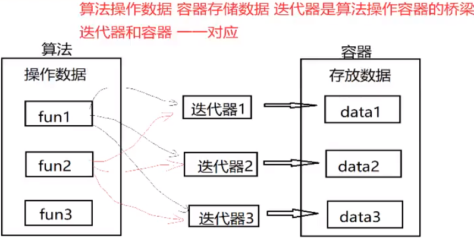
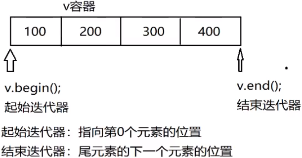
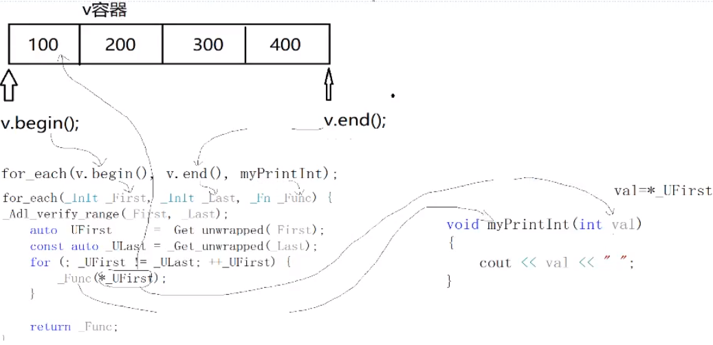
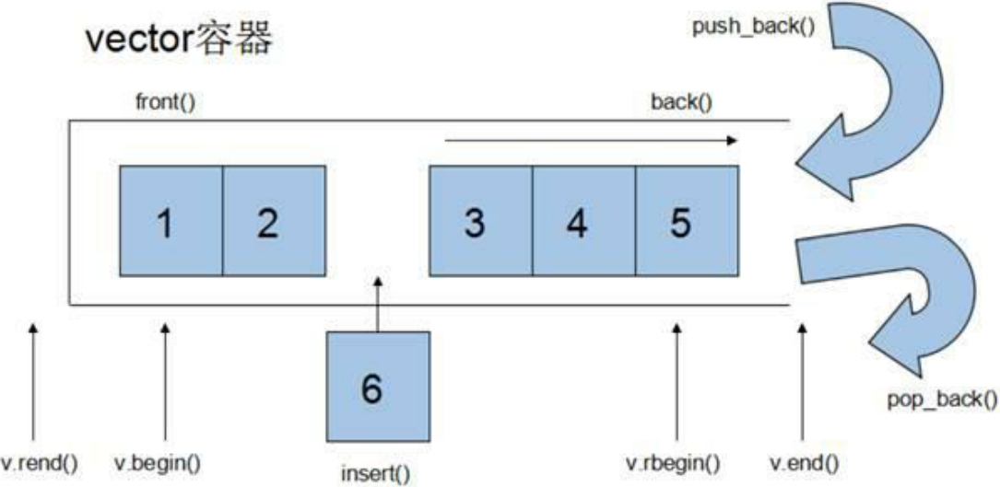
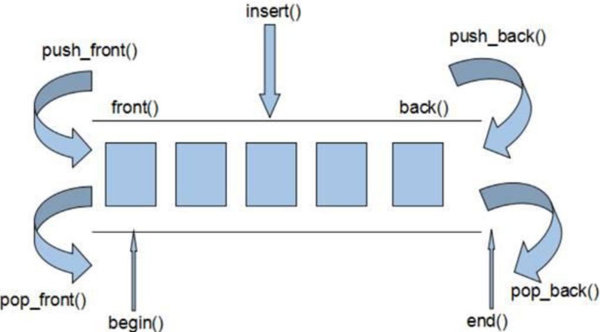
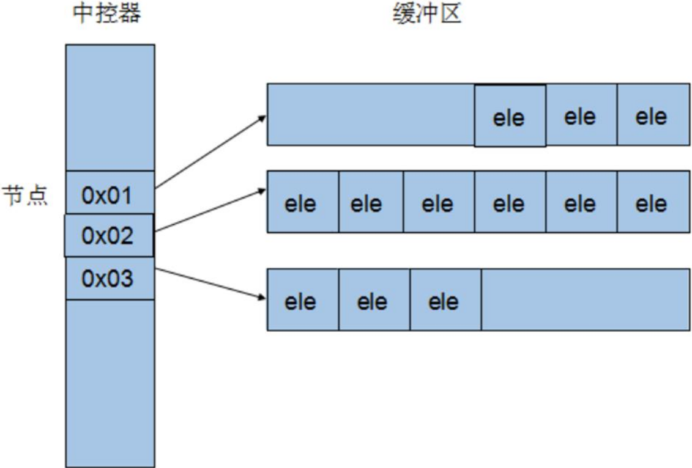

# 一、STL 概述

## 1.1 STL 基本概念

STL(Standard Template Library，标准模板库)

STL广义上三大组件：容器(container)、算法(algorithm)、迭代器(iterator)

<div align=center>
    
</div>

## 1.2 STL六大组件

容器(container) : 存放数据，vector、list、deque、set、map等
算法(algorithm) ： 操作数据，sort、find、copy、for_each
迭代器(iterator) : 容器和算法的桥梁，将operator*、operator->、operator++、operator--等指针相关操作予以重载的class template
仿函数(function) : 为算法提供更多的策略；行为类似函数，可作为算法的某种策略。从实现角度来看，仿函数是一种重载了operator()的class或者class template.
适配器(adoapter)：为算法提供更多的参数接口；用来修饰容器或者仿函数或迭代器接口的东西。
空间适配器 : 管理容器和算法的空间；负责空间的配置与管理。从实现角度看，配置器是一个实现了动态空间配置、空间管理、空间释放的class template.

### 1.2.1 算法的分类

质变算法：运算过程中会更改区间内的元素的内容；拷贝、替换、删除等等。
非质变算法：运算过程中不会更改容器内的数据；查找、计数、遍历、寻找极值等

### 1.2.2 迭代器

输入迭代器：提供对数据的只读访问；只读，支持++、\==、！=
输出迭代器：提供对数据的只写访问；只写，支持++
前向迭代器：提供读写操作，并能向前推进迭代器；读写，支持++、==、！=
双向迭代器：提供读写操作，并能向前和向后操作；读写，支持++、--
随机访问迭代器：提供读写操作，并能以跳跃的方式访问容器的任意数据，是功能最强的迭代器；读写，支持++、、[n]、-n、<、<=、>、>=

## 1.3 vector

<div align=center>
    
</div>

```cpp
#include <iostream>
#include <vector>
#include <algorithm>

void myPrintInt(int val);

void test01()
{
    // 单端动态数组vector类模板
    std::vector<int> v; // v就是一个具体的vector容器

    // push_back 尾部插入
    v.push_back(100);
    v.push_back(200);
    v.push_back(300);
    v.push_back(400);

    // 访问数据
    // 定义一个迭代器存储v的起始迭代器
    std::vector<int>::iterator it = v.begin();
    // 定义一个迭代器存储v的结束迭代器
    std::vector<int>::iterator endIt = v.end();

    // for循环遍历
    for (; it != endIt; it++) {
        // 对迭代器取* 代表的是容器的元素
        std::cout << *it << " ";
    }
    std::cout << std::endl;

    // for循环遍历2（推荐）
    for (std::vector<int>::iterator it = v.begin(); it != v.end(); it++) {
        std::cout << *it << " ";
    }
    std::cout << std::endl;

    // STL提供的算法来遍历容器
    // 包含算法头文件 algorithm
    // for_each 从容器的起始 ---> 结束，逐个元素去取出
    std::for_each(v.begin(), v.end(), myPrintInt);
    std::cout << std::endl;
}

void myPrintInt(int val)
{
    std::cout << val << " ";
}

int main(int argc, char **argv)
{
    test01();

    return 0;
}
```

<b>运行结果：</b>

```bash
100 200 300 400 
100 200 300 400 
100 200 300 400
```

### 1.3.1 for_each 迭代器

<div align=center>
    
</div>

### 1.3.2 存放自定义数据

```cpp
class Person
{
public:
    std::string name;
    int age;
    Person(std::string name, int age) {
        this->age = age;
        this->name = name;
    }
};
void myPrintPerson(Person &ob)
{
    std::cout << "name = " << ob.name << ", age = " << ob.age << std::endl;
}
void test02()
{
    Person ob1("德玛", 18);
    Person ob2("小炮", 28);
    Person ob3("小法", 38);
    Person ob4("小李", 24);

    // 定义一个vector容器存放
    std::vector<Person> v;
    v.push_back(ob1);
    v.push_back(ob2);
    v.push_back(ob3);
    v.push_back(ob4);

    for_each(v.begin(), v.end(), myPrintPerson);
}
```

### 1.3.4 容器嵌套容器

```cpp
void test03()
{
    std::vector<int> v1;
    std::vector<int> v2;
    std::vector<int> v3;

    v1.push_back(10);
    v1.push_back(20);
    v1.push_back(30);
    v1.push_back(40);

    v2.push_back(100);
    v2.push_back(200);
    v2.push_back(300);
    v2.push_back(400);

    v3.push_back(1000);
    v3.push_back(2000);
    v3.push_back(3000);
    v3.push_back(4000);

    // 需求：再定义一个vector容器，存放v1,v2,v3
    std::vector<std::vector<int>> v;
    v.push_back(v1);
    v.push_back(v2);
    v.push_back(v3);

    // for 循环遍历
    for (std::vector<std::vector<int>>::iterator it = v.begin(); it != v.end(); it++) {
        for (std::vector<int>::iterator mit = (*it).begin(); mit != (*it).end(); mit++) {
            std::cout << *mit << "\t";
        }
        std::cout << std::endl;
    }
}
```

# 二、常用容器

## 2.1. string

C风格字符串（以空字符结尾的字符数组）太过复杂难于掌握，不适合大程序的开发，所以C++标准库定义了一种string类，定在在头文件。

<b>`string`和C风格字符串对比：</b>

1. `char*`是一个指针，`string`是一个类
2. `string`封装了`char*`，管理这个字符串，是一个char型的容器。
3. `string`封装了很多实用的成员方法：查找find、拷贝copy、删除delete、替换replace、插入insert
4. 不用考虑内存释放和越界
5. `string`管理`char*`所分配的内存，每一次`string`的赋值，取值都由`string`类负责维护，不用担心复制越界和取值越界等。

## 2.2 string容器常用操作

### 2.2.1 `string`构造函数

```cpp
string();   // 创建一个空的字符串，例如：string str;
string(const string &str);  // 使用一个string对象初始化另一个string对象
string(const char* s);  // 使用字符串s初始化
string(int n, char c);  // 使用n个字符串c初始化v
```

### 2.2.2 `string`基本赋值操作

```cpp
string& operator=(const char *s);   // char*类型字符串赋值给当前的字符串
string& operator=(const string &s); // 把字符串s赋给当前的字符串
string& operator=(char c);  // 字符赋值给当前的字符串
string& assign(const char *s);  // 把字符串s赋给当前的字符串
string& assign(const char *s, int n);   // 把字符串s的前n个字符赋给当前的字符串
string& assign(const string &s);    // 把字符串s赋给当前字符串
string& assign(int n, char c);  // 用n个字符c赋给当前字符串
string& assign(const string &s, int start, int n);  // 将s从start开始n个
```

```cpp
int main(int argc, char **argv)
{
    // string(const char* s);  // 使用字符串s初始化
    string str1("hello string");
    std::cout << str1 << std::endl;

    // string(int n, char c);  // 使用n个字符串c初始化v
    string str2(10, 'a');
    std::cout << str2 << std::endl;

    string str3 = str2;
    std::cout << str3 << std::endl;

    string str4;
    // string& operator=(const string &s); // 把字符串s赋给当前的字符串
    str4 = str1;
    std::cout << str4 << std::endl;

    string str5;
    // string& operator=(const char *s);   // char*类型字符串赋值给当前的字符串
    str5 = "hello str5";
    std::cout << str5 << std::endl;

    // string& operator=(char c);  // 字符赋值给当前的字符串
    string str6;
    str6 = 'h';
    std::cout << str6 << std::endl;

    // string& assign(const char *s);  // 把字符串s赋给当前的字符串
    string str7;
    str7.assign("hello str7");
    std::cout << str7 << std::endl;

    // string& assign(const char *s, int n);   // 把字符串s的前n个字符赋给当前的字符串
    string str8;
    str8.assign("hello str8", 5);
    std::cout << str8 << std::endl;

    // string& assign(const string &s);    // 把字符串s赋给当前字符串
    string str9;
    str9.assign(str8);
    std::cout << str9 << std::endl;

    // string& assign(int n, char c);  // 用n个字符c赋给当前字符串
    string str10;
    str10.assign(10, 'h');
    std::cout << str10 << std::endl;

    // string& assign(const string &s, int start, int n);  // 将s从start开始n个
    string str11;
    str11.assign(str7, 2, 5);
    std::cout << str11 << std::endl;

    return 0;
}
```

#### 2.2.2.1 字符串的存取

```cpp
char& operator[](int n);    // 通过[]方式取字符
char& at(int n);    // 通过at方法获取字符
```

```cpp
void test02()
{
    string str1 = "hello string";
    cout << str1[1] << endl;
    cout << str1.at(1) << endl;

    str1[1] = 'E';
    cout << str1 << endl;
    str1.at(7) = 'T';
    cout << str1 << endl;

    // [] 和 at的区别
    try
    {
        // str1[1000] = 'G';   // 未捕获到异常
        str1.at(1000) = 'G';    // basic_string::at: __n (which is 1000) >= this->size() (which is 12)
    }
    catch(const std::exception& e)
    {
        std::cerr << e.what() << '\n';
    }
    
}
```

> [] 和 at() 方法存在一些差异：如果访问越界，使用at()方法会抛出异常，而使用[]则不会抛出异常。

### 2.2.3 字符串拼接操作

```cpp
string& operator+=(const string& str); // 重载+=操作符
string& operator+=(const char* str); // 重载+=操作符
string& operator+=(const char c); // 重载+=操作符
string& append(const char *s); // 把字符串s连接到当前字符串结尾
string& append(const char *s, int n); // 把字符串s的前n个字符连接到当前字符串结尾
string& append(const string &s); // 同operator+=()
string& append(const string &s, int pos, int n); // 把字符串s中从pos开始的n个字符连接到当前字符串结尾
string& append(int n, char c); // 在当前字符串结尾添加n个字符c
```

```cpp
void test03()
{
    // string& operator+=(const string& str); // 重载+=操作符
    string str1 = "hello";
    string str2 = " string";
    str1 += str2;   // str1 = str1 + str2;
    cout << str1 << endl;   // hello string

    // string& operator+=(const char* str); // 重载+=操作符
    string str3 = "hello";
    str3 += " string3";
    cout << str3 << endl;   // hello string3

    // string& operator+=(const char c); // 重载+=操作符
    string str4 = "hello";
    str4 += 'T';
    cout << str4 << endl;   // helloT

    // string& append(const char *s); // 把字符串s连接到当前字符串结尾
    string str5 = "hello";
    str5.append(" str5");
    cout << str5 << endl;   // hello str5

    // string& append(const char *s, int n); // 把字符串s的前n个字符连接到当前字符串结尾
    string str6 = "hello";
    str6.append("hahahahehe", 6);
    cout << str6 << endl;   // hellohahaha

    // string& append(const string &s); // 同operator+=()
    string str7 = "hello";
    string str8 = " str8";
    str7.append(str8);
    cout << str7 << endl;   // hello str8

    // string& append(const string &s, int pos, int n);// 把字符串s中从pos开始的n个字符连接到当前字符串结尾
    string str9 = "hello";
    string str10 = " string10";
    str9.append(str10, 5, 14);  // hellong10
    cout << str9 << endl;

    // string& append(int n, char c); // 在当前字符串结尾添加n个字符c
    string str11 = "hello";
    str11.append(10, 'c');
    cout << str11 << endl;  // hellocccccccccc
}
```

### 2.2.4 字符串查找和替换

```cpp
int find(const string& str, int pos = 0) const; // 查找str第一次出现位置，从pos开始查找
int find(const char* s, int pos = 0) const; // 查找s第一次出现位置，从pos开始查找
int find(const char* s, int pos, int n) const; // 从pos位置查找s的前n个字符第一次位置
int find(const char c, int pos = 0) const; // 查找字符c第一次出现位置
int rfind(const string& str, int pos = npos) const; // 查找s最后一次出现位置，从pos开始查找
int rfind(const char* s, int pos = npos) const; // 查找s最后一次出现位置，从pos开始查找
int rfind(const char* s, int pos, int n) const; // 从pos查找s的前n个字符最后一次位置
int rfind(const char c, int pos = 0) const; // 查找字符c最后一次出现位置
string& replace(int pos, int n, const string& str); // 替换从pos开始n个字符为字符串str
string& replace(int pos, int n, const char* s); // 替换从pos开始的n个字符为字符串s
```

```cpp
void test04()
{
    // int find(const string& str, int pos = 0) const; // 查找str第一次出现位置，从pos开始查找
    string str1 = "hehe:haha:xixi:haha:heihei";
    // 从str1中查找haha
    string tmp = "haha";
    cout << str1.find(tmp) << endl; // 5
    cout << str1.find(tmp, 10) << endl; // 15

    // int find(const char* s, int pos = 0) const; // 查找s第一次出现位置，从pos开始查找
    cout << str1.find("hehe") << endl;  // 0
    cout << str1.find("haha", 6) << endl;   // 15

    // int find(const char* s, int pos, int n) const; // 从pos位置查找s的前n个字符第一次位置
    cout << str1.find("xiiii", 0, 2) << endl;    // 10

    // int find(const char c, int pos = 0) const; // 查找字符c第一次出现位置
    cout << str1.find('x', 0) << endl;  // 10

    // int rfind(const string& str, int pos = npos) const; // 查找s最后一次出现位置，从pos开始查找
    cout << str1.rfind(tmp) << endl;    // 15

    // int rfind(const char* s, int pos = npos) const; // 查找s最后一次出现位置，从pos开始查找
    cout << str1.rfind("hehe", 0) << endl; // 0
    
    // int rfind(const char* s, int pos, int n) const; // 从pos查找s的前n个字符最后一次位置
    cout << str1.rfind("hehexxx", 0, 4) << endl; // 0

    // int rfind(const char c, int pos = 0) const; // 查找字符c最后一次出现位置
    cout << str1.rfind('x') << endl;    // 12

    // string& replace(int pos, int n, const string& str); // 替换从pos开始n个字符为字符串str
    string tmp2 = "####";
    cout << str1.replace(5, 4, tmp2) << endl; // hehe:####:xixi:haha:heihei
    
    // string& replace(int pos, int n, const char* s); // 替换从pos开始的n个字符为字符串s
    cout << str1.replace(15, 4, "&&&&") << endl;    // hehe:####:xixi:&&&&:heihei

    // 需求：将字符串中的所有"sex"用***屏蔽
    string str2 = "www.sex.117114.sex.person.77.com";
    int pos = 0;
    while (1)
    {
        pos = str2.find("sex", pos);
        if (pos == string::npos) {
            break;
        } else {
            str2.replace(pos, strlen("sex"), "***");
        }
    }
    cout << str2 << endl;   // www.***.117114.***.person.77.com
}
```

### 2.2.5 字符串比较

```cpp
compare函数在>时返回1，<时返回-1，==时返回0.
比较区分大小写，比较时参考字典顺序，排越前面的越小。
大写的A比小写的a小。

int compare(const string &s) const; // 与字符串s比较
int compare(const char *s); // 与字符串s比较
```

```cpp
void test05()
{
    string str1 = "hehe";
    string str2 = "haha";
    cout << str1.compare(str2) << endl; // 1

    cout << str1.compare("lala") << endl; // -1

    cout << str1.compare("hehe") << endl; // 0
}
```

C语言中字符串比较函数：`strcmp`
C语言中内存比较函数：`memcmp`

### 2.2.6 字符串提取

```cpp
string substr(int pos = 0, int n = npos) const; // 返回由pos开始的n个字符组成的字符串
```

```cpp
void test06()
{
    string str1 = "hehe:haha:xixi:lala:heihei";
    cout << str1.substr(5, 4) << endl;  // haha

    // 案例：将:分割的所有字符串提取出来
    int pos = 0;
    while (1) {
        int ret = str1.find(':', pos);
        if (ret == string::npos) {
            cout << str1.substr(pos, ret - pos) << endl;
            break;
        }
        cout << str1.substr(pos, ret - pos) << endl;
        pos = ret + 1;
    }
}
```

### 2.2.7 字符串的插入删除

```cpp
string& insert(int pos, const char* s); // 插入字符串
string& insert(int pos, const string& str); // 插入字符串
string& insert(int pos, int n, char c); // 在指定位置插入n个字符c
string& erase(int pos, int n = npos); // 删除从pos开始的n个字符
```

```cpp
void test07()
{
    string str1 = "hello world";
    str1.insert(5, "hehe");
    cout << str1 << endl;   // hellohehe world

    cout << str1.erase(5, 4) << endl;   // hello world

    // 清空字符串
    str1.erase(0, str1.size());
    cout << str1 << endl;   // 
}
```

### 2.2.8 string和c风格的字符串转换

```cpp
void test08()
{
    string str1;
    char *str2 = "hello str";

    // 将char* 转成 string (直接完成)
    str1 = str2;
    cout << str1 << endl; // hello str

    string str3 = "hello str3";
    // 不能直接将string转换成char *，必须借助string中的c_str方法完成。
    // char *str4 = str3;  // error: cannot convert ‘std::__cxx11::string’ {aka ‘std::__cxx11::basic_string<char>’} to ‘char*’ in initialization
    char *str4 = const_cast<char *>(str3.c_str());
    cout << str4 << endl;  // hello str3
}
```

## 2.3 vector容器

vector的数据安排以及操作方式，与array非常相似，两者唯一的差别在于空间运动的灵活性。array是静态空间，一旦配置了就不能改变，要换大一点或者小一点的空间，一切琐碎都得有自己完成，首先配置一块新的空间，然后将旧空间的数据搬往新空间，再释放原来的空间。

vector是动态空间，随着元素的加入，它的内部机制会自动扩充空间以容纳新元素。因此vector的运用对于内存的合理利用与运用的灵活性有很大的帮助，我们再也不必害怕空间不足而一开始就要求一个大块头的array了。

vector的实现技术，关键在于其对大小的控制以及重新配置时的数据移动效率，一旦vector旧空间满了，如果客户每新增一个元素，vector内部只是扩充一个元素的空间，实为不智，因为所谓的扩充空间(不论大小)，是“配置新空间-数据移动-释放旧空间”的大工程，时间成本很高，应该加入某种未雨绸缪的考虑。

<div align=center>
    
</div>

<b>vector容器的迭代器：</b>随机访问迭代器
<b>随机访问迭代器：</b>迭代器++可以通过编译就是随机访问迭代器

### 2.3.1 vector的容量和大小

capacity：空间能容纳元素的最大个数
size：空间中实际存放的元素个数

```cpp
void test01()
{
    vector<int> v;
    int capacity = v.capacity();
    int sz = v.size();
    cout << "容器内存：" << &v[0] << ", 扩充容器大小为：" << v.capacity() << endl;
    for (int i = 0; i < 100; i++) {
        v.push_back(i);
        if (v.capacity() != capacity) {
            cout << "更新了容器内存：" << &v[0] << ", 扩充容器大小为：" << v.capacity() << endl;
            capacity = v.capacity();
        }
    }

    cout << "v的容量capacity: " << v.capacity() << endl;    // v的容量capacity: 128
    cout << "v的大小size: " << v.size() << endl;    // v的大小size：100
}
```

<b>输出：</b>

```bash
容器内存：0, 扩充容器大小为：0
更新了容器内存：0x55aa2de4c2c0, 扩充容器大小为：1
更新了容器内存：0x55aa2de4c2e0, 扩充容器大小为：2
更新了容器内存：0x55aa2de4c2c0, 扩充容器大小为：4
更新了容器内存：0x55aa2de4c300, 扩充容器大小为：8
更新了容器内存：0x55aa2de4c330, 扩充容器大小为：16
更新了容器内存：0x55aa2de4c380, 扩充容器大小为：32
更新了容器内存：0x55aa2de4c410, 扩充容器大小为：64
更新了容器内存：0x55aa2de4c520, 扩充容器大小为：128
v的容量capacity: 128
v的大小size: 100
```

> 容量 >= 元素的个数size \
> 为啥插入100个元素容量却是128？原因：vector的未雨绸缪机制。\
> 只要空间满，就会另寻空间。

### 2.3.2 vector的构造函数

```cpp
vector<T> v; // 采用模板实现类对象，默认构造函数
vector(v.begin(), v.end()); // 将v[begin(), end()]区间中的元素拷贝给本身
vector(n, elem); // 构造函数将n个elem拷贝给本身
vector(const vector &vec); // 拷贝构造函数
```

```cpp
void test03()
{
    // vector(n, elem); // 构造函数将n个elem拷贝给本身
    vector<int> v1(10, 5);
    for_each(v1.begin(), v1.end(), [](int val){ cout << val << " ";});
    cout << endl;

    // vector(v.begin(), v.end()); // 将v[begin(), end()]区间中的元素拷贝给本身
    vector<int> v2(v1.begin(), v1.end() - 2);
    for_each(v2.begin(), v2.end(), [](int val){ cout << val << " ";});
    cout << endl;

    vector<int> v3(v1);
    for_each(v3.begin(), v3.end(), [](int val){ cout << val << " ";});
    cout << endl;

    // 使用int数组赋值
    int arr[] = {2, 3, 4, 1, 9};
    vector<int> v4(arr, arr + sizeof(arr) / sizeof(int));
    for_each(v4.begin(), v4.end(), [](int val){ cout << val << " ";});  // 2 3 4 1 9
    cout << endl;
}
```

> 可以使用int数组赋值，int数组的变量名就是第一个元素的地址。

### 2.3.3 vector的赋值语句

```cpp
assign(beg, end); // 将[beg,end)区间中的数据拷贝赋值给本身
assign(n, elem); // 将n个elem拷贝赋值给本身
vector& operator=(const vector &vec); // 重载等号操作符
swap(vec);  // 将vec与自身的元素互换
```

```cpp
void test04()
{
    vector<int> v1(5, 10);
    vector<int> v2;

    // vector& operator=(const vector &vec); // 重载等号操作符，是深拷贝。
    v2 = v1;
    printVectorInt(v2); // 10 10 10 10 10 
    v2[1] = 5;
    printVectorInt(v1); // 10 10 10 10 10 
    printVectorInt(v2); // 10 5 10 10 10 

    // assign(n, elem); // 将n个elem拷贝赋值给本身
    vector<int> v3;
    v3.assign(5, 100);
    printVectorInt(v3);

    // assign(beg, end); // 将[beg,end)区间中的数据拷贝赋值给本身
    vector<int> v4;
    v4.assign(v3.begin(), v3.end());
    printVectorInt(v4);

    // swap(vec);  // 将vec与自身的元素互换
    vector<int> v5(5, 20);
    vector<int> v6(10, 40);
    printVectorInt(v5);
    printVectorInt(v6);
    v5.swap(v6);
    printVectorInt(v5);
    printVectorInt(v6);
}
```

> `vector& operator=(const vector &vec);`是深拷贝。


### 2.3.4 vector大小操作

```cpp
size(); // 返回容器中元素的个数
empty(); // 判断容器是否为空
resize(int num); // 重新指定容器的长度为num，若容器变长，则以默认值填充新位置。
resize(int num, elem); // 重新指定容器的长度为num，若容器变长，则以elem值填充新位置。
capacity(); // 容器的容量
reserve(int len); // 容器预留len个元素长度，预留位置不初始化，元素不可访问
```

```cpp
void test05()
{
    vector<int> v;
    v.push_back(10);
    v.push_back(20);
    v.push_back(30);
    v.push_back(40);

    if (v.empty()) {
        cout << "v容器为空" << endl;
    } else {
        cout << "容器非空" << endl;
        cout << "size = " << v.size() << endl;
        cout << "capacity = " << v.capacity() << endl;
    }

    printVectorInt(v); // 10 20 30 40

    v.resize(8);
    printVectorInt(v); // 10 20 30 40 0 0 0 0
    v.resize(3);
    printVectorInt(v); // 10 20 30

    v.resize(8, 2);
    printVectorInt(v); // 10 20 30 2 2 2 2 2

    v.reserve(100); // 预留空间，但是不初始化，且不可访问
    printVectorInt(v); // 10 20 30 2 2 2 2 2
    cout << "v的容量： " << v.capacity() << endl; // 100
    cout << "v的大小：" << v.size() << endl; // 8

    v.resize(5);
    printVectorInt(v);
    cout << "v的容量： " << v.capacity() << endl; // 100, resize不会改变容器的容量
    cout << "v的大小：" << v.size() << endl; // 5

    v.resize(400, 8);
    printVectorInt(v);
    cout << "v的容量： " << v.capacity() << endl; // 400
    cout << "v的大小：" << v.size() << endl; // 400
}
```

> resize作用的容器的大小，不会更改容器的容量。

### 2.3.5 使用swap收缩容器容量

```cpp
void test06()
{
    vector<int> v;
    for (int i = 0; i < 1000; i++) {
        v.push_back(i);
    }
    cout << "size: " << v.size() << endl; // 1000
    cout << "capacity: " << v.capacity() << endl; // 1024

    // 使用resize将空间置为10个元素（可以吗？）
    v.resize(10); // 不能修改容量，只能修改size
    cout << "size: " << v.size() << endl; // 10
    cout << "capacity: " << v.capacity() << endl; // 1024

    // 使用swap收缩容器的容量
    cout << vector<int>(v).size() << endl;  // 10
    cout << vector<int>(v).capacity() << endl;  // 10
    vector<int>(v).swap(v);
    cout << "size: " << v.size() << endl; // 10
    cout << "capacity: " << v.capacity() << endl; // 10
}
```

> 操作步骤：1）`v.resize(10);`先resize到10；2）`vector<int>(v).swap(v);`通过swap交换 \
> 原理：resize之后，v的size只剩下10；`vector<int>(v)`是一个匿名对象容器，将v的实际元素赋值给匿名容器，大小为10，容量也为10；`swap(v)`交换，使用匿名对象和v进行交换，交换之后，v代表匿名对象，匿名对象代表原来的v，`swap()`结束后匿名对象会被释放，相当于把原来的v对象释放了。

### 2.3.6 reserve预留空间

```cpp
// reserve(int len); // 容器预留len个元素长度，预留位置不初始化，元素不可访问
```

```cpp
void test07()
{
    vector<int> v;

    // 一次性给够空间，叫空间预留
    v.reserve(1000); // 预留空间，1000个元素
    int *p = NULL;
    int count = 0;
    for (int i = 0; i < 1000; i++) {
        v.push_back(i);
        if (p != &v[0]) {
            count++;
            p = &v[0];
        }
    }
    cout << "重新另寻空间次数：" << count << endl; // 11，reserve(1000)之后，只另寻了1次
}
```

### 2.3.7 vector数据的存取

```cpp
at(int idx); // 返回索引idx所指的数据，如果idx越界，抛出out_of_range异常。
operator[]; // 返回索引idx所指的数据，越界时，运行直接报错
front(); // 返回容器中的第一个数据元素
back(); // 返回容器中的最后一个数据元素
```

```cpp
void test08()
{
    vector<int> v;
    v.push_back(10);
    v.push_back(20);
    v.push_back(30);
    v.push_back(40);

    printVectorInt(v); // 10
    cout << v[2] << endl;    // 30
    cout << v.at(2) << endl; // 30

    // []越界不抛出异常
    // at越界抛出异常
    cout << v[100] << endl; // 0
    cout << v.at(100) << endl; // throwing an instance of 'std::out_of_range'

    cout << "front = " << v.front() << endl; // 10
    cout << "end = " << v.back() << endl; // 40
}
```

### 2.3.8 vector的插入和删除

```cpp
insert(const_iterator pos, int count, ele); // 迭代器指向位置pos插入count个ele元素
push_back(ele); // 尾部插入元素ele
pop_back(); // 删除最后一个元素
erase(const_iterator start, const_iterator end); // 删除迭代器从start到end之间的元素
erase(const_iterator pos); // 删除迭代器指向的元素
clear(); // 删除容器中所有元素
```

```cpp
void test09()
{
    vector<int> v;
    v.push_back(10);
    v.push_back(20);
    v.push_back(30);
    v.push_back(40);
    printVectorInt(v); // 10 20 30 40

    // insert(const_iterator pos, int count, ele); // 迭代器指向位置pos插入count个ele元素
    v.insert(v.begin() + 2, 3, 100);
    cout << "size = " << v.size() << endl; // 7
    cout << "capacity = " << v.capacity() << endl; // 8，按照动态扩充的逻辑在扩充容量
    printVectorInt(v); // 10 20 100 100 100 30 40

    // 尾部删除
    v.pop_back(); // 删除了40    
    cout << "size = " << v.size() << endl; // 6
    cout << "capacity = " << v.capacity() << endl; // 8
    printVectorInt(v); // 10 20 100 100 100 30

    // erase(const_iterator start, const_iterator end); // 删除迭代器从start到end之间的元素
    // [begin, end)
    v.erase(v.begin() + 2, v.end());
    cout << "size = " << v.size() << endl; // 2
    cout << "capacity = " << v.capacity() << endl; // 8
    printVectorInt(v); // 10 20

    // erase(const_iterator pos); // 删除迭代器指向的元素
    v.erase(v.begin() + 1);
    cout << "size = " << v.size() << endl; // 1
    cout << "capacity = " << v.capacity() << endl; // 8
    printVectorInt(v); // 10

    // clear(); // 删除容器中所有元素
    v.clear();
    cout << "size = " << v.size() << endl; // 0
    cout << "capacity = " << v.capacity() << endl; // 8
}
```

## 2.4 deque容器

双端动态数组。

### 2.4.1 deque容器基本概念

`vector`容器是单向开口的连续内存空间，deque则是一种双向开口的连续性空间。所谓的双向开口，意思是可以在头尾两端分别做元素的插入和删除操作，当然，vector容器也可以在头尾两端插入元素，但是在其头部操作效率奇差，无法被接受。

<div align=center>
    
</div>

<b>deque容器和vector容器最大的差异</b>，一在于deque允许使用常数项时间对头端进行元素的插入和删除操作。二在于deque没有容量的概念，因为它是动态的以分段连续空间组合而成，随时可以增加一段新的空间并链接起来，换句话说，像vector那样，“旧空间不足而重新配置一块更大空间，然后复制元素，再释放旧空间”这样的事情在deque身上是不会发生的。也因此，deque没有必须要提供所谓的空间保留(reserve)功能。

虽然deque容器也提供了Random Access Iterator，但是它的迭代器并不是普通的指针，其复杂度和vector不是一个量级，这当然影响各个运算的层面。因此，除非有必要，应尽可能的使用vector，而不是deque。对deque进行的排序操作，为了最高效率，可将deque先完整的复制到一个vector中，对vector容器进行排序，再复制回deque中。

### 2.4.2 deque容器实现原理

deque容器是连续的空间，至少逻辑上看来如此，连续现行空间总是令我们联想到array和vector，array无法成长，vector虽可成长，却只想向尾端成长，而且其成长其实是一个假象，事实上(1)申请更大空间 (2)原数据复制新空间 (3)释放原空间 三步骤，如果不是vector每次配置新的空间时都留有余裕，其成长假象所带来的的代价是非常昂贵的。

<b>Deque是由一段一段的定量的连续空间构成</b>。一旦有必要在deque前端或者尾端增加新的空间，便配置一段连续定量的空间，串接在deque的头端或尾端。deque最大的工作就是维护这些分段连续的内存空间的整体性的假象，并提供随机存取的接口，避开了重新配置空间，复制，释放的轮回，代价就是复杂的迭代器架构。既然deque是分段连续内存空间，那么必须有中央控制，维持整体连续的假象，数据结构的设计及迭代器的前进后退操作颇为繁琐。

<b>定量说明是等长的。</b>

deque代码的实现远比vector或list都多得多。deque采取一块所谓的map(注意，不是STL的map容器)作为主控，这里所谓的map是一小块连续的内存空间，其中每一个元素(此处成为一个节点)都是一个指针，指向另一段连续性内存空间，称作缓冲区。缓冲区才是deque的存储空间的主体。

<div align=center>
    
</div>

### 2.4.3 deque常用API

#### 2.4.3.1 deque的构造和赋值

```cpp
1. deque构造函数
deque<T> deqT; // 默认构造形式
deque(beg, end); // 构造函数将[beg, end)区间中的元素拷贝给本身
deque(n, elem); // 构造函数将n个elem拷贝给本身
deque(const deque &deq); // 拷贝构造函数

2. deque赋值操作
assign(beg, end); // 将[beg, end)区间中的数据拷贝赋值给本身
assign(n, elem); // 将n个elem拷贝赋值给本身
deque& operator=(const deque &deq); // 重载等号操作符
swap(deq); //将deq与本身的元素互换
```

```cpp
void test01()
{
    deque<int> d(5, 10);
    printDequeInt(d); // 10 10 10 10 10

    // assign(n, elem); // 将n个elem拷贝赋值给本身
    deque<int> d1;
    d1.assign(5, 100);
    printDequeInt(d1); // 100 100 100 100 100

    // deque& operator=(const deque &deq); // 重载等号操作符
    deque<int> d2;
    d2 = d1;
    printDequeInt(d2); // 100 100 100 100 100

    // swap(deq); //将deq与本身的元素互换
    deque<int> d3(5, 1);
    deque<int> d4(5, 2);
    printDequeInt(d3); // 1 1 1 1 1
    printDequeInt(d4); // 2 2 2 2 2
    d3.swap(d4);
    printDequeInt(d3); // 2 2 2 2 2
    printDequeInt(d4); // 1 1 1 1 1

    vector<int> v(10, 100);
    deque<int> d5(v.begin(), v.end());
    printDequeInt(d5); // 100 100 100 100 100 100 100 100 100 100
    deque<int> d6;
    d6.assign(v.begin(), v.end());
    printDequeInt(d6); // 100 100 100 100 100 100 100 100 100 100

    deque<int> d7;
    d7.assign(d2.begin(), d2.end());
    printDequeInt(d7); // 100 100 100 100 100=
}
```

#### 2.4.3.2 deque容器的大小操作、双端插入删除操作、元素访问操作

```cpp
3. deque大小操作
size(); // 返回容器中元素的个数
empty(); // 判断容器是否为空
resize(num); // 重新指定容器的长度为num，若容器变长，则以默认值填充新位置。
resize(num, elem); // 重新指定容器的长度为num，若容器变长，则以elem值填充

4. deque双端插入和删除操作
push_back(elem); // 在容器尾部添加一个数据
push_front(elem); // 在容器头部插入一个数据
pop_back(); // 删除容器最后一个数据
pop_front(); // 删除容器第一个数据

5. deque数据存取
at(idx); // 返回索引idx所指的数据，如果idx越界，抛出out_of_range
operator[]; // 返回索引idx所指的数据，如果idx越界，不抛出异常，直接出错
front(); // 返回第一个数据
back(); // 返回最后一个数据
```

```cpp
void test02()
{
    deque<int> d;
    // 尾部插入
    d.push_back(10);
    d.push_back(20);
    d.push_back(30);

    // 头部插入
    d.push_front(40);
    d.push_front(50);
    d.push_front(60);
    printDequeInt(d); // 60 50 40 10 20 30

    // 头部删除
    d.pop_front(); // 50 40 10 20 30
    d.pop_back(); // 50 40 10 20
    printDequeInt(d); // 50 40 10 20

    if (d.empty()) {
        cout << "d容器为空" << endl;
    } else {
        cout << "d容器非空" << endl;
        cout << "size = " << d.size() << endl; // size = 4
    }

    // []方位第二个元素
    cout << "d[2] = " << d[2] << endl; // d[2] = 10
    cout << "d.at(2) = " << d.at(2) << endl; // d.at(2) = 10
    cout << "头元素 = " << d.front() << endl; // 头元素 = 50
    cout << "尾元素 = " << d.back() << endl; // 尾元素 = 20
}
```

#### 2.4.3.3 deque容器的插入和删除

```cpp
6. deque插入操作
insert(pos, elem); // 在pos位置插入一个elem元素的拷贝，返回新数据的位置。
insert(pos, n, elem); // 在pos位置插入n个elem数据，无返回值。
insert(pos, beg, end); // 在pos位置插入[beg,end)区间的数据，无返回值。

7. deque删除操作
clear(); // 移除容器的所有数据
erase(beg, end); // 删除[beg,end)区间的数据，返回下一个数据的位置
erase(pos); // 删除pos位置的数据，返回下一个数据的位置
```

```cpp
void test03()
{
    deque<int> d;
    d.insert(d.begin(), 5, 100);
    printDequeInt(d); // 100 100 100 100 100

    d.clear();
    cout << "size = " << d.size() << endl; // size = 0
}
```

#### 2.4.3.4 案例

```bash
5名选手，ABCDE，10个评委分别对每一名选手打分，去除最高分，去除最低分，取平均分。
1. 创建五名选手，放到vector中；
2. 遍历vector容器，取出来每一个选手，执行for循环，可以把10个评分存到deque容器中；
3. sort算法对deque容器中分数排序，pop_back，pop_front去除最高和最低分；
4. deque容器遍历一遍，累加分数，累加分数/d.size();
5. person.score = 平均分。
```

```cpp
class Person
{
public:
    string name;
    float score;
    Person(string name, float score)
    {
        this->name = name;
        this->score = score;
    }
};
void createPerson(vector<Person> &v)
{
    // 5名选手，ABCDE
    string nameTemp = "ABCDE";
    for (int i = 0; i < 5; i++) {
        string name = "选手:";
        name += nameTemp[i];

        // 将选手的姓名 分数0 放入vector容器中
        v.push_back(Person(name, 0.0));
    }
}
void printVectorPerson(vector<Person> &v)
{
    for (vector<Person>::iterator it = v.begin(); it != v.end(); it++) {
        cout << (*it).name << ", " << (*it).score << endl;
    }
}
void palyGame(vector<Person> &v)
{
    // 设计随机种子
    srand(time(NULL));
    // 容器中的每个人逐一参加比赛
    for (vector<Person>::iterator it = v.begin(); it != v.end(); it++) {
        // 每位选手都要被10个评委打分
        deque<int> d;
        for (int i = 0; i < 10; i++) { // 10个评委
            int score = rand() % 41 + 60; // 60 ~ 100
            d.push_back(score);
        }

        // 对deque容器（评委的10个分数）排序
        sort(d.begin(), d.end());

        for (deque<int>::iterator mit = d.begin(); mit != d.end(); mit++) {
            cout << *mit << " ";
        }
        cout << endl;

        // 去掉一个最低分，一个最高分
        d.pop_front();
        d.pop_back();
        
        // 得到总分数
        int sum = accumulate(d.begin(), d.end(), 0);
        // 获取平均分，选手的score        
        it->score = (float)sum / d.size();
    }
}
int main(int argc, char **argv)
{
    // 1. 定义一个vector容器存放Person
    vector<Person> v;
    createPerson(v);

    // 2. 遍历vector容器
    printVectorPerson(v);

    // 2. 5名选手逐一参加比赛
    palyGame(v);

    printVectorPerson(v);

    return 0;
}
```

#### 2.4.3.5 随机数

```cpp
#include <iostream>

using namespace std;

int main(int argc, char **argv)
{
    // 设置随机数种子，如果种子是固定的，随机数也是固定的
    // time(NULL)获取当前时间，则每次运行，随机数种子都是不一样的
    srand(time(NULL));
    for (int i = 0; i < 10; i++)
    {
        // rand() 函数的返回值就是随机数
        int num = rand();
        cout << num << " ";
    
    }
    cout << endl;

    return 0;
}
```

## 2.5 stack容器

### 2.5.1 statck容器基本概念

stack是一种先进后出(First In Last Out, FILO)的数据结构，它只有一个出口，形式如下图所示。stack容器允许新增元素，移除元素，取得栈顶元素，但是除了最顶端外，没有任何其他方法可以存取stack的其他元素。换言之，stack不允许有遍历行为。有元素推入栈的操作称为：push，将元素推出stack的操作称为pop。

### 2.5.2 stack没有迭代器

stack所有元素的进出都必须符合“先进后出”的条件，只有stack顶端的元素，才有机会被外界取用。stack不提供遍历功能，也不提供迭代器。

### 2.5.3 stack常用API

#### 2.5.3.1 stack构造函数

#### 2.5.3.2 stack赋值操作