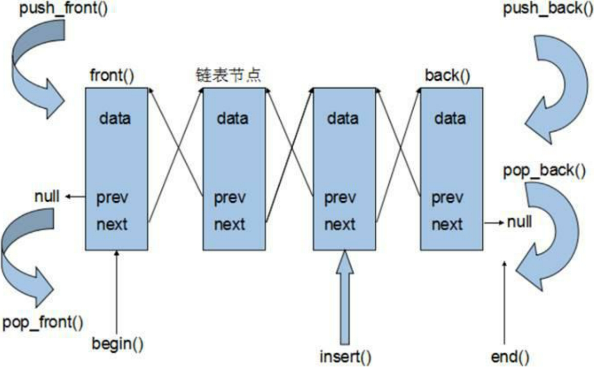

## 2.6 stack容器

```cpp
1. stack构造函数
stack<T> stkT; // stack采用模板类实现，stack对象的默认构造形式：
stack(const stack &stk); // 拷贝构造函数

2. stack赋值操作
stack& operator=(const stack &stk); // 重载等号操作符

3. stack数据存取操作
push(elem); // 向栈顶添加元素
pop(); // 从栈顶移除第一个元素
top(); // 返回栈顶元素

4. stack大小操作
empty(); // 判断堆栈是否为空
size(); // 返回堆栈的大小
```

```cpp
void test01()
{
    stack<int> s;
    // 入栈
    s.push(10);
    s.push(20);
    s.push(30);
    s.push(40);
    if (s.empty()) {
        cout << "栈为空" << endl;
    } else {
        cout << "栈不为空" << endl;
    }
    while (!s.empty()) //非空，返回false
    {
        cout << s.top() << endl;
        s.pop();
    }
}
```

## 2.7 queue容器

队列容器：先进先出

queue允许从一端新增元素，从另一端移除元素。


### 2.7.1 queue没有迭代器

queue所有元素的进出都必须符合“先进先出”的条件，只有queue的顶端元素才有机会被外界取用。queue不提供遍历功能，也不提供迭代器。

### 2.7.2 queue常用API

```cpp
1. queue构造函数
queue<T> queT; // queue采用模板类实现，queue对象的默认构造形式
queue(const queue &que); // 拷贝构造函数

2. queue存取、插入和删除操作
push(elem); // 往队尾添加元素
pop(); // 从队头移除第一个元素
back(); // 返回最后一个元素
front(); // 返回第一个元素

3. queue赋值操作
queue& operator=(const queue &que); // 重载等号操作符

4. queue大小操作
empty(); // 判断队列是否为空
size(); // 返回队列大小
```

```cpp
void test01()
{
    queue<int> q;
    q.push(10);
    q.push(20);
    q.push(30);
    q.push(40);

    if(q.empty()) {
        cout << "容器为空" << endl;
    } else {
        cout << "容器非空" << endl;
        cout << "size = " << q.size() << endl;
        cout << "队头元素 = " << q.front() << endl;
        cout << "队尾元素 = " << q.back() << endl;
    }

    cout << "遍历队列" << endl;
    while (!q.empty()) {
        cout << q.front() << endl;
        q.pop();
    }
}
```

## 2.8 list链表容器

链表是一种物理存储单元上非连续、非顺序的存储结构，数据元素的逻辑顺序是通过链表中的指针链接次序实现的。

链表由一系列结点(链表中每一个元素称为结点)组成，结点可以在运行时动态生成。每个结点包括两个部分：一个是存储数据元素的数据域，另一个是存储下一个结点地址的指针域。相较于vector的连续线性空间，list就显得负责许多，它的好处是每次插入或者删除一个元素，就是配置或者释放一个元素的空间。因此，list对于空间的运用有绝对的精准，一点也不浪费。而且，对于任何位置的元素插入或元素的移除，list永远是常数时间。

list和vector是两个最常被使用的容器，list容器是一个<b>双向链表</b>。采用动态存储分配，不会造成内存浪费和溢出。链表执行插入和删除操作十分方便，修改指针即可，不需要移动大量元素。链表灵活，但时间和空间额外耗费较大。

list容器(双向链表)的迭代器必须具备前移、后移。提供的是双向迭代器。

<div align=center>
    
</div>

<b>回顾</b>

- list:双向迭代器，双向链表
- vector:随机访问迭代器，单端动态数组
- deque:随机访问迭代器，双端动态数组
- stack:无迭代器，栈容器
- queue:无迭代器，队列容器

## 2.8.1 链表的常用API

```cpp
1. list构造函数
list<T> lstT; // list采用模板类实现，对象的默认构造形式；
list(beg,end); // 构造函数将[beg,end)区间中的元素拷贝给本身
list(n, elem); // 构造函数将n个elem拷贝给本身
list(const list &lst); // 拷贝构造函数

2. list数据元素插入和删除操作
push_back(elem); // 在容器尾部加入一个元素
pop_back(); // 删除容器中最后一个元素
push_front(); // 在容器开头插入一个元素
pop_front(); // 从容器开头移除第一个元素
insert(pos, elem); // 在pos位置插入elem元素的拷贝，返回新数据的位置
insert(pos, n, elem); // 在pos位置插入n个elem数据，无返回值
insert(pos, beg, end); // 在pos位置插入[beg,end)区间的数据，无返回值
clear(); // 移除容器的所有数据
erase(beg,end); // 删除[beg,end)区间的数据，返回下一个数据的位置
erase(pos); // 删除pos位置的数据，返回下一个数据的位置
remove(elem); // 删除容器中所有与elem指匹配的元素。

3. list大小操作
size(); // 返回容器中元素的个数
empty(); // 判断容器是否为空
resize(num); // 重新指定容器的长度为num，若容器变长，则以默认值填充新位置。如果容器变短，则末尾超出容器长度的元素被删除。
resize(num. elem); // 重新指定容器的长度为num，若容器变长，则以elem值填充新位置。

4. list赋值操作
assign(beg, end); // 将[beg, end)区间中的数据拷贝赋值给本身。
assign(n, elem); // 将n个elem拷贝赋值给本身
list& operator=(const list &lst); // 重载等号操作符
swap(lst); // 将lst与本身的元素互换

5. list数据的存取
front(); // 返回第一个元素
back(); // 返回最后一个元素、

6. list反转排序
reverse(); // 反转链表
sort(); // list排序
```

```cpp
void test01()
{
    list<int> l;
    l.push_back(10);
    l.push_back(20);
    l.push_back(30);
    l.push_back(40);

    printListInt(l); // 10 20 30 40

    // insert(pos, n, elem);
    // 迭代器+n，只有随机访问迭代器支持
    // 而list容器的迭代器是双向迭代器，不支持+n
    // l.insert(l.begin() + 2, 3, 100); //  error: no match for ‘operator+’ (operand types are ‘std::__cxx11::list<int>::iterator’ {aka ‘std::_List_iterator<int>’} and ‘int’)
    list<int>::iterator it = l.begin();
    // ++ 随机访问迭代器以及双向迭代器都支持
    it++;
    it++; // 两次++不等于+2，因为重载运算符++
    l.insert(it, 3, 100);
    printListInt(l); // 10 20 100 100 100 30 40

    // remove(elem); // 删除容器中所有与elem值匹配的元素
    l.remove(100);
    printListInt(l); // 10 20 30 40

    // 链表反转
    l.reverse();
    printListInt(l); // 40 30 20 10

    // list容器的排序使用list类本身的排序算法
    // sort是系统提供的蒜贩，仅支持随机访问迭代器(不支持list)
    // list不能使用系统算法
    // sort(l.begin(), l.end()); // error: no match for ‘operator-’ (operand types are ‘std::_List_iterator<int>’ and ‘std::_List_iterator<int>’)
    l.sort();
    printListInt(l); // 10 20 30 40
}
```

### 2.8.1.2 list容器存放自定义数据

如果删除某个结点必须重载==运算符,remove()

```cpp
#include <vector>
#include <algorithm>
#include <string>
#include <iostream>
#include <list>

using namespace std;

class Person
{
public:
    string name;
    int age;
public:
    Person(string name, int age)
    {
        this->name = name;
        this->age = age;
    }
    bool operator==(const Person &ob)
    {
        if (this->age == ob.age && this->name == ob.name) {
            return true;
        }
        return false;
    }
};

void printListPerson(list<Person> &l)
{
    for (list<Person>::iterator it = l.begin(); it != l.end(); it++) {
        cout << it->name << ", " << it->age << endl;
    }
}

void test01()
{
    // 存放自定义的数据
    list<Person> l;
    l.push_back(Person("德玛西亚", 18));
    l.push_back(Person("提莫", 28));
    l.push_back(Person("狗头", 38));
    l.push_back(Person("牛头", 19));
    printListPerson(l);

    // 删除狗头
    Person tmp("狗头", 38);
    l.remove(tmp); // error: no match for ‘operator==’ (operand types are ‘Person’ and ‘const value_type’ {aka ‘const Person’})
    printListPerson(l);
}
```

### 2.8.1.3 list容器自定数据排序，必须实现排序规则

```cpp

```