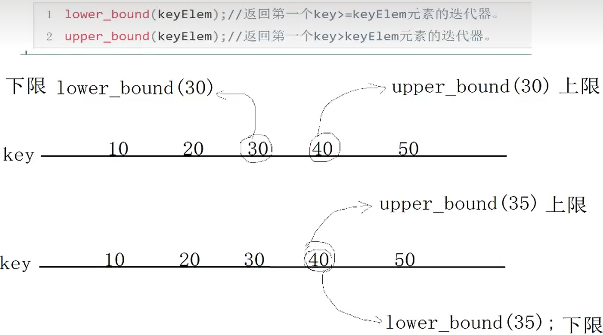

## 2.6 stack容器

```cpp
1. stack构造函数
stack<T> stkT; // stack采用模板类实现，stack对象的默认构造形式：
stack(const stack &stk); // 拷贝构造函数

2. stack赋值操作
stack& operator=(const stack &stk); // 重载等号操作符

3. stack数据存取操作
push(elem); // 向栈顶添加元素
pop(); // 从栈顶移除第一个元素
top(); // 返回栈顶元素

4. stack大小操作
empty(); // 判断堆栈是否为空
size(); // 返回堆栈的大小
```

```cpp
void test01()
{
    stack<int> s;
    // 入栈
    s.push(10);
    s.push(20);
    s.push(30);
    s.push(40);
    if (s.empty()) {
        cout << "栈为空" << endl;
    } else {
        cout << "栈不为空" << endl;
    }
    while (!s.empty()) //非空，返回false
    {
        cout << s.top() << endl;
        s.pop();
    }
}
```

## 2.7 queue容器

队列容器：先进先出

queue允许从一端新增元素，从另一端移除元素。


### 2.7.1 queue没有迭代器

queue所有元素的进出都必须符合“先进先出”的条件，只有queue的顶端元素才有机会被外界取用。queue不提供遍历功能，也不提供迭代器。

### 2.7.2 queue常用API

```cpp
1. queue构造函数
queue<T> queT; // queue采用模板类实现，queue对象的默认构造形式
queue(const queue &que); // 拷贝构造函数

2. queue存取、插入和删除操作
push(elem); // 往队尾添加元素
pop(); // 从队头移除第一个元素
back(); // 返回最后一个元素
front(); // 返回第一个元素

3. queue赋值操作
queue& operator=(const queue &que); // 重载等号操作符

4. queue大小操作
empty(); // 判断队列是否为空
size(); // 返回队列大小
```

```cpp
void test01()
{
    queue<int> q;
    q.push(10);
    q.push(20);
    q.push(30);
    q.push(40);

    if(q.empty()) {
        cout << "容器为空" << endl;
    } else {
        cout << "容器非空" << endl;
        cout << "size = " << q.size() << endl;
        cout << "队头元素 = " << q.front() << endl;
        cout << "队尾元素 = " << q.back() << endl;
    }

    cout << "遍历队列" << endl;
    while (!q.empty()) {
        cout << q.front() << endl;
        q.pop();
    }
}
```

## 2.8 list链表容器

链表是一种物理存储单元上非连续、非顺序的存储结构，数据元素的逻辑顺序是通过链表中的指针链接次序实现的。

链表由一系列结点(链表中每一个元素称为结点)组成，结点可以在运行时动态生成。每个结点包括两个部分：一个是存储数据元素的数据域，另一个是存储下一个结点地址的指针域。相较于vector的连续线性空间，list就显得负责许多，它的好处是每次插入或者删除一个元素，就是配置或者释放一个元素的空间。因此，list对于空间的运用有绝对的精准，一点也不浪费。而且，对于任何位置的元素插入或元素的移除，list永远是常数时间。

list和vector是两个最常被使用的容器，list容器是一个<b>双向链表</b>。采用动态存储分配，不会造成内存浪费和溢出。链表执行插入和删除操作十分方便，修改指针即可，不需要移动大量元素。链表灵活，但时间和空间额外耗费较大。

list容器(双向链表)的迭代器必须具备前移、后移。提供的是双向迭代器。

<div align=center>
    
</div>

<b>回顾</b>

- list:双向迭代器，双向链表
- vector:随机访问迭代器，单端动态数组
- deque:随机访问迭代器，双端动态数组
- stack:无迭代器，栈容器
- queue:无迭代器，队列容器

## 2.8.1 链表的常用API

```cpp
1. list构造函数
list<T> lstT; // list采用模板类实现，对象的默认构造形式；
list(beg,end); // 构造函数将[beg,end)区间中的元素拷贝给本身
list(n, elem); // 构造函数将n个elem拷贝给本身
list(const list &lst); // 拷贝构造函数

2. list数据元素插入和删除操作
push_back(elem); // 在容器尾部加入一个元素
pop_back(); // 删除容器中最后一个元素
push_front(); // 在容器开头插入一个元素
pop_front(); // 从容器开头移除第一个元素
insert(pos, elem); // 在pos位置插入elem元素的拷贝，返回新数据的位置
insert(pos, n, elem); // 在pos位置插入n个elem数据，无返回值
insert(pos, beg, end); // 在pos位置插入[beg,end)区间的数据，无返回值
clear(); // 移除容器的所有数据
erase(beg,end); // 删除[beg,end)区间的数据，返回下一个数据的位置
erase(pos); // 删除pos位置的数据，返回下一个数据的位置
remove(elem); // 删除容器中所有与elem指匹配的元素。

3. list大小操作
size(); // 返回容器中元素的个数
empty(); // 判断容器是否为空
resize(num); // 重新指定容器的长度为num，若容器变长，则以默认值填充新位置。如果容器变短，则末尾超出容器长度的元素被删除。
resize(num. elem); // 重新指定容器的长度为num，若容器变长，则以elem值填充新位置。

4. list赋值操作
assign(beg, end); // 将[beg, end)区间中的数据拷贝赋值给本身。
assign(n, elem); // 将n个elem拷贝赋值给本身
list& operator=(const list &lst); // 重载等号操作符
swap(lst); // 将lst与本身的元素互换

5. list数据的存取
front(); // 返回第一个元素
back(); // 返回最后一个元素、

6. list反转排序
reverse(); // 反转链表
sort(); // list排序
```

```cpp
void test01()
{
    list<int> l;
    l.push_back(10);
    l.push_back(20);
    l.push_back(30);
    l.push_back(40);

    printListInt(l); // 10 20 30 40

    // insert(pos, n, elem);
    // 迭代器+n，只有随机访问迭代器支持
    // 而list容器的迭代器是双向迭代器，不支持+n
    // l.insert(l.begin() + 2, 3, 100); //  error: no match for ‘operator+’ (operand types are ‘std::__cxx11::list<int>::iterator’ {aka ‘std::_List_iterator<int>’} and ‘int’)
    list<int>::iterator it = l.begin();
    // ++ 随机访问迭代器以及双向迭代器都支持
    it++;
    it++; // 两次++不等于+2，因为重载运算符++
    l.insert(it, 3, 100);
    printListInt(l); // 10 20 100 100 100 30 40

    // remove(elem); // 删除容器中所有与elem值匹配的元素
    l.remove(100);
    printListInt(l); // 10 20 30 40

    // 链表反转
    l.reverse();
    printListInt(l); // 40 30 20 10

    // list容器的排序使用list类本身的排序算法
    // sort是系统提供的蒜贩，仅支持随机访问迭代器(不支持list)
    // list不能使用系统算法
    // sort(l.begin(), l.end()); // error: no match for ‘operator-’ (operand types are ‘std::_List_iterator<int>’ and ‘std::_List_iterator<int>’)
    l.sort();
    printListInt(l); // 10 20 30 40
}
```

### 2.8.1.2 list容器存放自定义数据

如果删除某个结点必须重载==运算符,remove()

```cpp
#include <vector>
#include <algorithm>
#include <string>
#include <iostream>
#include <list>

using namespace std;

class Person
{
public:
    string name;
    int age;
public:
    Person(string name, int age)
    {
        this->name = name;
        this->age = age;
    }
    bool operator==(const Person &ob)
    {
        if (this->age == ob.age && this->name == ob.name) {
            return true;
        }
        return false;
    }
};

void printListPerson(list<Person> &l)
{
    for (list<Person>::iterator it = l.begin(); it != l.end(); it++) {
        cout << it->name << ", " << it->age << endl;
    }
}

void test01()
{
    // 存放自定义的数据
    list<Person> l;
    l.push_back(Person("德玛西亚", 18));
    l.push_back(Person("提莫", 28));
    l.push_back(Person("狗头", 38));
    l.push_back(Person("牛头", 19));
    printListPerson(l);

    // 删除狗头
    Person tmp("狗头", 38);
    l.remove(tmp); // error: no match for ‘operator==’ (operand types are ‘Person’ and ‘const value_type’ {aka ‘const Person’})
    printListPerson(l);
}
```

### 2.8.1.3 list容器自定数据排序，必须实现排序规则

<b>1. 重载\<运算符</b>

```cpp
#include <vector>
#include <algorithm>
#include <string>
#include <iostream>
#include <list>

using namespace std;

class Person
{
public:
    string name;
    int age;
public:
    Person(string name, int age)
    {
        this->name = name;
        this->age = age;
    }
    // 重载<运算符
    bool operator<(const Person &ob)
    {
        return this->age < ob.age;
    }
};

void printListPerson(list<Person> &l)
{
    for (list<Person>::iterator it = l.begin(); it != l.end(); it++) {
        cout << it->name << ", " << it->age << endl;
    }
}

void test02()
{
    list<Person> l;
    l.push_back(Person("德玛西亚", 18));
    l.push_back(Person("提莫", 28));
    l.push_back(Person("狗头", 38));
    l.push_back(Person("牛头", 19));
    printListPerson(l);

    // 对于自定义数据，可以重载<运算符
    l.sort(); // error: no match for ‘operator<’ (operand types are ‘Person’ and ‘Person’)
    printListPerson(l);
}
```

<b>list对自定义数据排序指定排序规则</b>

```cpp
bool myComparePerson(const Person &ob1, const Person &ob2)
{
    return ob1.age < ob2.age;
}
void test03()
{
    list<Person> l;
    l.push_back(Person("德玛西亚", 18));
    l.push_back(Person("提莫", 28));
    l.push_back(Person("狗头", 38));
    l.push_back(Person("牛头", 19));
    printListPerson(l);
    cout << "==================" << endl;
    l.sort(myComparePerson);
    printListPerson(l);
}
```

### 2.8.1.4 vector对自定义数据排序指定排序规则

方法一：普通函数实现排序规则

```cpp
void test04()
{
    vector<Person> v;
    v.push_back(Person("德玛西亚", 18));
    v.push_back(Person("提莫", 28));
    v.push_back(Person("狗头", 38));
    v.push_back(Person("牛头", 19));
    printVectorPerson(v);

    // 默认比较方式从小到大，对于自定义数据没有排序规则
    // vector存放自定义数据，可指定排序规则
    sort(v.begin(), v.end(), myComparePerson);
    printVectorPerson(v);
}
```

### 2.8.1.5 仿函数指定排序规则

```cpp
// 仿函数指定排序规则
class MyComparePerson
{
public:
    bool operator()(const Person &ob1, const Person &ob2)
    {
        return ob1.age < ob2.age;
    }
};
void test05()
{
    vector<Person> v;
    v.push_back(Person("德玛西亚", 18));
    v.push_back(Person("提莫", 28));
    v.push_back(Person("狗头", 38));
    v.push_back(Person("牛头", 19));
    printVectorPerson(v);

    sort(v.begin(), v.end(), MyComparePerson());
    printVectorPerson(v);
}
```

### 2.8.1.6 仿函数回顾

```cpp
class MyAdd
{
public:
    // 本质是成员函数，函数名叫operator()
    int operator()(int a, int b)
    {
        cout << "调用了operator() int int" << endl;
        return a + b;
    }
    int operator()(int a, int b, int c)
    {
        cout << "调用了operator() int int int" << endl;
        return a + b + c;
    }
};
void test06()
{
    MyAdd ob1;
    int ret = ob1.operator()(10, 20);
    cout << ret << endl; // 30
    // 严格意义：ob1是对象和()结合，调用operator()成员函数
    // ob1(100,200) ob1本质是对象不是函数名，只是形式像函数调用
    // 叫作仿函数
    cout << ob1(20, 50) << endl; // 70
    cout << MyAdd()(40, 90) << endl; // 130

    cout << ob1(10, 20, 30) << endl; // 60

    cout << MyAdd()(1000, 2000) << endl; // 3000，产生一个匿名对象
}
```

输出：

```bash
调用了operator() int int
30
调用了operator() int int
70
调用了operator() int int
130
调用了operator() int int int
60
调用了operator() int int
3000
```

## lambda表达式

```cpp
void myPrintVectorInt(vector<int> &v)
{
    for (vector<int>::iterator it = v.begin(); it != v.end(); it++) {
        cout << *it << " ";
    }
    cout << endl;
}

// 指定打印方式
void myPrint01(int val)
{
    cout << val << " ";
}

void test07()
{
    vector<int> v;
    v.push_back(10);
    v.push_back(20);
    v.push_back(30);
    v.push_back(40);

    // 方法一：访问v容器，普通函数
    myPrintVectorInt(v);

    // 方法二：访问v容器，系统算法for_each
    for_each(v.begin(), v.end(), myPrint01);
    cout << endl;

    // 方法三：访问v容器 lambda表达式
    // []标识函数名 ()参数列表 {}函数体
    for_each(v.begin(), v.end(), [](int val){ cout << val << " "; });
    cout << endl;
}
```

# 2.9 set容器

set的特性是所有元素都会根据元素的键值自动被排序，set元素不像map那样可以同时拥有实值和键值，set的元素既是键值又是实值。set不允许两个元素有相同的键值。

可以通过set的迭代器改变set元素的值吗？不行，因为set元素值就是其键值，关系到set的排序规则。如果任意改变set元素值，会严重破坏set组织。换句话说，set的iterator是一种const iterator。set拥有和list某些相同的性质，当对容器中的元素进行插入操作或者删除操作的时候，操作之前所有的迭代器，在操作完成之后依然有效，被删除的那个元素的迭代器必然是一个例外。

multiset特性及用法和set完全相同，唯一的差别在于它允许键值重复。set和multiset的底层实现是红黑树，红黑树为平衡二叉树的一种。

树的简单知识：二叉树就是任何节点最多只允许有两个子节点，分别是左子节点和右子节点。

set容器特点：

所有元素都会根据元素的<b>键值</b>自动被排序。

## 2.9.1 set容器常用API

```cpp
1. set构造函数
set<T> st; // set容器默认构造函数
multiset<T> mst; // multiset容器默认构造函数
set(const set &st); // 拷贝构造函数

2. set赋值操作
set& operator=(const set &st); // 重载等号操作符
swap(st); // 交换两个集合容器

3. set大小操作
size(); // 返回容器中元素的数目
empty(); // 判断容器是否为空

4. set插入和删除操作
insert(elem); // 在容器中插入元素
clear(); // 清除所有元素
erase(pos); // 删除pos迭代器所指的元素，返回下一个元素的迭代器
erase(beg, end); // 删除区间[beg, end)的所有元素，返回下一个元素的迭代器
erase(elem); // 删除容器中值为elem的元素
```

```cpp
void test01()
{
    set<int> s;
    s.insert(30);
    s.insert(10);
    s.insert(20);
    s.insert(50);
    s.insert(40);

    for_each(s.begin(), s.end(), [](int val){ cout << val << " "; }); // 10 20 30 40 50 
    cout << endl;

    set<int>::iterator it = s.begin();
    // set容器提供的是只读迭代器const_iterator
    // 迭代器不允许修改值
    // *it = 100; // error: assignment of read-only location ‘it.std::_Rb_tree_const_iterator<int>::operator*()'

    cout << "size = " << s.size() << endl; // size = 5

    s.erase(s.begin()); // 删除起始位置
    for_each(s.begin(), s.end(), [](int val){ cout << val << " "; }); // 20 30 40 50
    cout << endl;

    s.erase(40); // 根据元素删除
    for_each(s.begin(), s.end(), [](int val){ cout << val << " "; }); // 20 30 50
    cout << endl;
}
```

## 2.9.2 set查找操作

```cpp
find(key); // 查找key是否存在，若存在，返回该键的元素的迭代器；若不存在，返回set.end();
count(key); // 查找键key的元素个数
```

```cpp

void test02()
{
    set<int> s;
    s.insert(30);
    s.insert(10);
    s.insert(20);
    s.insert(50);
    s.insert(40);

    // find(key); // 查找key是否存在，若存在，返回该键的元素的迭代器；若不存在，返回set.end();
    set<int>::const_iterator it = s.find(20);
    if (it == s.end()) {
        cout << "没有找到" << endl;
    } else {
        cout << "找到" << *it << endl;
    }

    // count(key); // 查找键key的元素个数
    // set容器的键值是不重复的，那么count(key)只能是0或1。
    int cnt = s.count(30);
    cout << "cnt = " << cnt << endl; // cnt = 1
    cout << s.count(200) << endl; // 0
}
```

## 2.9.3 set上、下限查找

```cpp
lower_bound(keyElem); // 返回第一个key>=keyElem元素的迭代器
upper_bound(keyElem); // 返回第一个key>keyElem元素的迭代器。
```

<div align=center>
    
</div>

```cpp
void test03()
{
    set<int> s;
    s.insert(30);
    s.insert(10);
    s.insert(20);
    s.insert(50);
    s.insert(40);

    for_each(s.begin(), s.end(), [](int val) { cout << val << " "; }); // 10 20 30 40 50
    cout << endl;
    // lower_bound(keyElem); // 返回第一个key>=keyElem元素的迭代器，下限
    set<int>::const_iterator it = s.lower_bound(30);
    if (it != s.end()) {
        cout << "下限查找:" << *it << endl; // 下限查找:30，下限查找:30
    } else {
        cout << "下限查找:不存在" << endl;
    }
    // upper_bound(keyElem); // 返回第一个key>keyElem元素的迭代器，上限
    it = s.upper_bound(30);
    if (it != s.end()) {
        cout << "上限查找:" << *it << endl; // 下限查找:30，上限查找:40
    } else {
        cout << "上限查找:不存在" << endl;
    }
}
```

## 2.9.3 set equal_ubound查找

```cpp
equal_range(keyElem); // 返回容器中key与keyElem相等的上下限的两个迭代器。
```

```cpp
void test04()
{
    set<int> s;
    s.insert(30);
    s.insert(10);
    s.insert(20);
    s.insert(50);
    s.insert(40);

    for_each(s.begin(), s.end(), [](int val) { cout << val << " "; }); // 10 20 30 40 50
    cout << endl;

    // equal_range(keyElem); // 返回容器中key与keyElem相等的上下限的两个迭代器。
    // equal_range 返回的是对组
    // first对组中第一个值，second对组中第二个值
    pair<set<int>::const_iterator, set<int>::const_iterator> pit = s.equal_range(30);
    if (pit.first != s.end()) {
        cout << "下限查找:" << *(pit.first) << endl; // 下限查找:30
    } else {
        cout << "下限查找:不存在" << endl;
    }

    if (pit.second != s.end()) {
        cout << "上限查找:" << *(pit.second) << endl; // 上限查找:40
    } else {
        cout << "上限查找:不存在" << endl;
    }
}
```

## 2.9.4 对组 pair

对组(pair)将一对值组成成一个值，这一对值可以具有不同的数据类型，两个值可以分别用pair的两个公有属性first和second访问。类模板：`template<class T1, class T2> struct pair`。

```cpp
void test05()
{
    // 9527--星爷 10086--移动 10010--联通
    // 定义对组方式1：
    pair<int, string> pair1(9527, "星爷");
    cout << "编号：" << pair1.first << ", 人物：" << pair1.second << endl; // 编号：9527, 人物：星爷

    // 定义对组方式2：(推荐)
    pair<int, string> pair2 = make_pair(10086, "移动");
    cout << "编号：" << pair2.first << ", 人物：" << pair2.second << endl; // 编号：10086, 人物：移动

    // pair=赋值
    pair<int ,string> pair3 = pair2;
    cout << "编号：" << pair2.first << ", 人物：" << pair2.second << endl; // 编号：10086, 人物：移动
}
```

## 2.9.5 set更改容器的默认排序规则(推荐使用仿函数)

```cpp
class MyGreater
{
public:
    bool operator()(int val1, int val2)
    {
        return val1 > val2;
    }
};

void test06()
{
    // 默认从小到大排序
    // 改成从大到小排序,一旦插入过后无法修改排序规则
    // set<int, 排序规则> s;
    // set<int, std::greater<int>> s; // 方法一
    set<int, MyGreater> s; // 方法二,自定义排序规则
    s.insert(30);
    s.insert(10);
    s.insert(20);
    s.insert(50);
    s.insert(40);
    for_each(s.begin(), s.end(), [](int val) { cout << val << " "; }); // 50 40 30 20 10
    cout << endl;

}
```

## 2.9.6 set容器自定义数据必须指定排序规则,重载<运算符

```cpp
class Person
{
public:
    string name;
    int age;
    Person(string name, int age)
    {
        this->name = name;
        this->age = age;
    }

    // 方法一:重载<运算符 从小到大
    bool operator<(const Person &ob) const
    {
        return this->age < ob.age;
    }
};
void test07()
{
    set<Person> s;
    // set存放自定义数据,需提供排序规则,否则无法在内存中进行顺序存放
    s.insert(Person("德玛西亚", 18)); // error: no match for ‘operator<’ (operand types are ‘const Person’ and ‘const Person’)
    s.insert(Person("冯楠", 21)); 
    s.insert(Person("小炮", 20)); 
    s.insert(Person("小法", 19)); 

    for_each(s.begin(), s.end(), [](const Person &ob){ cout << "姓名:" << ob.name << ", 年龄:" << ob.age << endl;});
}
```

运行结果:

```bash
姓名:德玛西亚, 年龄:18
姓名:小法, 年龄:19
姓名:小炮, 年龄:20
姓名:冯楠, 年龄:21
```

> 如果要从大到小排序,就得重载>运算符.有些繁琐,可以指定排序规则,如下:

## 2.9.6 set容器自定义数据必须指定排序规则,指定排序规则

```cpp
class MyGreaterPerson
{
public:
    bool operator()(const Person &ob1, const Person &ob2)
    {
        return ob1.age > ob2.age;
    }
};

void test08()
{
    set<Person, MyGreaterPerson> s;
    s.insert(Person("德玛西亚", 18));
    s.insert(Person("冯楠", 21)); 
    s.insert(Person("小炮", 20)); 
    s.insert(Person("小法", 19)); 
    for_each(s.begin(), s.end(), [](const Person &ob){ cout << "姓名:" << ob.name << ", 年龄:" << ob.age << endl;});
}
```

<b>运行结果:</b>

```bash
姓名:冯楠, 年龄:21
姓名:小炮, 年龄:20
姓名:小法, 年龄:19
姓名:德玛西亚, 年龄:18
```

## 2.9.7 multiset容器

multiset容器可以插入重复的值.

set容器如果插入重复的值,后面的插入会无效.

```cpp
void test09()
{
    set<int> s;
    pair<set<int>::const_iterator, bool> it1;
    pair<set<int>::const_iterator, bool> it2;
    it1 = s.insert(10);
    it2 = s.insert(10);
    if (it1.second == true) {
        cout << "第一次插入成功" << endl; // 第一次插入成功
    } else {
        cout << "第一次插入失败" << endl;
    }
    
    if (it2.second == true) {
        cout << "第二次插入成功" << endl;
    } else {
        cout << "第二次插入失败" << endl; // 第二次插入失败
    }
}
```

> multiset可以插入相同的元素

```cpp
void test10()
{
    multiset<int> mst;
    mst.insert(10);
    mst.insert(10);
    for_each(mst.begin(), mst.end(), [](int val){ cout << val << " ";}); // 10 10,两个相同元素插入成功
    cout << endl;
}
```

---

# 2.10 map容器