封装：把客观的事务抽象成一个类（将数据和方法打包在一起，加以权限的区分，达到保护并安全使用的目的）。

继承：类之间的关系，这种关系使得对象可以继承另外一类对象的特征和能力，目的是：避免公用代码的重复开发，减少代码和数据冗余。

多态：一个接口，多种方法，程序在运行时才决定调用的函数。

# c++语法检查增强

C语言是弱语法语言，C++是强语法语言。

## 全局变量监测增强
c语言代码：
```cpp
int a = 10; // 有赋值，当作定义
int a; // 同名，没有赋值，当作声明

int main()
{
    printf("a：%d\n", a);
    return 0;
}
```
上面代码在c语言中是可以编译通过的，但在C++中编译失败，会报重复定义的错误。

## C++中所有的变量和函数都必须有类型

C语言代码：

```cpp
// i 没有写类型，可以是任意类型
int fun1(i) {
    printf("%d\n", i);
    return 0;
}

// i 没有写类型，可以是任意类型
int fun2(i) {
    printf("%s\n", i);
    return 0;
}

// 没有写参数，代表可以传任何类型的实参
int fun3()
{
    printf("fun33333333\n");
    return 0;
}

fun1(2);
fun2("string");

// 在C语言中，上述代码可以编译通过，C++不行。

// C语言中，如果函数没有参数，建议写void，代表没有参数
```

## 更严格的类型转换

在C++，不同类型的变量一般是不能直接赋值的，需要相应的强转。C语言代码：

```cpp
typedef enum COLOR { GREEN, RED, YELLOW } color;

int main()
{
    color myColor = GREEN;
    mycolor = 10;
    // 在C语言中，枚举类型在编译中中就是int类型。
    printf("mycolor: %d", mycolor);
    char *p = malloc(10);
    return 0;
}
```

> C代码C编译器可通过，C++编译器无法编译通过。

## struct 类型加强

c中定义结构体变量需要加上struct关键字，C++不需要。c中的结构体只能定义成员变量，不能定义成员函数。C++既可以定义成员变量，也可以定义成员函数。

c语言代码：
```c
#include <stdio.h>
struct stu
{
    int num;
    char name[32];
};

void test01()
{
    // stu lucy = { 100, "lucy" }; // 会报错，unknown type name "stu"
    struct stu lucy = { 100, "lucy" };  // 编译通过
}
```

> c++代码可以不需要使用struct关键字。
> 1. C++的结构体中既可以定义成员变量，也可以定义成员函数

## 新增“bool”类型关键字

标准C++的bool类型有两种内建的常量true(转换为整数1)和false(转换为整数0)表示状态。这三个名字都是关键字。bool类型只有两个值，占1个字节大小，给bool类型赋值时，非0值都会自动转换为true，0值会自动转换为false。

C语言中也有bool类型，在C99标准之前是没有bool关键字，C99标准已经有bool类型，包含头文件stdbool.h就可以使用和C++一样的bool类型。

## 三目运算符功能增强

C语言三目运算表达式返回值为数据值，为右值，不能赋值。

```c
int a = 10;
int b = 20;
printf("ret:%d\n", a > b ? a : b);
// 思考一个问题，(a > b ? a : b) 三目运算符表达式返回的是什么？

// (a > b ? a : b) = 100;
// 返回的是右值
```

C++语言三目运算表达式返回值为变量本身(引用)，为左值，可以赋值。

```cpp
a > b ? a : b = 100;    // 返回的是左值，变量的引用
```

> [左值和右值概念]在C++中可以放在赋值操作符左边的是左值，可以放在赋值操作符右边的是右值。有些变量既可以当左值，也可以当右值。左值为Lvalue，L代表Location，表示<B>内存可以寻址</B>，可以赋值。右值为Rvalue，R代表Read，就可以知道它的值。比如：int temp = 10; temp在内存中有地址，10没有，但是可以Read到它的值。

# C/C++中的const

const是C/C++中的一个关键字，是一个限定符，它用来限定一个变量不允许改变，它将一个对象转换成一个常量。

```cpp
const int a = 10;
a = 100; // 编译错误，const是一个常量，不可修改
```

## C和C++中const的区别

### C中的const

C中的const本质是变量，只读变量，既然是变量那么就会给const分配内存，并且在C中const是一个只读变量，C语言中const修饰的只读变量是外部连接的。

外部连接：其他源文件也可以使用。

```cpp
const int arrSize = 10;
int arr[arrSize];   // 在C语言中，这是错误的。因为arrSize占用某块内存，所以C编译器不知道它在编译时的值是多少。
```

> 如果知道arrSize的地址，可以通过地址间接的修改num的值。

```c
int *p = (int *)&arrSize;
*p = 2000;
printf("num = %d\n", num);  // 此时结果为2000
```

> 局部只读变量(局部const变量)，内存在栈区(可读可写) \
> 全局只读变量，内存在文本常量区，不可修改。\
> 所以，如果arrSize是在函数内定义，可以间接修改；但如果arrSize是在全局定义的，则无法对其进行修改。

总结：在C语言中
1. const修饰全局变量，变量名只读，内存空间在文字常量区(只读)、不能通过变量的地址修改空间内容；
2. const修饰局部变量，变量名只读，内存空间在栈区(可读可写)，可以通过data地址间接的修改空间内容。

### C++中的const

出现在所有函数之外的const作用于当前文件(其他文件不可见)，默认为内部连接(只在当前源文件有效)。

如果必须用在其他源文件 使用只读的全局变量 必须加extern转换成外部连接。

```cpp
extern const int num = 100; // 声明+定义，边声明为外部连接
// 然后在其他文件中就可以使用如下：
extern const int num;   // 声明
```

出现在函数内部(局部)const变量，

```cpp
const int data = 10;
// data = 100;     // err 只读
int *p = (int *)&data;
*p = 2000;
std::cout << "*p = " << *p  << std::endl;   // *p = 2000
std::cout << "data = " << data << std::endl;    // data = 10, 未发生修改
```

1. 对于基础数据类型，也就是const int a = 10这种，编译器会把它放到符号表中，不分配内存，当对其取地址时，会分配内存。

> data在符号表中，当对data取地址，这个时候为data分配了新的空间，*p操作的是分配的空间，而data是从符号表获取的值。

const在C++中使用符号表的形式，更类似于`#define`的用法。

2. 当以变量的形式初始化 const 修饰的变量，系统会为其开辟空间。

```cpp
int b = 200;
const int a = b;    // 系统直接为a开辟空间，而不会把a放入符号表中。
int *p = (int *)&a;
*p = 3000;
std::cout << "*p = " << *p << std::endl;    // 3000
std::cout << "a = " << a << std::endl;      // 3000
```

const内容能不能修改，取决于cont变量是否放入了符号表中，放入了符号表则无法修改。

3. 对于自定义数据类型(结构体、对象)，比如类对象，那么也会分配内存。

```cpp
const Person person = { 100， "lucy"};    // 未初始化age
// person.age = 50;     // 不可修改
std::cout << "age: " << person.age << std::endl;
Person *person = (Person *)&person;
// 指针间接修改
pPerson->age = 150;
std::cout << "age: " << person.age << std::endl;    // 150
pPerson->age = 200；
std::cout << "age: " << person.age << std::endl;    // 200
```

### 尽量以const替换`#define`

```c
#define MAX 1024;
```
`#define`从未被编译器看到过，因为在预处理阶段所有的MAX已经被替换为1024，于是MAX并没有将其加入到符号表中。

如果使用常量获得一个编译错误信息时，可能会带来一些困惑，因为这个信息可能会提到1024，但是并没有提到MAX，如果MAX被定义在一个不是你写的头文件中，可能并不知道1024代表什么，也许解决这个问题要花费很长时间。解决方法就是用一个常量替换上面的宏。

```cpp
const int max = 1024;
```

#### const 和 define区别

1. const有类型，可进行编译器类型安全检查。#define 无类型，不可进行类型检查。
2. const有作用域，而 #define 不重视作用域，默认定义处到文件结尾处，如果定义在指定作用域下有效的常量，那么#define就不能用。

```cpp
#define MAX 1024
const short myMax = 1024;

void func(short i)
{
    std::cout << "short函数" << std::endl;
}

void func(int i)
{
    std::cout << "int 函数" << std::endl;
}

void test()
{
    func(MAX);  // int函数， MAX默认是使用int类型强转，数字默认是整型
    func(myMax);    // short函数
}
```

```cpp
void func1(void)
{
    // 作用范围 是当前复合语句
    const int my_num = 10;

    // 作用范围 当前位置到文件结束
    #define MY_NUM 10;
}

void fun2(void)
{
    // cout << "my_num = " << my_num << std::endl; // err, 不识别
    std::cout << "MY_NUM = " << MY_NUM << std::endl;    // 10
}

// #define的作用域是从定义处开始到文件结尾处。
```

> 命名空间对宏常量无法限制作用范围。即使是在命名空间内定义宏常量，也不属于命名空间，而是属于文件。


# 引用(reference)

> 能用引用，绝对不用指针。

变量名本质是一段连续空间的别名，是一个标号，程序中通过变量来申请并命名内存空间，通过变量的名字可以使用内存空间。

引用可以作为一个已经定义好的变量的别名，基本语法：`Type& ref = val;` &在这里不是取地址，而是起标识作用。

类型标识符是指目标变量的类型，必须在声明引用变量时进行初始化。<b>引用初始化之后不能改变</b>。不能有NULl引用。必须确保引用是和一块合法的存储单元关联。可以建立对数组的引用。

有点类似于：`Type* const ref = &val;`不能修改ref指针的指向。

> 引用的核心：给已有的变量起个别名，不会开辟空间。

上面ref本身不存在空间。ref完全等价于val。

注意：

1. 引用必须初始化
2. 引用一旦初始化，就不能再次修改别名

```cpp
int num = 10;
int &a = num;

int data = 20;
a = data;   // 不是data别名为a，而是将data的值赋给a这个别名所指向的变量。

// a是num的别名，所以a和num具有相同的地址空间。
std::cout << "a的地址空间：" << &a << std::endl;        // 0x61fe88
std::cout << "num 的地址空间：" << &num << std::endl;   // 0x61fe88
```

## 引用作用于数组

引用给数组起个别名

1. 方式一：梁哥法

```cpp
void test01()
{
    int arr[5] = { 10, 20, 30, 40, 50 };
    // 需求：给arr起个别名
    int (&my_arr)[5] = arr;  // my_arr就是数组arr的别名
    int i = 0;
    for (int i = 0; i < 5; i++) {
        cout << my_arr[i] << " ";
    }
    std::cout << std::endl;
}
```

2. 方式二：配合typedef

```cpp
void test02()
{
    int arr[5] = { 10, 20, 30, 40, 50 };
    // 需求：给arr起个别名
    // 1、用typedef给数组取个别名
    // TYPE_ARR 就是一个数组类型（有5个元素，每个元素为int）
    typedef int TYPE_ARR{5};

    // TYPE_ARR new_arr = { 1, 2, 3, 4, 5 };
    TYPE_ARR &myArr = arr;

    int i = 0;
    for (int i = 0; i < 5; i++) {
        cout << my_arr[i] << " ";
    }
    std::cout << std::endl;
}
```

## 函数中的引用

在函数参数和返回值中使用引用，当引用被用作函数参数时，在函数内对任何引用的修改，将对函数外的参数产生改变。如果从函数中返回一个引用，必须像从函数中返回一个指针一样对待。当函数返回值时，引用关联的内存一定要存在。

### 在函数参数中使用引用

通过引用参数产生的效果同按地址传递是一样的，引用的语法更清楚简单。

1) 函数调用时传递的实参不必加"&"符
2) 在被调用函数中不必在参数前加"*"符，引用作为其他变量的别名而存在，因此在一些场合可以代替指针。C++主张用引用传递取代地址传递的方式，因为引用语法容易且不易出错。

### 在函数返回值中使用引用

给函数的返回值起一个别名

```cpp
// 引用作为函数的返回值类型
int& my_data()
{
    int num = 100;
    return num; // 函数返回啥变量，引用就是该变量的别名
}

void test05()
{
    // ret是别名，是函数返回值num的别名
    int &ret = my_data();   // 非法访问
}

// 函数内局部变量在退出函数后，num会被释放。
// 函数的返回值是引用时，不要返回局部变量
int& my_data1()
{
    static int num = 100;
    return num; // 函数返回啥变量，引用就是该变量的别名
}

void test05()
{
    // ret是别名，是函数返回值num的别名
    int &ret = my_data();   // 合法，static的生存周期是整个生命周期
}
```

> 不能返回局部变量的引用。
> 函数返回值当左值，那么函数的返回值类型必须是引用。

```cpp
int& my_data(void)
{
    static int num = 10;
    std::cout << "num = " << num << std::endl;
    return num;
}

void test06()
{
    // 函数的返回值 作为左值
    my_data() = 2000;   // num = 10 等价于num = 2000
    my_data();  // num = 2000
}
```

### 引用的本质

引用的本质在C++内部实现是一个<b>指针常量</b>`Type& ref = val; // Type* const ref = &val;`

C++编译器在编译过程中使用常指针作为引用的内部实现，因此引用所占用的空间大小与指针相同，只是这个过程是编译器内部实现，用户不可见。

> 指针常量：int *const p;
> 常量指针：const int* p;

### 指针引用

```cpp
void fun(int **);
给指针变量取一个别名
Type* pointer = NULL;
Type* &newPointer = pointer;

#include <stdlib.h>
#include <string.h>
void my_str1(char **p_str)  // p_str = &str;
{
    // *p_str == *&str ==  str
    *p_str = (char *)calloc(1, 32);
    strcpy(*p_str, "hello world");
}

void my_str2(char* &my_str)
{
    my_str = (char *)calloc(1, 32); // 1块 32字节
    strcpy(my_str, "hello world");
}

void test07()
{
    char *str = NULL;
    // 需求：封装一个函数从堆区给str申请一个空间，并赋值为"hello world"
    my_str1(&str);
    cout << "str = " << str << endl;    // str = hello world
    my_str2(str);
    cout << "str = " << str << endl;    // str = hello world
}
```

### 常量引用


```cpp
typedef struct
{
    int num;
    char name[32];
}STU;

void myPrintSTU1(STU tmp)   // 普通结构体变量作为形参 开销太大 36个字节
{
    cout << sizeof(tmp) << endl;    // 36
    cout << "学号： " << tmp.num << ", 姓名：" << tmp.name << std::endl;    // 学号：100, 姓名：lucy
}

void myPrintSTU2(STU &tmp)   // tmp是lucy的别名 tmp没有开辟独立空间
{
    cout << sizeof(tmp) << endl;    // 36，这里tmp是引用，本质是指针常量，C++编译器内部在使用tmp是，默认会对其进行解地址(解lucy)，所以结果仍然是36，但实际上tmp没有开辟新的内存。
    tmp.num = 2000; // 引用可以进行修改，引用可能导致实参随形参改变而改变
    cout << "学号： " << tmp.num << ", 姓名：" << tmp.name << std::endl;    // 学号：2000, 姓名：lucy
}

void myPrintSTU3(const STU &tmp)    // 常量引用，防止对引用的内容进行修改
{
    cout << sizeof(tmp) << endl;
    // tmp.num = 200;  // err, 因为tmp为常量引用
    cout << "学号： " << tmp.num << ", 姓名：" << tmp.name << std::endl;    // 学号：2000, 姓名：lucy
}

void test08()
{
    STU lucy = {100, "lucy"};

    // 需求：定义一个函数，打印lucy成员
    myPrintSTU1(lucy);
    myPrintSTU2(lucy);
    myPrintSTU3(lucy);
}
```

### 常量的引用

```cpp
void test09()
{
    // 给常量10取个别名 叫num
    // int &针对的是int，10是const int类型
    int &num = 10;  // err, 无法使用右值给int&赋值
    // const int针对的是const int，10就是const int
    const int &num = 10;    // 这是可以的
}
```

# 宏函数与内联函数的比较

内联函数（inline）

在c中，一些短并且执行频繁的计算写成宏，而不是函数。这样可以获得更高的执行效率，宏可以避免函数调用的开销，这些都是在预处理中完成的。

C++中，使用宏函数出现的问题：1）宏看起来像是一个函数调用，但是会隐藏一些难以发现的错误。2）预处理不允许访问类的成员，也就是说预处理宏不能作为类的成员函数。

为了保持预处理宏的效率又增加安全性，而且还能像一般成员函数那样可以在类里访问自如，C++引入了内联函数(inline function)。

内联函数为了集成宏函数的效率，<b>没有函数调用时开销</b>，又可以像普通函数那样，可以进行参数、返回值类型的安全检查，又可以作为成员函数。

内联函数本质是一个真正的函数，拥有普通函数的行为，不同之处在于内联函数会在适当的地方像预定义宏一样展开，所以不需要函数调用开销。

内联函数必须函数体和声明结合在一起。

内联函数的确占用空间，但是内联函数相对于普通函数的优势只是省去了函数调用时候的压栈，跳转，返回的开销。内联函数用空间换时间。

## 类内部的内联函数

任何在类内部定义的函数自动成为内联函数。

```cpp
class Person
{
public:
    Person() { std::cout << "构造函数！" << std::endl; }
    void PrintPerson() { std::cout << "输出Person!" << std::endl; }
}

// 以上两个都将自动成为内联函数，目的是提高效率。
```

## 内联函数和编译器

内联函数不是何时何地都有效

<b>函数的替换发生在编译阶段，而不是预处理阶段。</b>

当调用一个内联函数的时候，编译器首先确保传入参数类型是正确匹配的，或者如果类型不完全匹配，但是可以将其转换为正确类型，并且返回值在目标表达式里匹配正确类型，或者可以转换为正确类型，内联函数就会直接替换函数调用，这就消除了函数调用的开销。

加入内联函数是成员函数，对象this指针也会被放入合适位置，类型检查和类型转换、包括在合适位置放入对象this指针这些都是预处理器不能完成的。

C++内联函数编译的一些限制，以下情况编译器不会将函数进行内联编译：

1. 不能存在任何形式的循环语句；
2. 不能存在过多的条件判断语句；
3. 函数体不能过于庞大，不能对函数进行取址操作。

内联函数仅仅只是给编译器一个建议，编译器不一定会接受这种建议，如果你没有将函数声明为内联函数，那么编译器也可能将此函数做内联编译。一个好的编译器将会内联小的、简单的函数。

# 函数的默认参数

C++在<b>声明函数原型时</b>可为一个或者多个参数<b>指定默认(缺省)的参数值</b>，当函数调用的时候如果没有指定这个值，编译器会自动用默认值代替。

```cpp
int my_add(int x = 10, int y = 20)
{
    return x + y;
}

void test02()
{
    std::cout << "my_add = " << my_add(100, 200) << std::endl;  // 300
    std::cout << "my_add = " << my_add(100) << std::endl;  // 120
    std::cout << "my_add = " << my_add() << std::endl;  // 30
}
```

注意点：

1. 函数的默认参数从左到右，如果一个参数设置了默认参数，那么这个参数之后的参数都必须设置默认参数。
2. 如果函数声明和函数定义分开写，函数声明和函数定义不能同时设置默认参数，默认参数只在函数声明处起作用。


## 函数的占位参数

C++在声明函数时，可以设置占位参数。占位参数只有参数类型声明，没有参数名。一般情况下，在函数体内部无法使用占位参数。

由于有类型名，所以函数调用的时候，必须给占位参数传参； \
由于没有形参名，所以函数内部是无法使用占位参数的。

```cpp
void func3(int x, int y, int)
{
    std::cout << "x = " << x << ", y = " << y << std::endl;
    return;
}

void test05()
{
    func3(10, 30, 40);
}
```

> 操作符重载的后置++要用到这个。


# 函数重载(overload)

C++多态的特性

<b>函数重载意义</b>：方便的使用函数名

函数重载条件：同一个作用域，参数个数不同/参数类型不同/参数顺序不同 均可重载

<b>注意</b>

1. 函数的返回值类型不能作为重载的依据；
   在编写程序过程中可以忽略他的返回值。
2. 函数重载和默认参数一起使用，需要额外注意二义性问题的产生。
   ```cpp
    void myFunc02(int a)
    {
        cout << "int 的 myFunc" << std::endl;
    }
    void myFunc02(int a, int b = 10)    // 默认参数
    {
        cout << "int, int 的 myFunc" << std::endl;
    }
    void test07()
    {
        // myFunc02(int a) 和 myFunc02(int a, int b = 10)都能识别
        myFunc02(10);   // call of overloaded'myFunc02(int)' is ambiguous
    }
   ```

## 函数重载实现原理

编译器使用不同的参数类型来修饰不同的函数名，比如void func()：编译器可能会将函数名修饰成func，对于void func(int x)，编译器可能将函数名修饰为funcint；对于void func(int x, char c)，编译器会将函数名修改为funcintchar。


# C和C++混合编程

```cpp
extern "c" {    // 这部分代码将会由C语言编译器去编译链接。

}
```

```cpp
// MyModule.h
#ifndef MYMODULE_H
#define MYMODULE_H

#include <stdio.h>

#if __cplusplus
extern "C" {
#endif

    extern void func1();
    extern int func2(int a, int b);

#if _cplusplus
}
#endif

#endif

// MyModule.c
#include "MyModule.h"

void func1()
{
    printf("hello world!\n");
}

int func2(int a, int b)
{
    printf("a + b = %d\n", a + b);
}

// TestExternC.cpp
#define _CRT_SECURE_NO_WARNINGS
#include <iostream>
#include "MyModule.h"
using namespace std;

int main()
{
    func1();
    func2(10, 20);
    return 0;
}
```

> ubuntu:
> main.cpp fun.c fun.h
> 混合编译步骤：
>   gcc -c fun.c -o fun.o
>   g++ main.cpp fun.o -o main


# 四、类和对象

C语言中struct只有变量，C++语言struct既有变量，也有函数。

C语言中，将数据和方法独立，容易造成方法调用错误数据。

```cpp
typedef {
    char name[32];
    int age;
}Person;

typedef {
    int age;
    char name[32];
}Dog;

void PersonEat(void *p) {
    Person *person = (Person *)p;
    printf("%s正在吃饭！\n", person->name);
}

void AnimalEat(void *a) {
    Dog *dog = (Dog *)a;
    printf("%s正在吃狗粮！\n", dog->name);
}

void test()
{
    Person person = {18, "老王"};
    Dog dog = {2. "旺财"};

    PersonEat((void *)&person); // 老王正在吃饭！
    AnimalEat((void *)&dog);    // 旺财正在吃狗粮！
    AnimalEat((void *)&person); // 老王正在吃狗粮！ 用错的情况
}
```

在C语言中，行为和属性是分开的，也就是吃饭这个属性不属于某类对象，而属于所有的共同的数据，所以不单单是PeopleEat可以调用Person数据，AnimalEat也可以调用Person数据，如果调用错误，将会导致问题发生。

因此，属性和行为应该放在一起，一起表示一个具有属性和行为的对象。加入某对象的某项属性不想被外界获知，封装应该再提供一种机制能够给属性和行为的访问权限控制住。

<b>封装特性包含两个方面：一个是属性和变量合成一个整体，一个是给属性和函数增加访问权限。</b>

1. 把变量(属性)和函数(操作)合成一个整体，封装在一个类中
2. 对变量和函数进行访问控制
3. 在类的内部(作用域范围内)，没有访问权限之分，所有成员可以相互访问。
4. 在类的外部(作用域范围外)，访问权限才有意义：public、private、protected.
5. 在类的外部，只有public修饰的成员才能被访问，在没有涉及继承与派生类时，private和protected是同等级的，外部不允许访问。

## 类的初始

```cpp
class 类名 {    // 抽象的概念，系统不会为其分配空间， 但是有大小。
    private:    // 私有 类的外部不可直接访问
    protected:  // 保护；
    数据

    public:     // 公有 类的外部可以直接访问
    方法

    // 在类的内部，没有权限之分，都可以相互访问。
};
```

<b>C++中，struct和class的区别？</b>

> class默认访问权限为private，struct默认访问权限为public。

## 将成员变量设置为private

1. 可赋予客户端访问数据的一致性。如果成员变量不是public，客户端唯一能够访问对象的方法就是通过成员函数。
2. 可细微划分访问控制。使用成员函数可使得我们对变量的控制处理更加精细。如果成员变量访问权限为public，每个人都可以读写它。如果设置为private，可以实现 不准访问、只读访问、读写访问、设置只写访问。

 ## 类的大小

```cpp
class Data
{
private:
    // 成员数据 占类的空间大小
    int num;
public:
    // 成员函数不占用类空间大小，成员函数放在代码区，根据函数名和形参列表去代码区调用函数。
    void setNum(int data)
    {
        num = data;
    }
    int getNum(void)
    {
        return num;
    }
};

void test01()
{
    printf("%d\n", sizeof(Data));   // 4， 4个字节是int num的空间大小
}
```

## 在类里声明，类外定义 成员函数。

> Data.h

```cpp
class Data
{
private:
    int num;
public:
    void setNum(int data);
    int getNum(void);
};
```

> Data.cpp

```cpp
void Data::setNum(int data)
{
    num = data;
}

int Data::getNum(void)
{
    return num;
}
```


## 对象的构造和析构

### 初始化和清理

构造函数和析构函数会被编译器自动调用，完成对象初始化和对象清理工作。

构造函数主要作用于创建对象时为对象的成员属性赋值，构造函数由编译器自动调用，无须手动调用；
析构函数主要用于对象销毁前系统自动调用，执行一些清理工作。

### 构造和析构的定义

<b>构造函数语法</b>：构造函数函数名和类名相同，没有返回值（不能有void），但可以有参数。`class ClassName(){}`

<b>析构函数语法</b>：析构函数函数名在类名前面加“~”，没有返回值（不能有void），不能有参数，不能重载。


### 构造函数的分类

#### 构造函数分类

按照参数类型：无参构造和有参构造 \
按照类型分类：普通构造和拷贝构造函数(复制构造函数)

#### 构造函数调用

无参构造的调用形式：

1. 实例化

```cpp
Data obj1;   // 调用无参或默认构造(隐式调用构造函数)

Data obj2 = Data(); // 显式调用无参构造函数


Data obj3(10);  // 调用有参构造(隐式调用)
Data obj4 = Data(100);  // 显式调用有参构造函数

// 隐式转换的方式，调用有参构造(针对于只有一个数据成员的情况)
Data obj5 = 30;     // 转化成Data obj5(30);

// 匿名对象(当前语句结束，匿名对象立即释放)
Data(40);
```

<b>注意</b>：在同一作用域构造和析构的顺序相反。

#### 拷贝构造函数

```cpp
class Data
{
private:
    int num;
public:
    // 无参构造函数
    Data()
    {
        num = 0;
        cout << "无参构造函数 num = " << num << std::endl;
    }

    // 构造函数（有参的构造）
    Data(int n) 
    {
        num = n;
        cout << "有参构造函数 num = " << num << std::endl;
    }

    // 拷贝构造函数
    Data(const Data &obj)
    {
        num = obj.num;
        cout << "拷贝构造函数 num = " << num << std::endl;
    }

    // 析构函数
    ~Data()
    {
        cout << "析构函数 num = " << num << std::endl;
    }
};

void test03()
{
    Data obj1(10);
    Data obj2 = obj1;   // 调用拷贝构造函数 隐式转换调用
    Data obj3(obj1);    // 调用拷贝构造函数 隐式调用
    Data obj4 = Data(obj1); // 调用拷贝构造函数 显式调用
    // obj4并不会有两次拷贝构造，因为Data(obj1)是拷贝构造，但 obj4 = Data(obj1);是属于对象赋值操作。
}
```

> 调用拷贝构造函数（如果用户不实现拷贝构造，系统将调用默认的拷贝构造） \
> 默认的拷贝构造：单纯的整体赋值（浅拷贝） \
> 如果用户实现了拷贝构造，系统将调用用户实现的拷贝构造

<b>注意</b>：旧对象 初始化新对象，才会调用拷贝构造函数。

```cpp
Data ob1(10);
Data ob2;
ob2 = ob1;  // 不会调用拷贝构造，单纯的对象赋值操作
```

```cpp
Data ob1(); // 不会认为是实例化对象ob1, 而是看成函数ob1声明
```

#### 构造函数的调用规则

C++编译器至少为我们写的类增加3个函数，\
1：默认构造函数(无参，函数体为空)；\
2：默认析构函数(无参，函数体为空)；\
3：默认拷贝构造函数，对类中<b>非静态成员属性简单值拷贝</b>。

如果用户定义了普通构造（非拷贝），C++不再提供默认无参构造，但是会提供默认拷贝构造。

<b>1、如果用户提供了有参构造，将屏蔽系统的默认构造函数。</b> \
```cpp
Data ob1;   // err
```
<b>2、如果用户提供了有参构造，不会屏蔽系统的默认拷贝构造函数。</b> \
```cpp
Data ob1(10);
Data ob2 = ob1; // ob2.num == 10;
```
<b>3、如果用户提供了拷贝构造函数，将屏蔽系统的默认构造函数、默认拷贝构造函数。</b>
```cpp
Data ob1;   // err
```

<b>总结:</b>

对于构造函数，用户一般要实现：无参构造、有参构造、拷贝构造、析构

#### 深拷贝和浅拷贝

同一类型的对象之间可以赋值，使得两个对象的成员变量的值相同，两个对象仍然是独立的两个对象，这种情况被称为浅拷贝。一般情况下，浅拷贝没有任何副作用，但是当类中有指针，并且指针指向动态分配的内存空间，析构函数做了动态内存释放的处理，会导致内存问题。

```cpp
#include <iostream>
#include <cstdlib>
class Person
{
private:
    char m_name[32];
    int m_num;
public:
    Person()
    {
        m_name = NULL;
        m_num = 0;
        cout << "无参构造函数" << std::endl;
    }

    Person(char *name, int num)
    {
        // 为m_name申请空间
        m_name = (char *)calloc(1, strlen(name) + 1);
        if (m_name == NULL) {
            cout << "构造失败" << std::endl;
        }
        strcpy(m_name, name);
        m_num = num;
        cout << "有参构造函数" << std::endl;
    }

    Person(const Person &bob)
    {
        cout << "拷贝构造函数" << std::endl;
        m_name = (char *)calloc(1, strlen(ob.m_name) + 1);
        strcpy(m_name, bob.m_name);
        m_name = bob.m_num;
    }

    ~Person()
    {
        if (m_name != NULL)
        {
            free(m_name);
            m_name = NULL;
        }
        cout << "析构函数" << std::endl;
    }

    void showPerson(void)
    {
        cout << "m_name = " << m_name << ", m_num = " << m_num << std::endl;
    }
};

void test01()
{
    Person lucy("lucy", 18);
    lucy.showPerson();

    // 浅拷贝的问题（多次释放同一块堆区空间）
    // 通过自定义拷贝构造函数，完成深拷贝动作。
    Person bob = lucy;  // 调用系统的默认拷贝构造（单纯的值拷贝）
}
```

#### 初始化列表

初始化列表只能在构造函数中使用。

<b>类的对象作为另一个类的成员</b>

```cpp
class A
{
private:
    int data;
public:
    A()
    {
        cout << "A无参构造" << endl;
    }
    A(int d)
    {
        cout << "A有参构造" << endl;
    }
    ~A()
    {
        cout << "A析构函数" << endl;
    }
};

class B
{
private:
    int data;
public:
    B()
    {
        cout << "A无参构造" << endl;
    }
    B(int d)
    {
        cout << "A有参构造" << endl;
    }
    ~B()
    {
        cout << "A析构函数" << endl;
    }
};

class Data
{
private:
    A oba;  // 对象成员
    B obb;  // 对象成员
    int data;   // 基本类型成员
public:
    Data()
    {
        cout << "Data无参构造" << endl;
    }

    Data(int a, int b, int c)
    {
        cout << "Data有参构造" << endl;
    }

    ~Data()
    {
        cout << "Data析构函数" << endl;
    }
};

void test()
{
    Data data;  // Data的成员对象，A和B都只会调用各自的无参构造函数。由于A和B的成员变量data都是private，所以无法给A和B的对象成员变量data赋值。
}

// 使用初始化列表
Data(int a, int b, int c) : oba(a), obb(b), data(c)
{
    cout << "Data有参构造" << endl;
}
// 使用初始化列表之后，成员变量A oba;和B obb;会被当成声明，然后在初始化列表中调用各自的有参构造函数。
```

先调用对象成员的构造-->自己的构造函数-->析构自己-->析构对象成员

必须在Data的构造函数中，使用初始化列表，使其对象成员显式调用对象成员调用有参构造函数。

<b>注意：</b>

1. 按各对象成员在类定义中的顺序（和参数列表的顺序无关）依次调用它们的构造函数；
2. 先调用对象成员函数的构造函数，再调用本身的构造函数。析构函数和构造函数调用顺序相反，先构造，后析构。

### explict关键字

C++提供了关键字explict，禁止通过构造函数进行的隐式转换。声明为explict的构造函数不能在隐式转换中使用。

<b>注意</b>：explict用于修饰构造函数，防止隐式转换。是针对单参数的构造函数(或者除了第一个参数外其余参数都有默认值的多参构造)而言。其实是前面所描述的隐式转换构造。

### 动态对象创建

创建数组时，总是需要提前预订数组的长度，然后编译器分配预定长度的数组空间；在使用数组时，会存在也许数组空间太大，浪费空间；也许数组空间不足。如果能根据需要来分配空间大小再好不过了。

C早就提供了动态内存分配(dynamic memory allocation)，函数malloc和free可以在运行时从堆中分配存储单元。然而这些函数在C++中不能很好的运行，因为它不能帮我们完成对象的初始化工作。

#### 对象创建

当创建一个C++对象时会发生两件事：
1. 为对象分配内存空间；
2. 调用构造函数来初始化那块内存。

如果使用malloc、calloc、realloc，第一步我们能保证实现；但第二步需要程序员理解和小心使用才能确保第二步一定能发生。

```cpp
Data *p = (Data *)malloc(sizeof(Data));
if (p == NULL)
{
    std::cout << "申请失败" << std::endl;
}

p->Init(100);
p->showNum();

free(p);
```

<b>问题：</b>

1. 程序员必须确定对象的长度；
2. malloc返回一个void指针，C++不允许将void赋值给其他任何指针，必须强转；
3. malloc可能申请内存失败，所以必须判断返回值来确保内存分配成功；
4. 用户在使用对象之前必须记住对它的初始化，<b>构造函数不能显式调用初始化（构造函数是由编译器调用）</b>，用户有可能忘记调用初始化函数。

C的动态分配函数太复杂，容易令人混淆，是不可接受的，C++中我们推荐使用运算符new和delete。

#### new operator

C++中解决动态内存分配的方案是把创建一个对象所需要的操作都结合在一个称为new的运算符里。当用new创建一个对象时，它就在堆里为对象分配内存并调用构造函数完成初始化。

```cpp
Person* person = new Person;
// 相当于：
Person* person = (Person*)malloc(sizeof(Person));
if (person == NULL)
{
    return 0;
}
person->init();
```

1. new给基本类型申请空间

```cpp
void test01()
{
    // 基本类型
    int *p = NULL;
    // p = (int *)calloc(1, sizeof(int));
    p = new int;
    *p = 100;
    cout << "*p = " << *p << endl;

    // 释放 free(p)
    delete p;
}
```

2. new 申请基本类型数组空间

```cpp
void test02()
{
    int *arr = NULL;
    // arr = (int *)calloc(5, sizeof(int));
    arr = new int[5];

    int i = 0;
    for (i = 0; i < 5; i++) {
        cout << arr[i] << " ";
    }
    cout << endl;

    // 释放 new时加了[] delete必须加[]
    delete [] arr;
}
```

> 动态分配数组初始化：`arr = new int[5]{1, 2, 3, 4, 5};`

> delete [] arr;   中括号是一个标志，有[]，编译器会去拿arr的元素个数，然后释放对应个数的对象。

3. new 申请char数组

```cpp
void test04()
{
    // char *arr = new char[32]{"hehe"};   // err, invalid conversion from 'const char*' to 'char'
    // 大括号认为是给某一个元素赋值，只能逐个元素赋值；如果需要整体赋值，需要先申请空间，然后使用strcpy()或者memorycopy进行拷贝。字符串常量是char*
    // 方法一：
    char *arr = new char[32]{'h', 'e', 'h', 'e'};

    // 方法二：
    char *arr = new char[32];
    strcpy(arr, "hehe");
    cout << arr << endl;
    delete [] arr;
}
```

4. new从堆区实例化对象

```cpp
class Person
{
private:
    char m_name[32];
    int  m_num;
public:
    Person()
    {
        cout << "无参构造" << endl;
    }
    Person(char *name, int num)
    {
        strcpy(m_name, name);
        m_num = num;
        cout << "有参构造" << endl;
    }
    ~Person()
    {
        cout << "析构函数" << endl;
    }

    void showPerson()
    {
        cout << "m_name = " << m_name << "， num = " << m_num << endl;
    }
};

void test05()
{
    // new按照Person申请空间，如果申请成功就会自动调用Person类的构造函数。
    Person *person = new Person("lucy", 100);

    // 由于person是指针，使用 -> 如果 person是普通对象，使用`.`
    person->showPerson();
    
    // delete 先调用析构函数，再释放堆区空间
    delete person;
}
```

### 对象数组

本质是数组，只是数组的每个元素是类的对象。

```cpp
void test06()
{
    // 对象数组 arr是数组，每个元素是Person类型的对象
    // 定义对象数组的时候，系统会自动给数组中的每个元素调用构造函数
    // 自动调用无参构造
    Person arr[5];

    // 人为2为元素调用有参构造
    // 前面两个元素会调用有参构造函数
    Person arr1[5] = { Person("lucy", 18), Person("bob", 18)};
    // arr1[0] // 第 0 个元素，就是Person对象
    arr1[0].showPerson();   // lucy
    arr1[1].showPerson();   // bob
}
```

#### 用new申请对象指针

```cpp
void test08()
{
    // 第一种方式
    Person *arr = NULL;
    arr = new Person[5];    //  调用无参构造

    delete [] arr;

    // 第二种方式：
    // 初始化元素调用有参构造，没有初始化的调用无参构造
    Person *arr2 = new Person[5]{Person("lucy", 18), Person("bob", 20)};
    (*(arr2 + 0)).showPerson();
    arr2[0].showPerson();
    (arr2 + 0)->showPerson();

    delete [] arr2;
}
```

#### delete不让释放void指针

```cpp
void test09()
{
    Person *p = new Person("lucy", 18);
    p->showPerson();

    void *p1 = p;

    delete p1;  // 运行不会出错，但不会调用Person的析构函数，说明没有被正确释放。
}
```

> 尽量不要用delete释放void*。

为什么没有析构？

> delete有两步：1) 调用析构函数, 2) 释放内存。 \
> delete发现p1指向的类型为void，无法从void中寻找相应的析构函数。

> malloc、free和new、delete不能混搭使用。因为new操作符有两件事：分配内存和调用构造函数；delete操作符也有两件事：调用析构函数和释放内存。


### 静态成员

在类定义中，它的成员（包括成员变量和成员函数），这些成员可以用关键字static声明为静态的，称为静态成员。不管这个类创建了多少个对象，静态成员只有一个拷贝，这个拷贝被所有属于这个类的对象共享。

#### 静态成员变量

> 静态成员属于类而不是对象。 \
> 静态变量是在编译阶段就分配空间，对象还没有创建时，就已经分配了空间。
> <b>静态成员必须在类内声明，在类外定义</b>。因为在编译阶段类是不会分配空间的，只有在对象初始化的时候才会分配空间。

```cpp
class Data
{
public:
    int num;    // 普通成员变量
    static int data;    // 静态成员变量(类内声明)
};

// 定义的时候不需要加static
int Data::data = 100;   // 类外定义+初始化

void test01()
{
    // data是静态成员变量，是属于类，可以通过类名称直接访问
    cout << Data::data << endl; // 100
    // 赋值
    Data::data = 200;
    cout << Data::data << endl; // 200

    // data是静态变量，是所有对象共享的，可以通过对象名访问
    Data ob1;
    ob1.data = 300;
    cout << Data::data << endl; // 300

    Data ob2;
    cout << ob2.data << endl;

    // 普通成员变量属于对象的，只能通过对象名访问
}
```

#### 静态成员函数

```cpp
class Data
{
private:
    int num;    // 普通成员变量
    static int data;    // 静态成员变量(类内声明)

public:
    // 普通成员函数依赖于对象
    int getData(void)
    {
        return data;
    }
};

// 定义的时候不需要加static
int Data::data = 100;   // 类外定义+初始化

void test02()
{
    // cout << Data::data << endl; // err, 'int Data::data' is private.
    // cout << Data::getData() << endl;    // err, getData()必须对象调用

    Data ob;
    cout << ob.getData() << endl;   // 可以访问

    // 存在问题，data是静态的，在创建对象之前就已经存在。存在真空期，如果类没有实例化对象，就不能使用data？
    // 解决方法：用静态成员函数
}
```

> 当static类成员变量被private修饰时，在类外依然不能访问，而只能在类内被访问。但是static变量的定义依然需要在类外定义+初始化。


```cpp
class Data
{
private:
    int num;
    static int data;
public:
    int getData()
    {
        return data;
    }
    static int getData()
    {
        return data;
    }
};

int Data::data = 100;

void test
{
    Data ob;
    cout << ob.getData() << endl;

    // 1. 静态成员函数属于类，可以通过类名称直接访问
    cout << Data::getDataStatci() << endl;

    // 2. 也可以通过对象名访问(对象共享静态成员函数)
    cout << ob.getDataStatic() << endl;
}
```

<b>注意：</b>
1. 静态成员函数的目的：操作静态成员变量。
2. 静态成员函数不能访问非静态成员变量。
3. 普通成员函数可以访问普通成员变量，也可以访问静态成员变量。
4. 静态成员变量和静态成员函数都有权限之分。

#### const静态成员属性

如果一个类的成员，既要实现共享，又要实现不可改变，那就用const static修饰。定义静态const成员变量时，最好在类内部初始化。

```cpp
class Person
{
public:
    const static int data;
};

const int Person::data = 100;   // 类外定义+初始化，这是可以的，但不允许修改

void test()
{
    // 访问
    cout << Person::data << endl;   // 100
    // 赋值
    // Person::data = 200; //  err, 不能进行修改

}
```

#### 静态案例

1. 静态成员变量统计对象的个数

```cpp
class Data
{
public:
    Data()
    {
        cout << "无参构造" << endl;
        count++;
    }
    Data(const Data &ob)
    {
        cout << "拷贝构造函数" << endl;
        count++;
    }
    ~Data()
    {
        cout << "析构函数" << endl;
        count--;
    }

    static int count;
};

int Data::count = 0;

int main(int argc, char **argv)
{
    Data ob1;
    Data ob2;
    {
        Data ob3;
        Data ob4;
        cout << "对象的个数:" << Data::count << endl;   // 4
    }
    cout << "对象的个数:" << Data::count << endl;   // 2
}
```

2. 单例模式

Singleton(单例)：在单例类的内部实现只生成一个实例，同时它提供一个静态的getInstance()工厂方法，让客户可以访问它的唯一实例。为了防止在外部对其实例化，将其默认构造函数和拷贝构造函数设计为私有；在单例类内部定义了一个Singleton类型的静态对象，作为外部共享的唯一实例。

步骤1： 在单例类内部定义了一个Singleton类型的静态对象，作为外部共享的唯一实例。
步骤2： 提供一个静态的getInstance()工厂方法，让客户可以访问它的唯一实例。
步骤3： 为了防止在外部对其实例化，将其默认构造函数和拷贝构造函数设计为私有。

```cpp
#include <iostream>

using namespace std;

class Printer
{
public:
    // 2. 提供一个方法获得单例指针
    static Printer* getSinglePrint(void)
    {
        return singlePrint;
    }

    // 4. 设置功能函数（自定义）
    void printText(char *str)
    {
        cout << "打印" << str << endl;
        count++;
    }

    int count;
private:
    // 1. 定义一个静态的对象指针变量，保存唯一实例地址
    static Printer *singlePrint;

private:
    // 3. 防止该类实例化其他对象，将构造函数全部私有
    Printer() { count = 0; }
    Printer(const Printer &ob)
    {

    }
    ~Printer()
    {

    }
};

// 申请一个唯一的实例
Printer *Printer::singlePrint = new Printer;

int main(int argc, char **argv)
{
    // 打印任务1
    Printer *p1 = Printer::getSinglePrint();
    p1->printText("入职报告1");
    p1->printText("体检报告2");
    p1->printText("离职证明3");

    // 打印任务2
    Printer *p2 = Printer::getSinglePrint();
    p2->printText("入职报告1");
    p2->printText("体检报告2");
    p2->printText("离职证明3");

    cout << "打印任务数量：" << p2->count << endl;
    return 0;
}
```

### this指针

C++的封装性：将数据和方法封装在一起，数据和方法是分开存储。数据存储在每个对象中，而方法是对象共有的，存储在代码区。

```cpp
class Data
{
public:
    int m_num;
    void setNum(int num)
    {
        m_num = num;
    }
};

void test01()
{
    Data ob1;
    ob1.setNum(10);
    cout << "ob1.m_num = " << ob1.m_num << endl;

    Data ob2;
    ob2.setNum(20);
    cout << "ob1.m_num = " << ob2.m_num << endl;

    Data ob3;
    ob3.setNum(30);
    cout << "ob1.m_num = " << ob3.m_num << endl;
}
```

<b>思考：</b>
1. m_num是ob1,ob2和ob3独有的，但是方法setNUm(int num)是在代码区，为什么方法可以精确的知道需要给哪个对象的m_num赋值呢？
2. 当一个对象，调用setNum()方法时，会在setNum方法中产生一个this指针，this指针指向所调用方法的对象。
    ```cpp
    void setNum(int num)
    {
        this->m_num = num;
        m_num = num;    // 相当于this->m_num = num;
    }
    ```
3. 哪个对象调用方法，那么方法中的this就指向哪个对象。

#### this指针的注意点

1. this指针时隐含在对象成员函数内的一种指针；
2. 成员函数通过this指针即可知道操作的是哪个对象的数据；
3. 静态成员函数内部没有this指针，静态成员函数不能操作非静态成员变量。

#### this指针的使用

1. 当形参和成员变量同名时，可用this指针来区分

```cpp
class Data
{
public:
    int num;

    // 形参和成员名相同
    void setNum(int num)
    {
        // 形参num
        // 形参num this->num
        // num = num;   // 就近原则，形参num赋值给形参num
        this->num = num;
        // 将形参num赋值给对象中成员num
    }
};
```

2. 在类的普通成员函数中返回对象本身（*this）

```cpp
class MyCout
{
public:
    // 如果返回值是void就无法使用链式打印
    // void myCout(char *str)
    // {
    //     cout << str;
    // }

    // 可以使用链式打印
    MyCout& myCout(char *str)
    {
        cout << str;
        return *this;   // *this代表就是当前调用该函数的对象
    }
};

int main(int argc, char **argv)
{
    MyCout ob;
    /*
    ob.myCout("hehe");
    ob.myCout("haha");
    ob.myCout("xixi");
    */

    ob.myCout("hehe").myCout("haha").myCout("xixi");

    return 0;
}
```

## const修饰成员函数

用const修饰的成员函数时，const修饰this指针指向的内存区域，成员函数体内不可以修改本类中的任何普通成员变量，当成员变量类型符用mutable修饰时例外。

```cpp
void myFun(void) const  // const修饰的是成员函数
{

}   // 函数内部不能修改普通成员变量，mutable修饰的例外

class Data
{
private:
    int data;
    mutable int num;
public:
    // 遍历成员的函数，不会去修改成员的值
    // 如果函数不会更改成员数据，就让编译器知道这是一个const函数
    void myPrintData(void) const
    {
        // data = 1000; // err, const修饰函数，函数不能操作普通成员函数
        // mutable修饰的成员变量，可以修改
        num = 1000;
        cout << this->data << endl;
    }
    Data()
    {
        cout << "无参构造" << endl;
    }
    Data(int data)
    {
        this->data = data;
        cout << "有参构造" << endl;
    }
    Data(const Data &ob)
    {
        this->data = ob.data;
        cout << "拷贝构造" << endl;
    }
    ~Data()
    {
        cout << "析构函数" << endl;
    }
};

void test02()
{
    Data ob1(10);
    ob1.myPrintData();
}
```


### const修饰对象(叫常对象)

`const int num = 10;`变量系统不会给num开辟空间，num被放入符号表中，如果后期对num取地址，这时系统才会给num开辟空间。

```cpp
class  Data
{
private:
    int data;
    mutable int num;
public:
    void myPrintData(void) const
    {
        cout << this->data << endl;
    }
    // 编译器认为普通成员函数存在修改成员变量的可能
    void setData(int num) const
    {
        // this->data = num;
        this->num = num;
    }
    Data()
    {
        cout << "无参构造" << endl;
    }
    Data(int data)
    {
        this->data = data;
        cout << "有参构造" << endl;
    }
    Data(const Data &ob)
    {
        this->data = ob.data;
        cout << "拷贝构造" << endl;
    }
    ~Data()
    {
        cout << "析构函数" << endl;
    }
};

void test03()
{
    // 常对象
    const Data ob1(200);

    // 如果setData()函数使用const修饰，则不会出现修改对象成员的可能，则可以调用
    // ob1.setData(20000); // err, 不管setData()函数是否修改成员变量的值，都无法编译通过
    ob1.myPrintData();
}
```

<b>总结：</b>

1. 常对象只能调用使用const修饰的成员函数

## 友元

类的主要特点之一是数据隐藏，即类的私有成员变量无法在类外访问。类外访问类的私有成员，如何解决？

使用友元函数，友元函数是一种特权函数，C++允许这个特权函数访问私有成员。

`friend`关键字只出现在声明处，其他类、类成员函数、全局函数都可声明位友元，友元函数不是类的成员，不带this指针。友元函数可访问对象任意成员属性，包括私有属性。

### 普通全局函数作为类的友元

```cpp
// 房间类
class Room
{
    // 将goodGayVisit作为类的友元函数
    // goodGayVisit可以访问类中所有数据 但它不是类的成员
    friend void goodGayVisit(Room &room);  // 可以放在任何位置
private:
    string bedRoom; // 卧室
public:
    string sittingRoom; // 客厅
public:
    Room()
    {
        this->bedRoom = "卧室";
        this->sittingRoom = "客厅";
    }
};

// 普通全局函数作为类的友元
// 好基友访问我的房间
void goodGayVisit(Room &room)
{
    cout << "好基友访问了你的" << room.sittingRoom << endl;
    cout << "好基友访问了你的" << room.bedRoom << endl; // 类外无法访问，bedRoom是私有变量；友元可以
}

void test01()
{
    Room myRoom;
    goodGayVisit(myRoom);
}
```

把函数声明全部复制到类中的任何位置，然后在前面添加`friend`即可。

### 类的成员函数作为另一个类的友元

```cpp
class Room; // Room前置声明
class GoodGay
{
public:
    // void visit1(Room &room)  // Room前置之后，可以识别Room类。
    // {
    //     cout << "好基友访问了你的" << room.sittingRoom << endl;      // 即使Room已经前置声明了，依然无法访问类成员，因为还无法知道Room有哪些成员，所以需要在所有类下面定义。
    //     cout << "好基友访问了你的" << room.bedRoom << endl;
    // }
    void visit(Room &room); // 只声明，不定义
    void visit2(Room &room); // 只声明，不定义
};

// 房间类
class Room
{
    // 如果想让 visit作为Room类的友元，那么visit就可以访问Room的私有数据
    friend void GoodGay::visit(Room &room); // 需要使用类作用域
private:
    string bedRoom; // 卧室
public:
    string sittingRoom; // 客厅
public:
    Room()
    {
        this->bedRoom = "卧室";
        this->sittingRoom = "客厅";
    }
};

// 在所有类下方定义
void GoodGay::visit(Room &room)
{
    cout << "好基友访问了你的" << room.sittingRoom << endl;
    cout << "好基友访问了你的" << room.bedRoom << endl;
}

// 在所有类下方定义
void GoodGay::visit2(Room &room)
{
    cout << "好基友访问了你的" << room.sittingRoom << endl;
    // cout << "好基友访问了你的" << room.bedRoom << endl;
}

void test02()
{
    Room room;
    GoodGay goodGay;
    goodGay.visit(room);
    goodGay.visit2(room);
}
```

> 问题一：如果GoodGay类在前，Room在后，而GoodGay的visit()函数里面用到了Room，此时会出现错误：无法识别Room类。\
> 解决方法：Room类向前声明，在GoodGay类前面添加`class Room;`

> 问题二：Room类向前声明后，可以识别Room类，但是无法识别Room类中的sittingRoom和bedRoom成员。因为向前声明只能说明Room这个类存在，但不能描述Room有哪些成员。\
> 解决方法：visit1函数定义放在所有类的下方，别在类中定义。

> 问题三：Room前置以及函数在所有类最下方定义后，不存在无法识别的问题。但visit()函数依然无法访问Room类的私有成员变量。 \
> 解决方法：使用友元`friend void GoodGay::visit(Room &room); // 需要使用类作用域`

### 类作为另一个类的友元

```cpp
class Room; // Room前置声明
class GoodGay
{
public:
    void visit(Room &room); // 只声明，不定义
    void visit2(Room &room); // 只声明，不定义
};

// 房间类
class Room
{
    // 将GoodGay作为Room的友元
    friend class GoodGay;
private:
    string bedRoom; // 卧室
public:
    string sittingRoom; // 客厅
public:
    Room()
    {
        this->bedRoom = "卧室";
        this->sittingRoom = "客厅";
    }
}

// 在所有类下方定义
void GoodGay::visit(Room &room)
{
    cout << "好基友访问了你的" << room.sittingRoom << endl;
    cout << "好基友访问了你的" << room.bedRoom << endl;
}

// 在所有类下方定义
void GoodGay::visit2(Room &room)
{
    cout << "好基友访问了你的" << room.sittingRoom << endl;
    // cout << "好基友访问了你的" << room.bedRoom << endl;
}

void test03()
{
    Room room;
    GoodGay goodGay;
    goodGay.visit(room);
    goodGay.visit2(room);
}
```

### 友元案例

```cpp
class TV
{
    friend class Remote;
    // 默认为私有
    enum{ On, Off };    // 电视状态
    enum{ minVol, maxVol = 100 };   // 音量从0到100
    enum{ minChannel = 1, maxChannel = 255 };   // 频道从1到255
private:
    int mState;     // 电视状态，开机/关机
    int mVolume;    // 电视机音量
    int mChannel;   // 电视频道
public:
    TV()
    {
        this->mState = Off; // 默认关机
        this->mVolume = minVol;
        this->mChannel = minChannel;
    }

    void onOrOff()
    {
        this->mState = (this->mState == On ? Off : On);
    }

    // 加大音量
    void volumeUp(void)
    {
        if (this->mVolume >= maxVol) {
            return;
        }
        this->mVolume++;
    }

    // 减小音量
    void volumeDown(void)
    {
        if (this->mVolume <= 0) {
            return;
        }
        this->mVolume--;
    }

    // 增加频道
    void channelUp(void)
    {
        if (this->mChannel == maxChannel) {
            this->mChannel = minChannel;
            return;
        }
        this->mChannel++;
    }

    // 减小音量
    void channelDown(void)
    {
        if (this->mChannel == minChannel) {
            this->mChannel = maxChannel;
            return;
        }
        this->mChannel--;
    }

    // 展示电视机状态
    void showTVState(void)
    {
        cout << "电视机状态： " << (this->mState == On) ? "开机" : "关机" << endl;
        cout << "电视机的频道： " << this->mChannel << endl;
        cout << "电视机的音量： " << this->mVolume << endl;
    }
};

// 遥控器类
class Remote
{
private:
    TV *pTv;
public:
    Remote(Tv *tv)
    {
        this->pTv = tv;
    }
    // 音量的加减
    void volumeUp(void)
    {
        this->pTv->volumeUp();
    }
    void volumeDown(void)
    {
        this->pTv->volumeDown();
    }

    // 频道的加减
    void channelUp(void)
    {
        this->pTv->channelUp();
    }
    void channelDown(void)
    {
        this->pTv->channelDown();
    }

    // 电视开关
    void onOrOff(void)
    {
        this->pTv->onOrOff();
    }

    // 遥控器设置频道设置
    void setChannel(int num)
    {
        // 判断频道是否有效
        if (num < TV::minChannel || num > TV::maxChannel) { // minChannel和maxChannel是私有
            std::cerr << "please input valid channel num, from 1 to 255" << std::endl;
            return;
        }
        this->pTv->mChannel = num;  // 私有变量
    }

    void showTVState(void)
    {
        this->pTv->showTVState();
    }
};

int main(int argc, char **argv)
{
    TV tv;
    tv.onOrOff();   // 开机

    tv.volumeUp();  // 调四次音量
    tv.volumeUp();
    tv.volumeUp();
    tv.volumeUp();

    tv.channelUp(); // 调三次频道
    tv.channelUp();
    tv.channelUp();

    Remote remote(&tv);
    remote.channelDown();
    remote.setChannel(100);
    remote.showTVState();
}
```

### 强化类的封装

```cpp
class MyArray
{
private:
    int mCapacity;  // 数组容量
    int mSize;      // 数组实际存放的元素个数
    int *pAddress;  // 数组首元素地址
public:
    MyArray();
    MyArray(int capacity);
    ~MyArray();

    // 往数组的尾部插入数据
    void pushBack(int data);
    // 获取指定位置的数据
    int getData(int pos);
    // 修改指定位置的数据
    void setData(int pos, int data);
    // 获取数组的容量
    inline int getCapacity(void)
    {
        return this->mCapacity;
    }
    // 获取数组的实际大小
    inline int getSize(void)
    {
        return this->mSize;
    }

    void printMyArray(void);

};

MyArray::MyArray()
{
    // 加入数组的容量为100
    this->mCapacity = 100;
    // 数组的size为0
    this->mSize = 0;
    // 根据容量给数组申请空间
    this->pAddress = new int[this->mCapacity];
}

MyArray::MyArray(int capacity)
{
    this->mCapacity = capacity;
    // 数组的size为0
    this->mSize = 0;
    // 根据容量给数组申请空间
    this->pAddress = new int[this->mCapacity];
}

MyArray::~MyArray()
{
    if (this->pAddress != NULL) {
        delete [] this->pAddress;
        this->pAddress = NULL;
    }
}

void MyArray::pushBack(int data)
{
    if (this->mCapacity <= this->mSize) {
        cout << "数组已满" << endl;
        return;
    }
    this->pAddress[this->mSize] = data;
    this->mSize++;
}

int MyArray::getData(int pos)
{
    if (pos + 1 >= this->mSize || pos < 0) {
        cout << "pos error" << endl;
        return -1;
    }
    return this->pAddress[pos];
}

void MyArray::setData(int pos, int data)
{
    if (pos + 1 >= this->mSize || pos < 0) {
        cout << "pos error" << endl;
        return -1;
    }
    this->pAddress[pos] = data;
    return;
}

void MyArray::printMyArray(void)
{
    int i = 0;
    for (i = 0; i < this->mSize; i++)
    {
        cout << this->pAddress[i] << " ";
    }
    cout << endl;
}

int main(int argc, char **argv)
{
    MyArray myArray;
    myArray.getSize();

    MyArray arr2(50);
}
```

## 运算符重载

### 重载运算符的概述

运算符重载，就是对<b>已有的运算符</b>重新进行定义，赋予其另一种功能，以适应不同的数据类型；\
运算符重载的目的：简化操作，让已有的运算符适应不同的数据类型 \
语法：函数的名字由关键字<b>operator</b>及其紧跟的<b>运算符</b>组成 \
比如：重载+运算符：`operator+` 重载=号运算符：`operator=` \
注意：重载运算符不要更改运算符的本质操作（+是数据的相加，不要重载成相减）

### 运算符`<<`的重载

```cpp
class Person
{
    // 设置成友元函数，在函数内访问Person类的私有变量
    friend void operator<<(ostream &out, Person &ob);
    friend ostream& operator<<(ostream &out, Person &ob);
private:
    char *name;
    int num;
public:
    Person(char *name, int num)
    {
        this->name = new char[strlen(name)+1];
        strcpy(this->name, name);
        this->num = num;
        cout << "有参构造" << endl;
    }
    // 普通的成员函数
    void printPerson(void)
    {
        cout << "name = " << name << ", num = " << num << endl;
    }
    ~Person()
    {
        if (this->name != NULL)
        {
            delete [] this->name;
            this->name = NULL;
        }
        cout << "析构" << endl;
    }
};

// cout是属于std，Person属于自定义类，像这种不是同一个类的情况，只能选择在全局区域重载
void operator<<(ostream &out, Person &ob)   // out=cout, ob=ob1
{
    // 重新实现输出格式
    out << ob.name << ", " << ob.num;   // name和num都是私有变量，类外无法访问，解决办法：使用友元
}

// 返回值为引用，一般用来迭代操作
ostream& operator<<(ostream &out, Person &ob)
{
    out << ob.name << ", " << ob.num;
    return out;
}


int main(int argc, char **argv)
{
    Person  ob1("lucy", 18);
    // 普通的成员函数 遍历信息
    ob1.printPerson();

    // cout默认输出方式，无法识别自定义对象输出格式
    // cout << ob1 << endl; // err, 没有定义操作符<<

    // 运算符重载的调用方式1
    operator<<(cout, ob1);  // name = lucy, num = 18
    // 运算符重载的调用方式2：对方法1进行优化(去掉operator)，第一个参数放在运算符左边，第二个参数放在运算符的右边
    cout << ob1;    // 等价operator<<(cout, ob1)

    // 还可以继续优化，无法进行迭代操作，cout << ob1 << endl;
    // 让操作符<<函数返回ostream&
    Person ob2("bob", 19);
    cout << ob1 << " " << ob2 << endl;
}
```

### 全局友元函数重载加法运算符

```cpp
class Person
{
    // 设置成友元函数，在函数内访问Person类的私有变量
    friend ostream& operator<<(ostream &out, Person &ob);
    friend Person operator+(Person &ob1, Person &ob2);
private:
    char *name;
    int num;
public:
    Person()
    {

    }
    Person(char *name, int num)
    {
        this->name = new char[strlen(name)+1];
        strcpy(this->name, name);
        this->num = num;
        cout << "有参构造" << endl;
    }
    // 普通的成员函数
    void printPerson(void)
    {
        cout << "name = " << name << ", num = " << num << endl;
    }
    ~Person()
    {
        if (this->name != NULL)
        {
            delete [] this->name;
            this->name = NULL;
        }
        cout << "析构" << endl;
    }
};

// 全局函数 作为友元完成运算符重载，因为第一个参数不是Person类，所以必须在全局重载
ostream& operator<<(ostream &out, Person &ob)
{
    out << ob.name << ", " << ob.num;
    return out;
}

// 全局函数作为友元完成加法运算符重载，第一个元素是Person类，所以可以在全局也可以在类内进行重载
// 这里必须返回Person，而不是引用。因为引用会在局部被释放对象，而返回对象则会进行拷贝
Person operator+(Person &ob1, Person &ob2)    // ob1 ob2
{
    char *tmp_name = new char[strlen(ob1.name) + strlen(ob2.name) + 1];
    strcpy(tmp_name, ob1.name);
    strcat(tmp_name, bo2.name);

    // name + name（字符串追加）
    // num + num

    Person tmp(tmp_name, ob1.num + ob2.num);

    // 释放name的空间
    if (tmp_name != NULL) {
        delete [] tmp_name;
        tmp_name = NULL;
    }
    return tmp;
}

void test02()
{
    Person ob1("lucy", 18);
    Person ob2("bob", 19);

    cout << ob1 << endl;
    cout << ob2 << endl;

    Person ob3;
    ob3 = ob1 + ob2;    // 等价于operator+(ob1, ob2);
    cout << ob3 << endl;
}
```

### 成员函数重载加法运算符

```cpp
class Person
{
    // 设置成友元函数，在函数内访问Person类的私有变量
    friend ostream& operator<<(ostream &out, Person &ob);
private:
    char *name;
    int num;
public:
    Person()
    {

    }
    Person(char *name, int num)
    {
        this->name = new char[strlen(name)+1];
        strcpy(this->name, name);
        this->num = num;
        cout << "有参构造" << endl;
    }
    // 成员函数完成运算符重载 ob1用this代替
    Person operator+(Person &ob2)
    {
        // this == &ob1
        char *tmp_name = new char[strlen(this->name) + strlen(ob2.name) + 1];
        strcpy(tmp_name, this->name);
        strcat(tmp_name, bo2.name);

        // name + name（字符串追加）
        // num + num

        Person tmp(tmp_name, this->num + ob2.num);

        // 释放name的空间
        if (tmp_name != NULL) {
            delete [] tmp_name;
            tmp_name = NULL;
        }
        return tmp;
    }
    ~Person()
    {
        if (this->name != NULL)
        {
            delete [] this->name;
            this->name = NULL;
        }
        cout << "析构" << endl;
    }
};

// 全局函数 作为友元完成运算符重载，因为第一个参数不是Person类，所以必须在全局重载
ostream& operator<<(ostream &out, Person &ob)
{
    out << ob.name << ", " << ob.num;
    return out;
}

void test03()
{
    Person ob1("lucy", 18);
    Person ob2("bob", 19);

    cout << ob1 << endl;
    cout << ob2 << endl;

    Person ob3 = ob1 + ob2; // 等价于 ob1.operator+(ob2)
    cout << ob3 << endl;
}
```

<b>可重载的运算符：</b>

`+ - * / % ^ & | ~ ! = < > += -= *= `

<b>不可重载的运算符：</b>

`. :: .* ?: sizeof`

### 加加和减减运算符重载

重载的++和--运算符有点让人不知所措，因为我们总是希望能根据它们出现在所作用对象的前面还是后面来调用不同的函数。解决方法很简单，例如当编译器看到`++a`就调用`operator++(a)`，当编译器看到`a++`就调用`operator++(a,int)`

```cpp
class Data
{
    friend ostream& operator<<(ostream& out, Data &ob);
private:
    int a;
    int b;
public:
    Data()
    {
        cout << "无参的构造函数" << endl;
        a = 0;
        b = 0;
    }
    Data(int a, int b) : a(a), b(b)
    {
        cout << "有参构造函数" << endl;
    }

    void showData(void)
    {
        cout << "a = " << a << ", b = " << b << endl;
    }

    ~Data()
    {
        cout << "析构函数" << endl;
    }

    // 成员函数重载前置++：++ob1;   // 先加后使用
    // 编译器默认识别operator++(a)    // 但是a可以用this代替，从而化简成 operator++()
    Data& operator++()
    {
        // 先加
        this->a++;
        this->b++;

        // 后使用
        return *this;
    }

    // 成员函数重载后置++， ob1++(先使用，后加)
    // 编译器默认识别operator++(a, int) // 但是a可以用this代替，从而简化：operator++(int)   // int是占位符
    Data operator++(int) // ob1++
    {
        // 先使用(备份加之前的值)
        Data old = *this;   // 临时对象，退出作用域之后就会被释放，所以无法返回引用，如果使用static修饰即可。

        // 后加
        this->a++;
        this->b++;

        return old;
    }

    // 前置--：--ob3
    Data& operator--()
    {
        this->a--;
        this->b--;
        return *this;
    }

    // 后置--：ob3--
    Data operator--(int)
    {
        Data old = *this;
        this->a--;
        this->b--;
        return old;
    }

    // 使用static修饰, 这样cout << ob-- << endl;    也是可以的
    // Data& operator--(int)
    // {
    //     static Data old;
    //     old = *this;
    //     this->a--;
    //     this->b--;
    //     return old;
    // }
};

ostream& operator<<(ostream& out, Data &ob)
{
    out << "a = " << ob.a << ", b = " << ob.b;
    return out;
}


void test01()
{
    Data ob1(10, 20);
    ob1.showData();

    // 重载<<直接输出自定义对象的值
    // operator<<(cout, ob1); 等价于下面的语句
    cout << ob1 << endl;

    // 成员函数重载++运算符
    cout << ++ob1 << endl;  // 调用Data& operator++()重载函数;  // 11, 21
    // ob1++;
    // cout << ob1++ << endl;  // 调用operator++(int)  // 11， 21
    // 这里不能直接使用 cout << ob1++ << endl; 因为返回的是Data对象，而不是引用，无法使用迭代输出。
    Data ob2 = ob1++;
    cout << ob2 << endl;    // 11, 21
    cout << ob1 << endl;    // 12, 22

    Data ob3(10, 20);
    cout << --ob3 << endl;  // 9, 19
    Data ob4 = ob3--;
    cout << ob4 << endl;    // 9, 10
    cout << ob3 << endl;    // 8, 18
}
```

### 指针运算符重载(*,->)

需求：智能指针设计

```cpp
class Person
{
private:
    int num;
public:
    Person(int num) :num(num)
    {
        cout << "有参构造 num = " << num << endl;
    }

    void showPerson(void)
    {
        cout << "num = " << num << endl;
    }
    ~Person()
    {
        cout << "析构函数 num = " << num << endl;
    }
};

// 设计一个智能指针 解决 Person堆区空间自动释放的问题
class SmartPointer
{
public:
    Person *pPerson;
public:
    SmartPointer(Person *p)
    {
        pPerson = p;
    }

    ~SmartPointer()
    {
        if (pPerson != nullptr)
        {
            delete pPerson;
            pPerson = nullptr;
        }
    }

    // 重载->运算符
    Person* operator->()
    {
        return this->pPerson;
    }

    // 成员函数重载 *运算
    Person& operator*()
    {
        return *(this->pPerson);
    }
};

void test01()
{
    Person *p = new Person(100);
    p->showPerson();

    // 假如忘了 delete p;则堆区的空间没有释放
    // delete p;

    // 需求：自动的释放堆区空间（智能指针的概念）

    SmartPinter pointer(new Person(200));

    // pointer.pPerson->showPerson(); // 

    // 可以做成如下的形式吗？重载->运算符即可。pointer-> 返回pPerson;
    // 等价于 (pointer.operator->())->showPerson();
    pointer->showPerson();
    (*pointer).showPerson();
}
```

### 重载赋值运算符

<b>前提1：</b>如果类中没有指针成员，不需要重载=运算符(默认的浅拷贝就可以完成) \
<b>前提2：</b>如果类中有指针成员，必须重载=运算符。

```cpp
class Person
{
    friend ostream& operator<<(ostream& out, Person &ob);
private:
    int a;
    int b;
public:
    Person() : a(0), b(0)
    {
        cout << "无参构造" << endl;
    }
    Person(int a, int b) : a(a), b(b)
    {
        cout << "有参构造" << endl;
    }
    void showPerson(void)
    {
        cout << "a = " a << ", b = " << b << endl;
    }
    ~Person()
    {
        cout << "析构函数" << endl;
    }
};

ostream& operator<<(ostream& out, Person &ob)
{
    out << "a = " << ob.a << ", b = " << ob.b;
    return out;
}

int main(int argc, char **argv)
{
    Person ob1(10, 20);
    ob1.showPerson();

    // 旧对象给新对象赋值，调用的是拷贝构造（默认拷贝构造就是单纯的赋值）
    Person ob2 = ob1;   // 这个地方，可不是调用赋值=运算符
    ob2.showPerson();

    Person ob3; 
    ob3 = ob1;  // 此处才是调用的赋值=运算符，可以不需要重载=运算符（默认赋值=运算符是浅拷贝）
    ob3.showPerson();

    return 0;
}
```

<b>类中有指针成员，必须重载赋值运算符。</b>

指针作为类的成员：
1. 拷贝构造函数必须自定义(默认浅拷贝)
2. 必须重载赋值运算符(默认浅拷贝)

```cpp
class Person
{
private:
    char *name; // 指针成员
public:
    Person()
    {
        name = NULL;
        cout << "无参构造" << endl;
    }
    Person(char *name)
    {
        // 根据实际传入的参数,给this->name申请空间
        this->name = new char[strlen(name)+1];

        // 将name指向的字符串拷贝到this->name指向的空间中
        strcpy(this->name, name);

        cout << "有参构造" << endl;
    }
    Person(const Person &ob)
    {
        // this代表的是新对象
        cout << "拷贝构造" << endl;
        this->name = new char[strlen(ob.name) + 1];
        strcpy(this->name, ob.name);
    }
    // 重载赋值运算符
    Person& operator=(Person &ob)
    {
        // 如果有指向,先释放空间
        if (this->name != nullptr)
        {
            delete [] this->name;
            this->name = nullptr;
        }
        this->name = new char[strlen(ob.name) + 1];
        strcpy(this->name, name);
        return *this;
    }
    ~Person()
    {
        cout << "析构函数" << endl;
        if (this->name != nullptr)
        {
            delete [] this->name;
            this->name = nullptr;
        }
    }
};

int main(int argc, char **argv)
{
    Person ob1("lucy");
    ob1.showPerson();

    Person ob2 = ob1;   // 调用拷贝构造
    ob2.showPerson();

    // Person ob3("bob");   // 如果是这种情况,需要首先释放name的空间
    Person ob3;
    ob3 = ob1;  // 使用赋值运算符
    ob3.showPerson();

    Person ob5, ob4;
    ob5 = ob4 = ob1;    // 这种情况,要求赋值运算符有返回值,且返回值是对象

    return 0;
}
```

### 重载不等以及相等运算符

```cpp
class Person
{
private:
    char *name; // 指针成员
public:
    Person()
    {
        name = NULL;
        cout << "无参构造" << endl;
    }
    Person(char *name)
    {
        // 根据实际传入的参数,给this->name申请空间
        this->name = new char[strlen(name)+1];

        // 将name指向的字符串拷贝到this->name指向的空间中
        strcpy(this->name, name);

        cout << "有参构造" << endl;
    }
    Person(const Person &ob)
    {
        // this代表的是新对象
        cout << "拷贝构造" << endl;
        this->name = new char[strlen(ob.name) + 1];
        strcpy(this->name, ob.name);
    }
    // 重载 == 运算符
    bool operator==(Person &ob)
    {
        if (strcmp(this->name, ob.name) == 0)
        {
            return true;
        }
        return false;
    }
    // 重载!=运算符
    bool operator!=(Person &ob)
    {
        if (strcmp(this->name, ob.name)) {
            return true;
        }
        return false;
    }
    ~Person()
    {
        cout << "析构函数" << endl;
        if (this->name != nullptr)
        {
            delete [] this->name;
            this->name = nullptr;
        }
    }
};

void test02()
{
    Person ob1("lucy");
    Person ob2("lucy");
    Person ob3("bob");

    if (ob1 == ob2)
    {
        cout << "ob1 == ob2" << endl;
    } else {
        cout << "ob1 != ob2" << endl;
    }

    if (ob1 == ob3)
    {
        cout << "ob1 == ob3" << endl;
    } else {
        cout << "ob1 != ob3" << endl;
    }
}
```

### 函数调用符()的重载

<b>仿函数：</b> 就是类重载了`()`符号，也叫函数调用运算符。可以通过匿名类对象直接调用仿函数。


```cpp
class Fun
{
public:
    int my_add(int x, int y)
    {
        return x+y;
    }

    // 重载()
    // 第一个()是重载的符号,第二个()是表明要传参
    int operator()(int x, int y)
    {
        return x + y;
    }
};

void test01()
{
    Fun fun;
    cout << fun.my_add(10, 20) << endl; // 30

    cout << fun.operator()(100, 200) << endl;   // 300
    // 优化 fun和()结合,就会自动寻找()运算符
    cout << fun(1000, 2000) << endl;    // 3000
    // 此处fun(1000, 2000)不是一个真正的函数,仅仅是一个对象名和()结合,调用()重载运算符而已
    // fun不是函数名，只是fun(1000, 2000)类似一个函数调用，所以将fun(1000, 2000)叫作仿函数。

    cout << Fun()(100, 200) << endl; // 300, Fun()是匿名类对象
    // 此处Fun()匿名对象 Fun()(100, 200)就是匿名对象
}
```

### 不要重载 && 和 ||

<b>为什么？</b>

因为无法用户无法实现&&和||的<b>短路特性</b>。

&& 短路特性：A && B；如果A为假，B将不会执行
|| 短路特性：A || B; 如果A为真，B将不会执行

### 符号重载的总结

=、[]、()和->操作符只能通过成员函数进行重载，<< 和 >>只能通过全局函数配合友元函数进行重载，不要重载&&和||操作符，因为无法实现短路规划。

所有的一元运算符 --> 建议使用成员 \
=()[]->*        --> 必须是成员 \
+= -= /= *= ^= &= != %= >>= <<= --> 成员 \
其他二元运算符   --> 非成员

### 强化训练 -- 字符串类封装

```cpp
// MyString.h
#ifndef MYSTRING_H
#define MYSTRING_H

#include <iostream>
#include <string.h>
#include <ostream>

class MyString
{
    friend std::ostream& operator<<(std::ostream &out, MyString &ob);
    friend std::istream& operator>>(std::istream &in, MyString &ob);
private:
    char *str;
    int size;
public:
    MyString();
    explicit MyString(const char *str);
    MyString(const MyString &ob);
    ~MyString();
    int Size(void);

    // 重载[]
    char& operator[](int index); // 如果返回值是char，则只能读，不能写。因为char返回的是具体值，是一个右值，必须返回一个引用
    // 重载=，参数是对象
    MyString& operator=(const MyString &ob);
    // 重载=，参数是字符串常量 const char*
    MyString& operator=(const char* str);
    // 重载+，参数是对象
    MyString& operator+(const MyString &ob);
    // 重载+，参数是字符串常量，const char*
    MyString& operator+(const char* str);
    // 重载==运算符，参数是对象
    bool operator==(const MyString &ob);
    // 重载==运算符，参数是字符串常量
    bool operator==(const char* str);
};
#endif

// MyString.cpp
#include "MyString.h"

MyString::MyString()
{
    this->str = nullptr;
    this->size = 0;
    std::cout << "无参构造" << std::endl;
}

MyString::MyString(const char *str)
{
    std::cout << "char *有参构造函数" << std::endl;
    // 申请空间
    this->str = new char[strlen(str) + 1];
    // 拷贝字符串
    strcpy(this->str, str);
    
    // 更新size
    this->size = strlen(str);
}

MyString::MyString(const MyString &ob)
{
    std::cout << "char *拷贝构造函数" << std::endl;
    // 申请空间
    this->str = new char[strlen(ob.str) + 1];
    // 拷贝字符串
    strcpy(this->str, ob.str);
    
    // 更新size
    this->size = ob.size;
}

MyString::~MyString()
{
    std::cout << "析构函数" << std::endl;
    if (this->str) {
        delete [] this->str;
        this->str = nullptr;
    }
}

int MyString::Size()
{
    return this->size;
}

char& MyString::operator[](int index)
{
    std::cout << "[]运算符" << std::endl;
    if (index >= this->size || index < 0) {
        std::cerr << "the length of MyString is " << this->size << ", you index is out of range" << std::endl;
        // return '\n';
    } else {
        return this->str[index];
    }
}

MyString& MyString::operator=(const MyString &ob)
{
    std::cout << "=运算符，ob" << std::endl;
    // 将ob.str拷贝到this->str中 
    if (this->str) {
        delete [] this->str;
        this->str = nullptr;
    }
    this->str = new char[ob.size + 1];
    strcpy(this->str, ob.str);
    this->size = ob.size;
    return *this;   // 返回引用，保证可以链式赋值
}


MyString& MyString::operator=(const char* str)
{
    std::cout << "=运算符，const char* str" << std::endl;
    // 将ob.str拷贝到this->str中 
    if (this->str) {
        delete [] this->str;
        this->str = nullptr;
    }
    this->str = new char[strlen(str) + 1];
    strcpy(this->str, str);
    this->size = strlen(str);
    return *this;   // 返回引用，保证可以链式赋值
}


MyString& MyString::operator+(const MyString &ob)
{
    // this 指向的是str5, ob是str6的别名
    int newSize = this->size + ob.size + 1;
    char *tmp_str = new char[newSize];

    // 清空tmp_str所指向的空间
    memset(tmp_str, 0, newSize);

    // 先将this->str拷贝到tmp_str中，然后将ob.str追加到tmp_str中
    strcpy(tmp_str, this->str);
    strcat(tmp_str, ob.str);

    static MyString newString;
    newString = tmp_str;
    // 释放tmp_str指向的临时空间
    if (tmp_str != nullptr) {
        delete [] tmp_str;
        tmp_str = nullptr;
    }
    return newString;
}

MyString& MyString::operator+(const char* str)
{
    // this 指向的是str5,str是字符串常量
    int newSize = this->size + strlen(str) + 1;
    char *tmp_str = new char[newSize];

    // 清空tmp_str所指向的空间
    memset(tmp_str, 0, newSize);

    // 先将this->str拷贝到tmp_str中，然后将str追加到tmp_str中
    strcpy(tmp_str, this->str);
    strcat(tmp_str, str);

    static MyString newString;
    newString = tmp_str;
    // 释放tmp_str指向的临时空间
    if (tmp_str != nullptr) {
        delete [] tmp_str;
        tmp_str = nullptr;
    }
    return newString;
}

bool MyString::operator==(const MyString &ob)
{
    if ((strcmp(this->str, ob.str) == 0) && (this->size == ob.size)) {
        return true;
    }
    return false;
}


bool MyString::operator==(const char* str)
{
    if ((strcmp(this->str, str) == 0) && (this->size == strlen(str))) {
        return true;
    }
    return false;
}


std::ostream& operator<<(std::ostream &out, MyString &ob)
{
    out << ob.str << ", size = " << ob.Size();
    return out;
}

std::istream& operator>>(std::istream &in, MyString &ob)
{
    // 方法一：
    // std::cout << &(ob.str) << std::endl;
    // in >> ob.str;
    // std::cout << &(ob.str) << std::endl;

    // 方法二：
    // 记得将原有的数据清除
    if (ob.str) {
        delete [] ob.str;
        ob.str = nullptr;
    }
    // 获取键盘输入的字符串
    char buf[1024] = "";   // 临时buf
    in >> buf;  // 先得到键盘输入的数据，然后根据buf的实际大小开辟空间
    ob.size = strlen(buf);
    ob.str = new char[strlen(buf) + 1];
    strcpy(ob.str, buf);
    return in;
}

// main.cpp
#include "MyString.h"

int main(int argc, char **argv)
{
    MyString str1("hehehaha");
    std::cout << str1 << std::endl;

    // 自定义对象 必须重载<< （普通全局函数）
    std::cin >> str1;
    std::cout << str1 << std::endl;

    MyString str2("hello class");
    // 重载[]运算符
    std::cout << str2[10] << std::endl;

    // 重载[]运算符，返回值必须是左值，才能写操作
    // 重载[]运算符，返回值必须是引用
    str2[1] = 'E';
    std::cout << str2 << std::endl;

    MyString str3("hello str3");
    std::cout << str3 << std::endl;

    // 将对象str2赋值给str3
    str3 = str2;    // 默认赋值语句，是浅拷贝。重载等号运算符
    std::cout << str3 << std::endl;

    MyString str4("hello str4");
    std::cout << str4 << std::endl;
    // 重载=运算符
    str4 = "hello string";  // 会调用默认的char*有参构造函数，构造了一个tmp对象，然后再使用=运算符赋值给str4对象。如果在有参构造函数前加上explict关键字之后，这句编译不通过
    std::cout << str4 << std::endl;

    // 字符串拼接
    MyString str5("我爱大家");
    MyString str6("我爱千峰");
    // 重载+运算符, ob
    std::cout << str5 + str6 << std::endl;
    std::cout << str1 + str2 << std::endl;

    MyString str7("大家爱我");
    // 重载+运算符，const char*
    std::cout << str7 + "前锋爱我" << std::endl;

    MyString str8("hehe");
    MyString str9("haha");
    // 重载=运算符
    if (str8 == str9) {
        std::cout << "相等" << std::endl;
    } else {
        std::cout << "不相等" << std::endl;
    }

    if (str8 == "hehe") {
        std::cout << "相等" << std::endl;
    } else {
        std::cout << "不相等" << std::endl;
    }

    std::cout << "====================" << std::endl;

    MyString fgs1 = MyString("abc");    // 调用有参构造函数
    MyString fgs2("abcd");  // 调用有参构造函数
    return 0;
}
```

## 五、继承和派生类

继承的优点：减少代码的冗余，提高代码的复用性。

<b>派生类格式</b>

```cpp
class 派生类名 : 继承方式 基类名 {
    // 派生类新增的数据成员和成员函数
};
```

<b>继承方式</b>

1. public：共有继承
2. private：私有继承
3. protected：保护继承

单继承：每个派生类都只继承一个基类 \
多继承：多个基类派生出一个派生类的继承关系，多继承的派生类直接继承了不止一个基类的特征


<b>注意：</b>
子类继承父类，子类拥有父类中<b>全部成员变量和成员方法</b>(除了构造和析构之外的成员函数)。但是在派生类中，<b>继承的成员并不一定能直接访问</b>，不同的继承方式会导致不同的访问权限。

<b>案例1：public继承</b>

```cpp
// 设置一个父类
class Base
{
public:
    int a;
private:
    int b;
protected:
    int c;
};

// 设置一个子类
class Son : public Base
{
public:
    // 子类的内部
    void test()
    {
        a = 1000;
        // b = 2000; // 不可访问
        c = 3000;
    }
};

class GrandSon : public Son
{
public:
    void showGrandSon()
    {
        a = 10000;
        // b = 20000; // 不可访问
        c = 30000;
    }
};

void test01()
{
    // 子类的外部
    Son son;
    std::cout << "son a = " << son.a << std::endl;
    // std::cout << "son b = " << son.b << std::endl; // 不可访问
    // std::cout << "son c = " << son.c << std::endl; // 不可访问

    GrandSon grandSon;
    std::cout << "grandSon a = " << grandSon.a << std::endl;
    // std::cout << "grandSon b = " << grandSon.b << std::endl; // 不可访问
    // std::cout << "grandSon c = " << grandSon.c << std::endl; // 不可访问

};
```

public继承分析：
1. 父类的public成员，在子类内、子类外以及孙子类内，外都可访问，说明父类的public成员在子类中依然是public权限；
2. 父类的protected成员，在子类内以及孙子类的内部都可以访问，但在类外均不可访问，说明父类的protected成员在子类中是protected的
3. 父类的private成员，在子类内、外，孙子类内、外均不可访问，说明父类private成员在子类中不可见，但依然存在。

public继承总结：
1. 父类public成员，在子类中是public权限；
2. 父类protected成员，在子类中是protected权限；
3. 父类private成员，在子类中是不可见的。

<b>案例2：protected继承</b>

```cpp
class Base
{
public:
    int a;
private:
    int b;
protected:
    int c;
};

class Son1 : protected Base
{
public:
    // 子类的内部
    void showSon()
    {
        a = 1000;
        // b = 2000; // 不可访问
        c = 3000;
    }
};

class GrandSon1 : public Son
{
public:
    void showGrandSon()
    {
        a = 10000;
        // b = 20000; // 不可访问
        c = 30000;
    }
};

void test02()
{
    Son1 son1;
    // std::cout << son1.a << std::endl;   // 无法访问
}
```

protected继承分析：
1. 父类的public成员在子类内部可以访问，在子类外部无法访问；在孙子类内部可以访问，说明父类的public成员在子类中是protected权限；
2. 父类的protected成员在子类内部可以访问，子类外部无法访问；在孙子类内部可以访问，外部无法访问，说明父类的protected成员在子类中依然是protected权限；
3. 父类的private成员在子类内部无法访问，说明父类的private成员在子类中是不可见的。

protected继承总结：
1. 父类public成员，在子类是protected权限；
2. 父类protected成员，在子类中是protected权限；
3. 父类private成员，在子类中是不可见的。

<b>案例3：private继承</b>

```cpp
class Base
{
public:
    int a;
private:
    int b;
protected:
    int c;
};

class Son2 : private Base
{
public:
    // 子类的内部
    void showSon()
    {
        a = 1000;
        // b = 2000; // 不可访问
        c = 3000;
        std::cout << "a = " << a << ", c = " << c << std::endl;
    }
};

class GrandSon2 : public Son2
{
public:
    void showGrandSon()
    {
        // a = 10000; // 不可访问
        // b = 20000; // 不可访问
        // c = 30000; // 不可访问
    }
};

void test03()
{
    Son2 son2;
    std::cout << son2.a << std::endl;   // 不可访问
    son2.showSon();

    GrandSon2 grandson2;
    grandson2.showGrandSon();
    // std::cout << son2.a << std::endl;    // 不可见
}
```

private继承分析：
1. 父类的public成员在子类内部可以访问，在子类外部不可访问，且在孙子类中也无法访问，说明父类的public成员在子类中是private权限；
2. 父类的protected成员在子类内部可以访问，在孙子类中不可访问，在子类外部也不可访问，说明父类的protected成员在子类中是private权限;
3. 父类的private成员在子类无法访问，说明父类的private成员在子类中不可见。

private继承总结：
1. 父类的public成员在子类是private权限；
2. 父类的protected成员在子类是private权限；
3. 父类的private成员在子类是不可见的。


不管啥继承，父类中的私有数据在子类中不可见。
 
### 5.1 子类的内层布局

```cpp
#include <iostream>

class Base
{
public:
    int a;
protected:
    int b;
private:
    int c;
};

class Son : public Base
{
public:
    int d;
    int e;
};

void test()
{

    std::cout << sizeof(Son) << std::endl;  // 20 = 5 * 4字节
}
```

<div align=center>
    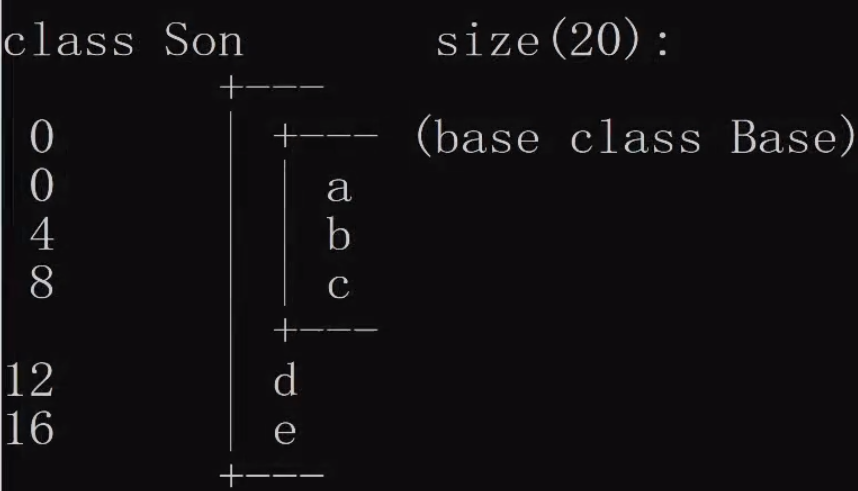
</div>

> abc三个变量是Base类的，de两个变量是Son类的。左边的数字是偏移。元素a的偏移是0，b的偏移是4，因为a占用4个字节。

### 5.2 构造和析构的顺序

#### 5.2.1 子类的构造和析构

继承中的构造和析构：1.子类对象在创建时<b>会首先调用父类的构造函数</b>，父类的构造函数执行完毕后，才会调用子类的构造函数；2.当父类构造函数有参数时，需要在子类初始化列表(参数列表)中显式调用父类构造函；析构函数调用顺序和构造函数相反。

```cpp
#include <iostream>

class Base
{
public:
    Base()
    {
        std::cout << "父类的无参构造函数" << std::endl;
    }
    ~Base()
    {
        std::cout << "父类的析构函数" << std::endl;
    }
};

class Son : public Base
{
public:
    Son()
    {
        std::cout << "子类的构造函数" << std::endl;
    }
    ~Son()
    {
        std::cout << "子类的析构函数" << std::endl;
    }
};

int main(int argc, char **argv)
{
    Son son;
    return 0;
}
```

运行结果：

```bash
父类的无参构造函数
子类的构造函数
子类的析构函数
父类的析构函数
```

总结：
1. 构造顺序：先父类构造--》子类构造；
2. 析构顺序：先子类析构--》父类析构。

#### 5.2.2 子类中有父类、对象成员的构造和析构的顺序

父类的构造和析构、对象成员的构造和析构、子类自身的构造和析构

<b>总结：</b>

1. 构造顺序：父类的构造函数--》对象成员的构造函数--》子类的构造函数
2. 析构顺序：子类的析构函数--》对象成员的析构函数--》父类的构造函数

#### 详解子类中的构造

```cpp
#include <iostream>
class Base
{
private:
    int a;
public:
    Base()
    {
        std::cout << "[父类的无参构造函数]" << std::endl;
    }
    Base(int a)
    {
        this->a = a;
        std::cout << "[父类的有参构造函数]" << std::endl;
    }
    ~Base()
    {
        std::cout << "[父类的析构函数]" << std::endl;
    }
};
class Son : public Base
{
private:
    int b;
public:
    Son()
    {
        std::cout << "[子类的无参构造函数]" << std::endl;
    }
    Son(int b)
    {
        this->b = b;
        std::cout << "[子类的有参构造函数]" << std::endl;
    }
    // 子类必须用初始化列表显式调用父类的有参构造
    Son(int a, int b) : Base(a)
    {
        this->b = b;
        std::cout << "[子类的有参构造函数 a, b]" << std::endl;
    }
    ~Son()
    {
        std::cout << "[子类的析构函数]" << std::endl;
    }
};
void test01()
{
    // 子类默认调用父类的无参构造，如果父类没有无参构造则会报错：no matching function for call to ‘Base::Base()’
    Son son(10);

    std::cout << "======================" << std::endl;
    // 子类必须用初始化列表显式调用父类的有参构造
    Son son2(10, 20);    
}
int main()
{
    test01();

    return 0;
}
```

1. 子类会默认调用父类的无参构造
2. 如果要调用父类的有参构造，子类必须在初始化列表显式调用父类的有参构造，调用形式：<b>父类名称</b>

其中，子类的初始化列表也可以改写如下：

```cpp
Son(int a, int b) : Base(a), b(b)
{
    std::cout << "[子类的有参构造函数 a, b]" << std::endl;
}
```

> 在初始化列表中，父类构造函数的调用，不一定需要在第一个位置。

### 5.3 继承中同名函数的处理

### 5.3.1 父类和子类同名成员变量处理

```cpp
class Base
{
    // 父类的私有数据，一旦涉及继承，在子类中不可见
public:
    int num;
public:
    Base(int num)
    {
        this->num = num;
        std::cout << "Base有参构造" << std::endl;
    }
    ~Base()
    {
        std::cout << "Base析构函数" << std::endl;
    }
};

class Son : public Base
{
private:
    int num;
public:
    Son(int num1, int num2) : num(num2), Base(num1)
    {
        std::cout << "Son有参构造 int int" << std::endl;
    }
    ~Son()
    {
        std::cout << "Son析构函数" << std::endl;
    }
    void showNum(void)
    {
        // 1. 当父类和子类成员变量同名时，在子类就近原则，选择本作用域的子类成员
        //    1.1父类的num是private，在子类中不可见
        // 2. 如果子类中必须使用父类中的同名成员变量，则必须使用父类的作用域
        std::cout << "父类中的num = " << Base::num << std::endl;
        std::cout << "子类中的num = " << num << std::endl;
    }
};
void test01()
{
    Son son(10, 20);
    son.showNum();
}
```

<b>总结：</b>
同名成员变量，在保证子类可以访问的前提下(父类中的public、protected权限的成员)，可以使用父类作用域去访问父类的同名成员变量。


### 5.3.2 父类和子类同名成员函数处理

#### 案例一

```cpp
class Base
{
public:
    void func(void)
    {
        std::cout << "父类中的void func" << std::endl;
    }
    void func(int a)
    {
        std::cout << "父类中的int func a = " << a << std::endl;
    }
};

class Son : public Base
{
public:
};

void test01()
{
    // 为啥构造和析构除外？因为父类的构造和析构，只有父类自己知道该怎么做(构造和析构由系统自动调用)
    // 子类会继承父类所有成员函数(无参/有参构造、拷贝构造和析构函数除外)和变量
    Son son;
    son.func();     // 访问父类的func void
    son.func(10);   // 访问附列的func int
}
```

子类没有定义和父类同名的成员函数，且父类的成员函数是public的，所以在子类中可以直接访问。

#### 案例二

```cpp
class Base
{
public:
    void func(void)
    {
        std::cout << "父类中的void func" << std::endl;
    }
    void func(int a)
    {
        std::cout << "父类中的int func a = " << a << std::endl;
    }
};

class Son : public Base
{
public:
    void func(void)
    {
        std::cout << "子类中的void func" << std::endl;
    }
};

void test01()
{
    Son son;
    son.func();     // 访问子类的func void
    // son.func(10);   // error: no matching function for call to ‘Son::func(int)’

    son.Base::func();   // 访问父类的void func方法
    son.Base::func(10); // 访问父类的int func方法
}
```

<b>总结：</b>
1. 一旦子类实现了父类的成员函数，将屏蔽所有父类同名成员函数；在类外将无法通过子类访问父类的int Func方法；
2. 如果用户一定要访问父类的其他同名方法，可以通过`son.Base::func();`和`son.Base::func(10);`来访问；
3. 建议：子类一旦实现了父类的一个同名函数，则尽量把父类的所有同名函数都实现；
4. operator=也不能被继承，因为它完成类似构造函数的行为。

### 5.3.3 父子类中静态成员同名分析

<b>继承中的静态成员特性：</b>
1. 它们都可以被继承到派生类中；
2. 如果重新定义一个静态成员函数，所有在基类中的其他重载函数会被隐藏；
3. 如果我们改变基类中一个函数的特征，所有使用该函数名的基类版本都会被隐藏。

#### 5.3.3.1 静态成员变量同名分析

```cpp
class Base
{
public:
    static int num; // 静态成员属于类，而不属于对象
    static int data;
    static void showData(void);
};
int Base::num = 100;
int Base::data = 200;

class Son : public Base
{
public:
    static int data;    // 父类和子类静态成员同名
    static void showData(void);
};
int Son::data = 300;

void Base::showData(void)
{
    std::cout << "父类的showData" << std::endl;
}

void Son::showData(void)
{
    std::cout << "子类的showData" << std::endl;
}

void test01()
{
    // 从Base类中访问
    std::cout << Base::num << std::endl;    // 100
    // Son类也拥有了静态成员
    std::cout << Son::num << std::endl; // 100
    Son::num = 150;
    std::cout << Base::num << std::endl;    // 150
    std::cout << Son::num << std::endl; // 150

    // 同名成员变量
    // 父类和子类静态成员同名，访问子类中的成员变量
    std::cout << Son::data << std::endl;    // 300
    // 父类和子类静态成员同名，访问父类中的成员变量
    std::cout << Son::Base::data << std::endl;  // 200

    // 同名成员函数
    // 父类和子类，同名静态成员函数，通过子类作用域默认访问子类的静态成员函数。
    Son::showData();
     // 父类和子类，同名静态成员函数，访问父类的成员函数。
    Son::Base::showData();
}
```

<b>总结：</b>

1. 父类的静态成员在子类中一样存在，静态成员一样存在权限的限制：比如，private的static成员变量，在子类中以及类外都无法访问。
2. 子类中的静态成员如果和父类中的不是同名，则父类和子类其实是同一个变量，根据子类作用域修改静态成员变量，则父类和子类的值都会修改。
3. 同名静态成员变量，通过子类作用域访问的是子类的同名静态变量；通过`Son::Base`作用域访问的是父类的同名静态变量；
4. 同名静态成员函数，通过子类作用域访问的是子类的同名静态函数；通过`Son::Base`作用域访问的是父类的同名静态函数。

### 5.3.4 菱形继承

多继承的格式：

```cpp
class 子类 : 继承方式1 父类名1, 继承方式2 父类名2, 继承方式3 父类名3, ....
{

};
// 表示子类是由父类名1，父类名2，父类名3...共同派生出来
```

example:
```cpp
class Base1
{
public:
    int a;
};
class Base2
{
public:
    int a;
    int b;
};
class Son : public Base1, public Base2
{

};
void test01()
{
    Son son;
    // std::cout << son.a << std::endl;   // error: request for member ‘a’ is ambiguous
    std::cout << son.b << std::endl;
    // 显式调用具体父类
    std::cout << son.Base1::a << ", " << son.Base2::a << std::endl;
}
```

多继承会带来一些二义性的问题，如果两个基类中有同名的函数或者变量，那么通过派生类对象去访问这个函数或变量时就不能明确到底调用从基类1继承的版本还是从基类2继承的版本？<b>解决方法就是显式指定调用哪个基类的版本。</b>

菱形继承：

```cpp
class Animal
{
public:
    Animal()
    {
        data = 100;
    }
    int data;
};
class Horse : public Animal
{
public:
    Horse()
    {
        data = 300;
    }
};
class Donkey : public Animal
{
public:
    Donkey()
    {
        data = 400;
    }
};
class Mule : public Horse, public Donkey
{
};
void test01()
{
    Mule mule;
    // std::cout << mule.data << std::endl;    // error: request for member ‘data’ is ambiguous

    mule.Horse::Animal::data = 100;
    std::cout << mule.Horse::data << std::endl; // 300
    std::cout << mule.Donkey::data << std::endl;    // 400
    // std::cout << mule.Horse::Animal::data << std::endl; // error: ‘Animal’ is an ambiguous base of ‘Mule’
    // std::cout << mule.Donkey::Animal::data << std::endl; // error: ‘Animal’ is an ambiguous base of ‘Mule’
}
```

<b>总结：</b>

1. 菱形继承无法直接通过孙子类读取父类的成员变量，因为两个父类中存在同名的成员变量，存在二义性；
2. 菱形继承可以通过父类的作用域读取两个父类的同名成员变量，但是无法通过`mule.Horse::Animal::data`访问父类的成员变量，因为Animal在孙子类中有两个，存在二义性。

<div align=center>
    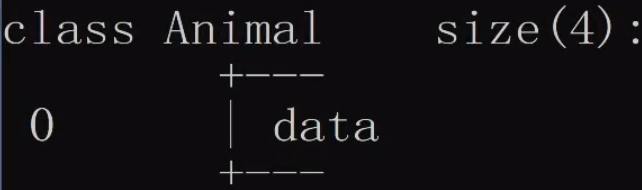
    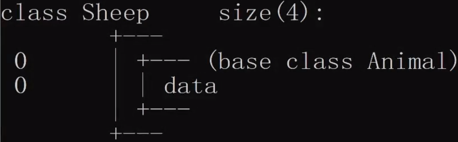
    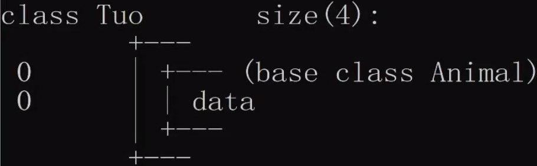
    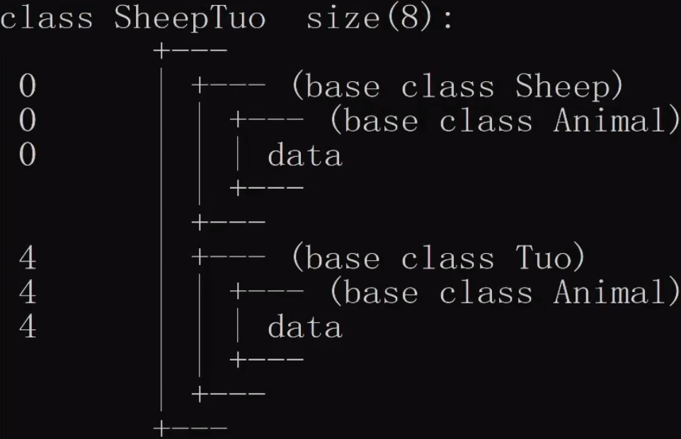
</div>

> 菱形继承中，父类的数据会在两个子类中各存在一份，孙子类会有双倍的父类数据，所以必须得使用作用域来区分。同时，父类在孙子类中也存在两个，存在二义性。

### 5.3.5 虚继承

`virtual`修饰继承方式

```cpp
class Animal
{
public:
    Animal()
    {
        data = 100;
    }
    int data;
};
// 继承的动作：虚继承
// 父类：虚基类
class Horse : virtual public Animal
{
public:
    Horse()
    {
        data = 300;
    }
};
class Donkey : virtual public Animal
{
public:
    Donkey()
    {
        data = 400;
    }
};
class Mule : public Horse, public Donkey
{
};
void test01()
{
    Mule mule;
    mule.data = 200;
    std::cout << "data = " << mule.data << std::endl;
}
```

<div align=center>
    
    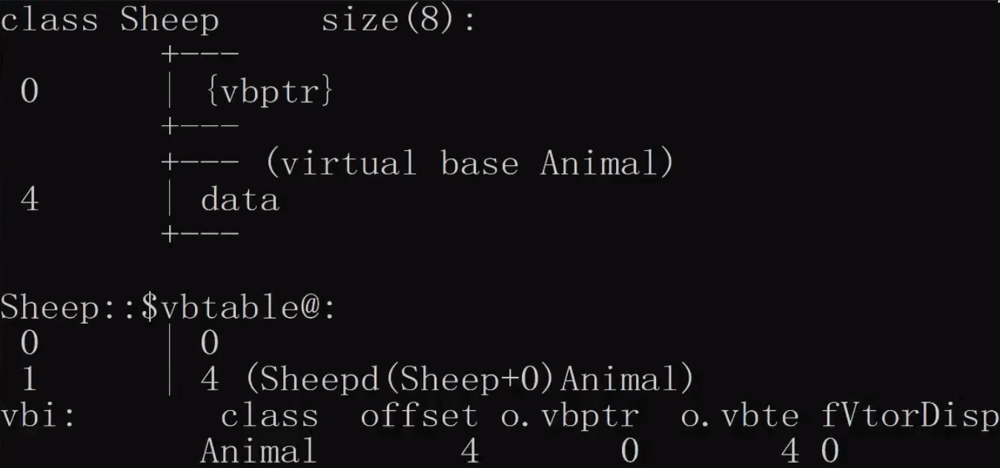
    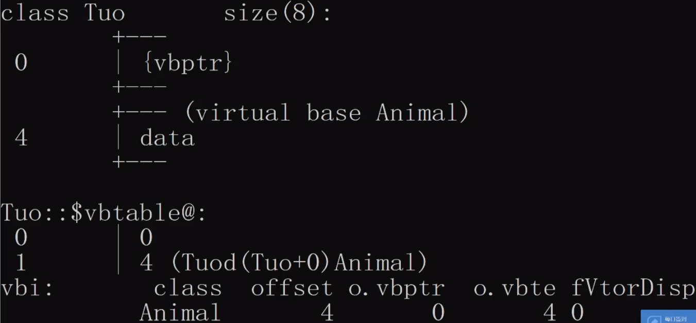
    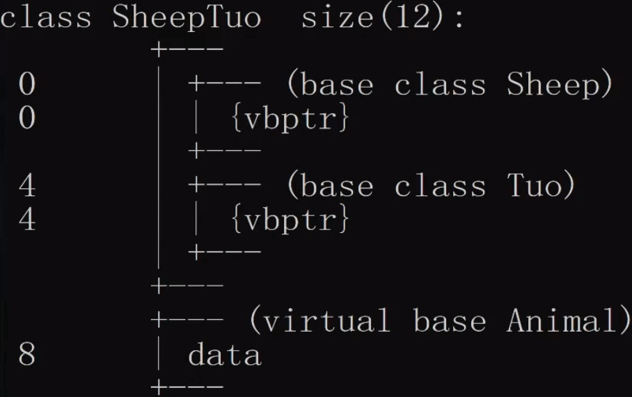
    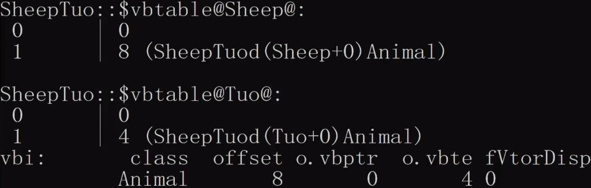
</div>

> 1. 当使用虚继承时，会在子类产生一个虚基类指针(vbptr, virtual base pointer)，vbptr指向虚基类表。
> 2. vbtable(虚基类表)存放的是data偏移量。0 0表示第一个偏移量是0，1 4表示第二个偏移量是4。
> 3. 虚基类指针和虚基类表的目的：保证不管多少个继承，虚基类的数据只有一份。
> 4. Sheep的vbptr是0开始，Tuo的vbptr是4开始；再去看虚函数表，Sheep需要偏移8个字节才能访问到data，Tuo需要偏移4字节才能访问到data。
> 5. Mule、Donkey、Horse三个类共享了一份Animal数据。
> 6. 虚函数表保存了当前的虚指针相对于虚基类的首地址的偏移量。

<b>共享基类，那么基类的初始化是由谁来完成的？</b>

> 1. 虚基类的初始化是由最后的子类完成，其他的初始化语句都不会调用。
> 2. 虚继承只能解决具备公共祖先的多继承所带来的二义性问题，不能解决没有公共祖先的多继承。


## 多态

多态性(polymorphism)提供接口与具体实现之间的另一个层隔离，多态性改善了代码的可读性和组织性，同时也使创建的程序具有可扩展性，项目不仅在在最初创建时期可以扩展，而且当项目在需要有新的功能时也能扩展。

C++支持编译时多态(静态多态)和运行时多态(动态多态)，运算符重载和函数重载就是编译时多态；而派生类和虚函数实现运行时多态。

静态多态和动态多态的区别就是函数地址是早绑定(静态联编)还是晚绑定(动态联编)。如果函数的调用，在编译阶段就可以确定函数的调用地址，并产生代码，就是静态多态(编译时多态) ，也就是说地址是早绑定的。而如果函数的调用地址不能在编译期间确定，而需要在运行时才能决定，这就属于晚绑定(动态多态，运行时多态)。

静态多态：运算符重载、函数重载
动态多态：虚函数

```cpp
#include <iostream>

class Animal
{
public:
    void sleep(void)
    {
        std::cout << "animal 动态在睡觉" << std::endl;
    }
};

class Cat : public Animal
{
public:
    void sleep(void)
    {
        std::cout << "猫在睡觉" << std::endl;
    }
};

void test01()
{
    Cat cat;
    cat.sleep();    // 猫在睡觉，Animal类的sleep()函数被屏蔽了，编译器就近选择了子类的sleep函数。
    cat.Animal::sleep();    // animal 动态在睡觉，访问的是父类的方法

    // 用基类(指针或引用)保存了子类对象(向上转换)
    Animal* p = new Cat;
    p->sleep(); // animal 动态在睡觉，调用的是父类的方法
    Animal animal = Cat();
    animal.sleep(); // animal 动态在睡觉
}
```

> 如果初始化子类对象，因为函数名相同，子类会屏蔽掉父类的同名函数；如果强制要通过子类访问父类的同名函数，则需要使用父类作用域。说明同名函数是存在的，只是不在子类的默认作用域下。\
> 使用父类指针或父类引用来获得子类对象，这是合理的，叫作<b>向上转换</b>。此时，父类指针或引用指向的是子类中父类部分，所以只能访问父类的变量和方法，无法访问到子类的方法。

<div align=center>
    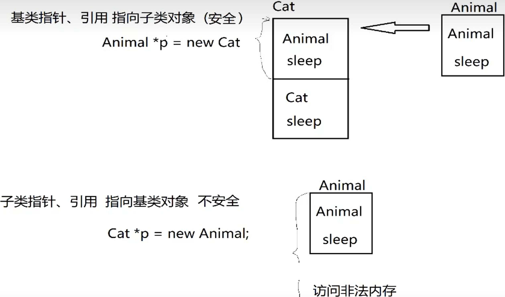
</div>

> 子类继承父类后，在子类中会存在一块空间，保存父类的变量和方法。父类指针指向的就是父类区域，所以是安全的；\
> 相反，如果使用子类指针去指向父类对象，则存在访问非法内存的风险，因为指针类型表明对象大小，而子类对象所占空间显然大于父类对象。

### 使用基类指针、引用访问子类对象中的成员方法(虚函数)

```cpp
class Animal
{
public:
    // 虚函数，用virtual修饰的成员函数只要涉及到继承，子类中同名函数都是虚函数
    // 虚函数，本质是一个函数指针变量
    // 如果Animal不涉及到继承，函数指针变量就指向自身sleep
    virtual void sleep(void)
    {
        std::cout << "animal 动态在睡觉" << std::endl;
    }
};
class Cat : public Animal
{
public:
    // 子类的同名函数不管是否使用virtual关键字修饰，都默认为virtual函数
    virtual void sleep(void)
    {
        std::cout << "猫在睡觉" << std::endl;
    }
};
void test01()
{
    // 需求：用基类(指针或引用)保存子类对象，同时还需要操作子类自身成员
    Animal *p = new Cat;
    p->sleep(); // 猫在睡觉
}
```

> 虚函数就是在函数前面加上`virtual`关键字

虚函数特点：

<div align=center>
    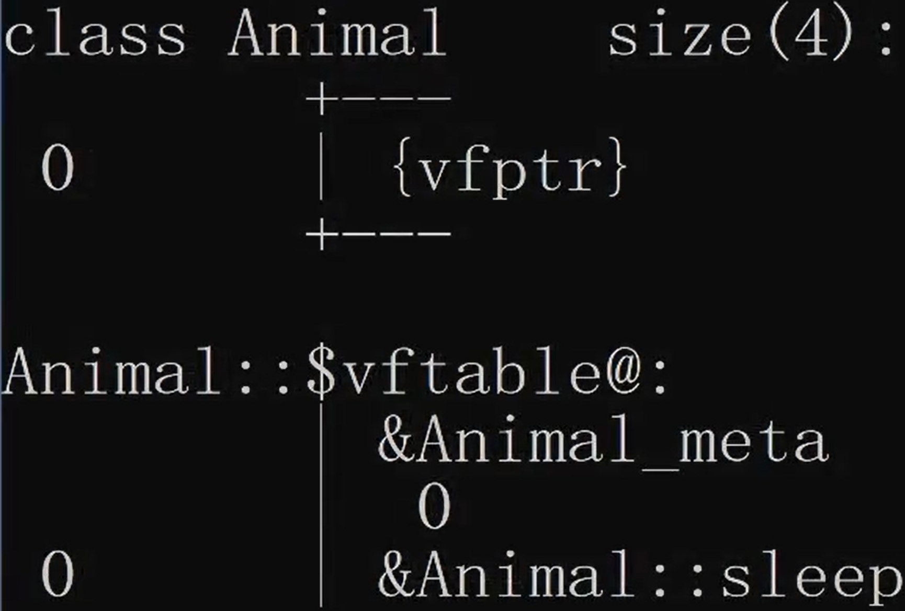
    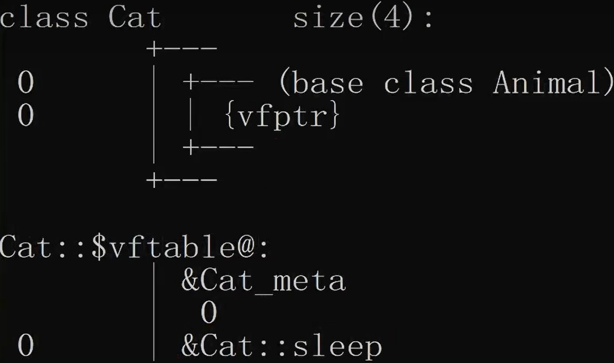
    <br/>
    <p>上图是不涉及继承的Animal类结构图，下图是设计继承的Cat类结构图</p>
</b>
</div>

> 基类类成员中会产生一个虚函数指针，虚函数指针指向虚函数表，虚函数表存放的氏所保存的函数入口地址。\
> 如果没涉及到继承，函数指针变量就指向自身sleep函数。\
> 如果涉及到继承，子类的虚函数表会更新，函数入口地址改成了子类的成员函数。

<div align=center>
    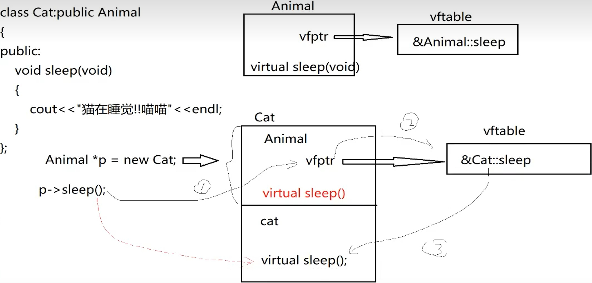
</div>

<b>总结：</b>

当虚函数涉及到继承时，子类会继承父类的（虚函数指针vfptr和虚函数表vftable），编译器会将虚函数表中的函数入口地址更新成子类的同名（返回值、参数都相同）的函数入口地址。\
如果基类指针、引用访问虚函数的时候，就会间接的调用子类的虚函数。

#### 为什么使用虚函数

使用虚函数的本质是为了用父类指针访问子类对象，而使用父类指针访问子类对象的目的是为了实现动态多态。

#### 虚函数的应用案例

基类指针、引用作为函数的参数

<b>C++如何实现动态绑定？</b>

> 当编译器发现我们的类中有虚函数的时候，编译器会创建一张虚函数表，把虚函数的函数入口地址放到虚函数表中，并且在类中秘密增加一个指针，这个指针就是虚函数指针，这个指针就是指向对象的虚函数表。在多态调用时，根据虚函数指针找到虚函数表来实现动态绑定。

#### 虚析构

1. 知识点的引入

```cpp
class Animal
{
public:
    virtual void sleep(void)
    {
        std::cout << "animal 动态在睡觉" << std::endl;
    }
    ~Animal()
    {
        std::cout << "Animal的析构" << std::endl;
    }
};
class Cat : public Animal
{
public:
    virtual void sleep(void)
    {
        std::cout << "猫在睡觉" << std::endl;
    }
    ~Cat()
    {
        std::cout << "Cat的析构" << std::endl;
    }
};
void test01()
{
    Animal* p = new Cat;
    p->sleep();
    
    // 出现的问题：只能释放父类析构
    delete p;   // 只调用了Animal的析构函数
}
```

<b>原因分析：</b>

<div align=center>
    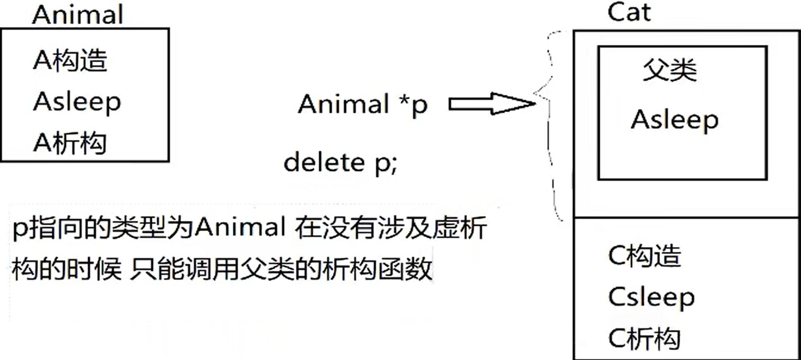
</div>

因为是使用父类指针指向的子类对象，指针类型决定了内存作用域，所以在父类指针中只能访问到父类的析构函数，而无法访问子类的析构函数。

<b>解决方案：虚析构</b>

虚析构的作用：通过基类指针、引用释放子类的所有空间。

```cpp
#include <iostream>

class Animal
{
public:
    virtual void sleep(void)
    {
        std::cout << "animal 动态在睡觉" << std::endl;
    }
    // 使用virtual修饰析构函数
    virtual ~Animal()
    {
        std::cout << "Animal的析构" << std::endl;
    }
};
class Cat : public Animal
{
public:
    virtual void sleep(void)
    {
        std::cout << "猫在睡觉" << std::endl;
    }
    ~Cat()
    {
        std::cout << "Cat的析构" << std::endl;
    }
};
void test01()
{
    Animal* p = new Cat;
    p->sleep();

    delete p;   
    // Cat的析构
    // Animal的析构
}
```

> 给父类的析构函数前面使用`virtual`修饰后，`delete p;`将会首先调用子类的析构，然后调用父类的析构。

##### 虚析构的分析

<div align=center>
    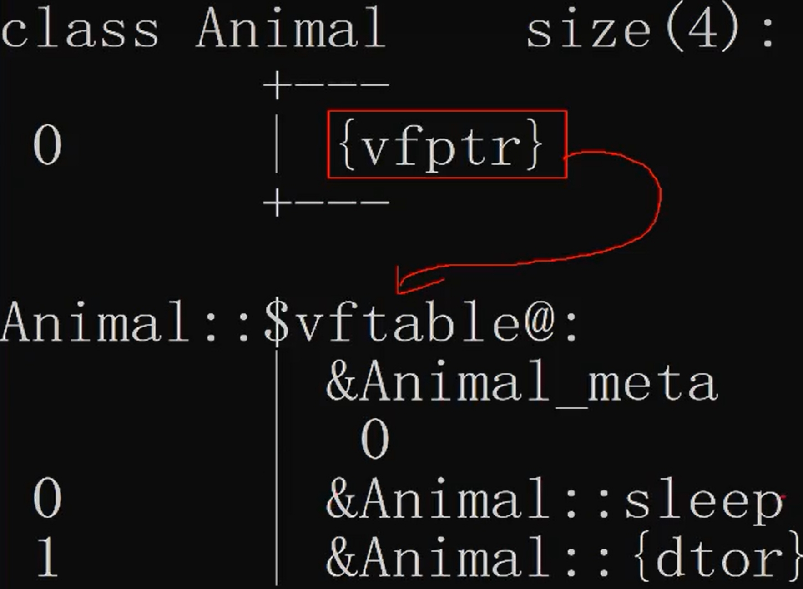
    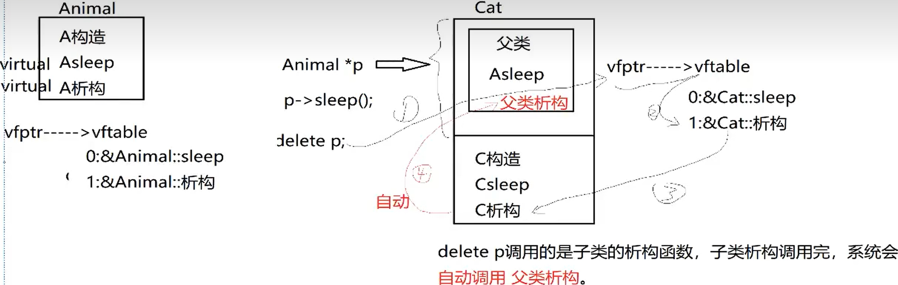
    <br/>
    <p>上图是Animal类的析构函数使用virtual修饰后的类结构图，下图是虚析构的调用流程。</p>
</div>

> 对父类的析构函数使用`virtual`修饰后，虚函数表内新增了析构函数的入口地址。
> 子类继承父类后，在虚函数表中将析构函数的入口地址修改为子类的析构函数地址；所以在`delete p;`时，会默认调用子类的析构函数，同时<b>C++子类的析构被调用后，系统会自动的调用父类的析构函数</b>。因此完成了子类和父类的析构。

### 抽象基类和纯虚函数(pure virtual function)

目的：希望基类仅仅作为其派生类的一个接口，建立公共接口的目的是为了将子类公共的操作抽象出来，可以通过一个公共接口来操作一组类，且这个公共接口不需要实现(或者不需要完全实现).

在虚函数中，如果使用父类指针来接收子类对象，则父类的同名虚函数则永远不会被调用，完全可以让基类只作为一个接口，而不做具体的实现。<b>纯虚函数(pure virtual function)</b>就是不提供任何实现的虚函数。

如果基类中至少存在一个纯虚函数，则该基类称为抽象类(abstract class)，纯虚函数使用关键字`virtual`，并在其后面加上`=0`。抽象类编译器不允许实例化，子类必须去实现纯虚函数，否则抽象类的派生类依然是一个抽象类。

`virtual void fun() = 0;`<b>告诉编译器在vtable中为函数保留了一个位置，但在这个特定位置不放地址。</b>

```cpp
class Animal
{
public:
    // 纯虚函数：如果一个类中拥有纯虚函数，那么这个类就是抽象类
    // 抽象类不能实例化对象
    virtual void sleep() = 0;
    virtual ~Animal() { std::cout << "Animal dtor" << std::endl; }
};
class Cat : public Animal
{
public:
    virtual void sleep()
    {
        std::cout << "Cat在睡觉" << std::endl;
    }
    ~Cat()
    {
        std::cout << "Cat dtor" << std::endl;
    }
};
void test01()
{
    Animal* p = new Cat;
    p->sleep();
    delete p;
    // Animal抽象类不能实例化对象
    // Animal ob;  // error: cannot declare variable ‘ob’ to be of abstract type ‘Animal’
    Animal* animal; // 但这样是允许的，因为这只是声明了一个指针，而不是初始化对象
}
```

1. 抽象类派生出子类，那么子类必须实现所有的纯虚函数；如果漏掉一个，那么子类依然是一个抽象类，无法初始化对象。

#### 纯虚函数和抽象类的引用

接口类中只有函数原型定义，没有任何数据定义。多重继承接口不会带来二义性和复杂性问题，接口类只是一个功能声明，并不是功能实现，子类需要根据功能说明定义功能实现。<b>注意：除了析构函数外，其他声明都是纯虚函数。</b>(因为析构函数如果为纯虚函数，则无法释放基类对象)

#### 纯虚析构函数

纯虚析构函数在C++中是合法的，但是在使用的时候有一个额外的限制：必须为纯虚析构函数提供一个函数体。问题是：如果给虚析构函数提供函数体了，还能称作纯虚析构函数吗？

纯虚析构函数和非纯虚析构函数之间唯一的不同之处在于纯虚析构函数使得基类是抽象类，不能创建基类的对象。

```cpp
// 非纯虚析构函数
class A
{
public:
    virtual ~A();
};
A::~A(){}

// 纯虚析构函数
class B
{
public:
    virtual ~B() = 0;
};
B::~B(){}

void test()
{
    A a;    // A类不是抽象类，可以实例化对象
    B b;    // B类是抽象类，不可以实例化对象
}
```

<b>纯虚析构函数更像是一种象征意义，表明该类是抽象类，不能被实例化。和普通的纯虚函数相比，基类必须也实现析构函数(即使它本身是纯虚函数)，而不像普通的纯虚函数，不需要实现只作为接口；和非纯虚析构函数相比，都需要在基类实现析构函数，否则基类对象无法释放，不同之处在于，非纯虚析构函数可以实例化对象，而纯虚析构函数不可以。</b>

纯虚析构函数除了声明等于0之外`virtual ~B() = 0;`之外，还需要有析构函数的实现`B::~B(){}`。
原因：通过基类指针释放子类对象时，先调用子类析构再自动调用父类析构（如果父类的析构不实现，无法实现调用）。

#### 虚函数、纯虚函数、虚析构、纯虚析构

1. 虚函数：只是`virtual`修饰的函数体（作用域成员函数）
2. 纯虚函数：`virtual`修饰加`=0`，没有函数体，所在的类为抽象类
3. 虚析构：`virtual`修饰类中的析构函数，有函数体
4. 纯虚析构：`virtual`修饰类中的析构函数加`=0`必须实现析构的函数体，所在的类为抽象类

#### 重载、重写、重定义

重载：同一作用域，参数个数、参数顺序、参数类型不同，和函数返回值没有关系的同名函数。const可以作为重载的条件。
重写：子类重写父类的virtual函数，函数返回值、函数名字、函数参数和基类中的虚函数一致。
重定义：子类重新定义父类的同名成员(非virtual函数)，隐藏了父类的同名成员。

## 函数模板

C++特点：封装、继承、多态

除此之外：面向对象编程(封装、继承、多态)、泛型编程(模板)


<b>全局函数模板</b>

```cpp
// class 和 typename一样的
template<typename T>
void mySwap(T &a, T &b)
{
    T tmp = a;
    a = b;
    b = tmp;
}
void test01()
{
    int a = 1, b = 2;
    std::cout << "a = " << a << ", b = " << b << std::endl; // a = 1, b = 2
    mySwap<int>(a, b);
    std::cout << "a = " << a << ", b = " << b << std::endl; // a = 2, b = 1

    char c = 'a', d = 'b';
    std::cout << "c = " << c << ", d = " << d << std::endl; // c = a, d = b
    mySwap<char>(c, d);
    std::cout << "c = " << c << ", d = " << d << std::endl; // c = b, d = a
}
```

函数模板也可以自动推导，比如直接调用`mySwap(a, b);`将默认调用`mySwap<int>(a, b);`。

<b>使用模板是为了实现泛型，可以减轻编程的工作量，增强函数的重用性。</b>

### 函数模板和普通函数的区别

```cpp
void mySwap(int &a, int &b)
{
    std::cout << "普通函数" << std::endl;
    int tmp;
    tmp = a;
    a = b;
    b = tmp;
}
// class 和 typename一样的
template<typename T>
void mySwap(T &a, T &b)
{
    std::cout << "函数模板" << std::endl;
    T tmp = a;
    a = b;
    b = tmp;
}
void test02()
{
    int data1 = 10, data2 = 20;
    // 函数模板和普通函数都识别时，优先选择普通函数
    mySwap(data1, data2);   // 普通函数

    // 函数模板和普通函数都识别，强行选择函数模板 加<>
    mySwap<int>(data1, data2);  // 函数模板

    // 函数模板参数的类型不能自动转换
    int a = 10;
    char b = 'b';
    // char无法强转为int&
    // mySwap(a, b);  // error: cannot bind non-const lvalue reference of type ‘int&’ to an rvalue of type ‘int’
}
```

> 当普通函数和函数模板都匹配时，编译器会优先选择普通函数；如果要强行选择函数模板可以在函数名后加`<>`。
> 函数模板参数的类型不能自动转换，同时char无法强转为int&。

```cpp
void mySwap(int a, int b)
{
    std::cout << "普通函数" << std::endl;
}
template<typename T>
void mySwap(T a, T b)
{
    std::cout << "函数模板" << std::endl;
}
void test01()
{
    int a = 100;
    char b = 'a';
    // 函数模板的参数类型，不能自动类型转换
    // 普通函数的参数类型，可以自动类型转换
    mySwap(a, b);   // 普通函数，这两个函数都没有引用

    // 编译器自动转换指定T
    // mySwap<>(a, b); // error: no matching function for call to ‘mySwap(int&, char&)’
    mySwap<int>(a, b);  // 函数模板，指定T之后，相当于普通函数；因为自动转换编译器不知道该转换成int还是char
}
```

> 函数模板无法自动类型转换，因为编译器无法确定是将int转换为char，还是将char转换为int。 \
> 如果人为指定T的类型后，则相当于普通函数，可以确切的知道该使用什么类型了。\
> 总之，只有当编译器确定类型了才行。

#### 函数模板练习

```cpp
template<class T>
void myPrintArrayTemplate(T arr[], int len)
{
    for (int i = 0; i < len; i++)
    {
        std::cout << arr[i] << " ";
    }
    std::cout << std::endl;
}
template<class T>
void mySortArrayTemplate(T arr[], int len)
{
    int i = 0, j = 0;
    for (i = 0; i < len - 1; i++) {
        int min = i;
        for (j = min + 1; j < len; j++) {
            if (arr[min] > arr[j]) {
                min = j;
            }
        }
        if (min != i) {
            T tmp = arr[min];
            arr[min] = arr[i];
            arr[i] = tmp;
        }
    }
    return;
}
int main(int argc, char **argv)
{
    char str[] = "hello template";
    int arr[] = {5, 3, 4, 7, 8, 9, 1, 6, 10};
    int str_len = strlen(str);
    int arr_len = sizeof(arr) / sizeof(arr[0]);

    // 用函数模板遍历数组
    myPrintArrayTemplate(str, str_len);
    myPrintArrayTemplate(arr, arr_len);

    // 用函数模板遍历数组
    mySortArrayTemplate(str, str_len);
    mySortArrayTemplate(arr, arr_len);

    myPrintArrayTemplate(str, str_len);
    myPrintArrayTemplate(arr, arr_len);

    return 0;
}
```
> 函数模板也可以重载，通常是参数个数的不同。

函数模板机制结论：编译器并不是把函数模板处理成能够处理任何类型给的函数，函数模板通过具体类型产生不同的函数。编译器会对函数模板进行两次编译，在声明的地方对模板代码本身进行编译，在调用的地方对参数替换后的代码进行编译。

### 模板的局限性

假设如下模板函数：
```cpp
template<class T>
void func(T a, T b){}
```

如果代码实现了a>b，如下代码所示：

```cpp
class Person
{
    friend std::ostream& operator<<(std::ostream &out, Person &ob);
private:
    int a;
    int b;
public:
    Person(int a, int b) : a(a), b(b)
    {
        std::cout << "构造函数" << std::endl;
    }
    ~Person()
    {
        std::cout << "析构函数" << std::endl;
    }
    // 方法二：重载>运算符
    bool operator>(Person &ob)
    {
        return this->a > ob.a;
    }
};
std::ostream& operator<<(std::ostream &out, Person &ob)
{
    out << "a = " << ob.a << ", b = " << ob.b << std::endl;
    return out;
}

template<typename T>
T& myMax(T &a, T &b)
{
    return a > b ? a : b;   // error: no match for ‘operator>’ (operand types are ‘Person’ and ‘Person’)
}

// 方法一：提供函数模板具体化
// C++标准不直接支持模板函数作为友元（特别是模板特化），所以无法解决要在类外访问私有成员变量
template<> Person& myMax<Person>(Person &ob1, Person &ob2)
{
    return ob1.a > ob2.a ? ob1 : ob2;
}

// 方法二：重载>运算符

void test01()
{
    int data1 = 10, data2 = 20;
    std::cout << myMax(data1, data2) << std::endl;   // 20

    Person ob1(10, 20);
    Person ob2(100, 200);
    std::cout << myMax(ob1, ob2) << std::endl;  // a = 100, b = 200
}
```

> 类Person如果没有定义`>`操作符，则出现错误：`error: no match for ‘operator>’ (operand types are ‘Person’ and ‘Person’)`;

</b>解决方案：</b>

<b>方案一：</b>提供函数模板具体化(也是模板的重载)。需要注意： C++标准不直接支持模板函数作为友元（特别是模板特化），所以如果要在函数模板中访问类的私有成员变量，这种方案不行；\
<b>方案二：</b>在类成员函数中重载`>`操作符。

## 类模板

有时，有两个或多个类，其功能是相同的，仅仅是数据类型不同。类模板用于实现类所需数据的类型参数化。

```cpp
// 类模板
template<class T1, class T2>
class Data
{
private:
    T1 name;
    T2 num;
public:
    Data(T1 name, T2 num)
    {
        this->name = name;
        this->num = num;
        std::cout << "有参构造" << std::endl;
    }
    ~Data()
    {
        std::cout << "析构函数" << std::endl;
    }
    void showPerson()
    {
        std::cout << "name = " << this->name << ", num = " << this->num << std::endl;
    }
};
void test01()
{
    // 类模板不能进行类型自动推导，c++17开始可以进行类型推导
    // Data ob("德玛西亚", 18);    // error: missing template arguments before ‘ob’ ，必须要指明模板参数类型
    Data<std::string, int> ob1("德玛西亚", 100);
    ob1.showPerson();   // name = 德玛西亚, num = 100

    Data<int, std::string> ob2(200, "提莫");
    ob2.showPerson();   // name = 200, num = 提莫

    Data ob3(100, 200); // 使用C++17编译可以通过
    ob3.showPerson();

    Data ob4("小炮", "德玛"); // 使用C++17编译可以通过
    ob4.showPerson();
}
```

> 在C++17之前，类模板不能进行模板类型的自动推导，所以`Data ob("德玛西亚", 18);`编译出错：`error: missing template arguments before ‘ob’`。必须指定模板的参数进行初始化。\
> 在C++17及之后，类模板可以进行类型的自动推导，所以`ob3`和`ob4`都能正常编译通过，指定C++版本使用`set(CMAKE_CXX_FLAGS "-std=c++17")`。

### 类模板做函数参数

```cpp
template<class T1, class T2>
class Data
{
    friend void addData(Data<std::string, int> &ob);
private:
    T1 name;
    T2 num;
public:
    Data(T1 name, T2 num)
    {
        this->name = name;
        this->num = num;
        std::cout << "有参构造" << std::endl;
    }
    ~Data()
    {
        std::cout << "析构函数" << std::endl;
    }
    void showPerson()
    {
        std::cout << "name = " << this->name << ", num = " << this->num << std::endl;
    }
};

// 类模板做函数参数
void addData(Data<std::string, int> &ob)
{
    ob.name += "_vip";
    ob.num += 200;
    return;
}

void test02()
{
    Data<std::string, int> ob("德玛西亚", 19);
    addData(ob);
    ob.showPerson();    // name = 德玛西亚_vip, num = 219
}
```

> 类模板作为函数参数，这个函数参数需要指明模板参数的具体类型。

### 类模板派生普通类

```cpp
template<class T>
class Base
{
private:
    T num;
public:
    Base(T num)
    {
        std::cout << "Base有参构造" << std::endl;
        this->num = num;
    }
    ~Base()
    {
        std::cout << "Base析构函数" << std::endl;
    }
    void showNum(void)
    {
        std::cout << "Base num = " << this->num << std::endl;
    }
};

// 类模板派生普通类，必须给基类指定类型
class Son1 : public Base<int>
{
public:
    // 基类构造函数初始化时，也必须指定类型
    Son1(int a) : Base<int>(a)
    {
        std::cout << "Son1有参构造" << std::endl;
    }
    ~Son1()
    {
        std::cout << "Son1析构函数" << std::endl;
    }
};

class Son2 : public Base<std::string>
{
public:
    Son2(std::string str) : Base<std::string>(str)
    {
        std::cout << "Son2有参构造" << std::endl;
    }
    ~Son2()
    {
        std::cout << "Son2析构函数" << std::endl;
    }
};

void test01()
{
    Son1 ob1(100);
    ob1.showNum();

    Son2 ob2("son2");
    ob2.showNum();
}
```

> 类模板派生出普通类，在继承时必须指定基类的模板类型。并且子类在构造函数中调用父类的构造函数时也必须指定模板类型。\
> 子类实例化的时候需要具体化的父类，子类需要知道父类的具体类型是什么样的？这样C++编译器才能知道给子类分配多少内存。

### 类模板类内实现

类模板的函数类外实现

```cpp

```


### 类模板类外实现