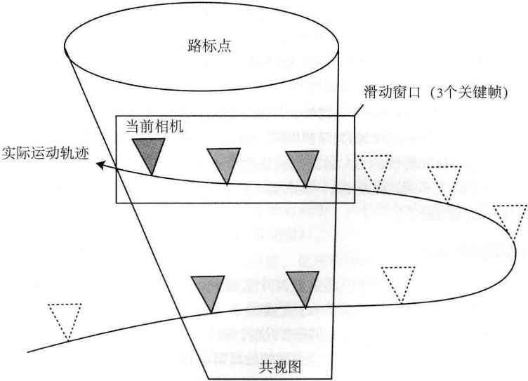
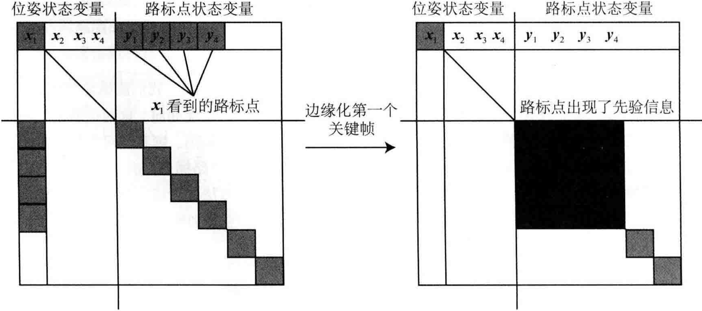
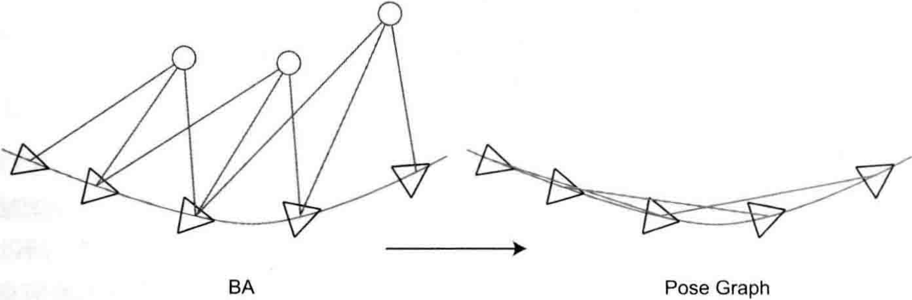

# 第10讲 后端2

<B>主要目标</B>

1. 理解滑动窗口优化。
2. 理解位姿图优化。
3. 理解带IMU紧耦合的优化。
4. 通过实验掌握g2o的位姿图。

第9讲重点介绍了以BA为主的图优化。BA能精确地优化每个相机位姿与特征点位置。不过在更大的场景中，大量特征点的存在会严重降低计算效率，导致计算量越来越大，以至于无法实时化。本讲的第一部分将介绍一种简化的BA：位姿图。

## 10.1 滑动窗口滤波和优化

### 10.1.1 实际环境下的BA结构

带有相机位姿和空间点的图优化称为BA，它能够有效地求解大规模的定位与建图问题。这在SfM问题中十分有用，但是在SLAM过程中，我们往往需要控制BA的规模，保持计算的实时性。倘若计算能力无限，那不妨每时每刻都计算整个BA-但是那不符合现实需要。现实条件是，我们必须限制后端的计算时间，比如BA规模不能超过1万个路标点，迭代不超过20次，用时不超过0.5秒，等等。像SfM那样用一周时间重建一个城市地图的算法，在SLAM里不见得有效。

控制计算规模的做法有很多，比如从连续的视频中抽出一部分作为<B>关键帧</B>，仅构造关键帧与路标点之间的BA，于是非关键帧只用于定位，对建图则没有贡献。即便如此，随着时间的流逝，关键帧数量会越来越多，地图规模也将不断增长。像BA这样的批量优化方法，计算效率会(令人担忧地)不断下降。为了避免这种情况，我们需要用一定手段控制后端BA的规模。这些手段可以是理论上的，也可以是工程上的。

例如，最简单的控制BA规模的思路，是仅保留离当前时刻最近的$N$个关键帧，去掉时间上更早的关键帧。于是，我们的BA将固定在一个时间窗口内，离开这个窗口的则被丢弃。这种方法称为滑动窗口法。当然，取这$N$个关键帧的具体方法可以有一些改变，例如，不见得必须取时间上最近的，而可以按照某种原则，取时间上靠近，空间上又可以展开的关键帧，从而保证相机即使在停止不动时，BA的结构也不至于缩成一团(这容易导致一些糟糕的退化情况)。如果我们在帧与帧的结构上再考虑得深一些，也可以像ORB-SLAM2那样，定义一种称为“共试图”(Covisibility graph)的结构(如图10-1所示)。所谓共试图，就是指那些“与现在的相机存在共同观测的关键帧构成的图”。于是，在BA优化时，我们按照某些原则在共视图内取一些关键帧和路标进行优化，例如，仅优化与当前帧有20个以上共视路标的关键帧，其余部分固定不变。当共试图关系能够正确构造的时候，基于共试图的优化也会在更长时间内保持最优。

滑动窗口也好，共视图也好，大体而言，都是我们对实时计算的某种工程上的折中。不过在理论上，它们也引入了一个新问题：刚才我们谈到要“丢弃”滑动窗口之外，或者“固定”共视图之外的变量，这个“丢弃”和“固定”具体怎样操作呢？“固定”似乎很容易理解，我们只需要将共视图之外的关键帧估计值保持不变即可。但是“丢弃”，是指完全弃之不用，即窗口外的变量完全不对窗口内的变量产生任何影响，还是说窗口外的数据<B>应该</B>对窗口内的有一些影响，但实际上被我们忽略了？如果有影响，这种影响应该是什么样子？它够不够明显，能不能忽略？

上面的问题，在理论上如何处理？在工程上能不能做一些简化手段？

    
     
    
图 10-1 滑动窗口和共视图的示意图

### 10.1.2 滑动窗口法

现在考虑一个滑动窗口。假设这个窗口内有$N$个关键帧，它们的位姿表达为：

$$
x_1,...,x_N,
$$

假设它们在向量空间，即用李代数表达，那么，关于这几个关键帧，能谈论些什么呢？

显然，我们关心这几个关键帧的位置在哪里，以及它们的不确定度如何，这对应着它们在高斯分布假设下的均值协方差。如果这几个关键帧还对应着一个局部地图，则我们可以顺带着问整个局部系统的均值和方差应该是多少。设这个滑动窗口还有$M$个路标点：$y_1,...,y_N$，它们与$N$个关键帧组成了局部地图。显然，我们可以用第9讲介绍的BA方法处理这个滑动窗口，包括建立图优化模型，构建整体的Hessian矩阵，然后边缘化所有路标点来加速求解。在边缘化时，我们考虑关键帧的位姿，即

$$
[x_1,...,x_N]^T \sim N([\mu_1,...,\mu_N]^T, \Sigma).
$$

其中$\mu_k$为第$k$个关键帧的位姿均值，$\Sigma$为所有关键帧的协方差矩阵，那么显然，均值部分就是指BA迭代之后的结果，而$\Sigma$就是对整个BA的$H$矩阵进行边缘化之后的结果，即第9讲提到的矩阵$S$。

在滑动窗口中，当窗口结构发生改变，这些状态量应该如何变化？这件事情可以分成两部分讨论：

1. 我们需要在窗口中新增一个关键帧，以及它预测到的路标点。
2. 我们需要把窗口中的一个旧的关键帧删除，也可能删除它观测到的路标点。

这时，滑动窗口法和传统的BA的区别就显现出来了。显然，如果按照传统的BA来处理，那么这仅仅对应于两个不同结构的BA，在求解上没有任何差别。但在滑动窗口的情况下，我们就要讨论具体的细节问题了。

#### 新增一个关键帧和路标点

考虑在上个时刻，滑动窗口已经建立了$N$个关键帧，我们也已知道它们服从某个高斯分布，其均值和方差如前所述。此时，新来了一个关键帧$x_{N+1}$，那么整个问题中的变量变为$N+1$个关键帧和更多路标点的集合。这实际上仍是平凡的，我们只需按照正常的BA流程处理即可。对所有点进行边缘化时，即得到这$N+1$个关键帧的高斯分布参数。

#### 删除一个旧的关键帧

当考虑删除旧关键帧时，一个理论问题将显现出来。例如我们要删除旧关键帧$x_1$，但是$x_1$并不是孤立的，它会和其他帧观测到同样的路标。将$x_1$边缘化之后将导致整个问题不再稀疏。和第9讲一样，我们举一个示意图，如下图10-2所示。

    
     
    
图 10-2 滑动窗口删除关键帧将破坏路标部分的对角块结构

在这个例子中，假设$x_1$看到了路标点$y_1$至$y_4$，于是，在处理之前，BA问题的Hessian矩阵应该应该像图10-2中的左图一样，在$x_1$行的$y_1$至$y_4$列存在着非零块，表示$x_1$看到了它们。这时考虑边缘化$x_1$，那么Schur消元过程相当于通过矩阵行和列消去非对角线处几个非零矩阵块，显然这将导致右下角的路标点矩阵块不再是非对角矩阵。这个过程称为边缘化中的<B>填入</B>(Fill-in)。

回顾第9讲介绍的边缘化，当我们边缘化路标点时，Fill-in将出现在左上角的位姿块中。不过，因为BA不要求位姿块为对角块，所以稀疏BA求解仍然可行。但是，当边缘化关键帧时，将破坏右下角路标点之间的对角块结构，这时BA就无法按照先前的稀疏方式迭代求解。这显然是个十分糟糕的问题。实际上，在早期的EKF滤波器后端中，人们确实保持着一个稠密的Hessian矩阵，这也使得EKF后端没法处理较大规模的滑动窗口。

不过，如果我们对边缘化的过程进行一些改造，也可以保持滑动窗口BA的稀疏性。例如，在边缘化某个旧的关键帧时，同时边缘化它观测到的路标点。这样，路标点的信息就会转换成剩下那些关键帧之间的共视信息，从而保持右下角部分的对角块结构。在某些SLAM框架中，边缘化策略会更复杂。例如在OKVIS中，我们会判断要边缘化的那个关键帧，它看到的路标点是否在最新的关键帧中仍能看到。如果不能，就直接边缘化这个路标点；如果能，就丢弃被边缘化关键帧对这个路标点的观测，从而保持BA的稀疏性。

#### SWF中边缘化的直观解释

我们知道在边缘化的概率上的意义就是指条件概率。所以，当我们边缘化某个关键帧，即“保持这个关键帧当前的估计值，求其他状态变量以这个关键帧为条件的条件概率”。所以，当某个关键帧被边缘化，它观测到的路标点就会产生一个“这些路标应该在哪里”的先验信息，从而影响其余部分的估计值。如果再边缘化这些路标点，那么它们的观测者将得到一个“观测它们的关键帧应该在哪里”的先验信息。

从数学上看，当我们边缘化某个关键帧，整个窗口中的状态变量的描述方式，将从联合分布变成一个条件概率分布。以上面的例子来看，就是说：

$$
p(x_1,...,x_4,y_1,...,y_6) = p(x_2,....x_4,y_1,...,y_6)\underbrace{p(x_1)}_{舍去}. \tag{10.1}
$$

然后舍去被边缘化部分的信息。在变量被边缘化之后，我们在工程中就不应再使用它。所以滑动窗口法比较适合VO系统，而不适合大规模建图的系统。

由于现在g2o和Ceres还未直接支持滑动窗口法中的边缘化操作，略去本节对应的实验部分。

---

## 10.2  位姿图

### 10.2.1 位姿图的意义

根据前面的讨论，我们发现特征点在优化问题中占据了绝大部分。实际上，经过若干次观测之后，收敛的特征点位置变化很小，发散的外点则已被剔除。对收敛点再进行优化，似乎是有些费力不讨好的。因此，我们更倾向于在优化几次之后就把特征点固定住，只把它们看作位姿估计的约束，而不再实际地优化它们的位置估计。

沿着这个思路继续思考，我们会想到：是否能够完全不管路标而只管轨迹呢？我们完全可以构建一个只有轨迹的图优化，而位姿节点之间的边，可以由两个关键帧之间通过特征匹配之后得到的运动估计来给定初始值。不同的是，一旦初始估计完成，我们就不再优化那些路标点的位置，而只关心所有的相机位姿之间的联系。通过这种方式，我们省去了大量的特征点优化的计算，只保留了关键帧的轨迹，从而构建了所谓的位姿图(Pose Graph)，如下图10-3所示。

    
     
    
图 10-3 位姿图示意图

> 当我们不再优化BA中的路标点，仅把它们看成对位姿节点的约束时，就得到了一个计算规模减小很多的位姿图。

我们知道，在BA中特征点数量远大于位姿节点。一个关键帧往往关联了数百个关键点，而实时BA的最大计算规模，即使利用稀疏性，在当前的主流CPU上一般也就是几万个点左右。这就限制了SLMA应用场景。所以，当机器人在更大范围的时间和空间中运动时，必须考虑一些解决方式：要么像滑动窗口那样，丢弃一些历史数据；要么像位姿图的做法那样，舍弃对路标点的优化，只保留Pose之间的边。此外，如果我们有额外测量Pose的传感器，那么位姿图也是一种常见的融合Pose测量的方法。

### 10.2.2 位姿图的优化

那么，位姿图优化中的节点和边都是什么意思呢？这里的节点表示相机位姿，以$T_1,...,T_n$来表达。而边，则是两个位姿节点之间相对运动的估计，该估计可以来自于特征点法或直接法，也可以来自GPS或IMU积分。无论通过哪种手段，假设我们估计了$T_i$和$T_j$之间的一个运动$\Delta T_{ij}$。该运动可以有若干种表达方式，我们取比较自然的一种：

$$
\Delta \xi_{ij} = \xi_i^{-1} \circ \xi_j = \ln(T_i^{-1}T_j)^{\vee}, \tag{10.2}
$$

或按李群的写法：

$$
T_{ij} = T_{i}^{-1} T_j. \tag{10.3}
$$

按照图优化的思路，实际中该等式不会精确地成立，因此我们设立最小二乘误差，然后和以往一样，讨论误差关于优化变量的导数。这里，我们把上式的$T_{ij}$移至等式右侧，构建误差$e_{ij}$:

$$
e_{ij} = \Delta \xi_{ij} \ln(T_{ij}^{-1} T_{i}^{-1} T_j)^{\vee}. \tag{10.5}
$$

注意优化变量有两个：$\xi_i$和$\xi_j$，因此我们求$e_{ij}$关于这两个变量的导数。按照李代数的求导方式，给$\xi_i$和$\xi_j$各一个左扰动：$\delta\xi_i$和$\delta \xi_j$。于是误差变为：

$$
\hat{e}_{ij} = \ln(T_{ij}^{-1} T_{i}^{-1} \exp((-\delta \xi_i)^{\wedge}) \exp(\delta \xi_{j}^{-1})T_j)^{\vee}. \tag{10.5}
$$

该式中，两个扰动项被夹在了中间。为了利用BCH近似，我们希望把扰动项移至式子左侧或右侧。回忆式(4.55)：

$$
\exp((Ad(T)\xi)^{\wedge}) = T \exp(\xi^{\wedge})T^{-1}. \tag{10.6}
$$

稍加改变，有

$$
\exp(\xi^{\wedge})T = T \exp\left( (Ad(T^{-1}) \xi)^{\wedge} \right). \tag{10.7}
$$

该式表明，通过引入一个伴随项，我们能够“交换”扰动项左右侧的$T$。利用它，可以将扰动挪到最右(当然最左亦可)，导出右乘形式的雅可比矩阵(挪到左边时形成左乘)：

$$
\begin{align}
    \hat{e}_{ij} &= \ln\left( T_{ij}^{-1} T_{i}^{-1} \exp((-\delta \xi_i)^{\wedge}) \exp(\delta \xi_j^{\wedge}) T_j \right)^{\vee} \\
    &= \ln\left( T_{ij}^{-1} T_{i}^{-1} T_j \exp\left((-Ad(T_{j}^{-1})\delta \xi_i)^{\wedge}\right) \exp\left((Ad(T_{j}^{-1})\delta \xi_j)^{\wedge}\right) \right) \\
    &\approx \ln\left( T_{ij}^{-1} T_{i}^{-1} T_j [I - (Ad(T_{j}^{-1})\delta \xi_i)^{\wedge} + (Ad(T_{j}^{-1})\delta \xi_j)^{\wedge}] \right) \\
    &\approx e_{ij} + \frac{\partial e_{ij}}{\partial \delta \xi_i} \delta \xi_i + \frac{\partial e_{ij}}{\partial \delta \xi_j} \delta \xi_j
\end{align} \tag{10.8}
$$

因此，按照李代数上的求导法则，我们求出了误差关于两个位姿的雅可比矩阵。关于$T_i$的：

$$
\frac{\partial e_{ij}}{\partial \delta \xi_i} = -\mathcal{J}_r^{-1}Ad(T_j^{-1}). \tag{10.9}
$$

以及关于$T_j$的：

$$
\frac{\partial e_{ij}}{\partial \delta \xi_j} = \mathcal{J}_r^{-1}(e_{ij})Ad(T_j^{-1}). \tag{10.10}
$$

由于$se(3)$上的左右雅可比$\mathcal{J}_r$形式过于复杂，我们通常取它们的近似。如果误差接近零，我们可以设它们近似为$I$或

$$
\mathcal{J}_r^{-1}(e_{ij}) \approx I + \frac{1}{2}\begin{bmatrix}
    \phi_e^{\wedge} & \rho_e^{\wedge} \\
    0 & \phi_e^{\wedge}
\end{bmatrix}. \tag{10.11}
$$

理论上，即使在优化之后，由于每条边给定的观测数据并不一致，误差也不见得近似于零，所以简单地把这里的$\mathcal{J}_r$设置为$I$会有一定的损失。

了解雅可比求导后，剩下的部分就和普通的图优化一样了。简而言之，所有的位姿顶点和位姿-位姿边构成了一个图优化，本质上是一个最小二乘问题，优化变量为各个顶点的位姿，边来自于位姿观测约束。记$\varepsilon$为所有边的集合，那么总体目标函数为

$$
\min \frac{1}{2}\sum_{i,j\in\varepsilon} e_{ij}^T \Sigma_{ij}^{-1} e_{ij}. \tag{10.12}
$$

我们依然可以用高斯牛顿法、列文伯格-马奈尔特方法等求解此问题，除了用李代数表示优化位姿，别的都是相似的。根据先前的经验，可以用Ceres或g2o进行求解。

---

## 10.3 实践：位姿图优化

### 10.3.1 g2o原生位姿图

### 10.3.2 李代数上的位姿图优化

