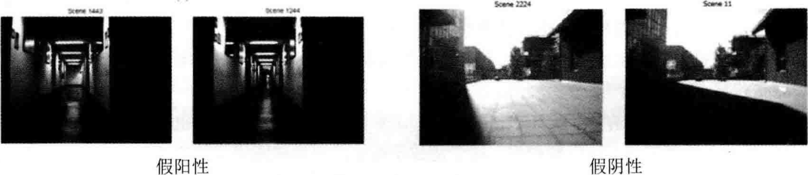
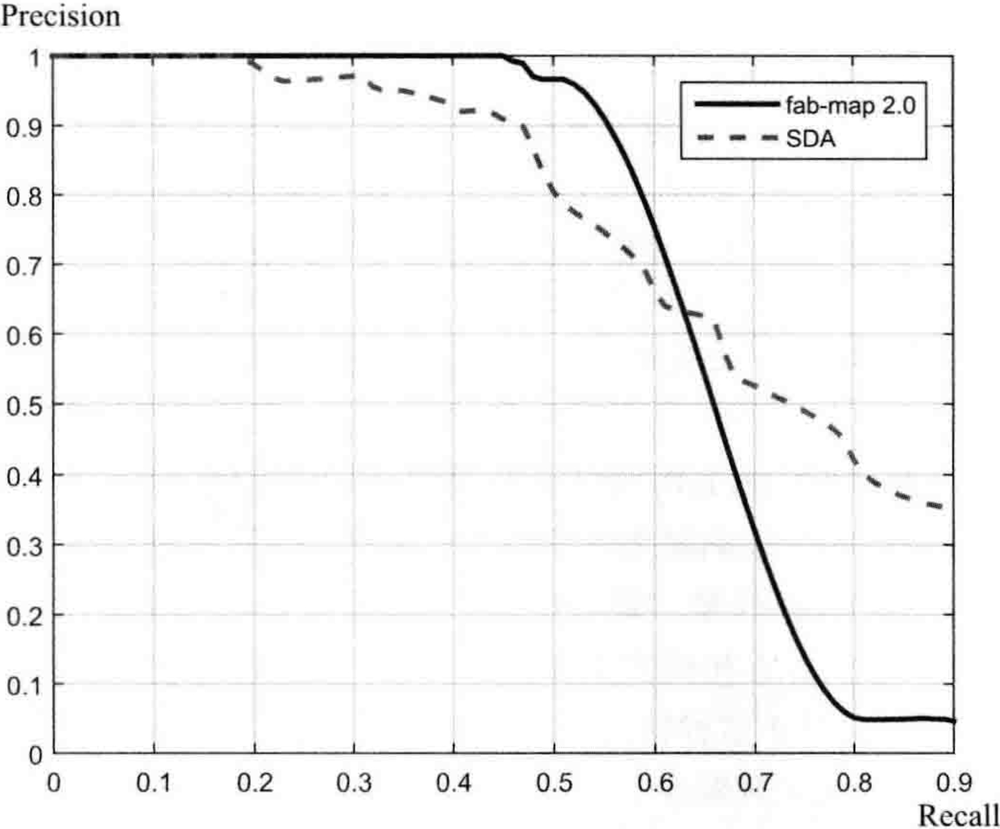
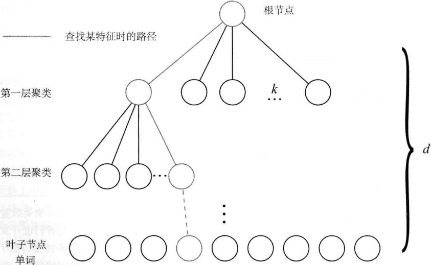

# 第11讲 回环检测

<B>主要目标</B>

1. 理解回环检测的必要性。
2. 掌握基于词袋的外观式回环检测。
3. 通过DBoW3的实验，学习词袋模型的实际用途。

本讲中，我们介绍SLAM中另一个主要模块：回环检测。我们知道SLAM主体(前端、后端)主要的目的在于估计相机运动，而回环检测模块，无论是目标上还是方法上，都与前面讲的内容相差较大，所以通常被认为是一个独立的模块。我们将介绍主流视觉SLAM中检测回环的方式：词袋模型，并通过DBoW库上的程序实验。

## 11.1 概述

### 11.1.1 回环检测的意义

我们已然介绍了前端和后端：前端提供特征点的提取和轨迹、地图的初值，而后端负责对所有这些数据进行优化。然而，如果像视觉里程计那样仅考虑相邻时间上的关键帧，那么，之前产生的误差将不可避免地累积到下一个时刻，使得整个SLAM出现<B>累积误差</B>，长期估计的结果将不可靠，或者说，我们无法构建<B>全局一致</B>的轨迹和地图。

举个例子：在自动驾驶的建图阶段，通常会指定采集车在某个给定区域绕若干圈以覆盖所有采集范围。假设我们在前端提取了特征，然后忽略特征点，在后端使用位姿图优化整个轨迹，如图11-1(a)所示。前端给出的只是局部的位姿间约束，例如，可能是$x_1-x_2,x_2-x_3$，等等。但是，由于$x_1$的估计存在误差，而$x_2$是根据$x_1$决定的，$x_3$又是$x_2$决定的。以此类推，误差就会被累积起来，使得后端优化的结果如图11-1(b)所示，慢慢地趋向不准确。在这种应用场景下，我们应该保证，优化的轨迹和实际地点一致。当我们实际经过同一个地点时，估计轨迹也必定经过同一点。

    
     
    
图 11-1 漂移示意图

> (a)真实轨迹；(b)由于前端只给出相邻帧间的估计，优化后的位姿图出现漂移；(c)添加回环检测后的位姿图可以消除累积误差

虽然后端能够估计最大后验误差，但所谓“好模型架不住烂数据”，只有相邻关键帧数据时，我们能做的事情并不多，也无从消除累积误差。但是，回环检测模块能够给出除了相邻帧的一些<B>时隔更加久远</B>的约束：例如$x_1 \sim x_{100}$之间的位姿变换。为什么它们之间会有约束呢？这是因为我们察觉到相机<B>经过了同一个地方，采集到了相似数据</B>。而回环检测的关键，就是如何有效地检测出<b>相机经过同一个地方</b>这件事。如果我们能够成功地检测到这件事，就可以为后端的位姿图提供更多的有效数据，使之得到更好的估计，特别是得到一个<b>全局一致</b>的估计。由于位姿图可以看成一个质点-弹簧系统，所以回环检测相当于在图像中加入了额外的弹簧，提高了系统稳定性。

回环检测对于SLAM系统意义重大。一方面，它关系到我们估计的轨迹和地图在<B>长时间下</B>的正确性。另一方面，由于回环检测提供了当前数据与所有历史数据的关联，我们还可以利用回环检测进行<b>重定位</b>。重定位的用处就更多一些。例如，如果我们事先对某个场景录制了一条轨迹并建立了地图，那么之后在该场景中就可以一直跟随这条轨迹进行导航，而重定位可以帮助我们确定自身在这条轨迹上的位置。因此，回环检测对整个SLAM系统精度与稳健性的提升是非常明显的。甚至在某些时候，我们把仅有前端和局部后端的系统称为视觉里程计，而把带有回环检测和全局后端的系统称为SLAM。

### 11.1.2 回环检测的方法

事实上，存在若干种不同的思路来实现回环检测。

最简单的方式就是对任意两幅图像都做一遍特征匹配，根据正确匹配的数量确定哪两幅图像存在关联-这确实是一种朴素且有效的思想。缺点在于，我们盲目假设了“任意两幅图像都可能存在回环”，使得要检测的数量实在太大：对于$N$个可能的回环，我们要检测$C_N^2$那么多次，这是$O(N^2)$的复杂度，随着轨迹变长增长太快，在大多数实时系统中是不实用的。另一种朴素的方式是，随机抽取历史数据并进行回环检测，例如在$n$帧中随机抽5帧与当前帧比较。这种做法能够维持常数时间的运算量，但是这种盲目试探方法在帧数$N$增长时，抽到回环的概率又大幅下降，使得检测效率不高。

上面说的朴素思路都过于粗糙，尽管随机检测在有些实现中确实有用，但我们至少希望有一个“哪处可能出现回环”的预计，才好不那么盲目地去检测。这样的方式大体有两种思路：基于里程计(Odometry based)的几何关系，或基于外观(Appearance based)的几何关系。基于里程计的几何关系是说，当我们发现当前相机运动到了之前的某个位置附近时，检测它们有没有回环关系-这自然是一种直观的想法，但是由于累积误差的存在，我们往往没法正确地发现“运动到了之前的某个位置附近”这件事实，回环检测也无从谈起。因此，这种做法在逻辑上存在一点问题，因为回环检测的目标在于发现“相机回到之前位置”的事实，从而消除累积误差。而基于里程计的几何关系的做法假设了“相机回到之前位置”的事实，从而消除累积误差。而基于里程计的几何关系的做法假设了“相机回到之前位置附近”，这样才能检测回环。这是有倒果为因的嫌疑的，因而也无法在累积误差较大时工作。

另一种方法是基于外观的。它和前端、后端的估计都无关，仅根据两幅图像的相似性确定回环检测关系。这种做法摆脱了累积误差，使回环检测模块成为SLAM系统中一个相对独立的模块(当然前端可以为它提供特征点)。自21世纪初被提出以来，基于外观的回环检测方式能够有效地在不同场景下工作，成了视觉SLAM中主流的做法，并被应用于实际的系统中。

除此之外，从工程角度我们也能提出一些解决回环检测的办法。例如，室外的无人车通常会配备GPS，可以提供全局的位置信息。利用GPS信息可以很轻松地判断汽车是否回到某个经过的点，但这类方法在室内就不怎么好用。

在基于外观的回环检测算法中，核心问题是<B>如何计算图像间的相似性</B>。例如，对于图像$A$和图像$B$，我们要设计一种方法，计算它们之间的相似性评分：$s(A,B)$。当然，这个评分会在某个区间内取值，当它大于一定量后我们认为出现了一个回环。

如何计算两幅图像的相似性？直观上看，图像能够表示成矩阵，那么直接让两幅图像相减，然后取某种范数行不行呢？

$$
s(A,B) = \lVert A - B \rVert. \tag{11.1}
$$

为什么不能这么做？

1. 前面说过，像素灰度是一种不稳定的测量值，它严重地受环境光照和相机曝光的影响。假设相机未动，我们打开一支电灯，那么图像会整体变亮。这样，即使对于同样的数据，我们也会得到一个很大的差异值。
2. 当相机视角发生少量变化时，即使每个物体的光度不变，它们的像素也会在图像中发生位移，造成一个很大的差异值。

由于这两种情况的存在，实际中，即使对于非常相似的图像，$A - B$也会经常得到一个(不符合实际的)很大的值。所以我们说，这个函数<B>不能很好地反映图像间的相似关系</B>。这里牵涉到一个“好”和“不好”的定义问题。我们要问，怎样的函数能够更好地反映相似关系，而怎样的函数不够好呢？从这里可以引出<B>感知偏差</B>(Perceptual Aliasing)和<B>感知变异</B>(Perceptual Variability)两个概念。

### 11.1.3 准确率和召回率

从程序角度看，我们希望程序算法能够得出和人类，或者和事实一致的判断。当我们觉得，或者事实上就是，两幅图像从同一个地方拍摄，那么回环检测算法也应该给出“这是回环”的结果。反之，如果我们觉得，或事实上，两幅图像是从不同地方拍摄的，那么程序也应该给出“这不是回环”的判断。当然，程序的判断并不总是与我们人类的想法一致，所以可能出现表 11-1 的 4 种情况。

表11-1 回环检测的结果分类

| 算法/事实 | 是回环 | 不是回环 |
| :--: | :--: | :--: |
| 是回环 | 真阳性 | 假阳性 |
| 不是回环 | 假阴性 | 真阴性 |

假阳性(False Positive)又称为感知偏差，而假阴性(False Negative)称为感知变异(如图 11-2 所示)。为了方便书写，用缩写TP代表True Positive（真阳性），用TN代表True Negative（真阴性），其余类推。由于我们希望算法和人类的判断一致，所以希望TP和TN尽量高，而FP和FN尽可能低。所以，对于某种特定算法，我们可以统计它在某个数据集上的TP、TN、FP、FN的出现次数，并计算两个统计量：<B>精确率</B>和<B>召回率</B>(Precision & Recall)。

$$
Precision = TP / (TP + FP), \quad Recall = TP / (TP + FN). \tag{11.2}
$$

    
     
    
图 11-2 假阳性与假阴性的例子

从公式字面意义上看，精确率描述的是算法提取的所有回环中确实是回环的概率。而召回率则是指，在所有真实回环中被正确检测出来的概率。它们有一定的代表性，并且通常是一对<B>矛盾</B>。

一个算法往往有许多的设置参数。例如，当提高某个阈值时，算法可能变得更加“严格”-他检出更少的回环，使精确率得以提高。同时，由于检出的数量变少了，许多原本是回环的地方就可能被漏掉，导致召回率下降了。反之，如果我们选择更加宽松的配置，那么检出的回环数量将增加，得到更高的召回率，但其中可能混杂一些不是回环的情况，于是准确率下降。

为了评价算法的好坏，我们会测试它在各种配置下的$P$和$R$值，然后做Precision-Recall曲线(如图11-3所示)。当用召回率为横轴，用准确率为纵轴时，我们会关心整条曲线偏向右上方的程度、100%准确率下的召回率或者50%召回率时的准确率，作为评价算法的指标。通常，我们不能一概而论地说算法A就是优于算法B的，我们可能会说A在准确率较高时还有很好的召回率，而B在70%召回率的情况下还能保证较好的准确率。

    
     
    
图 11-3 准确率-召回率曲线的例子

在SLAM中，我们对准确率的要求更高，而对召回率则相对宽容一些。由于假阳性的(检测结果是而实际不是的)回环将在后端的位姿图中添加根本错误的边，有些时候会导致优化算法给出完全错误的结果。想象一下，如果SLAM程序错误地将所有的办公桌当成了同一张，那建出来的图会怎么样呢？你可能会看到走廊不直了，墙壁被交错在一起了，最后整个地图都失效了。相比之下，召回率低一些，顶多有部分的回环没有被检测到，地图可能受一些累积误差的影响-然而仅需一两次回环就可以完全消除它们了。所以在选择回环检测算法时，我们更倾向于把参数设置得更严格，或者在检测之后再加上<B>回环验证</B>的步骤。

那么，回到之前的问题，为什么不用$A - B$来计算相似性呢？我们会发现它的准确率和召回率都很差，可能出现大量的假阳性或假阴性的情况，所以说这样做“不好”。那么，什么方法更好一些呢？

---

## 11.2 词袋模型

既然直接用两张图像相减的方式不够好，我们就需要一种更可靠的方式。结合前面几讲的内容，一种思路是：为何不像视觉里程计那样使用特征点来做回环检测呢？和视觉里程计一样，我们对两幅图像的特征点进行匹配，只要匹配数量大于一定值，就认为出现了回环。根据特征点匹配，我们还能计算出这两幅图像之间的运动关系。当然，这种做法存在一些问题，例如，特征的匹配会比较费时、当光照变化时特征描述可能不稳定等，但离我们要介绍的词袋模型已经很相近了。

词袋，也就是Bag-of-Words(BoW)，目的是用“图像上有哪几种特征”来描述一幅图像。例如，我们说某张照片中有一个人、一辆车；而另一张中有两个人、一只够。根据这样的描述，就可以度量这两幅图像的相似性。再具体一些，我们要做以下三步：

1. 确定“人”“车”“狗”等概念-对应于BoW中的“<B>单词</B>”(Word)，许多单词放在一起，组成了“<B>字典</B>”(Dictionary)。
2. 确定一幅图像中出现了哪些在字典中定义的概念-我们用单词出现的情况（或直方图）描述整幅图像。这就把一幅图像转换成了一个向量的描述。
3. 比较上一步中的描述的相似程度。

以上面举的例子来说，首先我们通过某种方式得到了一本“字典”。字典上记录了许多单词，每个单词都有一定意义，例如“人”“车”“狗”都是记录在字典中的单词，我们不妨记为$w_1,w_2,w_3$。然后，对于任意图像$A$，根据它们含有的单词，可记为

$$
A = 1 \cdot w_1 + 1 \cdot w_2 + 0 \cdot w_3. \tag{11.3}
$$

字典是固定的，所以只要用$[1,1,0]^T$这个向量就可以表达$A$的意义。通过字典和单词，只需一个向量就可以描述整幅图像。该向量描述的是“图像是否含有某类特征”的信息，比单纯的灰度值更稳定。又因为描述向量说的是“是否出现”，而不管它们“在哪儿出现”，所以与物体的空间位置和排列顺序无关，因此在相机发生少量运动时，只要物体仍在视野中出现，我们就仍然保证描述向量不发生变化。基于这种特性，我们称它为Bag-of-Words而不是什么List-of-Words，强调的是Words的有无，而无关其顺序。因此，可以说字典类似于单词的一个集合。

回到上面的例子，同理，用$[2,0,1]^T$可以描述图像$B$。如果只考虑“是否出现”而不考虑数量，也可以是$[1,0,1]^T$，这时候这个向量就是二值的。于是，根据这两个向量，设计一定的计算方式，就能确定图像间的相似性。当然，对两个向量求差仍然有一些不同的做法，例如对于$a,b\in \mathbb{R}^W$，可以计算：

$$
s(a,b) = 1 - \frac{1}{W} \lVert a - b \rVert_1. \tag{11.4}
$$

其中范数取$L_1$范数，即各元素绝对值之和。请注意在两个向量完全一样时，我们将得到1；完全相反时($a$为0的地方$b$为1)得到0。这样就定义了两个描述向量的相似性，也就定义了图像之间的相似程度。

接下来的问题是什么？

1. 我们虽然清楚了字典的定义方式，但它到底是怎么来的呢？
2. 如果我们能够计算两幅图像间的相似程度评分，是否就能够判断回环了呢？

所以接下来，我们首先介绍字典的生成方式，然后介绍如何利用字典实际地计算两幅图像间的相似性。

---

## 11.3 字典

### 11.3.1 字典的结构

按照前面的介绍，字典由很多单词组成，而每一个单词代表了一个概念。一个单词与一个单独的特征点不同，它不是从单幅图像上提取出来的，而是某一类特征的组合。所以，字典生成问题类似于一个<B>聚类</B>(Clustering)问题。

聚类问题在无监督机器学习(Unsupervised ML)中特别常见，用于让机器自行寻找数据中的规律。BoW的字典生成问题也属于其中之一。首先，假设我们对大量的图像提取了特征点的集合，应该怎么做呢？这可以用经典的K-means（K均值）算法解决。

K-means是一个非常简单有效的方法，因此在无监督学习中广为使用，下面对其原理稍做介绍。简单的说，当有$N$个数据，想要归成$k$个类，那么用$K-means$来做主要包括如下步骤：

1. 随机选取$k$个中心点：$c_1,...,c_k$。
2. 对每一个样本，计算它与每个中心点之间的距离，取最小的作为它的归类。
3. 重新计算每个类的中心点。
4. 如果每个中心点都变化很小，则算法收敛，退出；否则返回第2步。

K-means的做法是朴素且简单有效的，不过也存在一些问题，例如，需要指定聚类数量、随机选取中心点使得每次聚类结果都不相同，以及一些效率上的问题。随后，研究者们也开发出了层次聚类法、K-means++等算法以弥补它的不足。总之，根据K-means，我们可以把已经提取的大量特征点聚类成一个含有$k$个单词的字典。现在的问题变成了如何根据图像中某个特征点查找字典中相应的单词。

仍然有朴素的思想：只要和每个单词进行比对，取最相似的那个就可以了--这当然是简单有效的做法。然而，考虑到字典的通用性，我们通常会使用一个较大规模的字典，以保证当前使用环境中的图像特征都曾在字典里出现，或至少有相近的表达。如果你觉得对十个单词一一比较不是什么麻烦事，那么对于一万个呢？十万个呢？

这种$O(n)$的查找算法显然不是我们想要的，如果字典排过序，那么二分查找显然可以提升查找效率，达到对数级别的复杂度。而实践中，我们可能会用更复杂的数据结构，例如Fabmap中Chou-Liu tree等。

使用一种$k$叉树来表达字典，它的思路很简单(如图11-4所示)，类似于层次聚类，是K-means的直接扩展。假定我们有$N$个特征点，希望构建一个深度为$d$、每次分叉为$k$的树，那么做法如下：

1. 在根节点，用K-means把所有样本聚成$k$类(实际中为保证聚类均匀性会使用K-means++)。这样就得到了第一层。
2. 对第一层的每个节点，把属于该节点的样本再聚成$k$类，得到下一层。
3. 依此类推，最后得到叶子层。叶子层即为所谓的Words。

    
     
    
图 11-4 K叉树字典示意图

> 训练字典时，逐层使用 K-means 聚类。根据已知特征查找单词时，可逐层对比，找到对应的单词。

实际上，最终我们仍在叶子层构建了单词，而树结构中的中间节点仅供快速查找时使用。这样一个$k$分支、深度为$d$的树，可以容纳$k^d$个单词。另外，在查找某个给定特征对应的单词时，只需将它与每个中间节点的聚类中心比较(一共$d$次)，即可找到最后的单词，保证了对数级别的查找效率。

### 11.3.2 实践：创建字典

---

## 11.4 相似度计算

### 11.4.1 理论部分

下面来讨论相似度计算的问题。有了字典之后，给定任意特征$f_i$，只要在字典树中逐层查找，最后都能找到与之对应的单词$w_j$--当字典足够大时，我们可以认为$f_i$和$w_j$来自同一类物体(尽管没有理论上的保证，仅是在聚类意义下这样说)。那么，假设从一幅图像中提取了$N$个特征，找到这$N$个特征对应的单词之后，就相当于拥有了该图像在单词列表中的分布，或者直方图。理想情况下，相当于“这幅图里有一个人和一辆汽车”这样的意思。根据BoW的说法，不妨认为这是一个Bag。

注意，这种做法中我们对所有单词都是“一视同仁”的--有就是有，没有就是没有。这样做好不好呢？我们应考虑部分单词具有更强区分性这一因素。例如，“的”“是”这样的字可能在许许多多的句子中出现，我们无法根据它们判别句子的类型；但如果有“文档”“足球”这样的单词，对判别句子的作用就大一些，可以说它们提供了更多信息。所以概括起来，我们希望对单词的区分性或重要性加以评估，给它们不同的权值以起到更好的效果。

TF-IDF(Term Frequency-Inverse Document Frequency)，或译频率-逆文档频率，是文本检索中常用的一种加权方式，也用于BoW模型中。TF部分的思想是，某单词在一幅图像中经常出现，它的区分度就高。另外，IDF的思想是，某单词在字典中出现的频率越低，分类图像时区分度越高。

我们可以在建立字典时计算IDF：统计某个叶子节点$w_i$中的特征数量相对于所有特征数量的比例，作为IDF部分。假设所有特征数量为$n$，$w_i$数量为$n_i$，那么该单词的IDF为

$$
IDF_i = \log \frac{n}{n_i}. \tag{11.5}
$$

TF部分则是指某个特征在单幅图像中出现的频率。假设图像$A$中单词$w_i$出现了$n_i$次，而一共出现的单词次数为$n$，那么TF为

$$
TF_i = \frac{n_i}{n}. \tag{11.6}
$$

于是，$w_i$的权重等于TF乘IDF之积：

$$
\eta_i = TF_i \times IDF_i. \tag{11.7}
$$

考虑权重以后，对于某幅图像$A$，它的特征点可对应到许多个单词，组成它的BoW：

$$
A = \{(w_1,\eta_1), (w_1,\eta_1), ..., (w_N,\eta_N)\} \overset{def}{=} v_A. \tag{11.8}
$$

由于相似的特征可能落到同一个类中，因此实际的$v_A$中会存在大量的零。无论如何，通过词袋我们用单个向量$v_A$描述了一幅图像$A$。这个向量$v_A$是一个稀疏的向量，它的非零部分指示了图像$A$中含有哪些单词，而这些部分的值为TF-IDF的值。

接下来的问题是：给定$v_A$和$v_B$，如何计算它们的差异呢？这个问题和范数定义的方式一样，存在若干种解决方式，例如$L_1$范数形式：

$$
s(v_A - v_B) = 2 \sum_{i=1}^{N} |v_{A_i}| + |v_{B_i}|- |v_{A_i} - v_{B_i}|. \tag{11.9}
$$

### 11.4.2 实践：相似度的计算

---

## 11.5 实验分析与评述

### 11.5.1 增加字典规模

### 11.5.2 相似性评分的处理

对任意两幅图像，我们都能给出一个相似性评分，但是只利用这个分值的绝对大小对我们并不一定有很好的帮助。例如，有些环境的外观本来就很相似，像办公室往往有很多同款式的桌椅一样；另一些环境则各个地方都有很大的不同。考虑到这种情况，我们会取一个<B>先验相似度</B>$s(v_t, v_{t - \Delta t})$，它表示某时刻关键帧图像与上一时刻的关键帧的相似性。然后，其他的分值都参照这个值进行归一化;

$$
s(v_t, v_{t_j})' = s(v_t, v_{t_j}) / s(v_t, v_{t - \Delta t}). \tag{11.10}
$$

站在这个角度上，我们说：如果当前帧与之前某关键帧的相似度超过当前帧与上一个关键帧相似度的3倍，就认为可能存在回环。这个步骤避免了引入绝对的相似性阈值，使得算法能够适应更多的环境。

### 11.5.3 关键帧的处理

在检测回环时，我们必须考虑关键帧的选取。如果关键帧选得太近，那么将导致两个关键帧之间的相似性过高，相比之下不容易检测出历史数据中的回环。例如，检测结果经常是第$n$帧和第$n-2$帧、第$n-3$帧最为相似，这种结果似乎太平凡了，意义不大。所以从实践上说，用于回环检测的帧最好稀疏一些，彼此之间不太相同，又能涵盖整个环境。

另外，如果成功检测到了回环，例如，回环出现在第1帧和第2帧，那么很可能第$n+1$帧、第$n+2$帧都会和第一帧构成回环。确认第1帧和第$n$帧之间存在回环对估计优化是有帮助的，而接下去的第$n+1$帧、第$n+2$帧都会和第1帧构成回环产生的帮助就没那么大了，因为我们已经用之前的信息消除了累积误差，更多的回环并不会带来更多的信息。所以，我们会把“相近”的回环聚成一类，使算法不要反复地检测同一类的回环。

### 11.5.4 检测之后的验证

词袋的回环检测算法完全依赖于外观而没有利用任何的几何信息，这导致外观相似的图像容易被当成回环。并且，由于词袋不在乎单词顺序，只在意单词有无的表达方式，更容易引发感知偏差。所以，在回环检测之后，我们通常还会有一个验证步骤。

验证的方法有很多，一个方法是设立回环的缓存机制，认为单次检测到的回环并不足以构成良好的约束，而在一段时间中一直检测到的回环，才是正确的回环。这可以看成时间上的一致性检测。另一个方法是空间上的一致性检测，即对回环检测到的两个帧进行特征匹配，估计相机的运动。然后，把运动放到之前的位姿图中，检查与之前的估计是否有很大的出入。总之，验证部分通常是必需的，但如何实现却是见仁见智的问题。

### 11.5.5 与机器学习的关系

从前面的论述中可以看出，回环检测与机器学习有着千丝万缕的关联。回环检测本身非常像是一个分类问题。与传统模式识别的区别在于，回环中的类别数量很大，而每类的样本很少--极端情况下，当机器人发生运动后，图像发生变化，就产生了新的类别，我们甚至可以把类别当成连续变量而非离散变量；而回环检测，相当于两幅图像落入同一类，是很少出现的。从另一个角度看，回环检测也相当于对“图像间相似性”概念的一个学习。既然人类能够掌握图像是否相似的判断，让机器学习到这样的概念也是非常有可能的。

词袋模型本身是一个非监督的机器学习过程--构建词典相当于对特征描述子进行聚类，而树只是对所聚的类的一个快速查找的数据结构。既然是聚类，结合机器学习里的知识，我们至少可以问：

1. 是否能对机器学习的图像特征进行聚类，而不是对SURF、ORB这样的人工设计特征进行聚类？
2. 是否有更好的方式进行聚类，而不是用树结构加上K-means这些较朴素的方式？

结合目前机器学习的发展，二进制描述子的学习和无监督的聚类，都是非常有望在深度学习框架中得以解决的问题。我们也陆续看到了利用机器学习进行回环检测的工作。尽管目前词袋方法仍是主流，但我们相信，未来深度学习方法很有希望打败这些人工设计特征的、“传统”的机器学习方法。毕竟词袋方法在物体识别问题上已经明显不如神经网络了，而回环检测又是非常相似的一个问题。例如，BoW模型的改进形式VLAD就有基于CNN的实现，同时也有一些网络在训练之后，可以从图像直接计算采集时刻相机的位姿，这些都可能成为新的回环检测算法。