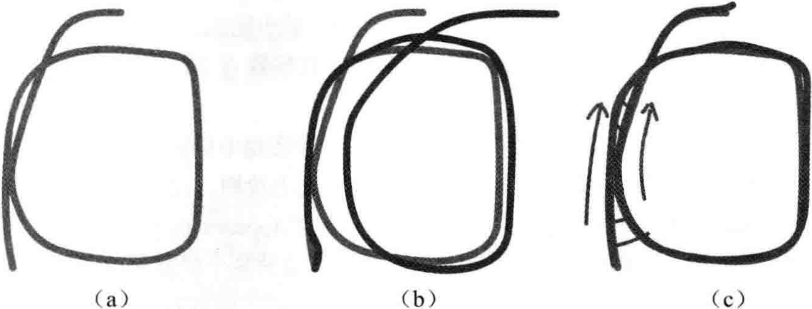

# 第11讲 回环检测

<B>主要目标</B>

1. 理解回环检测的必要性。
2. 掌握基于词袋的外观式回环检测。
3. 通过DBoW3的实验，学习词袋模型的实际用途。

本讲中，我们介绍SLAM中另一个主要模块：回环检测。我们知道SLAM主体(前端、后端)主要的目的在于估计相机运动，而回环检测模块，无论是目标上还是方法上，都与前面讲的内容相差较大，所以通常被认为是一个独立的模块。我们将介绍主流视觉SLAM中检测回环的方式：词袋模型，并通过DBoW库上的程序实验。

## 11.1 概述

### 11.1.1 回环检测的意义

我们已然介绍了前端和后端：前端提供特征点的提取和轨迹、地图的初值，而后端负责对所有这些数据进行优化。然而，如果像视觉里程计那样仅考虑相邻时间上的关键帧，那么，之前产生的误差将不可避免地累积到下一个时刻，使得整个SLAM出现<B>累积误差</B>，长期估计的结果将不可靠，或者说，我们无法构建<B>全局一致</B>的轨迹和地图。

举个例子：在自动驾驶的建图阶段，通常会指定采集车在某个给定区域绕若干圈以覆盖所有采集范围。假设我们在前端提取了特征，然后忽略特征点，在后端使用位姿图优化整个轨迹，如图11-1(a)所示。前端给出的只是局部的位姿间约束，例如，可能是$x_1-x_2,x_2-x_3$，等等。但是，由于$x_1$的估计存在误差，而$x_2$是根据$x_1$决定的，$x_3$又是$x_2$决定的。以此类推，误差就会被累积起来，使得后端优化的结果如图11-1(b)所示，慢慢地趋向不准确。在这种应用场景下，我们应该保证，优化的轨迹和实际地点一致。当我们实际经过同一个地点时，估计轨迹也必定经过同一点。

    
     
    
图 11-1 漂移示意图

> (a)真实轨迹；(b)由于前端只给出相邻帧间的估计，优化后的位姿图出现漂移；(c)添加回环检测后的位姿图可以消除累积误差

虽然后端能够估计最大后验误差，但所谓“好模型架不住烂数据”，只有相邻关键帧数据时，我们能做的事情并不多，也无从消除累积误差。但是，回环检测模块能够给出除了相邻帧的一些<B>时隔更加久远</B>的约束：例如$x_1 \sim x_{100}$之间的位姿变换。为什么它们之间会有约束呢？这是因为我们察觉到相机<B>经过了同一个地方，采集到了相似数据</B>。而回环检测的关键，就是如何有效地检测出<b>相机经过同一个地方</b>这件事。如果我们能够成功地检测到这件事，就可以为后端的位姿图提供更多的有效数据，使之得到更好的估计，特别是得到一个<b>全局一致</b>的估计。由于位姿图可以看成一个质点-弹簧系统，所以回环检测相当于在图像中加入了额外的弹簧，提高了系统稳定性。

回环检测对于SLAM系统意义重大。一方面，它关系到我们估计的轨迹和地图在<B>长时间下</B>的正确性。另一方面，由于回环检测提供了当前数据与所有历史数据的关联，我们还可以利用回环检测进行<b>重定位</b>。重定位的用处就更多一些。例如，如果我们事先对某个场景录制了一条轨迹并建立了地图，那么之后在该场景中就可以一直跟随这条轨迹进行导航，而重定位可以帮助我们确定自身在这条轨迹上的位置。因此，回环检测对整个SLAM系统精度与稳健性的提升是非常明显的。甚至在某些时候，我们把仅有前端和局部后端的系统称为视觉里程计，而把带有回环检测和全局后端的系统称为SLAM。

### 11.1.2 回环检测的方法