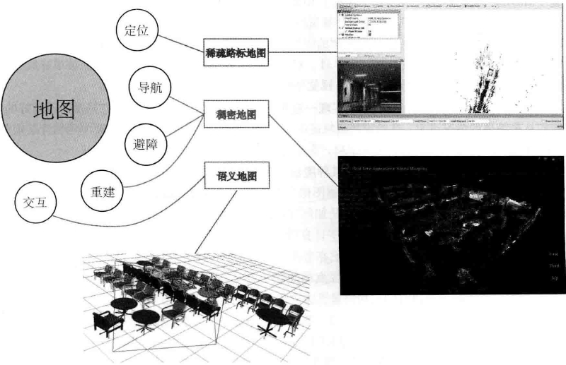

# 第 12 讲 建图

<B>主要目标</B>

1. 理解单目SLAM中稠密深度估计的原理。
2. 通过实验了解单目稠密重建的过程。
3. 了解几种RGB-D重建中的地图形式。

本讲介绍建图部分的算法，在前端和后端中，重点关注同时估计相机运动轨迹与特征点空间位置的问题。然而，在实际使用SLAM时，除了对相机本体进行定位、导航、避障和交互，特征点地图显然不能满足所有的需求。所以，本讲我们将更详细地讨论各种形式的地图，并指出目前视觉SLAM地图中存在的缺陷。

## 12.1 概述

建图，本应该是SLAM的两大目标之一--因为SLAM被称为同时定位与建图。但是直到现在，我们讨论的都是定位问题，包括通过特征点的定位、直接法的定位，以及后端优化。那么，这是否暗示建图在SLAM里没那么重要，所以直到本讲才开始讨论呢？

答案是否定的。事实上，在经典的SLAM模型中，我们所谓的地图，即所有路标点的集合。一旦确定了路标点的位置，就可以说我们完成了建图。于是，前面说的视觉里程计也好，BA也好，事实上都建模了路标点的位置，并对它们进行了优化。从这个角度上说，我们已经探讨了建图问题。那么为何还要单独介绍建图呢？

这是因为人们对建图的需求不同。SLAM作为一种底层技术，往往是用来为上层应用提供信息的。如果上层是机器人，那么应用层的开发者可能希望使用SLAM做全局的定位，并且让机器人在地图中导航--例如扫地机需要完成扫地工作，希望计算一条能够覆盖整张地图的路径。或者，如果上层是一个增强现实设备，那么开发者可能希望将虚拟物体叠加在现实物体之中，特别地，还可能需要处理虚拟物体和真实物体的遮挡关系。

我们发现，应用层面对于“定位”的需求是相似的，希望SLAM提供相机或搭载相机的主体的空间位姿信息。而对于地图，则存在着许多不同的需求。从视觉SLAM的角度看，“建图”是服务于“定位”的；但是从应用层面看，“建图”明显带有许多其他的需求。关于地图的用处，我们大致归纳如下：

1. <B>定位</B>。定位是地图的一项基本功能。在前面的视觉里程计部分，我们讨论了如何利用局部地图实现定位。在回环检测部分，我们也看到，只要有全局的描述子信息，我们也能通过回环检测确定机器人的位置。我们还希望能够把地图保存下来，让机器人在下次开机后依然能在地图中定位，这样只需对地图进行一次建模，而不是每次启动机器人都重新做一次完整的SLAM。
2. <B>导航</B>。导航是指机器人能够在地图中进行路径规划，在任意两个地图点间寻找路径，然后控制自己运动到目标点的过程。在该过程中，我们至少需要知道<B>地图中哪些地方不可通过，而哪些地方是可以通过的</B>。这就超出了稀疏特征点地图的能力范围，必须有另外的地图形式。这至少是一种<B>稠密</B>的地图。
3. <B>避障</B>。避障也是机器人经常碰到的一个问题。它与导航类似，但更注重局部的、动态的障碍物的处理。同样，仅有特征点，无法判断某个特征点是否为障碍物，所以需要<B>稠密</B>地图。
4. <B>重建</B>。有时，我们希望利用SLAM获得周围环境的重建效果。这种地图主要用于向人展示，所以希望它看上去比较舒服、美观。或者，我们也可以把该地图用于通信，使其他人能够远程观看我们重建得到的三维物体或场景--例如三维的视频通话或者网上购物等。这种地图亦是<B>稠密</B>的，并且还对它的外观有一些要求。我们可能不满足于稠密点云重建，更希望能够构建带纹理的平面，就像电子游戏中的三维场景那样。
5. <B>>交互</B>。交互主要指人与地图之间的互动。例如，在增强现实中，我们会在房间里放置虚拟的物体，并与这些虚拟物体之间有一些互动--例如我们会点击墙面上放着的虚拟网页浏览器来观看视频，或者向墙面投掷物体，希望它们有(虚拟的)物体碰撞。另外，机器人应用中也会有与人、与地图之间的交互。例如，机器人可能会收到命令“取桌子上的报纸”，那么，除了有环境地图，机器人还需要知道哪一块地图是“桌子”，什么叫作“之上”，什么叫作“报纸”。这就需要机器人对地图有更高层面的认知--也称为语义地图。

图12-1形象地解释了上面讨论的各种地图类型与用途之间的关系。之前的讨论，基本集中于“稀疏路标地图”部分，还没有探讨稠密地图。所谓稠密地图是相对于稀疏地图而言的。稀疏地图只建模感兴趣的部分，也就是前面说了很久的特征点(路标点)。而稠密地图是指建模<B>所有</B>看到过的部分。对于同一张桌子，稀疏地图可能只建模了桌子的四个角，而稠密地图则会建模整个桌面。虽然从定位角度看，只有四个角的地图也可以用于对相机进行定位，但由于我们无法从四个角推断这几个点之间的空间结构，所以无法仅用四个角完成导航、避障等需要稠密地图才能完成的工作。

    
     
    
图 12-1 各种地图的示意图

从上面的讨论中可以看出，稠密地图占据着一个非常重要的位置。于是，剩下的问题是：通过视觉SLAM能建立稠密地图吗？如果能，怎么建？

---

## 12.2 单目稠密重建

### 12.2.1 立体视觉

相机，被认为是只有角度的传感器(Bearing only)，单幅图像中的像素，只能提供物体与相机成像平面的角度及物体采集到的亮度，而无法提供物体的距离(Range)。而在稠密重建中，我们需要知道每一个像素点(或大部分像素点)的距离，对此大致上有如下解决方案：

1. 使用单目相机，估计相机运动，并且三角化计算像素的距离。
2. 使用双目相机，利用左右目的视差计算像素的距离(多母原理相同)。
3. 使用RGB-D相机直接获得像素距离。

前两种方式称为立体视觉(Stereo Vision)，其中移动单目相机的又称为移动视角的立体视觉(Moving View Stereo, MVS)。相比于RGB-D直接测量的深度，使用单目和双目的方式对深度获取往往是“费力不讨好”的-计算量巨大，最后得到一些不怎么可靠的深度估计。当然，RGB-D也有一些量程、应用范围和光照的限制，不过相比于单目和双目的结果，使用RGB-D进行稠密重建往往是更常见的选择。而单目、双目的好处是，在目前RGB-D还无法被很好地应用的室外、大场景场合中，仍能通过立体视觉估计深度信息。

本节将实现一遍单目的稠密估计，体验为何说它是费力不讨好的。从最简单的情况讲起：在给定相机轨迹的基础上，如何根据一段时间的视频序列估计某幅图像的深度。这里不考虑SLAM，先考虑简单的建图问题。

假定有一段视频序列，我们得到了每一帧对应的轨迹(有可能由视觉里程计前端估计所得)。现在以第一幅图像为参考帧，计算参考帧中每个像素的深度(或者距离)。首先，请回忆在特征点部分，我们是如何完成该过程的：

1. 对图像提取特征，并根据描述子计算特征之间的匹配。换言之，通过特征，我们对某一个空间点进行了跟踪，知道了它在各个图像之间的位置。
2. 由于无法仅用一幅图像确定特征点的位置，所以必须通过不同视角下的观测估计它的深度，原理即前面讲过的三角测量。

在稠密深度图估计中，不同之处在于，无法把每个像素都当作特征点计算描述子。因此，稠密深度估计问题中，匹配就称为很重要的一环：如何确定第一幅图的某像素出现在其他图里的位置？这需要用到<B>极线搜索</B>和<B>块匹配技术</B>。当我们知道某个像素在各个图中的位置，就能像特征点那样，利用三角测量法确定它的深度。不过不同的是，在这里要使用很多次三角测量法让深度估计收敛，而不仅使用一次。我们希望深度估计能够随着测量的增加从一个非常不确定的量，逐渐收敛到一个稳定值。这就是<B>深度滤波器技术</B>。

### 12.2.2 极线搜索与块匹配

如下图12-2所示，左边的相机观测到了某个像素$p_1$，由于这是一个单目相机，无从知道它的深度，所以假设这个深度可能在某个区域之内，不妨说是某最小值到无穷远之间$(d_{\min}, +\infty)$。因此，该像素对应的空间点就分布在某条线段(本例中是射线)上。从另一个视角(右侧相机)看，这条线段的投影也形成图像平面上的一条线，我们知道这称为<B>极线</B>。当知道两部相机间的运动时，这条极线也是能够确定的。那么问题就是：极线上的哪一点是我们刚才看到的$p_1$点呢？

    
     
    
图 12-2 极线搜索示意图

在特征点法中，通过特征匹配找到了$p_2$的位置，然而，现在我们没有描述子，所以只能在极线上所有和$p_1$长得比较相似的点。再具体地说，我们可能沿着第二幅图像中的极线的某一头走到另一头，逐个比较每个像素与$p_1$的相似程度。从直接比较像素的角度来看，这种做法和直接法有异曲同工之妙。

在直接法的讨论中我们了解到，比较单个像素的亮度值并不一定可靠。一件很明显的事情就是：万一极线上有很多和$p_1$相似的点，怎么确定哪一个是真实的呢？这似乎回到了我们在回环检测中说到的问题：如何确定两幅图像(或两个点)的相似性？回环检测是通过词袋来解决的，但是这里由于没有特征，所以只好寻求另外的解决途径。

一种直观的想法是：既然单个像素的亮度没有区分性，是否可以比较像素块呢？我们在$p_1$周围取一个大小为$w\times w$的小块，然后在极线上也取很多同样大小的小块进行比较，就可以在一定程度上提高区分性。这就是所谓的<b>块匹配</b>。在这个过程中，只有假设在不同图像间整个小块的灰度值不变，这种比较才有意义。所以算法的假设，从像素的灰度不变性变成了图像块的灰度不变性--在一定程度上变得更强了。

现在我们取得了$p_1$周围的小块，并且在极线上也取了很多个小块。不妨把$p_1$周围的小块记成$A \in \mathbb{R}^{w\times w}$，把极线上的$n$个小块记成$B_i,i=1,...,n$。那么，如何计算小块与小块间的差异呢？有若干种不同的计算方法：

1. SAD(sum of Absolute Difference)。顾名思义，即取两个小块的差的绝对值之和：

$$
S(A,B)_{SAB} = \sum_{i,j}| A(i,j) - B(i,j)|. \tag{12.1}
$$

2. SSD。平方和(Sum of Squared Distance):

$$
S(A,B)_{SSD} = \sum_{i,j}(A(i,j) - B(i,j))^2. \tag{12.2}
$$

3. NNC(Normalized Cross Correlation, 归一化互相关)。这种方式比前面两种要复杂，它计算的是两个小块的相关性：

$$
S(A,B)_{NCC} = \frac{\sum_{i,j} A(i,j) B(i,j)}{\sqrt{\sum_{i,j}A(i,j)^2 \sum_{i,j}B(i,j)^2}}. \tag{12.3}
$$

由于这里用的是相关性，所以相关性接近0表示两幅图像不相似，接近1表示相似。前面两种距离则是反过来的，接近0表示相似，而大的数值表示不相似。

这些计算方式往往存在一个精度-效率之间的矛盾，精度好的方法往往需要复杂的计算，而简单的快速算法又往往效果不佳。这需要我们在实际工程中进行取舍。另外，除了这些简单版本，我们可以<B>先把每个小块的均值去掉</B>，称为去均值的SSD、去均值的NCC，等等。去掉均值之后，允许像“小块B比A整体上亮一些，但仍然很相似”这样的情况，因此比之前的更可靠。

现在，我们在极线上计算了$A$与每一个$B_i$的相似性度量。假设使用NCC，那么，将得到一个沿着极线的NCC分布。这个分布的形状取决于图像数据，如图12-3所示。

    
     
    
图 12-3 匹配得分沿距离的分布

在搜索距离较长的情况下，通常会得到一个非凸函数：这个分布存在许多峰值，然而真实的对应点必定只有一个。在这种情况下，我们会倾向于使用概率分布描述深度值，而非用某个单一的数值来描述深度。于是，我们的问题就转到了在不断地对不同图像进行极线搜索时，我们估计的深度分布将发生怎样的变化--这就是所谓的<B>深度滤波器</B>。

### 12.2.3 高斯分布的深度滤波器

对像素点深度的估计，本身也可建模为一个状态估计问题，于是就自然存在滤波器与非线性优化两种求解思路。虽然非线性优化效果较好，但是在SLAM这种实时性要求较强的场合，考虑到前端已经占据了不少的计算量，建图方面则通常采用计算量较少的滤波器方式。这也是本节讨论深度滤波器的目的。

对深度的分布假设存在若干种不同的做法。一方面，在比较简单的假设条件下，可以假设深度值服从高斯分布，得到一种类卡尔曼式的方法(但实际上只是归一化积)。先介绍并演示高斯分布假设下的深度滤波器。

设某个像素点的深度$d$服从：

$$
P(d) = N(\mu, \sigma^2). \tag{12.4}
$$

每当新的数据到来，我们都会观测到它的深度。同样，假设这次观测也是一个高斯分布：

$$
P(d_{obs}) = N(\mu_{obs}, \sigma_{obs}^2). \tag{12.5}
$$

于是，我们的问题是，如何使用观测的信息更新原先$d$的分布。这正是一个信息融合问题。两个高斯分布的乘积依然是一个高斯分布。设融合后的$d$分布为$N(\mu_{fuse}, \sigma_{fuse}^2)$，那么根据高斯分布的乘积，有

$$
\mu_{fuse} = \frac{\sigma_{obs}^2 \mu + \sigma^2 \mu_{obs}}{\sigma^2 + \sigma_{obs}^2}, \quad \sigma_{fuse}^2 = \frac{\sigma^2 \sigma_{obs}^2}{\sigma^2 + \sigma_{obs}^2}. \tag{12.6}
$$

由于我们仅有观测方程没有运动方程，所以这里深度仅用到了信息融合部分，而无须像完整的卡尔曼那样进行预测和更新(当然，可以把它看成“运动方程为深度值固定不动”的卡尔曼滤波器)。可以看到融合的方程确实浅显易懂，不过问题仍然存在：如何确定我们观测到深度的分布呢？即如何计算$\mu_{fuse},\sigma_{obs}$呢？

关于$\mu_{fuse},\sigma_{obs}$，也存在一些不同的处理方式。可以考虑几何不确定性和光度不确定性二者之和，或者仅考虑几何不确定性。我们暂时只考虑由几何关系带来的不确定性。现在，假设我们通过极线搜索和块匹配确定了参考帧某个像素在当前帧的投影位置。那么，这个位置对深度的不确定性有多大呢？

以图12-4为例。考虑某次极线搜索，我们找到了$p_1$对应的$p_2$点，从而观测到了$p_2$的深度值，认为$p_1$对应的三维点为$P$。从而，可记$O_1 P$为$p$,$O_1 O_2$为相机的平移$t$，$O_2 P$记为$a$。并且，把这个三角形的下面两个角记作$\alpha, \beta$。现在，考虑极线$l_2$上存在一个像素大小的误差，使得$\beta$角变成了$\beta'$，而$p_2$也变成了$p_2'$，并记上面那个角为$\gamma$。我们要问的是，这个像素的误差会导致$p'$与$p$产生多大的差距呢？

    
     
    
图 12-4 不确定性分析

这是一个典型的几何问题。来列写这些量之间的几何关系。显然有

$$
\begin{array}{l}
    \mathbf{a = p - t} \\
    \alpha = \arccos \left \langle \mathbf{p,t} \right \rangle \\
    \beta = \arccos \left \langle \mathbf{a, -t} \right \rangle.
\end{array} \tag{12.7}
$$

对$\mathbf{p_2}$扰动一个像素，将使得$\beta$产生一个变化量，成为$\beta'$。根据几何关系，有

$$
\begin{array}{l}
    \beta' = \arccos \left \langle \mathbf{O_2 p_2', -t} \right \rangle \\
    \gamma = \pi - \alpha - \beta'.
\end{array} \tag{12.8}
$$

于是，由正弦定理，$p'$的大小可以求得

$$
\lVert \mathbf{p'} \rVert = \lVert \mathbf{t} \rVert \frac{\sin \beta'}{\sin \gamma}. \tag{12.9}
$$

由此，我们确定了由单个像素的不确定引起的深度不确定性。如果认为极线搜索的块匹配仅有一个像素的误差，那么就可以设：

$$
\sigma_{obs} = \lVert \mathbf{p} \rVert - \lVert \mathbf{p'} \rVert. \tag{12.10}
$$

当然，如果极线搜索的不确定性大于一个像素，则我们可按照此推导放大这个不确定性。接下来的深度数据融合已经在前面介绍过了，在实际工程中，当不确定性小于一定阈值时，就可以认为深度数据已经收敛了。

综上所述，我们给出了估计稠密深度的一个完整的过程：

<B>主要目标</B>

1. 假设所有像素的深度满足某个初始的高斯分布。
2. 当新数据产生时，通过极线搜索和块匹配确定投影点位置。
3. 根据几何关系计算三角化后的深度及不确定性。
4. 将当前观测融合进上一次的估计中。若收敛则停止计算，否则返回第2步。

这些步骤组成了一套可行的深度估计方式。请注意这里说的深度值是$O_1 P$的长度，它和我们在针孔相机模型里提到的“深度”有少许不同--针孔相机种的深度是指像素$z$值。

---

## 12.3 实践：单目稠密重建

### 12.3.1 实验分析与讨论

### 12.3.2 像素梯度的问题

### 12.3.3 逆深度

### 12.3.4 图像间的变换

### 12.3.5 并行化：效率的问题

### 12.3.6 其他的改进

---

## 12.4 RGB-D稠密建图

除了使用单目和双目相机进行稠密重建，在适用范围内，RGB-D相机是一种更好的选择。利用RGB-D进行稠密建图是相对容易的。不过，根据地图形式不同，也存在着若干种不同的主流建图方式。最直观、最简单的方法就是根据估算的相机位姿，将RGB-D数据转化为点云，然后进行拼接，最后得到一个由离散的点组成的点云地图(Point Cloud Map)。在此基础上，如果我们对外观有进一步的要求，希望估计物体的表面，则可以使用三角网格(Mesh)、面片(Surfel)进行建图。另外，如果希望知道地图的障碍物信息并在地图上导航，也可通过体素(Voxel)建立占据网格地图(Occupancy Map)。

### 12.4.1 实践：点云地图

### 12.4.2 从点云重建网格

### 12.4.3 八叉树地图

### 12.4.4 实践：八叉树地图

---

## 12.5 *TSDF地图和Fusion系列

---

## 12.6 小结

