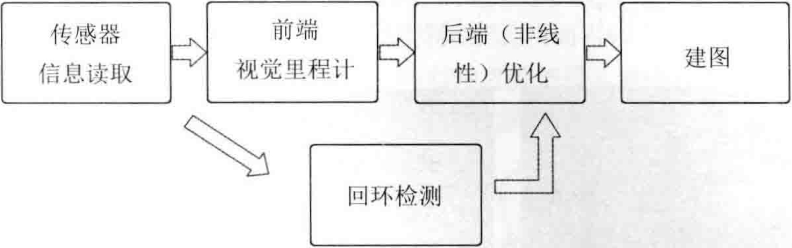

<B>主要目标</B>

> 1. 理解一个视觉SLAM框架由哪几个模块组成，各模块的任务是什么。
> 2. 搭建编程环境，为开发和实验做准备。
> 3. 理解如何在Linux下编译并运行一个程序，如果程序出了问题，又该如何调试它。
> 4. 掌握cmake的基本使用方法。

# 一.引言

惯性测量单元（Inertial Measurement Unit, IMU）

轮式编码器会测量轮子转动的角度

IMU测量运动的角速度和加速度

相机和激光传感器读取外部环境的某种观测数据。

## <B>1.单目相机</B>

单目、运动、结构、视差、远近、尺度

只使用一个摄像头进行SLAM的做法称为单目SLAM(Monocular SLAM)。单目相机中，无法通过单张图片计算场景中物体于相机之间的距离(远近)。

由于单目相机拍摄的图像只是三维空间的二维投影，所以，如果真想恢复三维结构，必须改变相机的视角。在单目SLAM中也是同样的原理，我们必须移动相机，才能估计它的运动(Motion)、同时估计场景中物体的远近和大小，不妨称之为结构(Structure)。

远处的物体移动快，远处的物体移动慢，极远处(无穷远处)的物体(如太阳、月亮)看上去是不动的。当相机移动时，这些物体在图像上的运动就形成了视差(Disparity)。通过视差，我们就能定量地判断哪些物体离得远，哪些物体离得近。

即使我们知道了物体的远近，它们依然只是一个相对的值。如果把相机的运动和场景大小同时放大两倍，单目相机所看到的像是一样的。同样地，把这个大小乘以任意倍数，我们都将看到一样的景象。这说明，单目SLAM估计的轨迹和地图将与真实的轨迹和地图相差一个因子，也就是所谓的尺度(Scale)。由于单目SLAM无法仅凭图像确定这个真实尺度，所以又称之为尺度不确定性(Scale Ambiguity)。

平移之后才能计算深度，以及无法确定真实尺度，这两件事情给单目SLAM的应用造成了很大的麻烦。其根本原因是通过单张图像无法确定深度。所以，为了得到这个深度，人们开始用双目相机和深度相机。

## <B>2.双目相机和深度相机</B>

使用双目相机和深度相机的目的是通过某种手段测量物体与相机之间的距离，克服单目相机无法知道距离的缺点。一旦知道了距离，场景的三维结构就可以通过单个图像恢复，同时消除尺度不确定性。

双目相机测量深度的原理：双目相机由两个单目相机组成，但这两个相机之间的距离(称为基线[Baseline])是已知的，通过这个基线来估计每个像素的空间位置。

如果对双目相机进行拓展，则可以搭建多目相机，不过本质上并没有什么不同。

计算机上的双目相机需要大量的计算才能(不太可靠地)估计每一个像素点的深度，相比于人类真是非常笨拙。<B>双目相机测量到的深度范围与基线相关，基线距离越大，能够测量到的物体就越远</B>，所以无人车上搭载的双目相机通常会是个很大的家伙。

双目相机的距离估计是比较左右眼的图像获得的，并不依赖其他传感设备，所以它既可以应用在室内，又可应用于室外。

双目或多目相机的缺点是配置与标定较为复杂，其深度量程和精度受双目的基线与分辨率所限，而且视差的计算非常消耗计算资源，需要使用GPU和FPGA设备加速，才能实时输出整张图像的距离信息。

在现有的条件下，计算量是双目的主要问题之一。

## <B>3.深度相机(又称RGB-D相机)</B>

深度相机通过红外结构光或Time-of-Flight(ToF)原理，像激光传感器那样，通过主动向物体发射光并接收返回的光，测出物体与相机之间的距离。它并不像双目相机那样通过软件计算来解决，而是通过物理的测量手段，所以相比于双目相机可节省大量的计算资源。

现在RGB-D相机还存在测量范围窄、噪声大、事业小、易受日光干扰、无法测量投射材质等诸多问题，在SLAM方面，主要用于室内，室外较难应用。

# 二.经典视觉SLAM框架

    

整个视觉SLAM流程包括以下步骤：

1. <B>传感器信息读取。</B> 在视觉SLAM中主要为相机图像信息的读取和预处理。如果是在机器人中，还可能有码盘、惯性传感器等信息的读取和同步。

2. <B>前端视觉里程计(Visual Odometry, VO)。</B>视觉里程计的任务是估算相邻图像间相机的运动，以及局部地图的样子。VO又称为前端(Front End)。

3. <B>后端(非线性)优化(Optimization)。</B>后端接受不同时刻视觉里程计测量的相机位姿，以及回环检测的信息，对它们进行优化，得到全局一致的轨迹和地图。由于接在VO之后，又称为后端(Back End)。

4. <B>回环检测(Loop Closure Detection)。</B>回环检测判断机器人是否到达过先前的位置。如果检测到回环，它会把信息提供给后端进行处理。

5. <B>建图(Mapping)。</B>它根据估计的轨迹，建立与任务要求对应的地图。

<B>如果把工作环境限定在静态、刚体、光照变化不明显、没有人为干扰的场景，那么这种场景下的SLAM技术已经相当成熟。</B>

##  2.1 视觉里程计

视觉里程计关心<B>相邻图像</B>之间的相机运动，最简单的情况当然是图像之间的运动关系。

计算机如何通过图像确定相机的运动呢？

在视觉SLAM中，我们只能看到一个个像素，知道它们是某些空间点在相机的成像平面上投影的结果。所以，为了定量地估计相机运动，必须先了解相机与空间点的几何关系。

视觉里程计能够通过相邻帧间的图像估计相机运动，并恢复场景的空间结构。称它为“里程计”是因为它和实际的里程计一样，只计算相邻时刻的运动，而和过去的信息没有关联。(可以不限于两帧，数量可以更多一些，例如5~10帧)。

假定我们已有了一个视觉里程计，估计了两张图像间的相机运动，那么，一方面，只要把相邻时刻的运动“串”起来，就构成了机器人的<B>运动轨迹</B>，从而解决了定位问题；另一方面，根据每个时刻的相机位置，计算出各像素对应的空间点的位置，就得到了<B>地图</B>。

到这，有了里程计，是不是就解决了SLAM问题呢？

视觉里程计确实是SLAM的关键，然而，仅通过视觉里程计来估计轨迹，将不可避免地出现<B>累积漂移(Accumulating Drift)</B>。这是由于视觉里程计在最简单的情况下只估计两个图像间的运动造成的。每次估计都带有一定的误差，由于里程计的工作方式，先前时刻的误差将会传递到下一时刻，导致经过一段时间之后，估计的轨迹将不再准确。

为了解决漂移问题，还需要两种技术：<B>后端优化</B>和<B>回环检测</B>。

回环检测负责把“机器人回到原始位置”的事情检查测出来；后端优化则根据该信息，校正整个轨迹的形状。

## 2.2 后端优化

后端优化主要指处理SLAM过程中的噪声问题，后端优化要考虑的问题，就是如何从这些带有噪声的数据中估计整个系统的状态，以及这个状态估计的不确定性有多大--这称为最大后验概率估计(Maximum-a-Posteriori, MAP)。这里的状态既包括机器人自身的轨迹，也包含地图。

相对地，视觉里程计部分有时被称为“前端”，在SLAM框架中，前端给后端提供待优化的数据，以及这些数据的初始值。而后端负责整体的优化过程，它往往面对的只有数据，不必关心这些数据到底来自什么传感器。

<B>在视觉SLAM中，前端和计算机视觉研究领域更为相关，比如图像的特征提取与匹配等，后端则主要是滤波与非线性优化算法。</B>

SLAM问题的本质：<B>对运动主体自身和周围环境空间不确定性的估计。</B>

为了解决SLAM问题，我们需要状态估计理论，把定位和建图的不确定性表达出来，然后采用滤波器或非线性优化，估计状态的均值和不确定性(方差)。

## 2.3 回环检测

回环检测，又称闭环检测，主要解决位置估计<B>随时间漂移</B>的问题。

假设实际情况下机器人经过一段时间的运动后回到了原点，但是由于漂移，它的位置估计值却没有回到原点，使用“回环检测”就可以让机器人知道“回到了原点”这件事，或者把“原点”识别出来，我们再把位置估计值“拉过去”，就可以消除漂移了。

回环检测与“定位”和“建图”二者都有密切的关系，地图存在的主要意义是让机器人知晓自己到过的地方，为了实现回环检测，我们需要让机器人具有<B>识别到过的场景</B>的能力。例如：可以判断图像间的相似性来完成回环检测，如果回环检测成功，则可以显著地减小累计误差。所以，视觉回环检测实质上是一种计算图像数据相似性的算法，由于图像的信息非常丰富，使得正确检测回环的难度降低了不少。

在检测到回环之后，我们会把“A与B是同一个点”这样的信息告诉后端优化算法，然后，后端根据这些新的信息，把轨迹和地图调整到符合回环检测结果的样子。这样，如果我们有充分而且正确的回环检测，则可以消除累积误差，得到全局一致的轨迹和地图。

## 2.4 建图

建图是指构建地图的过程，地图是对环境的描述，但这个描述并不是固定的，需要视SLAM的应用而定。

家用扫地机器人这种主要在低矮平面里运动的机器人来说，只需要一个二维的地图，标记哪里可以通过，哪里存在障碍物，就够它在一定范围内导航了。

对相机而言，它有6个自由度的运动，我们至少需要一张三维的地图，有时，我们想要一个漂亮的重建结果，不仅是一组空间点，还需要带纹理的三角面片。有时，我们又不关心地图的样子，只需要知道“A点到B点可通过，而B点到C点不行”这样的事情。甚至，有时不需要地图，或者地图可以由其他人提供，例如，行驶的车辆往往可以得到已绘制好的当地地图。

相比于前面提到的视觉里程计、后端优化和回环检测，建图并没有一个固定的形式和算法。一组空间点的集合可以称为地图，一个漂亮的3D模型也是地图，一个标记着城市、村庄、铁路、河道的图片还是地图。地图的形式随SLAM的应用场合而定。大体上讲，可以分为<B>度量地图</B>与<B>拓扑地图</B>两种。

### <B>度量地图(Metric Map)</B>

度量地图强调精确地表示地图中物体的位置关系，通常用稀疏(Sparse)与稠密(Dense)对其分类。稀疏地图进行了一定程度的抽象，并不需要表达所有的物体。稠密地图着重于建模所有看到的东西。定位时用稀疏路标地图就足够了，而用于导航时，则往往需要稠密地图。稠密地图通常按照某种分辨率，由许多个小块组成，在二维度量地图中体现为许多个小格子(Grid)，而在三维度量地图中则体现为许多小方块(Voxel)。

# 三.SLAM问题的数学表述

相机通常是在某些时刻采集数据的，我们只需要关心这些时刻的位置和地图，这样就把一段连续时间的运动变成了离散时刻$t=1,...,K$当中发生的事情。

在这些时刻，用$x$表示小萝卜自身的位置。各时刻的位置就记为$x_1,...,x_K$，它们构成了小萝卜的轨迹。

地图方面，假设地图是由许多个<B>路标</B>组成的，每个时刻，传感器会测量到一部分路标点，得到它们的观测数据，假设路标点一共有$N$个，用$y_1,...,y_N$表示它们。

在上述假定中，小萝卜携带着传感器在环境中运动，描述如下：

1. <B>运动</B>。考察从$k-1$时刻到$k$时刻，小萝卜的位置$x$如何变化。
2. <B>观测</B>。假设小萝卜在$k$时刻于$x_k$处探测到某一个路标$y_j$，如何用数学语言来描述这件事情。

先看运动：机器人携带一个测量自身运动的传感器，例如码盘或惯性传感器，这个传感器可以测量有关运动的读数，但不一定直接就是位置之差，还可能是加速度、角速度等信息。机器人所有的运动都可以用一个通用的、抽象的数学模型来说明此事：

$$
\pmb{x}_k=f(\pmb{x}_{k-1},\pmb{u}_k,\pmb{w}_k)
$$

> 这里，$\pmb{u}_k$是运动传感器的读数或者输入，$\pmb{w}_k$为该过程中加入的噪声。
> 
> 这个就是<B>运动方程</B>，用一个一般函数$f$来描述这个过程，而不指明$f$具体的作用方式。这使得整个函数可以替代任意的运动传感器/输入，成为一个通用的方程，而不必限定于某个特殊的传感器上。
>
> 噪声的存在使得这个模型变成了一个随机模型。

与运动方程相对应的还有一个观测方程，观测方程描述的是，当小萝卜在$x_k$位置上看到某个路标点$y_j$时，产生了一个观测数据$z_{k,j}$。同样用一个抽象的函数$h$来描述这个关系：

$$
z_{k,j}=h(y_j, x_k, v_{k,j})
$$

> 这里，$v_{k,j}$是这次观测里的噪声，由于观测所用的传感器形式更多，这里的观测数据$z$及观测方程$h$也有许多不同的形式。

SLAM过程可总结为两个基本方程：

$$
\begin{cases}
x_k &= f(x_{k-1}, u_k, w_k), \quad k=1,...,K \\
z_{k,j} &= h(y_j, x_k, v_{k,j}), \quad (k,j)\in O
\end{cases}
$$

> 其中$O$是一个集合，记录着在哪个时刻观察到了哪个路标(通常不是每个路标在每个时刻都能看到的)。这两个方程描述了最基本的SLAM问题：当知道运动测量的读数$u$，以及传感器的读数$z$时，如何求解定位问题(估计$x$)和建图问题(估计$y$)？
>
> 这时，我们就把SLAM问题建模成了一个<B>状态估计问题</B>：如何通过带有噪声的测量数据，估计内部的、隐藏着的状态变量？

状态估计问题的求解，与两个方程的具体形式，以及噪声服从哪种分布有关。按照运动和观测方程是否为线性，噪声是否服从高斯分布进行分类，分为线性/非线性和高斯/非高斯系统。其中线性高斯系统(Linear Gaussian，LG系统)是最简单的，它的无偏的最优估计可以由卡尔曼滤波器(Kalman Filter，KF)给出。而在复杂的非线性非高斯系统(Non-Linear Non-Gaussian，NLNG系统)中，我们会使用以扩展卡尔曼滤波器(Extended Kalman Filter, EKF)和非线性优化两大类方法去求解。

> 直至21世纪早期，以EKF为主的滤波器方法在SLAM中占据了主导地位，我们会在工作点处把系统线性化，并以预测-更新两大步骤进行求解(见Chapter10)。最早的实时视觉SLAM系统就是基于EKF开发的。随后，为了克服EKF的缺点(例如线性化误差和噪声高斯分布假设)，人们开始使用粒子滤波器(Particle Filter)等其他滤波器，乃至使用非线性优化的方法。时至今日，主流视觉SLAM使用以图优化(Graph Optimization)为代表的优化技术进行状态估计。我们认为优化技术已经明显优于滤波器技术，只要计算资源允许，通常都偏向于使用优化方法(见Chapter10和Chapter11)。

