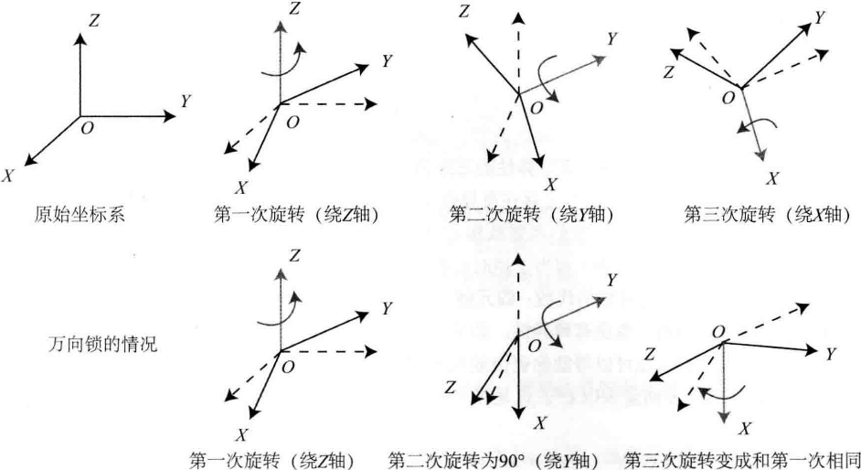

# 三维空间刚体运动

<B>主要目标</B>

> 1. 理解三维空间的刚体运动描述方式：旋转矩阵、变换矩阵、四元数和欧拉角。
> 2. 掌握Eigen库的矩阵、几何模块的使用方法。

本节介绍视觉SLAM的基本问题之一：<B>如何描述刚体在三维空间中的运动</B>

直观上，我们知道这由一次旋转加一次平移组成。

平移没有太大问题，但旋转的处理是一件很麻烦的事，我们将介绍旋转矩阵、四元数、欧拉角的意义，以及它们是如何运算和转换的。

# 3.1 旋转矩阵

## 3.1.1 点、向量和坐标系

刚体在三维空间中不光有位置，还有自身的姿态。位置是指刚体在空间中的哪个地方，而姿态则是指刚体的朝向。在数学中，使用点和向量来描述。

任意向量在空间的一组基($e_1,e_2,e_3$)下的坐标：

$$
a = [e_1, e_2, e_3]\left[
\begin{matrix}
a_1 \\
a_2 \\
a_3
\end{matrix}
\right] = a_1e_1+a_2e_2+a_3e_3
$$

这里$(a_1,a_2,a_3)^T$称为$a$在此基下的坐标。坐标的具体取值，一是和向量本身有关，二是和坐标系(基)的选取有关。坐标系通常由3个正交的坐标轴组成。

外积：

$$
a \cdot b = \begin{Vmatrix} 
e_1 & e_2 & e_3 \\
a_1 & a_2 & a_3 \\
b_1 & b_2 & b_3
\end{Vmatrix} = 
\begin{bmatrix}
a_2 b_3 - a_3 b_2 \\
a_3 b_1 - a_1 b_3 \\
a_1 b_2 - a_2 b_1
\end{bmatrix} = 
\begin{bmatrix}
0 & -a_3 & a_2 \\
a_3 & 0 & -a_1 \\
-a_2 & a_1 & 0
\end{bmatrix}b \overset{def}{=} a ^\wedge b. \tag{3.3}
$$

外积的结果是一个向量，它的方向垂直于这两个向量，大小为$\lvert a \rvert \lvert b \rvert sin\lang a,b \rang $，是两个向量张成的四边形的有向面积。

对于外积运算，我们引入$^\wedge$符号，把$a$写成一个矩阵。事实上是一个<B>反对称矩阵</B>(Skew-symmetric Matrix)，可以将$^\wedge$记成一个反对称符号。这样就把外积$a\times b$写成了矩阵向量的乘法$a^\wedge b$，把它变成了线性运算。

此符号是一个一一映射，意味着任意向量都对应着唯一的一个反对称矩阵，反之亦然：

$$
a^\wedge=\begin{bmatrix}
0 & -a_3 & a_2 \\
a_3 & 0 & -a_1 \\
-a_2 & a_1 & 0
\end{bmatrix}
$$

## 3.1.2 坐标系间的欧式变换

如下图所示，$x_W,y_W,z_W$定义的坐标系是一个世界坐标系，机器人是一个移动坐标系$x_C,y_C,z_C$定义的坐标系。

    

相机视野中某个向量$p$，它在相机坐标系下的坐标为$p_c$，而从世界坐标系下看，它的坐标为$p_w$，那么，这两个坐标系之间是如何转换的？

这时，就需要先得到该点针对机器人坐标系的坐标值，再根据机器人位姿变换到世界坐标系中。

两个坐标系之间的运动由一个旋转加上一个平移组成，这种运动称为<B>刚体运动</B>，我们说手机坐标系到世界坐标系之间，相差了一个<B>欧式变换</B>(Euclidean Transform)。

欧式变换由旋转和平移组成，首先考虑旋转，假设某个单位正交基$(e_1,e_2,e_3)$经过一次旋转变成了$(e_1^{'},e_2^{'},e_3^{'})$，那么，对于同一个向量$a$它在两个坐标系下的坐标为$[a_1,a_2,a_3]^T$和$[a_1',a_2',a_3']^T$。因为向量本身没变，所以根据坐标的定义有：

$$
[e_1,e_2,e_3]\begin{bmatrix} a_1 \\ a_2 \\ a_3 \end{bmatrix} = [e'_1,e'_2,e'_3]\begin{bmatrix} a'_1 \\ a'_2 \\ a'_3 \end{bmatrix}
$$

为了描述两个坐标系之间的关系，我们对上述等式的左右两边同时左乘$\begin{bmatrix} a^T_1 \\ a^T_2 \\ a^T_3 \end{bmatrix}$，那么左边的系数就变成了单位矩阵，所以：

$$
\begin{bmatrix} a_1 \\ a_2 \\ a_3 \end{bmatrix} = 
\begin{bmatrix}
e^T_1e'_1 & e^T_1e'_2 & e^T_1e'_3 \\
e^T_2e'_1 & e^T_2e'_2 & e^T_2e'_3 \\
e^T_3e'_1 & e^T_3e'_2 & e^T_3e'_3
\end{bmatrix}
\begin{bmatrix} a'_1 \\ a'_2 \\ a'_3 \end{bmatrix} \overset{def}{=}Ra'.
$$

把中间的矩阵拿出来，定义成一个矩阵$R$，这个矩阵由两组基之间的内积组成，刻画了旋转前后同一个向量的坐标变换关系。只要旋转是一样的，这个矩阵就是一样的。可以说，矩阵$R$描述了旋转本身。因此，称为<B>旋转矩阵</B>(Rotation Matrix)。同时，该矩阵各分量是两个坐标系基的内积，由于基向量的长度为1，所以实际上是各基向量的余弦值。所以这个矩阵也叫<B>方向余弦矩阵</B>(Direction Cosine Matrix)。

旋转矩阵有一些性质：它是一个行列式为1的正交矩阵。反之，行列式为1的正交矩阵也是一个旋转矩阵。所以，可以将n维旋转矩阵的集合定义如下：

$$
SO(n)=\{R\in \Re^{n\times n} | RR^T=I,det(R)=1\}.
$$

$SO(n)$是<B>特殊正交群</B>(Special Orthogonal Group)的意思，这个集合由$n$维空间的旋转矩阵组成，特别地，$SO(3)$就是指三维空间的旋转。通过旋转矩阵，可以直接谈论两个坐标系之间的旋转变换，而不用再从基开始谈起。

由于旋转矩阵为正交矩阵，它的逆(即转置)描述了一个相反的旋转。按照上面的定义方式有：

$$
a'=R^{-1}a=R^Ta.
$$

在欧氏变换中，除了旋转还有平移。考虑世界坐标系中的向量$a$，经过一次旋转(用$R$描述)和一次平移$t$后，得到了$a'$，那么把旋转和平移合到一起，有

$$
a'=Ra+t.
$$

> 其中，$t$称为平移向量。相比于旋转，平移部分只需要把平移向量加到旋转之后的坐标上。
> 通过上式，我们用一个旋转矩阵$R$和一个平移向量$t$完整地描述了一个欧氏空间的坐标变换关系。

实际当中，我们会定义坐标系1、坐标系2，那么向量$a$在两个坐标系下的坐标为$a_1$，$a_2$，它们之间的关系应该是：

$$
a_1=R_{12}a_2+t_{12}.
$$

这里的$R_{12}$是指“把坐标系2的向量变换到坐标系1”中，由于向量乘在这个矩阵的右边，它的下标是<B>从右读到左</B>的。如果要表达“从1到2的旋转矩阵”时，就写成$R_{21}$。

关于平移$t_{12}$，它实际对应的是坐标系1原点指向坐标系2原点的向量，<B>在坐标系1下取的坐标</B>，记作“从1到2的向量”。
但是反过来的$t_{21}$，即从2指向1的向量在坐标系2下的坐标，却并不等于$-t_{12}$，而是和两个系的旋转还有关系。

## 3.1.3 变换矩阵与齐次坐标

假设进行了两次欧氏空间的旋转与平移：$R_1,t_1$和$R_2,t_2$:

$$
b = R_1a + t_1, \quad c = R_2b + t_2.
$$
那么从$a$到$c$的变换为：

$$
c=R_2(R_1a + t_1) + t_2.
$$

可以发现，这里的变换关系不是一个线性关系。这样的形式在变换多次之后会显得很啰嗦，因此，我们引入齐次坐标和变换矩阵，重写：

$$
\begin{bmatrix} a' \\ 1 \end{bmatrix} = 
\begin{bmatrix} R & t \\ 0^T & 1 \end{bmatrix}
\begin{bmatrix} a \\ 1 \end{bmatrix} \overset{def}{=}
T \begin{bmatrix} a \\ 1 \end{bmatrix}
$$

> 这是一个数学技巧：我们在一个三维向量的末尾添加1，将其变成了四维向量，称为<B>齐次坐标</B>。对于这个四维向量，我们可以把旋转和平移写在一个矩阵里，使得整个关系变成线性关系。该式中，矩阵$T$称为<B>变换矩阵(Transform Matrix)</B>。

暂时用$\widetilde{a}$表示$a$的齐次坐标，那么依靠齐次坐标和变换矩阵，两次变换的叠加就可以有很好的形式：

$$
\widetilde{b}=T_1 \widetilde{a}, \widetilde{c}=T_2 \widetilde{b} \quad \Rightarrow \widetilde{c}=T_2T_2\widetilde{a}.
$$

> 区分齐次和非齐次坐标的符号令人厌烦，在不引起歧义的情况下，以后直接把它写成$b=Ta$的样子，默认进行了齐次坐标的转换。

关于变换矩阵$T$，它具有比较特别的结构：左上角为旋转矩阵，右侧为平移向量，左下角为$0$向量，右下角为$1$。这种矩阵又称为特殊欧氏群(Special Euclidean Group):

$$
SE(3)=\left\{ T=\begin{bmatrix} R & t \\ 0^T & 1 \end{bmatrix} \in \mathbb{R}^{4\times 4}|R\in SO(3),t\in \mathbb{R}^3 \right\}.
$$

与$SO(3)$一样，求解该矩阵的逆表示一个反向的变换：

$$
T^{-1}=\begin{bmatrix} R^T & -R^Tt \\ 0^T & 1 \end{bmatrix}.
$$

> 同样，我们用$T_{12}$这样的写法来表示从2到1的变换。

<B>回顾：</B>首先，我们介绍了向量及其坐标表示，并介绍了向量间的运算；然后，坐标系之间的运动由欧氏变换描述，它由平移和旋转组成。旋转可以由旋转矩阵$SO(3)$描述，而平移直接由一个$\mathbb{R}^3$向量描述。最后，如果将平移和旋转放一个矩阵中，就形成了变换矩阵$SE(3)$。

# 3.3 旋转向量和欧拉角

## 3.3.1 旋转向量

使用旋转矩阵来描述旋转，用变换矩阵描述一个6自由度的三维刚体运动。但是矩阵表示方式至少有以下两个缺点：

1. $SO(3)$的旋转矩阵有9个量，但一次旋转只有3个自由度。因此这种表达方式是冗余的。同理，变换矩阵用16个量表达了6自由度的变换。那么，是否有更紧凑的表示呢？
2. 旋转矩阵自身带有约束：它必须是正交矩阵，且行列式为1.变换矩阵也是如此。当想估计或优化一个旋转矩阵或变换矩阵时，这些约束会使得求解变得更困难。

我们希望有一种方式能够更紧凑地描述旋转和平移，例如，用一个三维向量表达旋转，用一个6维向量表达变换，可行吗？

> <B>事实上，任意旋转都可以用一个旋转轴和一个旋转角</B>来刻画。于是，我们可以使用一个向量，其方向与旋转轴一致，而长度等于旋转角。这种向量称为<B>旋转向量</B>(或轴角/角轴，Axis-Angle)，只需要一个三维向量即可描述旋转。
> 同样，对于变换矩阵，我们使用一个旋转向量和一个平移向量即可表达一次变换。这时的变量维数正好是六维。

<B>罗德里格斯公式</B>(Rodrigues's Formula)

$$
R=cos\theta I + (1-cos\theta)nn^T + sin\theta n^\wedge. \tag{3.15}
$$

> 符号$^\wedge$是向量到反对称矩阵的转换符。<B>罗德里格斯公式</B>是从旋转向量到旋转矩阵的转换公式。$n$是单位长度的旋转轴，角度为$\theta$。

反之，从一个旋转矩阵到旋转向量的转换，对于转角$\theta$，取两边的<B>迹</B>，有：

$$
\begin{aligned}
tr(R) &= cos\theta tr(I) + (1-cos\theta)tr(nn^T) + sin\theta tr(n^\wedge) \\
&= 3cos\theta + (1-cos\theta) \\
&= 1 + 2cos\theta
\end{aligned} \tag{3.16}
$$

因此：

$$
\theta = arccos \frac{tr(R) - 1}{2} \tag{3.17}
$$

关于转轴$n$，旋转轴上的向量在旋转后不发生改变，说明：
$$
Rn=n. \tag{3.18}
$$

因此，转轴$n$是矩阵$R$特征值1对应的特征向量。求解此方程，再归一化，就得到了旋转轴。也可以从“旋转轴经过旋转之后不变”的几何角度看待这个方程。

## 3.3.2 欧拉角

无论是旋转矩阵还是旋转向量，它们虽然能描述旋转，但对人类来说是非常不直观的。当我们看到一个旋转矩阵或旋转向量时，很难想象出这个旋转究竟是什么样的。当它们变换时，我们也不知道物体是在向哪个方向转动。

而欧拉角则提供了一种非常直观的方式来描述旋转--它使用<B>3个分离的转角</B>，把一个旋转分解成3次绕不同轴的旋转。人类很容易理解绕单个轴旋转的过程。

由于分解方式有许多种，所以欧拉角也存在着众多不同的，易于混淆的定义方法。例如，先绕$X$轴，再绕$Y$轴，最后绕$Z$轴旋转，就得到了一个$XYZ$轴的旋转。同理，可以定义$YXZ$、$ZYX$等旋转方式。

在特定领域内，在航空、航模中有“俯仰角”“偏航角”“翻滚角”，欧拉角常用的一种便是“偏航-俯仰-翻滚”(yaw-pitch-roll)3个角度来描述一个旋转，它等价于$ZYX$轴的旋转。刚体的前方为$X$轴，右侧为$Y$轴，上方为$Z$轴，如下图所示：

    

$ZYX$转角相当于把任意旋转分解成以下3个轴上的转角：
 1. 绕物体的$Z$轴旋转，得到偏航角yaw。
 2. 绕<B>旋转</B>之后的$Y$轴旋转，得到俯仰角pitch。
 3. 绕<B>旋转</B>之后的$X$轴旋转，得到滚转角roll。

此时，可以使用$[r,p,y]^T$这样一个三维的向量描述任意旋转。

欧拉角的一个重大缺点是会碰到著名的<B>万向锁问题(Gimbal Lock)</B>:在俯仰角为$\pm90\degree$时，第一次旋转与第三次旋转将使用同一个轴，使得系统丢失了一个自由度(由3次旋转变成了2次旋转)。

这被称为奇异性问题，由于这个问题，欧拉角不适用于插值和迭代，往往只用于人机交互中。

> 在SLAM程序中很少直接使用欧拉角表达姿态，同样不会在滤波或优化中使用欧拉角表达旋转。不过，若想验证自己的算法是否有错，转换成欧拉角能够帮助快速分辨结果是否正确。

在某些主体主要为2D运动的场合(例如扫地机、自动驾驶车辆)，可以把旋转分解成三个欧拉角，然后把其中一个(例如偏航角)拿出来作为定位信息输出。

# 3.4 四元数

## 3.4.1 四元数的定义

旋转矩阵用9个量描述3自由度的旋转，具有冗余性；欧拉角和旋转向量是紧凑的，但具有奇异性。事实上，<B>找不到不带奇异性的三维向量描述方式</B>。

回忆数学上的复数，用复数集$\mathbb{C}$表示复平面上的向量，而复数的乘法则表示复平面上的旋转：例如，乘上复数$i$相当于逆时针把一个复向量旋转$90\degree$。类似地，在表达三维空间旋转时，也有一种类似于复数的代数：<B>四元数(Quaternion)</B>。四元数是Hamilton找到的一种扩展的复数。它<B>既是紧凑的，也没有奇异性</B>。

缺点是，四元数不够直观，其运算稍复杂些。

当我们想将复平面的向量旋转$\theta$角时，可以给这个复向量乘以$e^{i\theta}$。这是极坐标表示的复数，它也可以写成普通的形式，只要用欧拉公式即可：

$$
e^{i\theta}=cos\theta + i sin\theta \tag{3.19}
$$

这正是一个单位长度的复数，所以在二维情况下，旋转可以由<B>单位复数</B>来描述，类似地，三维旋转可以由<B>单位四元数</B>来描述。

一个四元数$q$拥有一个实部和三个虚部。

$$
q=q_0 + q_1i + q_2 j + q_3 k, \tag{3.20}
$$

> 其中，$i,j,k$为四元数的三个虚部。这三个虚部满足以下关系式：

$$
\left\{\begin{matrix} 
  i^2=j^2=k^2=-1 \\
  ij=k,ji=-k \\
  jk=i,kj=-i \\
\end{matrix}\right.  \tag{3.21}
$$

> 如果把$i,j,k$看成三个坐标轴，那么它们于自己的乘法和复数一样，相互之间的乘法和外积一样。有时，人们也用一个标量和一个向量来表达四元数：

$$
\mathcal{q}=[s,v]^T, \quad s=q_0 \in \mathbb{R}, \quad v=[q_1, q_2, q_3]^T \in \mathbb{R}^3.
$$

> 这里，$s$称为四元数的实部，而$v$称为它的虚部。如果一个四元数的虚部为$0$，则称为<B>实四元数</B>；反之，若它的实部为0，则称为<B>虚四元数</B>。

https://www.latexlive.com/##