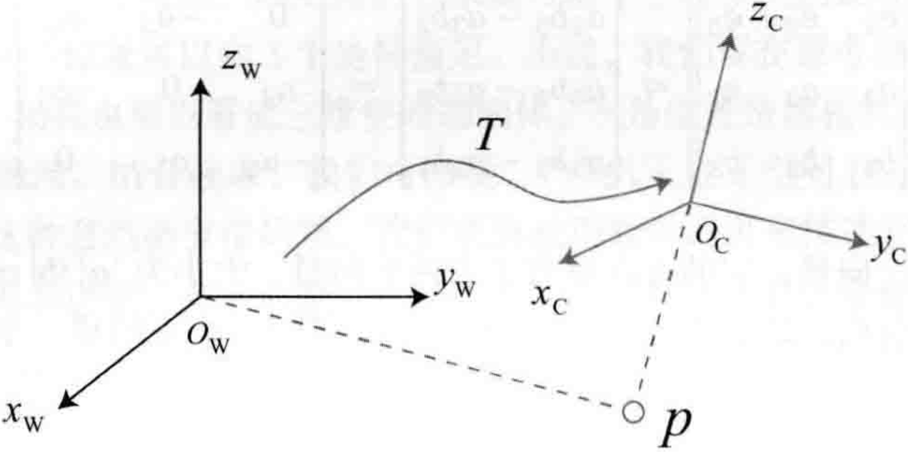

# 三维空间刚体运动

<B>主要目标</B>

> 1. 理解三维空间的刚体运动描述方式：旋转矩阵、变换矩阵、四元数和欧拉角。
> 2. 掌握Eigen库的矩阵、几何模块的使用方法。

本节介绍视觉SLAM的基本问题之一：<B>如何描述刚体在三维空间中的运动</B>

直观上，我们知道这由一次旋转加一次平移组成。

平移没有太大问题，但旋转的处理是一件很麻烦的事，我们将介绍旋转矩阵、四元数、欧拉角的意义，以及它们是如何运算和转换的。

# 3.1 旋转矩阵

## 3.1.1 点、向量和坐标系

刚体在三维空间中不光有位置，还有自身的姿态。位置是指刚体在空间中的哪个地方，而姿态则是指刚体的朝向。在数学中，使用点和向量来描述。

任意向量在空间的一组基($e_1,e_2,e_3$)下的坐标：

$$
a = [e_1, e_2, e_3]\left[
\begin{matrix}
a_1 \\
a_2 \\
a_3
\end{matrix}
\right] = a_1e_1+a_2e_2+a_3e_3
$$

这里$(a_1,a_2,a_3)^T$称为$a$在此基下的坐标。坐标的具体取值，一是和向量本身有关，二是和坐标系(基)的选取有关。坐标系通常由3个正交的坐标轴组成。

外积：

$$
a \cdot b = \begin{Vmatrix} 
e_1 & e_2 & e_3 \\
a_1 & a_2 & a_3 \\
b_1 & b_2 & b_3
\end{Vmatrix} = 
\begin{bmatrix}
a_2 b_3 - a_3 b_2 \\
a_3 b_1 - a_1 b_3 \\
a_1 b_2 - a_2 b_1
\end{bmatrix} = 
\begin{bmatrix}
0 & -a_3 & a_2 \\
a_3 & 0 & -a_1 \\
-a_2 & a_1 & 0
\end{bmatrix}b \overset{def}{=} a ^\wedge b.
$$

外积的结果是一个向量，它的方向垂直于这两个向量，大小为$\lvert a \rvert \lvert b \rvert sin\lang a,b \rang $，是两个向量张成的四边形的有向面积。

对于外积运算，我们引入$^\wedge$符号，把$a$写成一个矩阵。事实上是一个<B>反对称矩阵</B>(Skew-symmetric Matrix)，可以将$^\wedge$记成一个反对称符号。这样就把外积$a\times b$写成了矩阵向量的乘法$a^\wedge b$，把它变成了线性运算。

此符号是一个一一映射，意味着任意向量都对应着唯一的一个反对称矩阵，反之亦然：

$$
a^\wedge=\begin{bmatrix}
0 & -a_3 & a_2 \\
a_3 & 0 & -a_1 \\
-a_2 & a_1 & 0
\end{bmatrix}
$$

## 3.1.2 坐标系间的欧式变换

如下图所示，$x_W,y_W,z_W$定义的坐标系是一个世界坐标系，机器人是一个移动坐标系$x_C,y_C,z_C$定义的坐标系。

    

相机视野中某个向量$p$，它在相机坐标系下的坐标为$p_c$，而从世界坐标系下看，它的坐标为$p_w$，那么，这两个坐标系之间是如何转换的？

这时，就需要先得到该点针对机器人坐标系的坐标值，再根据机器人位姿变换到世界坐标系中。

两个坐标系之间的运动由一个旋转加上一个平移组成，这种运动称为<B>刚体运动</B>，我们说手机坐标系到世界坐标系之间，相差了一个<B>欧式变换</B>(Euclidean Transform)。

欧式变换由旋转和平移组成，首先考虑旋转，假设某个单位正交基$(e_1,e_2,e_3)$经过一次旋转变成了$(e_1^{'},e_2^{'},e_3^{'})$，那么，对于同一个向量$a$它在两个坐标系下的坐标为$[a_1,a_2,a_3]^T$和$[a_1',a_2',a_3']^T$。因为向量本身没变，所以根据坐标的定义有：

$$
[e_1,e_2,e_3]\begin{bmatrix} a_1 \\ a_2 \\ a_3 \end{bmatrix} = [e'_1,e'_2,e'_3]\begin{bmatrix} a'_1 \\ a'_2 \\ a'_3 \end{bmatrix}
$$

为了描述两个坐标系之间的关系，我们对上述等式的左右两边同时左乘$\begin{bmatrix} a^T_1 \\ a^T_2 \\ a^T_3 \end{bmatrix}$，那么左边的系数就变成了单位矩阵，所以：

$$
\begin{bmatrix} a_1 \\ a_2 \\ a_3 \end{bmatrix} = 
\begin{bmatrix}
e^T_1e'_1 & e^T_1e'_2 & e^T_1e'_3 \\
e^T_2e'_1 & e^T_2e'_2 & e^T_2e'_3 \\
e^T_3e'_1 & e^T_3e'_2 & e^T_3e'_3
\end{bmatrix}
\begin{bmatrix} a'_1 \\ a'_2 \\ a'_3 \end{bmatrix} \overset{def}{=}Ra'.
$$

把中间的矩阵拿出来，定义成一个矩阵$R$，这个矩阵由两组基之间的内积组成，刻画了旋转前后同一个向量的坐标变换关系。只要旋转是一样的，这个矩阵就是一样的。可以说，矩阵$R$描述了旋转本身。因此，称为<B>旋转矩阵</B>(Rotation Matrix)。同时，该矩阵各分量是两个坐标系基的内积，由于基向量的长度为1，所以实际上是各基向量的余弦值。所以这个矩阵也叫<B>方向余弦矩阵</B>(Direction Cosine Matrix)。

旋转矩阵有一些性质：它是一个行列式为1的正交矩阵。反之，行列式为1的正交矩阵也是一个旋转矩阵。所以，可以将n维旋转矩阵的集合定义如下：

$$
SO(n)=\{R\in \Re^{n\times n} | RR^T=I,det(R)=1\}.
$$
