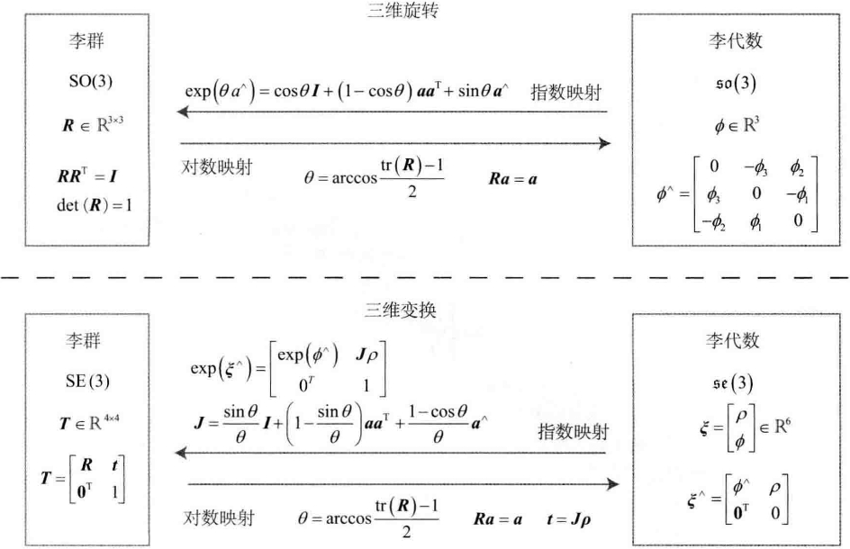

# 李群与李代数

<B>主要目标</B>

> 1. 理解李群与李代数的概念，掌握SO(3)、SE(3)与对应李代数的表示方式。
> 2. 理解BCH近似的意义。
> 3. 学会在李代数上的扰动模型。
> 4. 使用Sophus对李代数进行运算。

第3讲介绍了旋转的表示，但在SLAM中，除了表示，还需要对它们进行估计和优化。在SLAM中，位姿是未知的，SLAM需要解决形如“<B>什么样的相机位姿最符合当前观测数据</B>”这样的问题。一种典型的方式是把它构建成一个优化问题，求解最优的$R,t$，使得误差最小化。

旋转矩阵自身是带有约束的(正交且行列式为1).它们作为优化变量，会引入额外的约束，使优化变得困难。通过李群--李代数间的转换关系，我们希望把位姿估计变成无约束的优化问题，简化求解方式。

# 4.1 李群与李代数基础

三维旋转矩阵构成了<B>特殊正交群SO(3)</B>，而变换矩阵构成了<B>特殊欧氏群SE(3)</B>。

$$
SO(3)=\{R\in \mathbb{R}^3 | RR^T=I, det(R) = 1 \}, \tag{4.1}
$$

$$
SE(3)=\left\{ T=\begin{bmatrix} R & t \\ 0^T & 1 \end{bmatrix} \in \mathbb{R}^{ 4\times 4} |R \in SO(3), t\in \mathbb{R}^3 \right\}. \tag{4.2}
$$

旋转矩阵和变换矩阵<B>对加法是不封闭的</B>，对于任意两个旋转矩阵$R_1,R_2$，按照矩阵加法的定义，和不再是一个旋转矩阵：

$$
R_1 + R_2 \notin SO(3), \quad T_1 + T_2 \notin SE(3). \tag{4.3}
$$

$SO(3)$和$SE(3)$关于乘法是封闭的：
$$
R_1 R_2 \in SO(3), \quad T_1 T_2 \in SES(3). \tag{4.4}
$$

也可以对任何一个旋转或变换矩阵求逆，乘法对应着旋转或变换的符合，两个旋转矩阵相乘表示做了两次旋转。

> 对于这汇总只有一个(良好的，封闭的)运算的集合，我们称之为<B>群</B>。

## 4.1.1 群

群(Group)是<B>一种集合</B>加上<B>一种运算</B>的代数结构，把集合记作$A$，运算记作$\ \cdot$，那么群可以记作$G=(A,\cdot)$。群要求这个运算满足以下几个条件：

1. 封闭性：$\forall a_1,a_2 \in A, a_1 \cdot a_2 \in A$.
2. 结合律：$\forall a_1, a_2, a_3 \in A, (a_1 \cdot a_2) \cdot a_3 = a_1 \cdot (a_2 \cdot a_3)$.
3. 幺元：$\exists a_0 \in A, \quad s.t. \quad \forall a \in A, a_0 \cdot a = a \cdot a_0 = a$.
4. 逆：$\forall a \in A, \exists a^{-1} \in A, \quad s.t. \quad a\cdot a^{-1} = a_0$.

> 可以验证，旋转矩阵集合和矩阵乘法构成群，同样，变换矩阵和矩阵乘法也构成群。

矩阵中常见的群有：

- 一般线性群GL(n) 指$n \times n$ 的可逆矩阵，它们对矩阵乘法成群。
- 特殊正交群SO(n) 也就是所谓的旋转矩阵群，其中SO(2)和SO(3)最为常见。
- 特殊欧氏群SE(n) 也就是前面提到的$n$维欧氏变换，如SE(2)和SE(3)。

> <b>李群</b>是指具有连续(光滑)性质的群，与之相反，像整数群$\mathbb{Z}$那样离散的群没有连续性质，所以不是李群。SO(n)和SE(n)在实数空间上是连续的，所以它们是李群。

## 4.1.2 李代数的引出

考虑任意旋转矩阵$R$，它满足：
$$
RR^T=I. \tag{4.5}
$$

> $R$是某个相机的旋转，它会随着时间连续地变化，即为时间的函数：$R(t)$。由于它仍是旋转矩阵，有

$$
R(t)R(t)^T = I.
$$

> 等式两边对时间求导，得到：
$$
\dot{R}(t)R(t)^T + R(t)\dot{R}(t)^T = 0.
$$

> 整理得：
$$
\dot{R}(t)R(t)^T = -\left ( \dot{R}(t)R(t)^T \right ) ^T. \tag{4.6}
$$

> 可以看出，$\dot{R}(t)R(t)^T$是一个<B>反对称</B>矩阵，在第三节引入$^\wedge$符号时，将一个向量变成了反对称矩阵。同理，对于任意反对称矩阵，我们也能找到唯一与之对应的向量。

把这个运算用符号$^\vee$表示：

$$
a^{\wedge}=A=\begin{bmatrix} 0 & -a_3 & a_2 \\ a_3 & 0 & -a_1 \\ -a_2 & a_1 & 0 \end{bmatrix}, \quad A^{\vee}=a. \tag{4.7}
$$

于是，由于$\dot{R}(t)R(t)^T$是一个反对称矩阵，可以找到一个三维向量$\phi(t) \in \mathbb{R}^3$与之对应：

$$
\dot{R}(t)R(t)^T=\phi(t)^{\wedge}.
$$

等式两边右乘$R(t)$，由于$R$为正交矩阵，有：

$$
\dot{R}(t)=\phi(t)^{\wedge}R(t)=\begin{bmatrix} 0 & -\phi_3 & \phi _2 \\ \phi_3 & 0 & -\phi_1 \\ -\phi_2 & \phi_1 & 0\end{bmatrix} R(t). \tag{4.8}
$$

<B>可以看到，每对旋转矩阵求一次导数，只需要左乘一个$\phi^{\wedge}$(t)即可</B>。

考虑$t_0=0$时，设此时旋转矩阵为$R(0)=I$。按照导数，可以把$R(t)$在$t=0$附近进行一阶泰勒展开：

$$
\begin{aligned}
R(t) &\approx R(t_0) + \dot{R}(t_0)(t-t_0) \\
&=I + \phi(t_0)^{\wedge}(t).
\end{aligned} \tag{4.9}
$$
> <B>$\phi$反映了$R$的导数性质</B>，故称它在$SO(3)$原点附近的正切空间(Tangent Space)上。同时在$t_0$附近，设$\phi$保持为常数$\phi(t_0)=\phi_0$，那么根据式(4.8)，有：

$$
\dot{R}(t)=\phi(t_0)^{\wedge}R(t)=\phi_0^{\wedge}R(t).
$$

上式是一个关于$R$的微分方程，而且有初始值$R(0)=I$，解得：

$$
R(t)=\exp(\phi_0^{\wedge}t). \tag{4.10}
$$

> 上式对微分方程和初始值均成立，这说明在$t=0$附近，旋转矩阵可以由$\exp({\phi_0^{\wedge}}t)$计算出来。
>
> 可以看到，旋转矩阵$R$与另一个反对称矩阵$\phi_0^{\wedge}t$通过指数关系发生了联系。

在这里，有两个问题需要澄清：

1. 给定某时刻的$R$，就能求得一个$\phi$，它描述了$R$在局部的导数关系。与$R$对应的$\phi$有什么含义呢？<B>$\phi$正是对应到$SO(3)$上的李代数$\mathfrak{so}(3)$</B>;
2. 给定某个向量$\phi$，矩阵指数$\exp{(\phi^{\wedge})}$如何计算？反之，给定$R$时，能否有相反的运算来计算$\phi$？事实上，这正是李群与李代数间的指数/对数映射。

## 4.1.3 李代数的定义

每个李群都有与之对应的李代数，李代数描述了李群的局部性质，准确地说，是单位元附近的正切空间。一般的李代数的定义如下：

李代数由一个集合$\mathbb{V}$、一个数域$\mathbb{F}$和一个二元运算$[,]$组成。如果它们满足以下几条性质，则称$(\mathbb{V}, \mathbb{F}, [,])$为一个李代数，记作$\mathfrak{g}$。

1. 封闭性 $\quad \forall X,Y \in \mathbb{V}, [X,Y]\in \mathbb{V}$.
2. 双线性 $\quad \forall X,Y,Z \in \mathbb{V}, \ a,b \in \mathbb{F}$，有
$$
[aX + bY, Z]=a[X,Z]+b[Y,Z], \quad [Z,aX+bY]=a[Z,X]+b[Z,Y].
$$
3. 自反性 $\quad \forall X \in \mathbb{V}, [X,X]=0$.
4. 雅可比等价 $\quad \forall X,Y,Z \in \mathbb{V}, [X,[Y,Z]] + [Z,[X,Y]] + [Y,[Z,X]] = 0$.

其中二元运算被称为<B>李括号</B>，从表面上，李代数所需要的性质还是挺多的，相比于群中的较为简单的二元运算，李括号表达了两个元素的差异。它不要求结合律，而要求元素和自己做李括号之后为零的性质。

作为例子，三维向量$\mathbb{R}^3$上定义的叉积$\times$是一种李括号，因此$\mathfrak{g}=(\mathbb{R}^3, \mathbb{R}, \times)$构成了一个李代数。

## 4.1.4 李代数$\mathfrak{so}(3)$

之前提到的$\phi$，事实上是一种李代数，$SO(3)$对应的李代数是定义在$\mathbb{R}^3$上的向量，我们记作$\phi$，根据前面的推导，每个$\phi$都可以生成一个反对称矩阵：

$$
\Phi=\phi^{\wedge}=\begin{bmatrix} 0 & -\phi_3 & \phi_2 \\ \phi_3 & 0 & -\phi_1 \\ -\phi_2 & \phi_1 & 0 \end{bmatrix} \in \mathbb{R}^{3 \times 3}. \tag{4.11}
$$

两个向量$\phi_1, \phi_2$的李括号为

$$
[\phi_1, \phi_2]=(\Phi_1 \Phi_2 - \Phi_2 \Phi_1)^{\vee}. \tag{4.12}
$$

由于向量$\phi$与反对称矩阵是一一对应的，在不引起歧义的情况下，就说$\mathfrak{so}(3)$的元素是三维向量或者三维反对称矩阵，不加区别：

$$
\mathfrak{so}(3) = \left\{ \phi \in \mathbb{R}^3, \Phi = \phi^{\wedge} \in \mathbb{R}^{3 \times 3} \right\}. \tag{4.13}
$$

总结：$\mathfrak{so}(3)$是一个由<B>三维向量</B>组成的集合，每个向量对应一个反对称矩阵，可以用于表达旋转矩阵的导数。它与SO(3)的关系由指数映射给定：

$$
R=exp(\phi^{\wedge}). \tag{4.14}
$$

## 4.1.5 李代数$\mathfrak{se}(3)$

对于SE(3)，它也有对应的李代数$\mathfrak{se}(3)$，与$\mathfrak{so}(3)$相似，$\mathfrak{se}(3)$位于$\mathbb{R}^6$空间中：

$$
\mathfrak{se}(3) = \left\{ \xi= \begin{bmatrix} \rho \\ \phi \end{bmatrix} \in \mathbb{R}^6, \rho\in\mathbb{R}^3, \phi\in\mathfrak{so}(3), \xi^{\wedge} = \begin{bmatrix} \phi^{\wedge} & \rho \\ 0^T & 0 \end{bmatrix} \in \mathbb{R}^{4 \times 4} \right\}. \tag{4.15}
$$

把每个$\mathfrak{se}(3)$元素记作$\xi$，它是一个六维向量。前三维为平移，记作$\rho$；后三维为旋转，记作$\phi$，实质上是$\mathfrak{so}(3)$元素。

在$\mathfrak{se}(3)$中，同样使用$^\wedge$符号，将一个六维向量转换成四维矩阵，但这里不再表示反对称：

$$
\xi^{\wedge} = \begin{bmatrix} \phi^{\wedge} & \rho \\ 0^T & 0 \end{bmatrix} \in \mathbb{R}^{4 \times 4}. \tag{4.16}
$$

> 仍然使用$^\wedge$和$^\vee$符号指代“从向量到矩阵”和“从矩阵到向量”的关系，以保持和$\mathfrak{so}(3)$上的一致性，它们依旧是一一对应的。

可以简单地把$\mathfrak{se}(3)$理解成“由一个平移加上一个$\mathfrak{so}(3)$”元素构成的向量。同样地，李代数$\mathfrak{se}(3)$也有类似于$\mathfrak{so}(3)$的李括号：

$$
[\xi_1,\xi_2]=(\xi_1^{\wedge}\xi_2^{\wedge}-\xi_2^{\wedge}\xi_1^{\wedge})^{\vee}. \tag{4.17}
$$

# 4.2 指数于对数映射

## 4.2.1 SO(3)上的指数映射

如何计算$\exp(\phi^{\wedge})$，它是一个矩阵的指数，在李群和李代数中，称为指数映射(Exponential Map)。

任意矩阵的指数映射可以写成一个泰勒展开，但是只有在收敛的情况下才会有结果，其结果仍然是一个矩阵：

$$
\exp(A) = \sum_{n=0}^{\infty}\frac{1}{n!}A^n. \tag{4.18}
$$

同样地，对于$\mathfrak{so}(3)$中的任意元素$\phi$，可以按此方式定义它的指数映射：

$$
\exp(\phi^{\wedge}) = \sum_{n=0}^{\infty}\frac{1}{n!}(\phi^{\wedge})^n. \tag{4.19}
$$

这个定义无法直接计算，因为不想计算矩阵的无穷次幂。

由于$\phi$是三维向量，可以定义它的模长和方向，分别记作$\theta$和$a$，于是有$\phi = \theta a$，这里$a$是一个长度为1的方向向量，即$\lVert a \rVert = 1$，对于$a^{\wedge}$，有以下两条性质：

$$
a ^{\wedge } a ^{\wedge } =\begin{bmatrix} -a_{2}^{2} -a_{3}^{2} & a_{1} a_{2} & a_{1} a_{3}\\ a_{1} a_{2} & -a_{1}^{2} -a_{3}^{2} & a_{2} a_{3}\\ a_{1} a_{3} & a_{2} a_{3} & -a_{1}^{2} -a_{2}^{2}\end{bmatrix} = aa^{T} - I, \tag{4.20}
$$

以及

$$
a^{\wedge} a^{\wedge} a^{\wedge} = a^{\wedge} (aa^T - I) = -a^{\wedge}. \tag{4.21}
$$

> 上面两个式子提供了处理$a^{\wedge}$高阶项的方法，可以把指数映射写成

$$
\begin{aligned}
\exp(\phi^{\wedge}) &= \exp(\theta a^{\wedge})=\sum_{n=0}^{\infty}\frac{1}{n!}(\theta a^{\wedge})^n \\
&=I + \theta a^{\wedge} + \frac{1}{2!}\theta^{2}a^{\wedge} a^{\wedge} + \frac{1}{3!} \theta^{3} a^{\wedge} a^{\wedge} a^{\wedge}  + \frac{1}{4!} \theta^{4}(a^{\wedge})^4 + \cdots \\
&= aa^T - a^{\wedge} a^{\wedge} + \theta a^{\wedge} + \frac{1}{2!}\theta^{2}a^{\wedge} a^{\wedge} - \frac{1}{3!} \theta^{3} a^{\wedge} - \frac{1}{4!} \theta^{4}(a^{\wedge})^2 + \cdots \\
&=aa^T + \underbrace{\left ( \theta - \frac{1}{3!} \theta^3 + \frac{1}{5!}\theta^5-\cdots \right )a^{\wedge}}_{sin\theta} - \underbrace{\left ( \theta - \frac{1}{2!} \theta^2 + \frac{1}{4!}\theta^4-\cdots \right )a^{\wedge} a^{\wedge}}_{cos\theta} \\
&= a^{\wedge} a^{\wedge} + I + sin \theta a^{\wedge} - cos\theta a^{\wedge} a^{\wedge} 、、
&= (1-cos\theta)a^{\wedge} a^{\wedge} + I + sin\theta a^{\wedge} \\
&= cos\theta I + (1-cos\theta)aa^T + sin\theta a^{\wedge}.
\end{aligned}
$$

> 最后，得到一个似曾相识的式子：

$$
\exp{\theta a^{\wedge}} = cos\theta I + (1-cos\theta)aa^T + sin\theta a^{\wedge}. \tag{4.22}
$$

> 上面公式和罗德里格斯公式(式3.15)如出一辙，表明，$\mathfrak{so}(3)$实际上就是由所谓的<B>旋转向量</B>组成的空间，而指数映射即罗德里格斯公式。
> 
> 通过它们，把$\mathfrak{so}(3)$中任意一个向量对应到了一个位于SO(3)中的旋转矩阵。反之，如果定义对数映射，也能把SO(3)中的元素对应到$\mathfrak{so}(3)$中：

$$
\phi = ln(R)^{\wedge} = \left( \sum_{n=1}^{\infty}\frac{(-1)^n}{n+1}(R-I)^{n+1} \right)^{\vee}. \tag{4.23}
$$

> 指数映射只是一个满射，并不是单射，意味着每个SO(3)中的元素，都可以找到一个$\mathfrak{so}(3)$元素与之对应；但是可能存在多个$\mathfrak{so}(3)$中的元素，对应到同一个SO(3)。至少对于旋转角$\theta$，我们知道多转360°和没有转是一样的--它具有周期性。
>
> 如果把旋转角度固定在$\pm\pi$之间，那么李群和李代数元素是一一对应大的。

## 4.2.2 SE(3)上的指数映射

> $\mathfrak{se}(3)$上的指数映射形式如下：

$$
\begin{aligned}
\exp(\xi^{\wedge}) &= \begin{bmatrix}
\sum_{n=1}^{\infty}\frac{1}{n!}(\phi^{\wedge})^n & \sum_{n=0}^{\infty}\frac{1}{(n+1)!}(\phi^{\wedge})^n\rho \\
0^T & 1
\end{bmatrix} \\ 
&\overset{\Delta}{=} \begin{bmatrix} R & J\rho \\ 
0^T & 1 \end{bmatrix} = T. \tag{4.25}
\end{aligned}
$$

把$\exp$进行泰勒展开推导此式，令$\phi=\theta a$，其中$a$为单位向量，则：

$$
\begin{aligned}
\sum_{n=0}^{\infty}\frac{1}{(n+1)!}(\phi^{\wedge})^n &=
I + \frac{1}{2!}\theta a^{\wedge} + \frac{1}{3!}\theta^{2}(a^{\wedge})^2 + \frac{1}{4!}\theta^{3}(a^{\wedge})^3 + \frac{1}{5!}\theta^{4}(a^{\wedge})^4 + \cdots \\
&= \frac{1}{\theta}\left( \frac{1}{2!}\theta^2 - \frac{1}{4!}\theta^{4} +  \cdots \right)(a^{\wedge}) + \frac{1}{\theta}\left( \frac{1}{3!}\theta^3 - \frac{1}{5!}\theta^{5} + \cdots \right)(a^{\wedge})^2 + I \\
&=\frac{1}{\theta}(1-cos\theta)(a^{\wedge}) + \frac{\theta - sin\theta}{\theta}\left(aa^T - I\right) + I \\
&=\frac{sin\theta}{\theta}I + \left( 1 - \frac{sin\theta}{\theta} \right)aa^T + \frac{1- cos\theta}{\theta} a^{\wedge} \underset{def}{=}J.
\end{aligned} \tag{4.26}
$$

从结果上看，$\xi$的指数映射左上角的$R$是我们熟知的SO(3)中的元素，与$\mathfrak{se}(3)$中的旋转部分$\phi$对应，而右上角的$J$由上面的推导给出：

$$
J = \frac{sin\theta}{\theta}I + \left( 1 - \frac{sin\theta}{\theta} \right)aa^T + \frac{1-cos\theta}{\theta}a^{\wedge}. \tag{4.27}
$$

> 该式与罗德里格斯公式有些相似，但不完全一样，平移部分经过指数映射之后，发生了一次以$J$
为系数矩阵的线性变换。

> 同样地，虽然可以类比推得对数映射，不过根据变换矩阵$T$求$\mathfrak{so}(3)$上的对应向量也有更省事的方式：从左上角的$R$计算旋转向量，而右上角的$t$满足：

$$
t = J\rho. \tag{4.28}
$$

由于$J$可以由$\phi$得到，所以这里的$\rho$也可由此线性方程解得。

至此，李群与李代数的定义与相互的转换关系，总结下图所示：

    

# 4.3 李代数求导与扰动模型

## 4.3.1 BCH公式与近似形式

使用李代数的一大动机是进行优化，而在优化过程中导数是非常必要的信息。

> 思考：当在SO(3)中完成两个矩阵乘法时，李代数中$\mathfrak{so}(3)$上发生了什么改变呢？反过来说，当$\mathfrak{so}(3)$上做两个李代数的加法时，SO(3)上是否对应着两个矩阵的乘积？如果成立，相当于：

$$
\exp(\phi_1^{\wedge})\exp(\phi_2^{\wedge})=\exp((\phi_1 + \phi_2)^{\wedge})?
$$

如果$\phi_1,\phi_2$为标量，那么显然该式成立；但此处我们计算的是矩阵的指数函数，而非标量的指数，换言之，我们需要研究下式是否成立：

$$
\ln(\exp(A)\exp(B)) = A + B ?
$$
> 很遗憾，该式在矩阵时并不成立。

> 两个李代数指数映射乘积的完整形式，由Backer-Campbell-Hausdorff公式(BCH公式)给出。由于其完整形式比较复杂，我们只给出其展开式的前几项：

$$
\ln(\exp(A)\exp(B)) = A + B + \frac{1}{2}[A,B] + \frac{1}{12}[A,[A,B]]-\frac{1}{12}[B,[A,B]] + \cdots \tag{4.29}
$$

> 其中[ ]为李括号，BCH公式告诉我们，当处理两个矩阵指数之积时，它们会产生一些由李括号组成的余项。BCH公式告诉我们，当处理两个矩阵指数之积时，它们会产生一些由李括号组成的余项，特别地，考虑SO(3)上的李代数$\ln(\exp(\phi_1^{\wedge})\exp(\phi_2^{\wedge}))^{\vee}$，当$\phi_1$或$\phi_2$为小量时，小量二次以上的项都可以被忽略，此时，BCH拥有线性近似表达：

$$
\ln(\exp(\phi_1^{\wedge})\exp(\phi_2^{\wedge}))^{\vee} \approx \left \{ \begin{matrix} &J_l(\phi_2)^{-1}\phi_1 + \phi_2 \quad 当\phi_1为小量时, \\
&J_r(\phi_1)^{-1}\phi_2 + \phi_1 \quad 当\phi_2为小量时. \end{matrix}
\right. 
$$

以第一个近似为例，该式告诉我们，当对一个旋转矩阵$R_2$(李代数为$\phi_2$)左乘一个微小旋转矩阵$\R_1$(李代数为$\phi_1$)时，可以近似地看作，在原有的李代数$\phi_2$上加上一项$J_l(\phi_2)^{-1}\phi_1$。同理，第二个近似描述了右乘一个微笑位移的情况。

> 李代数在BCH近似下，分成了左乘近似和右乘近似两种，在使用时我们必须注意使用的时左乘模型还是右乘模型。

本书以左乘为例，左乘BCH近似雅可比$J_l$事实上就是式(4.27)的内容：

$$
J_l=J=\frac{sin\theta}{\theta}I + \left( 1-\frac{sin\theta}{\theta} \right)aa^T + \frac{q-cos\theta}{\theta}a^{\wedge}. \tag{4.31}
$$

它的逆为：

$$
J_l^{-1}=\frac{\theta}{2}\cot\frac{\theta}{2}I + \left( 1-\frac{\theta}{2}cot\frac{\theta}{2} \right)aa^T - \frac{\theta}{2}a^{\wedge}. \tag{4.32}
$$

而右乘雅可比仅需要对自变量取负号即可：

$$
J_r(\phi) = J_l(-\phi). \tag{4.33}
$$

> 有了上述关系，我们就可以讨论李群乘法与李代数加法的关系。
> 重新叙述BCH近似的意义，假定对某个旋转$R$，对应的李代数为$\phi$，给它左乘一个微小旋转，记作$\Delta\phi$，那么，在李群上，得到的结果就是$\Delta R\cdot R$，而在李代数上，根据BCH近似，为$J_l^{-1}(\phi)\Delta\phi + \phi$。合并起来，可以简单地写成：

$$
\exp(\Delta\phi^{\wedge})\exp(\phi^{\wedge})=\exp\left( (\phi + J_l^{-1}(\phi)\Delta\phi)^{\wedge} \right). \tag{4.34}
$$

> 反之，如果我们在李代数上进行加法，让一个$\phi$加上$\Delta\phi$，那么可以近似为李群上带左右雅可比的次乘法：

$$
\exp\left((\phi + \Delta\phi)^{\wedge}\right)=\exp\left((J_l\Delta\phi)^{\wedge}\right)\exp(\phi^{\wedge}) = \exp(\phi^{\wedge})\exp\left((J_r\Delta\phi)^{\wedge}\right). \tag{4.35}
$$

> 这就为之后李代数上做微积分提供了理论基础，同样地，对于SE(3)，也有类似的BCH近似：

$$
\exp(\Delta\xi^{\wedge})\exp(\xi^{\wedge}) \approx \exp\left((\mathcal{J}_l^{-1}\Delta\xi + \xi)^{\wedge}\right), \tag{4.36}
$$

$$
\exp(\xi^{\wedge})\exp(\Delta\xi^{\wedge}) \approx \exp\left((\mathcal{J}_r^{-1}\Delta\xi + \xi)^{\wedge}\right). \tag{4.37}
$$

> 这里$\mathcal{J}_l$形式比较复杂，它是一个$6 \times 6$的矩阵。

## 4.3.2 SO(3)上的李代数求导

在SLAM中，我们要估计一个相机的位置和姿态，该位姿是由SO(3)上的旋转矩阵或SE(3)上的变换矩阵描述的。不妨设某个时刻小萝卜的位姿为$T$，它观察到了一个世界坐标位于$p$的点，产生了一个观测数据$z$，那么，由坐标变换关系知：

$$
z = Tp + w. \tag{4.38}
$$

其中$w$为随机噪声，由于它的存在，$z$往往不可能精确地满足$z=Tp$的关系，所以，我们通常会计算理想的观测与实际数据的误差：

$$
e = z - Tp. \tag{4.39}
$$

假设一共有$N$个这样的路标点和观测，于是就有$N$个上式，那么对小萝卜进行位姿估计，相当于寻找一个最优的$T$，使得整体误差最小化：

$$
\underset{T}{min}J(T)=\sum_{i=1}^{N}\lVert z_i - Tp_i \rVert_{2}^{2}. \tag{4.40}
$$

> 求解此问题，需要计算目标函数$J$关于变换矩阵$T$的导数。<B>我们经常会构建与位姿有关的函数，然后讨论该函数关于位姿的导数，以调整当前的估计值</B>。然而，SO(3)，SE(3)上并没有良好定义的加法，它们只是群。如果我们把$T$当成一个普通矩阵来处理优化，就必须对它加以约束。而从李代数角度来说，由于李代数由向量组成，具有良好的加法运算，因此，使用李代数解决求导问题的思路分为两种：

1. 用李代数表示姿态，然后根据李代数加法对<B>李代数求导</B>。
2. 对李群左乘或右乘微小扰动，然后对该扰动求导，称为左扰动和右扰动模型。

> 第一种方式对应到李代数的求导模型，而第二种方式则对应到扰动模型。

## 4.3.3 李代数求导

假设我们对一个空间点$p$进行了旋转，得到了$Rp$，现在，要计算旋转之后点的坐标相对于旋转的导数，我们非正式地几位：

$$
\frac{\partial(Rp)}{\partial R}.
$$

由于SO(3)没有加法，所以该导数无法按照导数的定义进行计算，设$R$对应的李代数为$\phi$，我们转而计算：

$$
\frac{\partial(\exp(\phi^{\wedge})p)}{\partial\phi}.
$$

按照导数的定义，有：

$$
\begin{aligned}
\frac{\partial(\exp(\phi^{\wedge})p)}{\partial\phi} &= \lim_{\delta\phi \to 0}\frac{\exp\left((\phi + \delta\phi)^{\wedge}\right)p - \exp(\phi^{\wedge})p}{\delta \phi} \\
&= \lim_{\delta\phi \to 0} \frac{\exp\left((J_l\delta\phi)^{\wedge}\right)\exp(\phi^{\wedge})p - \exp(\phi^{\wedge})p}{\delta \phi} \\
&= \lim_{\delta\phi \to 0} \frac{\left(I + (J_l\delta\phi)^{\wedge}\right)\exp(\phi^{\wedge})p - \exp(\phi^{\wedge})p}{\delta \phi} \\
&= \lim_{\delta\phi \to 0} \frac{(J_l\delta\phi)^{\wedge}\exp(\phi^{\wedge})p}{\delta \phi} \\
&= \lim_{\delta\phi \to 0} \frac{-\left(\exp(\phi^{\wedge})p\right)^{\wedge}J_l\delta\phi}{\delta \phi} = -(Rp)^{\wedge}J_l. \\
\end{aligned}
$$

> 第2行的近似为BCH线性近似，第3行为泰勒展开舍去高阶项后的近似，第4行至第5行将反对称符号看作叉积，变换之后变号。于是，我们推导出了旋转后的点相对于李代数的导数：

$$
\frac{\partial(Rp)}{\partial \phi} = (-Rp)^{\wedge}J_l. \tag{4.41}
$$

## 4.3.4 扰动模型(左乘)

另一种求导方式是对$R$进行一次扰动$\Delta R$，看结果相对于扰动的变化率。这个扰动可以乘在左边也可以乘在右边，最后结果会有一点儿微小的差异，我们以左扰动为例。设左扰动$\Delta R$对应的李代数为$\varphi$，然后，对$\varphi$求导，即：

$$
\frac{\partial(Rp)}{\partial \varphi} = \lim_{\varphi \to 0}\frac{\exp(\varphi^{\wedge})\exp(\phi^{\wedge})p-\exp(\phi^{\wedge})p}{\varphi}. \tag{4.42}
$$

> 该式的求导比上面更简单：

$$
\begin{aligned}
\frac{\partial(Rp)}{\partial\varphi} &= \lim_{\varphi \to 0}\frac{\exp(\varphi^{\wedge})\exp(\phi^{\wedge})p-\exp(\phi^{\wedge})p}{\varphi} \\
&= \lim_{\varphi \to 0}\frac{(I+\varphi^{\wedge})\exp(\phi^{\wedge})p-\exp(\phi^{\wedge})p}{\varphi} \\
&= \lim_{\varphi \to 0}\frac{\varphi^{\wedge}Rp}{\varphi} = \lim_{\varphi \to 0}\frac{-(Rp)^{\wedge}\varphi}{\varphi} = -(Rp)^{\wedge}.
\end{aligned}
$$

> 相比于直接对李代数求导，省去了一个雅可比$J_l$的计算，这使得扰动模型更为实用。

## 4.3.5 SE(3)上的李代数求导

