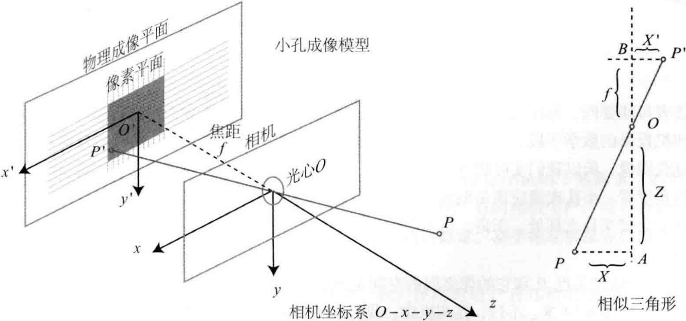
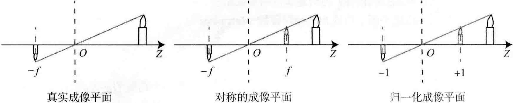
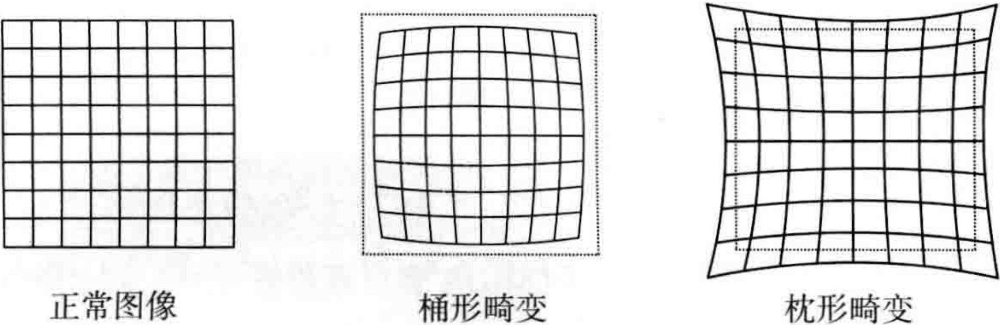
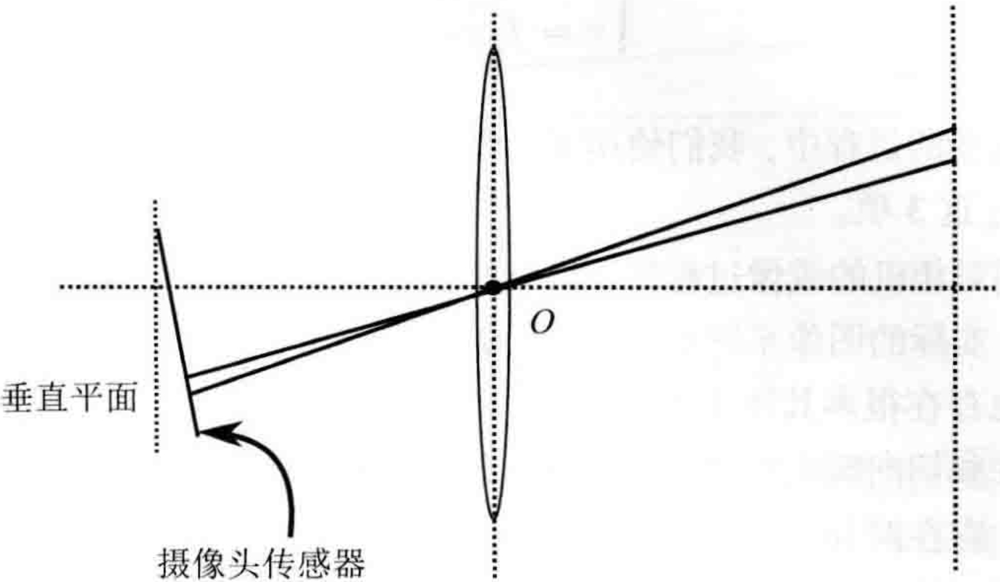
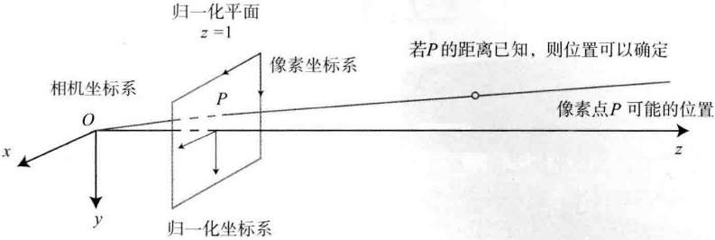
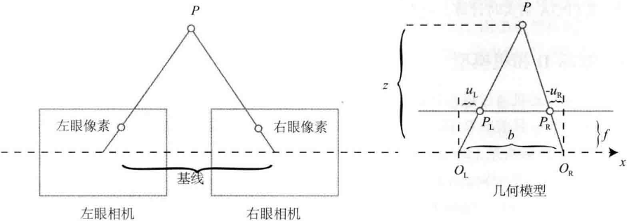

# 相机与图像

<B>主要目标</B>

> 1. 理解针孔相机的模型、内参与径向畸变参数。
> 2. 理解一个空间点是如何投影到相机成像平面的。
> 3. 掌握OpenCV的图像存储与表达方式。
> 4. 学会基本的摄像头标定方法。

本节讨论“机器人如何观测外部世界”，也就是观测方程部分。在以相机为主的视觉SLAM中，观测主要是指<B>相机成像</B>的过程。

# 5.1 相机模型

相机将三维世界中的坐标点(单位为米)映射到二维图像平面(单位为像素)的过程能够用一个几何模型进行描述。这个模型有很多种，其中最简单的称为<B>针孔模型</B>。

针孔模型描述了一束光线通过针孔之后，在针孔背面投影成像的关系，由于相机镜头上的透镜的存在，使得光线投影到成像平面的过程中会产生<B>畸变</B>，因此使用针孔和畸变两个模型来描述整个投影过程。

针孔模型和透镜的畸变能够把外部的三维点投影到相机内部成像平面，构成相机的<B>内参数</B>(Intrinsics)。

## 5.1.1 针孔相机模型

    

设$O-x-y-z$为相机坐标系，$z$轴指向相机前方，$x$轴向右，$y$轴向下。$O$为摄像机的<B>光心</B>，也是针孔模型中的针孔。现实世界的空间点$P$，经过小孔$O$投影之后，落在物理成像平面$O'-x'-y'$，成像点为$P'$。设$P$的坐标为$[X,Y,Z]^T$，$P'$为$[X',Y',Z']$，并且设物理成像平面到小孔的距离为$f$（焦距），那么，根据三角形相似关系，有：

$$
\frac{Z}{f}=-\frac{X}{X'}=-\frac{Y}{Y'}. \tag{5.1}
$$

负号表示成的像是倒立的，为了让模型更符合实际，可以等价地把成像平面对称地放到相机前方，和三维空间点一起放到摄像机坐标系的同一侧，如下图所示，这样做可以把公式中的负号去掉，使式子更加简洁：

$$
\frac{Z}{f}=\frac{X}{X'}=\frac{Y}{Y'}. \tag{5.2}
$$

    

把$X',Y'$放到等式左侧，整理得：

$$
\begin{aligned}
X'=f\frac{X}{Z} \\
Y'=f\frac{Y}{Z}
\end{aligned} . \tag{5.3}
$$

上式描述了点$P$和它的像之间的空间关系，在相机中，我们最终获得的是一个个的像素，这还需要在成像平面上对像进行采样和量化。

假设在物理成像平面上固定着一个像素平面$o-u-v$，我们在像素平面得到了$P'$的<B>像素坐标</B>：$[u,v]^T$。

<B>像素坐标系</B>通常的定义：原点$o'$位于图像的左上角，$u$轴向右与$x$轴平行，$v$轴向下与$y$轴平行。像素坐标系与成像平面之间，相差了一个<B>缩放</B>和一个<B>原点的平移</B>。假设像素坐标在$u$轴上缩放了$\alpha$倍，在$v$轴上缩放了$\beta$倍。同时，原点平移了$[c_x,c_y]^T$。那么$P'$的坐标与像素坐标$[u,v]^T$的关系为

$$
\left \{ \begin{aligned} u = \alpha X' + c_x \\ v = \beta Y' + c_y \end{aligned} \right. .\tag{5.4}
$$

代入式(5.3)并把$\alpha f$合并成$f_x$，把$\beta f$合并成$f_y$，得

$$
\left \{ \begin{aligned} u = f_x\frac{X}{Z} + c_x \\ v = f_y\frac{Y}{Z} + c_y \end{aligned} \right. .\tag{5.5}
$$

> 其中，$f$的单位为米，$\alpha,\beta$的单位为像素/米，所以$f_x,f_y$和$c_x,c_y$的单位为像素。把该式写成矩阵形式会更加简洁，不过左侧需要用到齐次坐标，右侧则是非齐次坐标：

$$
\begin{pmatrix}u \\ v \\ 1 \end{pmatrix}=\frac{1}{Z} \begin{pmatrix} f_x & 0 & c_x \\ 0 & f_y & c_y \\ 0 & 0 & 1 \end{pmatrix} \begin{pmatrix} X \\ Y \\ Z \end{pmatrix} \overset{def}{=} \frac{1}{Z}KP. \tag{5.6}
$$

把$Z$挪到左侧：

$$
Z\begin{pmatrix}u \\ v \\ 1 \end{pmatrix}=\begin{pmatrix} f_x & 0 & c_x \\ 0 & f_y & c_y \\ 0 & 0 & 1 \end{pmatrix} \begin{pmatrix} X \\ Y \\ Z \end{pmatrix} \overset{def}{=} KP. \tag{5.7}
$$

把中间的量组成的矩阵称为<B>相机的内参数(Camera Intrinsics)矩阵K</B>，通常认为，相机的内参在出厂之后是固定的，不会在使用过程中发生变化。

相机的内参在出厂时会告知，而有时需要自己确定相机的内参，也即是<B>标定</B>，可以使用单目棋盘格张正友标定法。

有内参，自然也有相对的外参，在式(5.6)中，使用的是$P$在相机坐标系下的坐标，但实际上由于相机的运动，所以$P$的相机坐标应该是它的世界坐标(记为$P_w$)根据相机的当前位姿变换到相机坐标系下的结果，相机的位姿由它的旋转矩阵$R$和平移向量$t$来描述，那么有：

$$
ZP_{uv}=Z\begin{bmatrix} u \\ v \\ 1 \end{bmatrix}=K(RP_w + t) = KTP_w. \tag{5.8}
$$

上式描述了$P$的世界坐标系到像素坐标系的投影关系，其中，相机的位姿$R,t$又称为<B>相机的外参数</B>(Camera Extrinsics)，相比于不变的内参，外参会随着相机运动发生改变，也是SLAM中待估计的目标，代表着机器人的轨迹。

式(5.8)表明，我们可以把一个世界坐标点先转换到相机坐标系，再除掉它最后一维的数值(即该点距离相机成像平面的深度),这相当于把最后一维进行归一化处理，得到点$P$在相机归一化平面上的投影：

$$
(RP_w + t) = \underbrace{[X,Y,Z]^T}_{相机坐标} \to \underbrace{[X/Z,Y/Z,1]^T}_{归一化坐标}. \tag{5.9}
$$

<B>归一化坐标</B>可看成相机前方$z=1$处的平面上的一个点，这个$z=1$平面也称为<B>归一化平面</B>。归一化坐标再左乘内参就得到了像素坐标，所以可以把像素坐标$[u,v]^T$看成对归一化平面上的点进行量化测量的结果。如果对相机坐标同时乘以任意非零常数，归一化坐标都是一样的，这说明<B>点的深度在投影过程中被丢失了，</B>所以单目视觉没法得到像素点的深度值。

## 5.1.2 畸变模型

相机的前方有透镜，透镜的加入会对成像过程中光线的传播产生新的影响：一是透镜自身的形状对光线传播的影响；二是在机械组装过程中，透镜和成像平面不可能完全平行，这也会使光线穿过透镜投影到成像面时的位置发生变化。

由透镜形状引起的<B>畸变</B>(Distortion, 也叫失真)称为<B>径向畸变</B>。在针孔模型中，一条直线投影到像素平面上还是一条直线，可是，在实际拍摄中，摄像机的透镜往往使得真实环境中的一条直线在图片中变成了曲线。越靠近图像的边缘，这种现象越明显，由于实际加工制作的透镜往往是中心对称的，这使得不规则的畸变通常径向对称，它们主要分为两大类：<B>桶形畸变</B>和<B>枕形畸变</B>。如下图所示：

    

桶形畸变图像放大率随着光轴之间的距离增加而减小，而枕形畸变则恰好相反。在这两种畸变中，穿过图像中心和光轴有交点的直线还能保持形状不变。

除了透镜的形状会引入径向畸变，由于在相机的组装过程中不能使透镜和成像平面严格平行，所以也会引入<B>切向畸变</B>，如下图所示：

    

考虑<B>归一化平面</B>上的任意一点$p$，它的坐标为$[x,y]^T$，也可写成极坐标的形式$[r,\theta]^T$，其中$r$表示点$p$与坐标系原点之间的距离，$\theta$表示与水平轴的夹角。

> 径向畸变可以看成坐标点沿着长度方向发生了变化，也就是其距离原点的长度发生了变化；\
> 切向畸变可以看成坐标点沿着切线方向发生了变化，也就是水平夹角发生了变化。

通常这些畸变呈现多项式关系：

$$
\begin{aligned}
x_{distorted}=x(1 + k_1 r^2 + k_2 r^4 + k_3 r^6) \\
y_{distorted}=y(1 + k_1 r^2 + k_2 r^4 + k_3 r^6)
\end{aligned} . \tag{5.10}
$$

其中，$[x_{distorted}, y_{distorted}]^T$是畸变后的<B>归一化坐标</B>。另外，对于切向畸变，可以使用另外两个参数$p_1,p_2$进行纠正：

$$
\begin{aligned}
x_{distorted} = x + 2p_1 xy + p_2(r^2 + 2x^2) \\
y_{distorted} = y + p_1(r^2 + 2y^2) + 2p_2 xy
\end{aligned} . \tag{5.11}
$$

联合式(5.10)和式(5.11)，对于相机坐标系中的一点$P$，能够通过5个畸变系数找到这个点在像素平面上的正确位置：

1. 将三维空间点投影到归一化图像平面。设它的归一化坐标为$[x,y]^T$。
2. 对归一化平面上的点计算径向畸变和切向畸变。

$$
\left\{ 
\begin{aligned}
x_{distorted} = x(1 + k_1 r^2 + k_2 r^4 + k_3 r^6) + 2p_1 xy + p_2(r^2 + 2x^2) \\
y_{distorted} = y(1 + k_1 r^2 + k_2 r^4 + k_3 r^6) + p_1(r^2 + 2y^2) + 2p_2 xy
\end{aligned}
\right. . \tag{5.12}
$$

3. 将畸变后的点通过内参矩阵投影到像素平面，得到该点在图像上的正确位置。

$$
\left\{ 
\begin{aligned}
u = f_x x_{distorted} + c_x \\
v = f_y y_{distorted} + c_y
\end{aligned}
\right. . \tag{5.13}
$$

> 在上面的纠正畸变的过程中，我们使用了5个畸变项，实际应用中，可以灵活选择纠正模型，比如只选择$k_1,p_1,p_2$这3项。

我们可以选择先对整张图像进行去畸变，得到去畸变后的图像，然后讨论此图像上的点的空间位置。或者，也可以从畸变图像上的某个点出发，按照畸变方程，讨论其畸变前的空间位置。二者都是可行的，在SLAM中一般使用前者。

所以，当一个图像去畸变之后，就可以直接用针孔模型建立投影关系，而不用考虑畸变。

总结单目相机的成像过程：

1. 世界坐标系下有一个固定的点$P$，世界坐标为$P_w$。
2. 由于相机在运动，它的运动由$R,t$或变换矩阵$T\in SE(3)$描述。$P$的相机坐标为$\tilde{P}_c=RP_w + t$。
3. 这时的$\tilde{P}_c$的分量为$X,Y,Z$，把它们投影到归一化平面$Z=1$上，得到$P$的归一化坐标：$P_c=[X/Z,Y/Z,1]^T$。
4. 有畸变时，根据畸变参数计算$P_c$发生畸变后的坐标。
5. $P$的归一化坐标经过内参后，对应到它的像素坐标：$P_{uv}-KP_c$。

上面一共谈到了四种坐标：世界坐标、相机坐标、归一化坐标和像素坐标。

## 5.1.3 双目相机模型

针孔相机模型描述了单个相机的成像模型，仅根据一个像素，无法确定这个空间点的具体位置，因为从相机光心到归一化平面上的所有点，都可以投影至该像素上。只有当$P$的深度确定时(比如通过双目或RGB-D相机)，才能确切地知道它的空间位置，如下图所示：

    

测量像素距离(或深度)的方式有很多种，比如人眼就可以根据左右眼看到的景物差异(或称视差)判断物体与我们的距离。双目相机的原理类似：通过同步采集左右相机的图像，计算图像间视差，以便估计每一个像素的深度。

双目相机成像原理如下图所示：

    

双目相机由左眼相机和右眼相机两个水平放置的相机组成，把两个相机都看作针孔相机，水平放置意味着两个相机的光圈中心都位于$x$轴上。两者之间的距离称为双目相机的<B>基线</B>(记作$b$)，是双目相机的重要参数。

假设一个空间点$P$，它在左眼相机和右眼相机各成一像，记作$P_L,P_R$。由于相机基线的存在，这两个成像位置是不同的。
