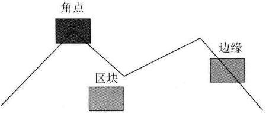
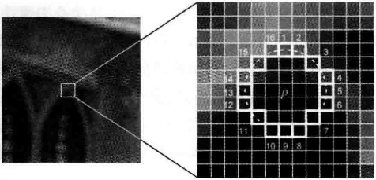
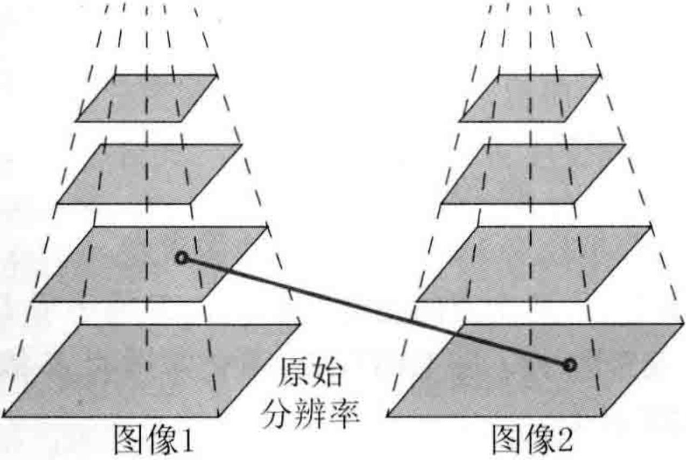
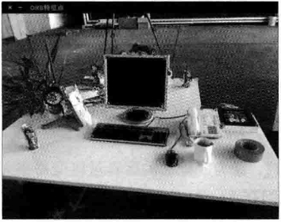
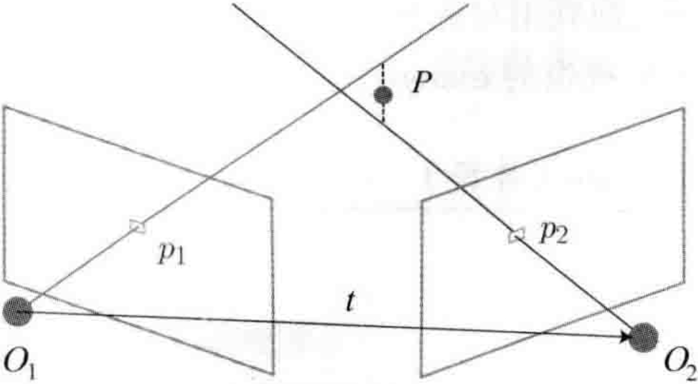
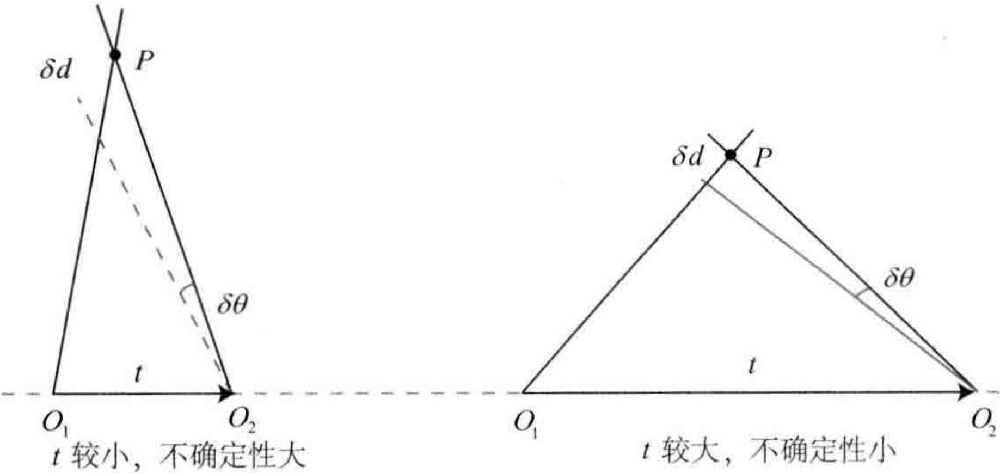

# 第7讲 视觉里程计1

- [第7讲 视觉里程计1](#第7讲-视觉里程计1)
- [7.1 特征点法](#71-特征点法)
  - [7.1.1 特征点](#711-特征点)
  - [7.1.2 ORB特征](#712-orb特征)
    - [FAST关键点](#fast关键点)
    - [BRIEF描述子](#brief描述子)
  - [7.1.3](#713)
- [7.2 实践：特征提取和匹配](#72-实践特征提取和匹配)
  - [7.2.1 OpenCV的ORB特征](#721-opencv的orb特征)
  - [7.2.2 手写ORB特征](#722-手写orb特征)
  - [7.2.3 计算相机运动](#723-计算相机运动)
- [7.3 2D-2D: 对极几何](#73-2d-2d-对极几何)
- [7.4 实践：对极约束求解相机运动](#74-实践对极约束求解相机运动)
  - [讨论](#讨论)
    - [尺度不确定性](#尺度不确定性)
    - [初始化的纯旋转的问题](#初始化的纯旋转的问题)
    - [多于8对点的情况](#多于8对点的情况)
- [7.5 三角测量](#75-三角测量)
- [7.6 实践：三角测量](#76-实践三角测量)
  - [7.6.1 三角测量代码](#761-三角测量代码)
  - [7.6.2 讨论](#762-讨论)
- [7.7 3D-2D：PnP](#77-3d-2dpnp)
- [7.8 实践：求解PnP](#78-实践求解pnp)
  - [7.8.1 使用EPnP求解位姿](#781-使用epnp求解位姿)
- [7.9 3D-3D：ICP](#79-3d-3dicp)

<B>主要目标</B>

> 1. 理解图像特征点的意义，并掌握在单幅图像中提取特征点及多幅图像中匹配特征点的方法。
> 2. 理解对极几何的原理，利用对极几何的约束，恢复图像之间的摄像机的三维运动。
> 3. 理解PNP问题，以及利用已知三维结构与图像的对应关系求解摄像机的三维运动。
> 4. 理解ICP问题，以及利用点云的匹配关系求解摄像机的三维运动。
> 5. 理解如何通过三角化获得二维图像上对应点的三维结构。

前面介绍了运动方程和观测方程的具体形式，并讲解了以非线性优化为主的求解方法。从本将开始，结束基础知识的铺垫而步入正题：按照第2讲的顺序，分别介绍视觉里程计、后端优化、回环检测和地图构建4个模块。

# 7.1 特征点法

一个SLAM系统分为前端和后端，其中前端也称为视觉里程计。视觉里程计根据相邻图像的信息估计出粗略的相机运动，给后端提供较好的初始值。视觉里程计的算法主要分为两大类：<B>特征点法</B>和<B>直接法</B>。基于特征点法的前端，长久以来被认为是视觉里程计的主流方法。它具有稳定，对光照、动态物体不敏感的优势，是目前比较成熟的解决方案。

从特征点法入手，学习如何提取、匹配图像特征点，然后估计两帧之间的相机运动和场景结构，从而实现一个两帧视觉里程计。这类算法有时也称为两视图几何(Two-view geometry)。

## 7.1.1 特征点

视觉里程计的核心问题是<B>如何根据图像估计相机运动</B>。图像本身是一个由亮度和色彩组成的矩阵，如果直接从矩阵层面考虑运动估计，将会非常困难。比较方便的做法是：首先，从图像中选取比较<B>有代表性</B>的点。这些点在相机视角发生少量变化后会保持不变，于是能在各个图像中找到相同的点。然后，在这些点的基础上，讨论相机位姿估计问题，以及这些点的定位问题。在经典SLAM模型中，我们称这些点为<B>路标</B>。而在视觉SLAM中，路标则是指图像特征(Feature)。

在视觉里程计中，我们希望<B>特征点在相机运动之后保持稳定</B>，而灰度值受光照、形变、物体材质的影响严重，在不同图像间变化非常大，不够稳定。理想的情况是，当场景和相机视角发生少量改变时，算法还能从图像中判断哪些地方是同一个点。所以，仅凭灰度值是不够的，我们需要对图像提取特征点。

    

如上图所示，可以把图像中的角点、边缘和区块都当成图像中有代表性的地方。

我们更容易精确地指出，某两幅图像中出现了同一个角点；指出某两幅图像中出现同一个边缘则稍微困难一些，因为沿着该边缘前进，图像局部是相似的；指出某两幅图像中出现同一个区块则是最困难的。

图像中的角点、边缘相比于像素区块而言更加“特别”，在不同图像之间的辨识度更强。一种直观的提取特征的方式就是在不同图像间辨认角点，确定它们的对应关系。在这种做法中，角点就是所谓的特征。角点的提取算法有很多，例如Harris角点、FAST角点、GFTT角点。

在大多数应用中，单纯的角点依然不能满足我们的很多需求。例如，从远处看上去是角点的地方，当相机离近之后，可能就不显示为角点了。或者，当旋转相机时，角点的外观会发生变化，也就不容易辨认出是同一个角点了。为此，计算机视觉领域的研究者们在长年的研究中设计了许多更加稳定的局部图像特征，如著名的<B>SIFT、SURF、ORB</B>等。相比于朴素的角点，这些人工设计的特征点能够拥有如下性质：

1. 可重复性(Repeatability):相同的特征可以在不同的图像中找到。
2. 可区别性(Distinctiveness):不同的特征有不同的表达。
3. 高效率(Efficiency):同一图像中，特征点的数量应远小于像素的数量。
4. 本地性(Locality):特征仅与一小片图像区域相关。

特征点由<B>关键点</B>(Key-point)和<B>描述子</B>(Descriptor)两部分组成。关键点是指该特征点在图像里的位置，有些特征点还具有朝向、大小等信息。描述子通常是一个向量，按照某种认为设计的方式，描述了该关键点周围像素的信息。描述子是按照“<B>外观相似的特征应该有相似的描述子</B>”的原则设计的。因此，只要两个特征点的描述子在向量空间上的距离相近，就可以认为它们是同样的特征点。

SIFT(尺度不变特征变换，Scale-Invariant Feature Transform)充分考虑了在图像变换过程中出现的光照、尺度、旋转等变化，但随之而来的是极大的计算量，图像特征的提取与匹配在SLAM过程中仅仅是一个环节，在SLAM中很少使用SIFT这种“奢侈”的图像特征。

另一些特征，考虑适当降低精度和鲁棒性，以提升计算的速度。例如，FASTR关键点属于计算特别快的一种特征点(这里“关键点”的表述，说明它没有描述子)，而ORB(Oriented FAST and ROtated BRIEF)特征则是目前看来非常具有代表性的实时图像特征。它改进了FAST检测子不具有方向性的问题，并采用速度极快的二进制描述子BRIEF(Binary Robust Independent Elementary Feature)，使整个图像特征提取的环节大大加速。

在同一副图像中同时提取约1000个特征点的情况下，ORB约花费15.3毫秒，SURF约花费217.3毫秒，SIFT约花费5228.7毫秒。由此可以看出，ORB在保持了特征子具有<B>旋转、尺度不变性</B>的同时，在速度方面提升明显，对于实时性要求很高的SLAM来说是一个很好的选择。

## 7.1.2 ORB特征

ORB特征由<B>关键点</B>和<B>描述子</B>两部分组成，它的关键点称为“Oriented FAST”，是一种改进的FAST角点；它的描述子称为BRIEF。因此，提取ORB特征分为如下两个步骤：

1. FAST角点提取：找出图像中的“角点”。相较于原版的FAST，ORB中计算了特征点的主方向，为后续的BRIEF描述子增加了旋转不变特性。
2. BRIEF描述子：对前一步提取出特征点的周围图像区域进行描述。ORB对BRIEF进行了一些改进，主要是指在BRIEF中使用了先前计算的方向信息。

### FAST关键点

FAST是一种角点，主要检测局部像素灰度变化明显的地方，以速度著称。它的思想是：如果一个像素与领域的像素差别较大（过亮或过暗），那么它更可能是角点。相比于其他角点检测算法，FAST只需比较像素亮度的大小，十分快捷。它的检测过程如下：

1. 在图像中选取像素$p$，假设它的亮度为$I_p$。
2. 设置一个阈值$T$（比如，$I_p$的20%）。
3. 以像素$p$为中心，选取半径为3的圆上的16个像素点。
4. 加入选取的圆上有连续的$N$个点的亮度大于$I_p + T$或小于$I_p - T$，那么像素$p$可以被认为是特征点（$N$通常取12，即FAST-12。其他常用的$N$取值为9和11，它们分别被称为FAST-9和FAST-11）。
5. 循环以上四步，对每一个像素执行相同的操作。

在FAST-12算法中，为了更高效，可以添加一项预测试操作，以快速地排除绝大多数不是角点的像素。具体操作为，对于每个像素，直接检测领域圆上的第1，5，9，13个像素的亮度。只有当这4个像素中有3个同时大于$I_p+T$或小于$I_p-T$时，当前像素才有可能是一个角点，否则应该直接排除。这样的预测试大大加速了角点检测。此外，原始的FAST角点经常出现“扎堆”的现象。所以在第一遍检测之后，还需要用非极大值抑制(Non-maximal suppression)，在一定区域内仅保留响应极大值的角点，避免角点集中的问题。

    

FAST特征点的计算仅仅是比较像素间亮度的差异，所以速度非常快，但它也有重复性不强、分布不均匀的缺点。此外，FAST角点不具有方向信息，同时，由于它固定取半径为3的圆，存在尺度问题：远处看像是角点的地方，接近后看可能就不是角点了。针对FAST角点不具有方向性和尺度的弱点，ORB添加了尺度和旋转的描述。尺度不变性由构建图像金字塔，并在金字塔的每一层检测角点来实现。而特征的旋转是由灰度质心法(Intensity Centroid)实现的。

金字塔是计算图视觉中常用的一种处理方法，如下图所示：

    

金字塔底层是原始图像，每往上一层，就对图像进行一个固定倍率的缩放，这样我们就有了不同分辨率的图像。较小的图像可以看成是远处看过来的场景。

在旋转方面，我们计算特征点附近的图像灰质质心，所谓质心是指以图像块灰度值作为权重的中心。其具体操作步骤如下：

1. 在一个小的图像块$B$中，定义图像块的矩为

$$
m_{pq}=\sum_{x,y\in B} x^p y^q I(x,y), \quad p,q={0,1}.
$$

2. 通过矩可以找到图像块的质心：

$$
C = \left( \frac{m_{10}}{m_{00}}, \frac{m_{01}}{m_{00}} \right).
$$

3. 连接图像块的几何中心$O$与质心$C$，得到一个方向向量$\overrightarrow{OC}$，于是特征点的方向可以定义为

$$
\theta = \arctan(m_{01}/m_{10}).
$$

通过以上方法，FAST角点便具有了尺度与旋转的描述，从而大大提升了其在不同图像之间表达的鲁棒性。所以在ORB中，把这种改进后的FAST称为Oriented FAST。

### BRIEF描述子

在提取Oriented FAST关键点之后，我们对每个点计算其描述子。ORB使用改进的BRIEF特征描述。

BRIEF是一种<B>二进制</B>描述子，其描述向量由许多个0和1组成，这里的0和1编码了关键点附近两个随机像素(比如$p$和$q$)的大小关系：如果$p$比$q$大，则取1，反之就取0。

如果取了128个这样的$p,q$，则最后得到128维由0、1组成的向量。BRIEF使用了随机选点的比较，速度非常快，而且由于使用了二进制表达，存储起来也十分方便，适用于实时的图像匹配。原始的BRIEF描述子不具有旋转不变性，因此在图像发生旋转时容易丢失。而ORB在FAST特征点提取阶段计算了关键点的方向，所以可以利用方向信息，计算旋转之后的“Steer BRIEF”特征使ORB的描述子具有较好的旋转不变性。

由于考虑到了旋转和缩放，ORB在平移、旋转和缩放的变换下仍有良好的表现。同时，FAST和BRIEF的组合也非常高效，使得ORB特征在实时SLAM中非常受欢迎。下图展示了一张用OpenCV提取ORB特征点的结果，下面介绍如何在不同的图像之间进行特征匹配。

    

---

## 7.1.3

特征匹配（如下图所示）是视觉SLAM中极为关键的一步，宽泛地说，特征匹配解决了SLAM中的数据关联问题(data association)，即确定当前看到的路标与之前看到的路标之间的对应关系。通过对图像与图像或者图像与地图之间的描述子进行准确匹配，我们可以为后续的姿态估计、优化等操作减轻大量负担。然后，由于图像特征的局部特征，误匹配的情况广泛存在，而且长期以来一直没有得到有效解决，目前已经成为视觉SLAM中制约性能提升的一大瓶颈。部分原因是场景中经常存在大量的重复纹理，使得特征描述非常相似，在这种情况下，仅利用局部特征解决误匹配是非常困难的。

    

考虑两个时刻的图像，如果在图像$I_t$中提取到特征点$x_t^m,m=1,2,...,M$，在图像$I_{t+1}$中提取到特征点$x_{t+1}^n,n=1,2,...,N$，如何寻找这两个集合元素的对应关系呢？最简单的特征匹配方法就是<B>暴力匹配(Brute-Force Matcher)</B>，即对每一个特征点$x_t^m$与所有的$x_{t+1}^n$测量描述子的距离，然后排序，取最近的一个作为匹配点。描述子距离表示了两个特征点之间的<B>相似程度</B>，不过在实际应用中还可以取不同的距离度量范数。对于浮点类型的描述子，使用欧氏距离进行度量即可。而对于二进制的描述子(比如BRIEF这样的)，往往使用汉明距离(Hamming distance)作为度量--两个二进制串之间的汉明距离，指的是其<B>不同位数的个数</B>。

然而，当特征点数量很大时，暴力匹配法的运算量将变得很大，特别是当想要匹配某个帧和一张地图的时候。不符合SLAM中的实时性需求。此时，<B>快速近似 最近邻(FLANN)</B>算法更加适合于匹配点数量极多的情况。由于这些匹配算法理论成熟，而且实现上也已集成到OpenCV。

---

# 7.2 实践：特征提取和匹配

第一个实验：演示使用OpenCV进行ORB的特征匹配；第二个实验：手写一个ORB特征。

## 7.2.1 OpenCV的ORB特征

## 7.2.2 手写ORB特征

## 7.2.3 计算相机运动

现在已经有了匹配好的点对，接下来，要根据点对估计相机的运动，由于相机的原理不同，情况发生了变化：

1.  当相机为单目时，我们只知道2D的像素坐标，因而问题是根据<B>两组2D点</B>估计运动。该问题用<B>对极几何</B>解决。
2.  当相机为双目、RGB-D时，或者通过某种方法得到了距离信息，那么问题就是根据<B>两组3D点</B>估计运动。该问题通常用ICP解决。
3.  如果一组为3D，一组为2D，即，我们得到了一些3D点和它们在相机的投影位置，也能估计相机的运动。该问题通过<B>PnP</B>求解。

---

# 7.3 2D-2D: 对极几何

- [Chapter7.3](./subChapter/Chapter7.3对极几何.md)

# 7.4 实践：对极约束求解相机运动

## 讨论

从演示的程序中可以看到，输出的$E$和$F$之间相差了相机内参矩阵，虽然它们在数值上并不直观，但可以验证它们的数学关系。从$E,F$和$H$都可以分解出运动，不过$H$需要假设特征点位于平面上，对于本实验的数据，这个假设是不好的，所以我们主要用$E$分解运动。

由于$E$本身具有尺度等价性，它分解得到的$t,R$也有一个尺度等价性，而$R\in SO(3)$自身具有约束，所以我们认为$t$具有一个<B>尺度</B>。换言之，在分解过程中，对$t$乘以任意非零常数，分解都是成立的。因此，我们通常把$t$进行<B>归一化</B>，让它的长度等于1。

### 尺度不确定性

对$t$长度的归一化，直接导致了<B>单目视觉的尺度不确定性</B>。在单目SLAM中，对轨迹和地图同时缩放任意倍数，得到的图像依然是一样的。

在单目视觉中，对两张图像的$t$归一化相当于<B>固定了尺度</B>，虽然我们不知道它的实际长度是多少，但我们以这时的$t$为单位1，计算相机运动和特征点的3D位置。这被称为单目SLAM的初始化，在初始化之后，就可以用3D-2D计算相机运动了。初始化之后的轨迹和地图的单位，就是初始化时固定的尺度，因此，单目SLAM有一步不可避免的<B>初始化</B>。初始化的两张图像必须有一定程度的平移，而后的轨迹和地图都将以此步的平移为单位。

除了对$t$进行归一化，另一种方法是令初始化时所有的特征点平均深度为1，也可以固定一个尺度，相比于令$t$长度为1的做法，把特征点深度归一化可以控制场景的规模大小，使计算在数值上更稳定。

### 初始化的纯旋转的问题

从$E$分解到$R,t$的过程中，如果相机发生的是纯旋转，导致$t$为零，那么，得到的$E$也将为零，这将导致我们无从求解$R$，不过，此时我们可以依靠$H$求解旋转，但仅有旋转，无法用三角测量估计特征点的空间位置。于是，另一个结论是，<B>单目初始化不能只有纯旋转，必须要有一定程度的平移</B>。如果没有平移，单目将无法初始化。在实践中，如果初始化时平移太小，会使得位姿求解与三角化结果不稳定，从而导致失败。相对地，如果把相机左右移动而不是原地旋转，就容易让单目SLAM初始化。因而，有经验的SLAM研究人员，在单目SLAM情况下经常选择让相机进行左右平移以顺利进行初始化。

### 多于8对点的情况

当给定的点数多于8对时，可以计算一个最小二乘解。根据式(7.13)中线性化后的对极约束，把左侧的系数矩阵记为$A$:

$$
Ae = 0. \tag{7.22}
$$

对于八点法，$A$的大小为$8\times9$，如果给定的匹配点多于8，则该方程构成一个超定方程，即不一定存在$e$使得上式成立。因此，可以通过最小化一个二次型来求：

$$
\min_{e} \lVert Ae \rVert_2^2 = \min_{3}e^TA^TAe. \tag{7.23}
$$

于是就求出了在最小二乘意义下的$E$矩阵，不过，当可能存在误匹配的情况时，我们会更倾向于使用<B>随机采样一致性(Randowm Sample Concensus, RANSAC)</B>来求，而不是最小二乘。RANSAC是一种通用的做法，适用于很多带错误数据的情况，可以处理带有错误匹配的数据。

# 7.5 三角测量

之前两节，我们使用对极几何约束估计了相机运动，也讨论了这种方法的局限性。在得到运动之后，下一步我们需要用相机的运动估计特征点的空间位置，在单目SLAM中，仅通过单张图像无法获得像素的深度信息，我们需要通过<B>三角测量(Trangulation)（或三角化）</B>的方法估计地图点的深度，如下图所示：

    

三角测量是指，通过不同位置对同一个路标点进行观察，从观察到的位置推断路标点的距离。

考虑图像$I_1$和$I_2$，以左图为参考，右图的变换矩阵为$T$，相机光心为$O_1$和$O_2$。在$I_1$中有特征点$p_1$，对应$I_2$中有特征点$p_2$。理论上，直线$O_1p_1$与$O_2p_2$在场景中会相交于一点$P$，该点即两个特征点所对应的地图点在三维场景中的位置。然而由于噪声的影响，这两条直线往往无法相交，因此，可以通过最小二乘法求解。

按照对极几何中的定义，设$x_1,x_2$为两个特征点的归一化坐标，那么它们满足：

$$
s_2 x_2 = s_1 R x_1 + t. \tag{7.24}
$$

现在已知$R,t$，我们想求解两个特征点的深度$s_1, s_2$，从几何上看，可以在射线$O_1 p_1$上寻找3D点，使其投影位置接近$p_2$，同理，也可以在$O_2 p_2$上找，或者在两条线的中间找。不同的策略对应着不同的计算方式，当然它们大同小异。

例如，要计算$s_1$，那么先对上式两侧左乘一个$x_2^{\wedge}$，得

$$
s_2 x_2^{\wedge} x_2 = 0 = s_1 x_2^{\wedge} R x_1 + x_2^{\wedge}t. \tag{7.25}
$$

该式左侧为零，右侧可看成$s_2$的一个方程，可以根据它直接求得$s_2$，有了$s_2, s_1$也非常容易求出。于是就得到了两帧下的点的深度，确定了它们的空间坐标。当然，由于噪声的存在，我们估计的$R,t$不一定精确使式(7.25)为零，所以更常见的做法是求最小二乘解而不是直接的解。

---

# 7.6 实践：三角测量

## 7.6.1 三角测量代码

## 7.6.2 讨论

关于三角测量，还有一个必须注意的地方。

三角测量是由平移得到的，有平移才会有对极几何中的三角形，才谈得上三角测量。因此，纯旋转是无法使用三角测量的，因为在平移为零时，对极约束一直为零。在平移存在的情况下，还要关心三角测量的不确定性，这会引出一个<B>三角测量的矛盾</B>。

如下图所示，，当平移很小时，像素上的不确定性将导致较大的深度不确定性，也就是说，如果特征点运动一个像素$\delta x$，使得视线角变化了一个角度$\delta \theta$，那么将测量到深度值有$\delta d$的变化。从几何关系可以看到，当$t$较大时，$\delta d$将明显变小，这说明平移较大时，在同样的相机分辨率下，三角化测量将更精确。对该过程的定量分析可以使用正弦定理得到。

    

要提高三角化的精度，一种方式是提高特征点的提取精度，也就是提高图像分辨率--但这会导致图像变大，增加计算成本。另一种方式是使平移量增大，但是，这会导致图像的外观发生明显的变化。外观变化会使得特征提取与匹配变得困难，总而言之，增大平移，可能导致匹配失效；而平移太小，则三角化精度不够--这就是三角化的矛盾。把这个问题称为“视差”(parallax)。

在单目视觉中，由于单目图像没有深度信息，要等待特征点被追踪几帧之后，产生了足够的视角，再用三角化来确定新增特征点的深度值。这有时也被称为延迟三角化。但是，如果相机发生了原地旋转，导致视差很小，就不好估计新观测到的特征点的深度。这种情况在机器人场合下更常见，因为原地旋转往往是一个机器人常见的指令。在这种情况下，单目视觉就可能出现追踪失败、尺度不正确等情况。

虽然本节只介绍了三角化的深度估计，但只要愿意，也能够定量地计算每个特征点的位置以及不确定性。所以，如果假设特征点服从高斯分布，并且不断地对它进行观测，并且不断地对它进行观测，在信息正确的情况下，我们就能够期望它的方差不断减小乃至收敛。这就得到了一个滤波器，称为深度滤波器(Depth Filter)。

# 7.7 3D-2D：PnP

- [Chapter7.7](./subChapter/Chapter7.7PnP.md)

# 7.8 实践：求解PnP

## 7.8.1 使用EPnP求解位姿

# 7.9 3D-3D：ICP

- [Chapter7.9](./subChapter/Chapter7.9ICP.md)