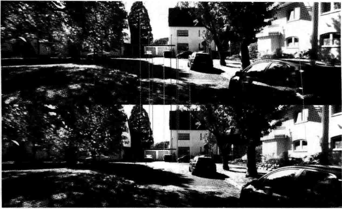

# 第7讲 视觉里程计1

<B>主要目标</B>

> 1. 理解图像特征点的意义，并掌握在单幅图像中提取特征点及多幅图像中匹配特征点的方法。
> 2. 理解对极几何的原理，利用对极几何的约束，恢复图像之间的摄像机的三维运动。
> 3. 理解PNP问题，以及利用已知三维结构与图像的对应关系求解摄像机的三维运动。
> 4. 理解ICP问题，以及利用点云的匹配关系求解摄像机的三维运动。
> 5. 理解如何通过三角化获得二维图像上对应点的三维结构。

前面介绍了运动方程和观测方程的具体形式，并讲解了以非线性优化为主的求解方法。从本将开始，结束基础知识的铺垫而步入正题：按照第2讲的顺序，分别介绍视觉里程计、后端优化、回环检测和地图构建4个模块。

# 7.1 特征点法

一个SLAM系统分为前端和后端，其中前端也称为视觉里程计。视觉里程计根据相邻图像的信息估计出粗略的相机运动，给后端提供较好的初始值。视觉里程计的算法主要分为两大类：<B>特征点法</B>和<B>直接法</B>。基于特征点法的前端，长久以来被认为是视觉里程计的主流方法。它具有稳定，对光照、动态物体不敏感的优势，是目前比较成熟的解决方案。

从特征点法入手，学习如何提取、匹配图像特征点，然后估计两帧之间的相机运动和场景结构，从而实现一个两帧视觉里程计。这类算法有时也称为两视图几何(Two-view geometry)。

## 7.1.1 特征点

视觉里程计的核心问题是<B>如何根据图像估计相机运动</B>。图像本身是一个由亮度和色彩组成的矩阵，如果直接从矩阵层面考虑运动估计，将会非常困难。比较方便的做法是：首先，从图像中选取比较<B>有代表性</B>的点。这些点在相机视角发生少量变化后会保持不变，于是能在各个图像中找到相同的点。然后，在这些点的基础上，讨论相机位姿估计问题，以及这些点的定位问题。在经典SLAM模型中，我们称这些点为<B>路标</B>。而在视觉SLAM中，路标则是指图像特征(Feature)。

在视觉里程计中，我们希望<B>特征点在相机运动之后保持稳定</B>，而灰度值受光照、形变、物体材质的影响严重，在不同图像间变化非常大，不够稳定。理想的情况是，当场景和相机视角发生少量改变时，算法还能从图像中判断哪些地方是同一个点。所以，仅凭灰度值是不够的，我们需要对图像提取特征点。

    

如上图所示，可以把图像中的角点、边缘和区块都当成图像中有代表性的地方。

我们更容易精确地指出，某两幅图像中出现了同一个角点；指出某两幅图像中出现同一个边缘则稍微困难一些，因为沿着该边缘前进，图像局部是相似的；指出某两幅图像中出现同一个区块则是最困难的。

图像中的角点、边缘相比于像素区块而言更加“特别”，在不同图像之间的辨识度更强。一种直观的提取特征的方式就是在不同图像间辨认角点，确定它们的对应关系。在这种做法中，角点就是所谓的特征。角点的提取算法有很多，例如Harris角点、FAST角点、GFTT角点。

在大多数应用中，单纯的角点依然不能满足我们的很多需求。例如，从远处看上去是角点的地方，当相机离近之后，可能就不显示为角点了。或者，当旋转相机时，角点的外观会发生变化，也就不容易辨认出是同一个角点了。为此，计算机视觉领域的研究者们在长年的研究中设计了许多更加稳定的局部图像特征，如著名的<B>SIFT、SURF、ORB</B>等。相比于朴素的角点，这些人工设计的特征点能够拥有如下性质：

1. 可重复性(Repeatability):相同的特征可以在不同的图像中找到。
2. 可区别性(Distinctiveness):不同的特征有不同的表达。
3. 高效率(Efficiency):同一图像中，特征点的数量应远小于像素的数量。
4. 本地性(Locality):特征仅与一小片图像区域相关。

特征点由<B>关键点</B>(Key-point)和<B>描述子</B>(Descriptor)两部分组成。关键点是指该特征点在图像里的位置，有些特征点还具有朝向、大小等信息。描述子通常是一个向量，按照某种认为设计的方式，描述了该关键点周围像素的信息。描述子是按照“<B>外观相似的特征应该有相似的描述子</B>”的原则设计的。因此，只要两个特征点的描述子在向量空间上的距离相近，就可以认为它们是同样的特征点。

SIFT(尺度不变特征变换，Scale-Invariant Feature Transform)充分考虑了在图像变换过程中出现的光照、尺度、旋转等变化，但随之而来的是极大的计算量，图像特征的提取与匹配在SLAM过程中仅仅是一个环节，在SLAM中很少使用SIFT这种“奢侈”的图像特征。

另一些特征，考虑适当降低精度和鲁棒性，以提升计算的速度。例如，FASTR关键点属于计算特别快的一种特征点(这里“关键点”的表述，说明它没有描述子)，而ORB(Oriented FAST and ROtated BRIEF)特征则是目前看来非常具有代表性的实时图像特征。它改进了FAST检测子不具有方向性的问题，并采用速度极快的二进制描述子BRIEF(Binary Robust Independent Elementary Feature)，使整个图像特征提取的环节大大加速。

在同一副图像中同时提取约1000个特征点的情况下，ORB约花费15.3毫秒，SURF约花费217.3毫秒，SIFT约花费5228.7毫秒。由此可以看出，ORB在保持了特征子具有<B>旋转、尺度不变性</B>的同时，在速度方面提升明显，对于实时性要求很高的SLAM来说是一个很好的选择。

## 7.1.2 ORB特征

ORB特征由<B>关键点</B>和<B>描述子</B>两部分组成，它的关键点称为“Oriented FAST”，是一种改进的FAST角点；它的描述子称为BRIEF。因此，提取ORB特征分为如下两个步骤：

1. FAST角点提取：找出图像中的“角点”。相较于原版的FAST，ORB中计算了特征点的主方向，为后续的BRIEF描述子增加了旋转不变特性。
2. BRIEF描述子：对前一步提取出特征点的周围图像区域进行描述。ORB对BRIEF进行了一些改进，主要是指在BRIEF中使用了先前计算的方向信息。

### FAST关键点

FAST是一种角点，主要检测局部像素灰度变化明显的地方，以速度著称。它的思想是：如果一个像素与领域的像素差别较大（过亮或过暗），那么它更可能是角点。相比于其他角点检测算法，FAST只需比较像素亮度的大小，十分快捷。它的检测过程如下：

1. 在图像中选取像素$p$，假设它的亮度为$I_p$。
2. 设置一个阈值$T$（比如，$I_p$的20%）。
3. 以像素$p$为中心，选取半径为3的圆上的16个像素点。
4. 加入选取的圆上有连续的$N$个点的亮度大于$I_p + T$或小于$I_p - T$，那么像素$p$可以被认为是特征点（$N$通常取12，即FAST-12。其他常用的$N$取值为9和11，它们分别被称为FAST-9和FAST-11）。
5. 循环以上四步，对每一个像素执行相同的操作。

在FAST-12算法中，为了更高效，可以添加一项预测试操作，以快速地排除绝大多数不是角点的像素。具体操作为，对于每个像素，直接检测领域圆上的第1，5，9，13个像素的亮度。只有当这4个像素中有3个同时大于$I_p+T$或小于$I_p-T$时，当前像素才有可能是一个角点，否则应该直接排除。这样的预测试大大加速了角点检测。此外，原始的FAST角点经常出现“扎堆”的现象。所以在第一遍检测之后，还需要用非极大值抑制(Non-maximal suppression)，在一定区域内仅保留响应极大值的角点，避免角点集中的问题。

    

FAST特征点的计算仅仅是比较像素间亮度的差异，所以速度非常快，但它也有重复性不强、分布不均匀的缺点。此外，FAST角点不具有方向信息，同时，由于它固定取半径为3的圆，存在尺度问题：远处看像是角点的地方，接近后看可能就不是角点了。针对FAST角点不具有方向性和尺度的弱点，ORB添加了尺度和旋转的描述。尺度不变性由构建图像金字塔，并在金字塔的每一层检测角点来实现。而特征的旋转是由灰度质心法(Intensity Centroid)实现的。

金字塔是计算图视觉中常用的一种处理方法，如下图所示：

    

金字塔底层是原始图像，每往上一层，就对图像进行一个固定倍率的缩放，这样我们就有了不同分辨率的图像。较小的图像可以看成是远处看过来的场景。

在旋转方面，我们计算特征点附近的图像灰质质心，所谓质心是指以图像块灰度值作为权重的中心。其具体操作步骤如下：

1. 在一个小的图像块$B$中，定义图像块的矩为

$$
m_{pq}=\sum_{x,y\in B} x^p y^q I(x,y), \quad p,q={0,1}.
$$

2. 通过矩可以找到图像块的质心：

$$
C = \left( \frac{m_{10}}{m_{00}}, \frac{m_{01}}{m_{00}} \right).
$$

3. 连接图像块的几何中心$O$与质心$C$，得到一个方向向量$\overrightarrow{OC}$，于是特征点的方向可以定义为

$$
\theta = \arctan(m_{01}/m_{10}).
$$

通过以上方法，FAST角点便具有了尺度与旋转的描述，从而大大提升了其在不同图像之间表达的鲁棒性。所以在ORB中，把这种改进后的FAST称为Oriented FAST。

### BRIEF描述子

在提取Oriented FAST关键点之后，我们对每个点计算其描述子。ORB使用改进的BRIEF特征描述。

BRIEF是一种<B>二进制</B>描述子，其描述向量由许多个0和1组成，这里的0和1编码了关键点附近两个随机像素(比如$p$和$q$)的大小关系：如果$p$比$q$大，则取1，反之就取0。

如果取了128个这样的$p,q$，则最后得到128维由0、1组成的向量。BRIEF使用了随机选点的比较，速度非常快，而且由于使用了二进制表达，存储起来也十分方便，适用于实时的图像匹配。原始的BRIEF描述子不具有旋转不变性，因此在图像发生旋转时容易丢失。而ORB在FAST特征点提取阶段计算了关键点的方向，所以可以利用方向信息，计算旋转之后的“Steer BRIEF”特征使ORB的描述子具有较好的旋转不变性。

由于考虑到了旋转和缩放，ORB在平移、旋转和缩放的变换下仍有良好的表现。同时，FAST和BRIEF的组合也非常高效，使得ORB特征在实时SLAM中非常受欢迎。下图展示了一张用OpenCV提取ORB特征点的结果，下面介绍如何在不同的图像之间进行特征匹配。

    

---

## 7.1.3

特征匹配（如下图所示）是视觉SLAM中极为关键的一步，宽泛地说，特征匹配解决了SLAM中的数据关联问题(data association)，即确定当前看到的路标与之前看到的路标之间的对应关系。通过对图像与图像或者图像与地图之间的描述子进行准确匹配，我们可以为后续的姿态估计、优化等操作减轻大量负担。然后，由于图像特征的局部特征，误匹配的情况广泛存在，而且长期以来一直没有得到有效解决，目前已经成为视觉SLAM中制约性能提升的一大瓶颈。部分原因是场景中经常存在大量的重复纹理，使得特征描述非常相似，在这种情况下，仅利用局部特征解决误匹配是非常困难的。

    

考虑两个时刻的图像，如果在图像$I_t$中提取到特征点$x_t^m,m=1,2,...,M$，在图像$I_{t+1}$中提取到特征点$x_{t+1}^n,n=1,2,...,N$，如何寻找这两个集合元素的对应关系呢？最简单的特征匹配方法就是<B>暴力匹配(Brute-Force Matcher)</B>，即对每一个特征点$x_t^m$与所有的$x_{t+1}^n$测量描述子的距离，然后排序，取最近的一个作为匹配点。描述子距离表示了两个特征点之间的<B>相似程度</B>，不过在实际应用中还可以取不同的距离度量范数。对于浮点类型的描述子，使用欧氏距离进行度量即可。而对于二进制的描述子(比如BRIEF这样的)，往往使用汉明距离(Hamming distance)作为度量--两个二进制串之间的汉明距离，指的是其<B>不同位数的个数</B>。

然而，当特征点数量很大时，暴力匹配法的运算量将变得很大，特别是当想要匹配某个帧和一张地图的时候。不符合SLAM中的实时性需求。此时，<B>快速近似 最近邻(FLANN)</B>算法更加适合于匹配点数量极多的情况。由于这些匹配算法理论成熟，而且实现上也已集成到OpenCV。

---

# 7.2 实践：特征提取和匹配

第一个实验：演示使用OpenCV进行ORB的特征匹配；第二个实验：手写一个ORB特征。

## 7.2.1 OpenCV的ORB特征

## 7.2.2 手写ORB特征

## 7.2.3 计算相机运动

现在已经有了匹配好的点对，接下来，要根据点对估计相机的运动，由于相机的原理不同，情况发生了变化：

1.  当相机为单目时，我们只知道2D的像素坐标，因而问题是根据<B>两组2D点</B>估计运动。该问题用<B>对极几何</B>解决。
2.  当相机为双目、RGB-D时，或者通过某种方法得到了距离信息，那么问题就是根据<B>两组3D点</B>估计运动。该问题通常用ICP解决。
3.  如果一组为3D，一组为2D，即，我们得到了一些3D点和它们在相机的投影位置，也能估计相机的运动。该问题通过<B>PnP</B>求解。

---

# 7.3 2D-2D: 对极几何

## 7.3.1 对极约束

假设从两张图像中得到了一对配对好的特征点，如下图所示：

    

如果有若干对这样的匹配点，就可以通过这些二维图像点的对应关系，恢复出在两帧之间摄像机的运动。

以上图为例，希望求两帧图像$I_1,I_2$之间的运动，假设第一帧到第二帧的运动为$R,t$，两个相机中心分别为$O_1,O_2$，现在考虑$I_1$中有一个特征点$p_1$，它在$I_2$中对应着特征点$p_2$。如果匹配正确，说明它确实是<B>同一个空间点在两个成像平面上的投影</B>。

连线$\overrightarrow{O_1p_1}$和连线$\overrightarrow{O_2p_2}$在三维空间中会相交于点$P$，这时$O_1,O_2,P$三个点可以确定一个平面，称为<B>极平面(Epipolar plane)</B>。$O_1O_2$连线与像平面$I_1,I_2$的交点分别为$e_1,e_2$。$e_1,e_2$称为<B>极点(Epipoles)</B>，$O_1O_2$被称为<B>基线</B>。我们称极平面与两个像平面$I_1,I_2$之间的相交线$l_1,l_2$为<B>极线(Epipolar line)</B>。

从第一帧的角度看，射线$\overrightarrow{O_1p_1}$是<B>某个像素可能出现的空间位置</B>--因为该射线上的所有点都会投影到同一个像素点，同时，如果不知道$P$的位置，那么当我们在第二幅图像上看时，连线$\overrightarrow{e_2p_2}$(也就是第二幅图像中的极线)就是$P$可能出现的投影的位置，也就是射线$\overrightarrow{O_1p_1}$在第二个相机中的投影。

现在，由于通过特征点匹配确定了$p_2$的像素位置，所以能够推断$P$的空间位置，以及相机的运动。从代数的角度来分析这里的几何关系，在第一帧的坐标系下，设$P$的空间位置为

$$
P=[X,Y,Z]^T.
$$

根据针孔相机模型，我们知道两个像素点$p_1,p_2$的像素位置为

$$
s_1p_1=KP, \quad s_2P_2=K(RP+t). \tag{7.1}
$$

这里$K$为相机内参矩阵，$R,t$为两个坐标系的相机运动。

有时会使用齐次坐标表示像素点，在使用齐次坐标时，一个向量将等于它自身乘上任意的非零常数，这通常用于表达一个投影关系。例如，$s_1p_1$和$p_1$成投影关系，它们在齐次坐标的意义下是相等的。我们称这种相等关系为尺度意义下相等(equal up to a scale)，记作：

$$
sp \simeq p. \tag{7.2}
$$

那么，上述两个投影关系可写为：

$$
p_1 \simeq KP, \quad p_2 \simeq K(RP + t). \tag{7.3}
$$

现在，取：

$$
x_1 = K^{-1}p_1, \quad x_2 = K^{-1}p_2. \tag{7.4}
$$

这里的$x_1,x_2$是两个像素点的归一化平面上的坐标。代入上式，得

$$
x_2 \simeq R x_1 + t. \tag{7.5}
$$

两边同时左乘$t^{\wedge}$，相当于两侧同时与$t$做外积：

$$
t^{\wedge}x_2\simeq t^{\wedge}Rx_1. \tag{7.6}
$$

然后，两侧同时左乘$x_2^T$:

$$
x_2^Tt^{\wedge}x_2 \simeq x_2^Tt^{\wedge}Rx_1. \tag{7.7}
$$

观察等式左侧，$t^{\wedge}x_2$是一个与$t$和$x_2$都垂直的向量，它再和$x_2$做内积时，将得到0.由于等式左侧严格为零，乘以任意非零常数之后也为零，于是我们可以把$\simeq$写成通常的等号。因此，我们就得到了一个简洁的式子：

$$
x_2^Tt^{\wedge}Rx_1 = 0. \tag{7.8}
$$

重新代入$p_1,p_2$，有

$$
p_2^TK^{-1}t^{\wedge}RK^{-1}p_1 = 0. \tag{7.9}
$$

这两个式子都称为<B>对极约束</B>，它以形式简洁著名，它的几何意义是$O_1,P,O_2$三者共面。对极约束中同时包含了平移和旋转。把中间部分记作两个矩阵：基础矩阵(Fundamental Matrix)<B>F</B>和本质矩阵(Essential Matrix)<B>E</B>，于是可以进一步简化对极约束：

$$
\mathord{E=t^{\wedge}R,\quad F = K^{-1}EK^{-1}, \quad x_2^TEx_1=p_2^TFP_1=0}. \tag{7.10}
$$

对极约束简洁地给出了两个匹配点的空间位置关系，于是，相机位姿估计问题变为以下两步：

1. 根据配对点的像素位置求出$E$或者$F$。
2. 根据$E$或者$F$求出$R,t$。

由于$E$和$F$只相差了相机内参，而内参在SLAM中通常是已知的，所以实践中往往使用形式更简单的$E$。以$E$为例，介绍上面两个问题如何求解。

## 7.3.2 本质矩阵

根据定义，本质矩阵$E=t^{\wedge}R$，它是一个$3\times 3$的矩阵，内有9个未知数。那么，是不是任意一个$3\times3$的矩阵都可以被当成本质矩阵呢？从$E$的构造方式上看，有以下值得注意的地方：

- 本质矩阵是由对极约束定义的，由于对极约束是<B>等式为零</B>的约束，所以对$E$乘以任意非零常数后，<B>对极约束依然满足</B>。把这件事称为$E$在不同尺度下是等价的。
- 根据$E=t^{\wedge}R$，可以证明，本质矩阵$E$的奇异值必定是$[\rho,\rho,0]^T$的形式，这称为<B>本质矩阵的内在性质</B>。
- 另外，由于平移和旋转各有3个自由度，故$t^{\wedge}R$共有6个自由度，但由于尺度等价性，故$E$实际上有5个自由度。

$E$具有5个自由度的事实，表明我们最少可以用5对点来求解$E$，但是，$E$的内在性质是一种非线性性质，在估计时会带来麻烦，因此，也可以只考虑它的<B>尺度等价性</B>，使用8对点来估计$E$--这就是经典的<B>八点法(Eight-point-algorithm)</B>。八点法只利用了$E$的线性性质，因此可以在线性代数框架下求解。

考虑一对匹配点，它们的归一化坐标为$x_1=[u_1,v_1,1]^T,x_2=[u_2,v_2,1]^T$。根据对极约束，有

$$
\begin{pmatrix} u_1,v_2,1 \end{pmatrix} \begin{pmatrix} e_1 & e_2 & e_3 \\ e_4 & e_5 & e_6 \\ e_7 & e_8 & e_9 \end{pmatrix} \begin{pmatrix}
    u_1 \\ v_1 \\ 1
\end{pmatrix} = 0. \tag{7.11}
$$

把矩阵$E$展开，写成向量的形式：

$$
e=[e_1, e_2, e_3, e_4, e_5, e_6, e_7, e_8, e_9]^T,
$$

那么，对极约束可以写成与$e$有关的线性形式：

$$
[u_2u_1, u_2v_1,u_2,v_2u_1,v_2v_1,u_1,v_1,1]\cdot e = 0. \tag{7.12}
$$

同理，对于其他点对也有相同的表示，把所有点都放到一个方程中，变成线性方程组($u^i,v^i$表示第$i$个特征点，以此类推)：

$$
\begin{pmatrix}
    u_2^1u_1^1 & u_2^1v_1^1 & u_2^1 & v_2^1u_1^1 & v_2^1v_1^1 & v_2^1 & u_1^1 & v_1^1 & 1 \\
    u_2^2u_1^2 & u_2^2v_1^2 & u_2^2 & v_2^2u_1^2 & v_2^2v_1^2 & v_2^2 & u_1^2 & v_1^2 & 1 \\
    \vdots & \vdots & \vdots & \vdots & \vdots & \vdots & \vdots & \vdots & 1 \\
    u_2^8u_1^8 & u_2^8v_1^8 & u_2^8 & v_2^8u_1^8 & v_2^8v_1^8 & v_2^8 & u_1^8 & v_1^8 & 1 \\
\end{pmatrix} \begin{pmatrix}
    e_1 \\ e_2 \\ e_3 \\ e_4 \\ e_5 \\ e_6 \\ e_7 \\ e_8 \\ e_9
\end{pmatrix} = 0. \tag{7.13}
$$

这8个方程构成了一个线性方程组，它的系数矩阵由特征点位置构成，大小为$8\times 9$，$e$位于该矩阵的零空间中，如果系数矩阵是满秩的(即秩为8)，那么它的零空间维数为1，也就是$e$构成一条线，这与$e$的尺度等价性是一致的。如果8对匹配点组成的矩阵满足秩为8的条件，那么$E$的各元素就可由上述方程解得。

接下来的问题是如何根据已经估得的本质矩阵$E$，恢复出相机的运动$R,t$，这个过程是由奇异值分解(SVD)得到的，设$E$的SVD为

$$
E=U\Sigma V^T, \tag{7.14}
$$

其中$U,V$为正交阵，$\Sigma$为奇异值矩阵，根据$E$的内在性质，我们知道$\Sigma=\mathbf{diag}(\rho, \rho, 0)$。在SVD分解中，对于任意一个$E$，存在两个可能的$t,R$与它对应：

$$
\begin{array}{l}
    t_1^{\wedge}=UR_Z(\frac{\pi}{2})\Sigma U^T, \quad R_1=UR_Z^T(\frac{\pi}{2})V^T \\
    t_2^{\wedge}=UR_Z(-\frac{\pi}{2})\Sigma U^T, \quad R_2=UR_Z^T(-\frac{\pi}{2})V^T.
\end{array} \tag{7.15}
$$

其中，$\mathbin{R}_Z(\frac{\pi}{2})$表示沿$Z$轴旋转90°得到旋转将矩阵，同时，由于$-\mathbin{E}$和$\mathbin{E}$等价，所以对任意一个$\mathbin{t}$取负号，也会得到同样的结果。因此，从$E$分解得到$t,R$时，一共存在4个可能的解。

下图形象地展示了分解本质矩阵得到的4个解，我们已知空间点在相机(蓝色线)上的投影(红色点)，想要求解相机的运动。在保持红色点不变的情况下，可以画出4种可能的情况。不过，幸运的是，只有第一种解中$P$在两个相机中都具有正的深度。因此，只要把任意一点代入4种解中，检测该点在两个相机下的深度，就可以确定哪个解是正确的了。

    

如果利用$E$的内在性质，那么它只有5个自由度，所以最少可以通过5对点来求解相机运动。然而这种做法形式复杂，从工程实现角度考虑，由于平时通常会有几十对乃至上百对的匹配点，从8对减至5对意义并不明显。

剩下的一个问题是：根据线性方程解出的$E$，可能不满足$E$的内在性质--它的奇异值不一定为$\rho,\rho,0$的形式。这时，我们会刻意地把$\Sigma$矩阵调整成上面的样子，通常的做法是，对八点法求得的$E$进行SVD，会得到奇异值矩阵$\Sigma=\mathbf{diag}(\rho_1,\rho_2,\rho_3)$，不妨设$\rho_1 \ge \rho_2 \ge \rho_3$。取：

$$
E = U \mathbf{diag}(\frac{\rho_1 + \rho_2}{2}, \frac{\rho_1 + \rho_2}{2}, 0)V^T. \tag{7.16}
$$

这相当于是把求出来的矩阵投影到了$E$所在的流形上，当然，更简单的做法是将奇异值矩阵取成$\mathbf{diag}(1,1,0)$，因为$E$具有尺度等价性，所以这样做也是合理的。

## 7.3.3 单应矩阵

