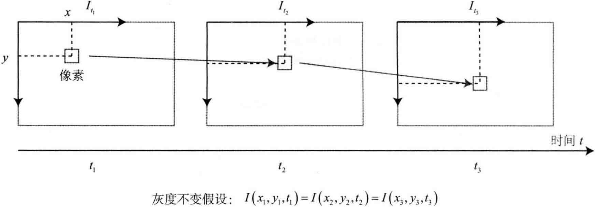
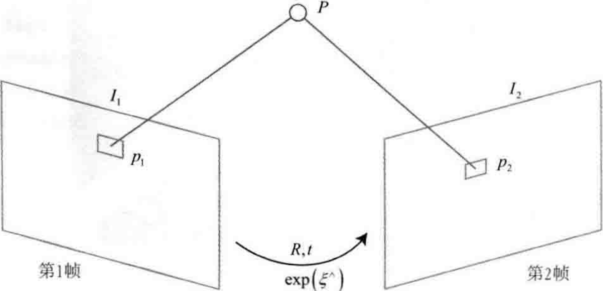

# 第8讲 视觉里程计2

<B>主要目标</B>

1. 理解光流法跟踪特征点的原理。
2. 理解直接法是如何估计相机位姿。
3. 实现多层直接法的计算。

直接法是视觉里程计的另一个主要分支，它与特征点法有很大不同。虽然它没有成为现在视觉里程计中的主流，但经过近几年的发展，直接法在一定程度上已经能和特征点法平分秋色。

## 8.1 直接法的引出

第7讲介绍了使用特征点估计相机运动的方法，尽管特征点法在视觉里程计中占据主流地位，但研究者们还是认识到它至少有以下几个缺点：

1. 关键点的提取与描述子的计算非常耗时。实践中，SIFT目前在CPU上是无法实时计算的，而ORB也需要近20毫秒的计算时长。如果整个SLAM以30毫秒/帧的速度运动，那么一大半时间都将花在计算特征点上。
2. 使用特征点时，忽略了除特征点以外的所有信息。一幅图像有几十万个像素，而特征点只有几百个。只使用特征点丢弃了大部分<B>可能有用的</B>图像信息。
3. 相机有时会运动到<B>特征缺失</B>的地方，这些地方往往没有明显的纹理信息。例如，有时会面对一堵白墙，或者一个空荡荡的走廊。这些场景下特征点数量会明显减少，我们可能找不到足够的匹配点来计算相机运动。

可以看到，特征点确实存在一些问题，有没有办法可以克服这些缺点呢？有以下几种思路：

- 保留特征点，但只计算关键点，不计算描述子。同时，使用<B>光流法(Optical Flow)</B>跟踪特征点的运动。这样可以回避计算和匹配描述子带来的时间，而光流本身的计算时间要小于描述子的计算与匹配。
- 只计算关键点，不计算描述子。同时，使用<B>直接发(Direct Mehtod)</B>计算特征点在下一时刻图像中的位置。这同样可以跳过描述子的计算过程，也省去了光流的计算时间。

第一种方法仍然使用特征点，只是把匹配描述子替换成了光流跟踪，估计相机运动仍使用对极几何、PnP或ICP算法。这依然会要求提取到的关键点具有可区别性，即需要提取到角点。而在直接法中，会根据图像的<B>像素灰度信息</B>同时估计相机运动和点的投影，不要求提取到的点必须为角点。甚至可以是随机的选点。

使用特征点法估计相机运动时，把特征点看作固定在三维空间的不动点。根据它们在相机中的投影位置，通过最小化<B>重投影误差(Reprojection error)</B>优化相机运动。在这个过程中，需要精确地知道空间点在两个相机中投影后的像素位置-- 这也就是我们要对特征进行匹配或跟踪的原因。同时，计算、匹配特征需要付出大量的计算量。相对地，在直接法中，我们并不需要知道点与点之间的对应关系，而是通过最小化<B>光度误差(Photometric error)</B>来求得它们。

直接法克服特征点法得上述缺点而存在，直接法根据像素的亮度信息估计相机得运动，可以完全不用计算关键点和描述子，于是，既避免了特征的计算时间，也避免了特征缺失的情况。只要场景中存在明暗变化(可以是渐变，不形成局部的图像梯度)，直接法就能工作。根据使用像素的数量，直接法分为稀疏、稠密和半稠密三种。与特征点法只能重构稀疏特征点(稀疏地图)相比，直接法还具有恢复稠密或半稠密结构的能力。

---

## 8.2 2D 光流

直接法是从光流法演变而来的，非常相似，具有相同的假设条件。光流描述了像素在图形中的运动，而直接法则附带着一个相机运动模型。先介绍光流：

光流是一种描述像素随时间在图像之间运动的方法，如下图所示，随着时间的流逝，同一个像素会在图像中运动，而我们希望追踪它的运动过程。其中，计算部分像素运动的称为<B>稀疏光流</B>，计算所有像素的称为<B>稠密光流</B>。稀疏光流以Lucas-Kanade光流为代表，并可以在SLAM中用于跟踪特征点位置。稠密光流以Horn-Schunck光流为代表，因此此，本节主要介绍Lucas-Kanade光流，也称为LK光流。

    

### Lucas-Kanade光流

在LK光流中，我们认为来自相机的图像是随时间变化的。图像可以看作时间的函数：$T(t)$。那么，一个在$t$时刻，位于$(x,y)$处的像素，它的灰度可以写成

$$
I(x,y,t).
$$

这种方式把图像看成了关于位置与时间的函数，它的值域就是图像中像素的灰度。现在考虑某个固定的空间点，它在$t$时刻的像素坐标为$x,y$。由于相机的运动，它的图像坐标将发生变化。我们希望估计这个空间点在其他时刻图像中的位置。怎么估计呢？这里要引入光流法的基本假设。

<B>灰度不变假设</B>：同一个空间点的像素灰度值，在各个图像中是固定不变的。

对于$t$时刻位于$(x,y)$处的像素，我们设$t+dt$时刻它运动拿到$(x+dx,y+dy)$处。<B>由于灰度不变</B>，我们有

$$
I(x + dx, y + dy, t + dt) = I(x, y, t). \tag{8.1}
$$

上面写灰度不变是一个很强的假设，实际中很可能不成立。事实上，由于物体的材质不同，像素会出现高光和阴影部分；有时，相机会自动调整曝光参数，使得图像整体变亮或变暗。这时灰度不变假设都是不成立的，因此光流的结果也不一定可靠。然而，从另一方面说，所有算法都是在一定假设下工作的。如果我们什么假设都不做，就没法设计实用的算法。所以，让我们暂时认为该假设成立，看看如何计算像素的运动。

对左边进行泰勒展开，保留一阶项，得

$$
I(x + dx, y + dy, t + dt) \approx I(x, y, t) + \frac{\partial I}{\partial x} dx + \frac{\partial I}{\partial y}dy + \frac{\partial I}{\partial t}dt. \tag{8.2}
$$

因为假设了灰度不变，于是下一时刻的灰度等于之前的灰度，从而：

$$
\frac{\partial I}{\partial x}dx + \frac{\partial I}{\partial y}dy + \frac{\partial I}{\partial t}dt = 0. \tag{8.3}
$$

两边除以$dt$，得

$$
\frac{\partial I}{\partial x}\frac{dx}{dt} + \frac{\partial I}{\partial y}\frac{dy}{dt} = -\frac{\partial I}{\partial t}. \tag{8.4}
$$

其中$dx/dt$为像素在$x$轴上的运动速度，而$dy/dt$为$y$轴上的速度，把它们记为$u,v$。同时，$\partial I / \partial x$为图像在该点处$x$方向的梯度，另一项则是在$y$方向的梯度，记为$I_x,I_y$。把图像灰度对时间的变化量记为$I_t$，写成矩阵形式，有

$$
\begin{bmatrix}
    I_x & I_y
\end{bmatrix} \begin{bmatrix}
    u \\ v
\end{bmatrix} = -I_t. \tag{8.5}
$$

我们想计算的是像素的运动$u,v$，但是该式是带有两个变量的一次，仅凭它无法计算出$u,v$。因此，必须引入额外的约束来计算$u,v$。在LK光流中，假设<B>某一个窗口内的像素具有相同的运动</B>。

考虑一个大小为$w\times w$的窗口，它含有$w^2$数量的像素。该窗口内像素具有同样的运动，因为我们共有$w^2$个方程：

$$
\begin{bmatrix}
    I_x & I_y
\end{bmatrix}_k \begin{bmatrix}
    u \\ v
\end{bmatrix} = -I_{tk}, \quad k=1,...,w^2. \tag{8.6}
$$

记：

$$
A = \begin{bmatrix}
    [I_x, I_y]_1 \\
    \vdots \\
    [I_x,I_y]_k
\end{bmatrix}, b = \begin{bmatrix}
    I_{t1} \\
    \vdots \\
    I_{tk}
\end{bmatrix}. \tag{8.7}
$$

于是，整个方程为

$$
A\begin{bmatrix}
    u \\ v
\end{bmatrix} = -b. \tag{8.8}
$$

这是一个关于$u,v$的超定线性方程，传统解法是求最小二乘解。最小二乘经常被用到：

$$
\begin{bmatrix}
    u \\ v
\end{bmatrix}^* = -(A^TA)^{-1}A^Tb.
$$

这样就得到了像素再图像间的运动速度$u,v$。当$t$取离散的时刻而不是连续时间时，可以估计某块像素在若干个图像重出现的位置。由于像素地图仅在局部有效，所以如果一次迭代不够好，可以多迭代几次这个方程。在SLAM中，LK光流常被用来跟踪角点的运动。

---

## 8.3 实践：LK光流

### 8.3.1 使用LK光流

### 8.3.2 用高斯牛顿法实现光流

### 8.3.3 光流实践小结

LK光流跟踪能够直接得到特征点的对应关系，这个对应关系就像是描述子的匹配，只是光流对图像的连续性和光照稳定性要求更高一些。可以通过光流跟踪的特征点，用PnP、ICP或对极几何来估计相机运动。

从运行时间看，演示实验大约有230个特征点，OpenCV和多层光流需要大约2毫秒完成追踪，这实际上是相当快的。如果使用FAST这样的关键点，那么整个光流计算可以做到5毫秒左右，相比于特征匹配来说算是非常快了。不过，如果角点提的位置不好，光流也容易跟丢或给出错误的结果，这就需要后续算法拥有一定的异常值去除机制。

总而言之，光流法可以加速基于特征点的视觉里程计算法，避免计算和匹配描述子的过程，但要求相机运动较平滑。

---

## 8.4 直接法

光流法与直接法类似。

### 8.4.1 直接法的推导

在光流法中，会首先追踪特征点的位置，再根据这些位置确定相机的运动。这样一种两步走的方案，很难保证全局的最优性。

<B>考虑</B>：能不能在后一步中，调整前一步的结果呢？例如，如果认为相机右转了15°，那么光流能不能以这个15°运动作为初始值的假设，调整光流的计算结果呢？直接法就是遵循这样的思路得到的结果。

如下图所示，考虑某个空间点$P$和两个时刻的相机。$P$的世界坐标为$[X,Y,Z]$，它在两个相机上成像，记像素坐标为$p_1,p_2$。

    

我们的目标是求第一个相机到第二个相机的相对位姿变换。以第一个相机为参照系，设第二个相机的旋转和平移为$R,t$（对应李群为T）。同时，两相机的内参相同，记为$K$。为清楚起见，我们列写完整的投影方程：

$$
p_1 = \begin{bmatrix}
    u \\ v \\ 1
\end{bmatrix}_1 = \frac{1}{Z_1}KP, \\
p_2 = \begin{bmatrix}
    u \\ v \\ 1
\end{bmatrix}_2 = \frac{1}{Z_2}K(RP + t) = \frac{1}{Z_2}K(TP)_{1:3}.
$$

其中$Z_1$是$P$的深度，$Z_2$是$P$在第二个相机坐标系下的深度，也就是$RP+t$的第三个坐标值。由于$T$只能和齐次坐标相乘，所以乘完之后要取出前3个元素。

在特征点法中，由于通过匹配描述子知道了$p_1,p_2$的像素位置，所以可以计算重投影的位置。但在直接法中，由于没有特征匹配，无从知道哪一个$p_2$与$p_1$对应着同一个点。直接法的思路是根据当前相机的位姿估计值寻找$p_2$的位置。但若相机位姿不够好，$p_2$的外观和$p_1$会有明显差别。于是，为了减少这个差别，我们优化相机的位姿，来寻找与$p_1$更相似的$p_2$。这同样可以通过解一个优化问题完成，但此时最小化的不是重投影误差，而是<B>光度误差</B>，也就是$P$的两个像素的亮度误差：

$$
e = I_1(p_1) - I_2(p_2). \tag{8.11}
$$

注意，这里的$e$是一个标量。同样地，优化目标为该误差的二范数，暂时取不加权的形式，为

$$
\min_{T} J(T) = \lVert e \rVert^2. \tag{8.12}
$$

能够做这种优化的理由，仍是基于<B>灰度不变假设</B>。我们假设一个空间点在各个视角下成像的灰度是不变的。我们有许多个(比如N个)空间点$P_i$，那么，整个相机位姿估计问题变为

$$
\min_{T}J(T) = \sum_{i=1}^{N} e_i^Te_i, \quad e_i = I_1(p_1,i) - I_2(p_2, i). \tag{8.13}
$$

注意，这里的优化变量是相机位姿$T$，而不像光流那样优化各个特征点的运动。为了求解这个优化问题，我们关心误差$e$是如何随着相机位姿$T$变化的，需要分析它们的导数关系。因此，定义两个中间变量：

$$
q = TP, \\
u = \frac{1}{Z_2}Kq.
$$

这里的$q$为$P$在第二个相机坐标系下的坐标，而$u$为它的像素坐标。显然$q$是$T$的函数，$u$是$q$的函数，从而也是$T$的函数。考虑李代数的左扰动模型，利用一阶泰勒展开，因为：

$$
e(T) = I_1(p_1) - I_2(u), \tag{8.14}
$$

所以：

$$
\frac{\partial e}{\partial T} = \frac{\partial I_2}{\partial u} \frac{\partial u}{\partial q} \frac{\partial q}{\partial \delta \xi} \delta \xi, \tag{8.15}
$$

其中$\delta\xi$为$T$的左扰动，我们看到，一阶导数由于链式法则分成了3项，而这3项都是容易计算的：

1. $\partial I_2/\partial u$为$u$处的像素梯度。
2. $\partial u / \partial q$为投影方程关于相机坐标系下的三维点的导数。记$q=[X,Y,Z]^T$，根据第7讲的推导，导数为

$$
\frac{\partial u}{\partial q} = \begin{bmatrix}
    \frac{\partial u}{\partial X} & \frac{\partial u}{\partial Y} & \frac{\partial u}{\partial Z} \\
    \frac{\partial v}{\partial X} & \frac{\partial v}{\partial Y} & \frac{\partial v}{\partial Z}
\end{bmatrix} = \begin{bmatrix}
    \frac{f_x}{Z} & 0 & -\frac{f_x X}{Z^2} \\
    0 & \frac{f_y}{Z} & -\frac{f_y Y}{Z^2}
\end{bmatrix}. \tag{8.16}
$$
3. $\partial q / \partial \delta \xi$ 为变换后的三维点对变换的导数，这在李代数一讲介绍过：

$$
\frac{\partial q}{\partial \delta \xi} = [I, -q^{\wedge}]. \tag{8.17}
$$

在实践中，由于后两项只与三维点$q$有关，而与图像无关，经常把它合并在一起：

$$
\frac{\partial u}{\partial \delta \xi} = \begin{bmatrix}
    \frac{f_x}{Z} & 0 & -\frac{f_x X}{Z^2} & -\frac{f_x XY}{Z^2} & f_x + \frac{f_x X^2}{Z^2} & -\frac{f_x Y}{Z} \\
    0 & \frac{f_y}{Z} & -\frac{f_y Y}{Z^2} & -f_y - \frac{f_y Y^2}{Z^2} & \frac{f_y XY}{Z^2} & \frac{f_y X}{Z}
\end{bmatrix}. \tag{8.18}
$$

这个$2\times 6$的矩阵在第7讲中也出现过。于是，我们推导处误差相对于李代数的雅可比矩阵：

$$
J = -\frac{\partial I_2}{\partial u} \frac{\partial u}{\partial \delta \xi}. \tag{8.19}
$$

对于$N$个点的问题，可以用这种方法计算优化问题的雅可比矩阵，然后使用高斯牛顿法或列文伯格-马奈尔特方法计算增量，迭代求解。至此，推导了直接法估计相机的整个流程。

### 8.4.2 直接法的讨论

在上面的推导中，$P$是一个已知位置的空间点，它是怎么来的呢？在RGB-D相机下，可以把任意像素反投影到三维空间中，然后投影到下一幅图像中。如果在双目相机中，那么同样可以根据视差来计算像素的深度。如果在单目相机中，这件事更为困难，因为我们还须考虑$P$的深度带来的不确定性。现在先来考虑简单的情况，即$P$深度已知的情况。

根据$P$的来源，可以把直接法进行分类：

1. $P$来自于稀疏关键点，称之为稀疏直接法。通常，我们使用数百个至上千个关键点，并且像L-K光流那样，假设它周围像素也是不变的。这种稀疏直接法不必计算描述子，并且只使用数百个像素，因此速度最快，但只能计算稀疏的重构。
2. $P$来自部分像素。我们看到式(8.19)中，如果像素梯度为零，那么整项雅可比矩阵就为零，不会对计算运动增量有任何贡献。因此，可以考虑只使用带有梯度的像素点，舍弃像素梯度不明显的地方。这称为半稠密(Semi-Dense)的直接法，可以重构一个半稠密结构。
3. $P$为所有像素，称为稠密直接法。稠密重构需要计算所有像素(一般几十万至几百万个)，因此多数不能再现有的CPU上实时计算，需要GPU的加速。但是，如前面讨论的，像素梯度不明显的点，在运动估计中不会有太大贡献，在重构时也会难以估计位置。

可以看到，从稀疏到稠密重构，都可以用直接法计算。它们的计算量是逐渐增长的。稀疏方法可以快速地求解相机位姿，而稠密方法可以建立完整地图。具体使用哪种方法，需要视机器人的应用环境而定。特别地，在低端的计算平台上，稀疏直接法可以做到非常快速的效果，适用于实时性较高且计算资源有限的场合。

---

## 实践：直接法

### 8.5.1 单层直接法

### 8.5.2 多层直接法

### 8.5.3 结果讨论

### 8.5.4 直接法优缺点总结

优点如下：

- 可以省去计算特征点，描述子的时间。
- 只要求有像素梯度即可，不需要特征点。因此，直接法可以在特征缺失的场合下使用。比较极端的例子是只有渐变的一幅图像。它可能无法提取角点类特征，但可以用直接法估计它的运动。在演示实验中，我们看到直接法对随机选取的点亦能正常工作。这一点在实用中非常关键，因为实用场景很有可能没有很多角点可供使用。
- 可以构建半稠密仍至稠密的地图，这时特征点法无法做到的。
  
缺点也很明显：

- <B>非凸性</B>。直接法完全依靠梯度搜索，降低目标函数来计算相机位姿。其目标函数中需要取像素点的灰度值，而图像是强烈非凸的函数。这使得优化算法容易进入极小，只在运动很小时直接法才能成功。针对于此，金字塔的引入可以在一定程度上减小非凸性的影响。
- <B>单个像素没有区分度</B>。和它像的实在太多了！于是我们要么计算图像块，要么计算复杂的相关性。由于每个像素对改变相机运动的“意见”不一致，只能少数服从多数，以数量代替质量。所以，直接法在选点较少时的表现下降明显，通常建议用500个点以上。
- <B>灰度值不变是很强的假设</B>。如果相机是自动曝光的，当它调整曝光参数时，会使得图像整体变亮或变暗。光照变化时也会出现这种情况。特征点法对光照具有一定的容忍性，而直接法由于计算灰度间的差异，整体灰度变化会破坏灰度不变假设，使算法失败。针对这一点，实用的直接法会同时估计相机的曝光参数 ，以便在曝光时间变化时也能工作。

---

