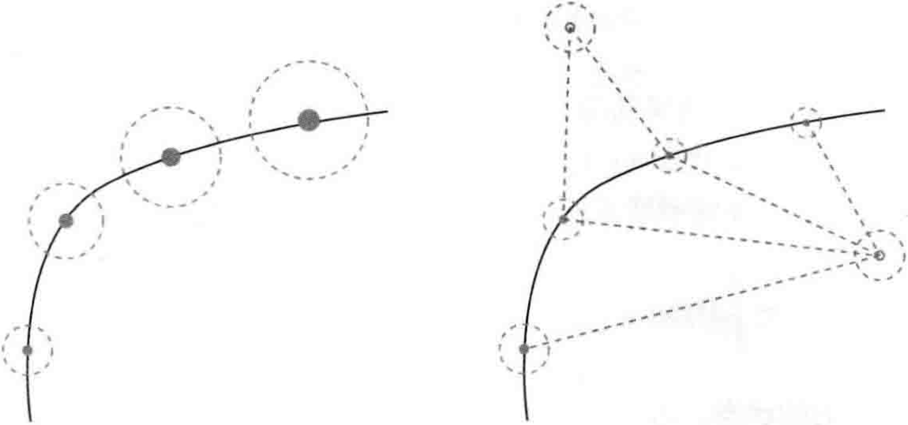

# 第9讲 后端1

<B>主要目标</B>

1. 理解后端的概念。
2. 理解以EKF为代表的滤波器后端的工作原理。
3. 理解非线性优化的后端，明白稀疏性是如何利用的。
4. 使用g2o和Ceres实际操作后端优化。

前端视觉里程计能给出一个短时间内的轨迹和地图，但由于不可避免的误差累积，这个地图在长时间内是不准确的。所以，在视觉里程计的基础上，还希望构建一个尺度、规模更大的优化问题，以考虑长时间内的最优轨迹和地图。不过，考虑到精度与性能的平衡，实际中存在着许多不同的做法。

## 9.1 概述

### 9.1.1 状态估计的概率解释

第2讲中提到，视觉里程计只有短暂的记忆，而我们希望整个运动轨迹在较长时间内都能保持最优的状态。在后端优化中，通常考虑一段更长时间内(或所有时间内)的状态估计问题，而且不仅使用过去的信息更新自己的状态，也会用未来的信息来更新，这种处理方式称为“<B>批量的</B>”(Batch)。否则，如果当前的状态只由过去的时刻决定，甚至只由前一个时刻决定，则称为“<B>渐进的</B>”(Incremental)。

已经知道SLAM过程可以由运动方程和观测方程来描述，那么，假设在$t=0$到$t=N$的时间内，有位姿$x_0$到$x_N$，并且有路标$y_1,\cdots,y_M$。按照之前的写法，运动和观测方程为

$$
\left\{ 
    \begin{array}{l}
        x_k = f(x_{k-1}, u_k) + w_k \\
        z_{k,j} = h(y_j,x_k) + v_{k,j}
    \end{array}
\right. k = 1,...,N,j = 1, ... , M. \tag{9.1}
$$

注意以下几点：

1. 观测方程中，只有当$x_k$看到了$y_j$时，才会产生观测数据，否则就没有，事实上，在一个位置通常只能看到一小部分路标。而且，由于视觉SLAM特征点数量众多，所以实际中观测方程的数量会远远大于运动方程。
2. 我们可能没有测量运动的装置，也可能没有运动方程。在这个情况下，有若干个处理方式：认为确实没有运动方程，或假设相机不动，或假设相机匀速运动。这几种方式都是可行的。在没有运动方程的情况下，整个优化问题就只由许多个观测方程组成。这就非常类似于SfM问题，相当于我们通过一组图像来恢复运动和结构。不同的是，SLAM中的图像有时间上的先后顺序，而SfM中允许使用完全无关的图像。

我们知道每个方程都受噪声影响，所以要把这里的位姿$x$和路标$y$看成<B>服从某种概率分布的随机变量</B>，而不是单独的一个数。因此，我们关心的问题就变成：当我们拥有某些运动数据$u$和观测数据$z$时，如何确定状态变量$x,y$的分布？进而，如果得到了新时刻的数据，它们的分布又将发生怎样的变化？在比较常见且合理的情况下，我们假设状态量和噪声项服从高斯分布--这意味着在程序中只需要存储它们的均值和协方差矩阵即可。均值可看作对变量最优值的估计，而协方差矩阵则度量了它的不确定性。那么，问题就转变为：当存在一些运动数据和观测数据时，我们如何估计状态量的高斯分布？

我们依然设身处地地扮演小萝卜，只有运动方程时，相当于我们蒙着眼睛在一个未知的地方走路。尽管我们知道自己每一步走了多远，但是随着时间流逝，我们越来越不确定自己的位置--内心也就越不安。这说明当输入数据受噪声影响时，<B>误差是逐渐累积的</B>，我们对位置房方差的估计将越来越大。但是，当我们睁开眼睛时，由于能够不断地观测到外部场景，使得位置估计的不确定性变小。如果用椭圆或椭球直观地表达协方差阵，那么这个过程有点像是在手机地图软件中走路的感觉。以下图为例，当没有观测数据时，这个圆会随着运动越来越大；而如果有正确的观测数据，圆会缩小至一定的大小，保持稳定。

    

> 左侧：只有运动方程时，由于下一时刻的位姿是在上一时刻的基础上添加了噪声，所以不确定性越来越大。右侧：存在路标点时，不确定性会明显减小。

在第6讲中，介绍了最大似然估计，提到<B>批量状态估计问题可以转化为最大似然估计问题，并使用最小二乘法进行求解</B>。在本节中，将探讨如何将该结论应用于渐进式问题，得到一些经典的结论。同时，在视觉SLAM里，最小二乘法又有何特殊的结构。

由于位姿何路标点都是待估计的变量，改变记号，令$x_k$为$k$时刻的所有未知量。它包含了当前时刻的相机位姿与$m$个路标点。在这种记号的意义下(虽然与之前稍有不同，但含义是清楚的)，写成

$$
x_k \overset{def}{=} {x_k,y_1,...,y_m}. \tag{9.2}
$$

同时，把$k$时刻的所有观测记作$z_k$。于是，运动方程与观测方程的形式可写得更简洁。这里不会出现$y$，但我们心里要明白这时$x$中已经包含了之前的$y$:

$$
\left\{
    \begin{array}{l}
        x_k = f(x_{k-1},u_k) + w_k \\
        z_k = h(x_k) + v_k
    \end{array}
 \right. k = 1,...,N. \tag{9.3}
$$

现在考虑第$k$时刻的情况，我们希望用过去$0$到$k$中的数据来估计现在的状态分布：

$$
P(x_k|x_0,u_{1:k},z_{1:k}). \tag{9.4}
$$

下标$0:k$表示从$0$时刻到$k$时刻的所有数据。请注意，$z_k$表示所有在$k$时刻的观测数据，它可能不止一个，只是这种记法更方便。同时，$x_k$实际上和$x_{k-1},x_{k-2}$这些量有关，但是此式没有显式地将它们写出来。

下面看看如何对状态进行估计，按照贝叶斯法则，把$z_k$与$x_k$交换位置，有

$$
P(x_k|x_0,u_{1:k},z_{1:k}) \propto P(z_k|x_k)P(x_k|x_0,u_{1:k},z_{1:k-1}). \tag{9.5}
$$

第一项称为<B>似然</B>，第二项称为<B>先验</B>。似然由观测方程给定，而先验部分，当前状态$x_k$是基于过去所有的状态估计得来的。至少，它会受$x_{k-1}$影响，于是以$x_{k-1}$时刻为条件概率展开：

$$
P(x_k|x_0,u_{1:k},z_{1:k-1}) = \int P(x_k|x_{k-1},x_0,u_{1:k},z_{1:k-1}) P(x_{k-1}|x_0,u_{1:k},z_{1:k-1})dx_{k-1}. \tag{9.6}
$$

如果考虑更久之前的状态，也可以继续对此式进行展开，但现在我们只关心$k$时刻和$k-1$时刻的情况。至此，我们给出了贝叶斯估计，因为上式还没有具体的概率分布形式，所以没法实际操作它。对这一步的后续处理，方法上产生了一些分歧。大体上讲，存在若干种选择：一种方法是假设<B>马尔可夫性</B>，简单的一阶马氏性认为，$k$时刻状态只与$k-1$时刻状态有关，而与再之前的无关。如果做出这样的假设，我们就会得到以<B>扩展卡尔曼滤波</B>(EKF)为代表的滤波器方法。在滤波方法中，我们会从某时刻的状态估计，推导到下一个时刻。另一种方法是依然考虑$k$时刻状态与之前<B>所有</B>状态的关系，此时将得到<B>非线性优化</B>为主体的优化框架。目前，视觉SLAM的主流为非线性优化方法。

### 9.1.2 线性系统和KF

