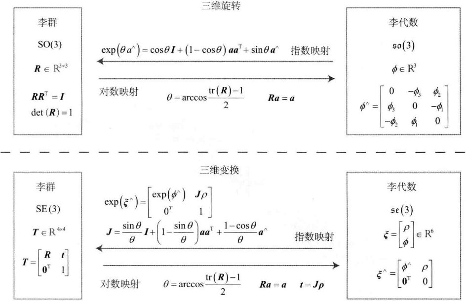

# 一.李群与李代数

## 1. 群

群(Group)是<b>一种集合</b>加上<b>一种运算</b>的代数结构，比如，集合$A$和运算$\cdot$，群记为$G=(A,\cdot)$，群满足以下几个条件：

1. 封闭性：$\forall a_1,a_2\in A, a_1 \cdot a_2 \in A.$
2. 结合律：$\forall a_1, a_2, a_3 \in A, (a_1\cdot a_2)\cdot a_3 = a_1\cdot (a_2 \cdot a_3).$
3. 幺元：$\exist a_0 \in A, s.t. \forall a \in A, a_0 \cdot a = a \cdot a_0 = a.$
4. 逆：$\forall a \in A, \exist a^{-1}\in A, \quad s.t. \quad a \cdot a^{-1} = a_0$

旋转矩阵构成了<b>特殊正交群$\mathbf{SO}(3)$</b>，变换矩阵构成了<b>特殊欧氏群$\mathbf{SE}(3)$</b>。它们对加法不封闭，但对乘法封闭。

$$
\mathbf{SO}(3) = {R \in \mathbb{R}^{3 \times 3}|RR^T = I, \det(R)=1}, \tag{4.1}
$$

$$
\mathbf{SE}(3) = \left\{T = \begin{bmatrix}
    R & t \\ 0^T & 1
\end{bmatrix} \in \mathbb{R}^{4 \times 4} | R \in \mathbf{SO}(3), t \in \mathbb{R}^3 \right\}. \tag{4.2}
$$

## 2. 李代数

任意随着时间变化的旋转矩阵$R(t)$，有

$$
R(t)R(t)^T = I.
$$

对时间求导： $\dot{R}(t)R(t)^T + R(t)\dot{R}(t)^T = 0.$
整理得：
$$
\dot{R}(t)R(t)^T = -\left( \dot{R}(t)R(t)^T \right)^T. \tag{4.3}
$$

$\dot{R}(t)R(t)^T$是一个反对称矩阵，根据上一节的内容，任意反对称矩阵都能找到对应唯一的向量：

$$
\dot{R}(t)R(t)^T = \phi(t)^{\wedge}. \tag{4.4}
$$

等式两边右乘$R(t)$，R为正交阵，有

$$
\dot{R}(t) = \phi(t)^{\wedge} R(t) = \begin{bmatrix}
    0 & -\phi_3 & \phi_2 \\
    \phi_3 & 0 & -\phi_1 \\
    -\phi_2 & \phi_1 & 0
\end{bmatrix} R(t). \tag{4.5}
$$

> 每对旋转矩阵求一次导数，只需左乘一个$\phi(t)^{\wedge}$矩阵即可。

把$R(t)$在$t=0$附近泰勒展开，$t_0=0$时，此时旋转矩阵$R(0) = I$:

$$
\begin{aligned}
    R(t) &\approx R(t_0) + \dot{R}(t_0)(t - t_0) \\
    &= I + \phi^{\wedge}(t_0)(t).
\end{aligned} \tag{4.6}
$$

> $\phi$反映了$R$的导数性质，它在$\mathbf{SO}(3)$原点附近的正切空间上。

假设$\phi(t_0) = \phi_0$: $\dot{R}(t) = \phi(t_0)^{\wedge}R(t) = \phi_0^{\wedge} R(t).$

求解微分方程有：

$$
R(t) = \exp(\phi_0^{\wedge}t). \tag{4.7}
$$

> 说明：在$t = 0$附近，旋转矩阵可以由$\exp(\phi_0^{\wedge}t)$计算出来。
> 旋转矩阵和反对称矩阵$\phi_0^{\wedge}t$通过指数关系发生了联系。

- 给定某时刻的$R$，就能求得一个$\phi$，它描述了$R$在局部的导数关系，与$R$对应的$\phi$正是对应到$\mathbf{SO}(3)$上的李代数$\mathcal{so}(3)$;
- 从$R$到$\phi$，以及它们的反转换，是李群与李代数间的指数/对数映射。

### 2.1 李代数定义

李代数描述了李群的局部性质，准确的说，是单位元附近的正切空间。一个集合$\mathbb{V}$、一个数域$\mathbb{F}$和一个二元运算$[,]$组成，二元运算称为<b>李括号</b>，满足以下性质：

1. 封闭性 $\forall X,Y \in \mathbb{V}, [X,Y] \in \mathbb{V}$.
2. 双线性 $\forall X,Y,Z \in \mathbb{V}, a,b \in \mathbb{F}$，有
   $$
   [aX + bY, Z] = a[X,Z] + b[Y, Z], \quad [Z, aX + bY] = a[Z, X] + b[Z, Y].
   $$
3. 自反性 $\forall X \in \mathbb{V}, [X, X] = 0.$
4. 雅可比等价 $\forall X,Y,Z \in \mathbb{V}, [X,[Y,Z]] + [Z,[X,Y]] + [Y,[Z,X]] = 0.$

<b>三维向量$\mathbb{R}^{3}$上定义的叉积$\times$是一种李括号，因此$\mathcal{g}=(\mathbb{R}^3, R, \times)$构成了一个李代数。</b>

### 2.2 李代数$\mathcal{so}(3)$

SO(3)对应的李代数是定义在$\mathbb{R}^3$上的向量，记作$\phi$：

$$
\Phi = \phi^{\wedge} = \begin{bmatrix}
    0 & -\phi_3 & \phi_2 \\
    \phi_3 & 0 & -\phi_1 \\
    -\phi_2 & \phi_1 & 0
\end{bmatrix} \in \mathbb{R}^{3 \times 3}. \tag{4.8}
$$

两个向量的李括号(叉乘)为：

$$
\begin{aligned}
    [\phi_1, \phi_2] &= \phi_1 \times \phi_2 = \begin{Vmatrix}
        e_1 & e_2 & e_3 \\
        a_1 & a_2 & a_3 \\
        b_1 & b_2 & b_3
    \end{Vmatrix}  = \begin{bmatrix}
        a_2b_3 - a_3b_2 \\
        a_3b_1 - a_1b_3 \\
        a_1b_2 - a_2b_1
    \end{bmatrix} \\
    &= (\Phi_1\Phi_2 - \Phi_2\Phi_1)^{\vee}
\end{aligned}. \tag{4.9}
$$

总结：$\mathcal{so}(3)$的元素是三维向量或者三维反对称矩阵：
$$
\mathcal{so}(3) = \left\{ \phi \in \mathbb{R}^3, \Phi = \phi^{\wedge} \in \mathbb{R}^{3 \times 3} \right\}. \tag{4.10}
$$

李代数$\mathcal{so}(3)$与旋转矩阵的关系由指数映射给定：

$$
R = \exp(\phi^{\wedge}). \tag{4.11}
$$

### 2.3 李代数$\mathcal{se}(3)$

李群SE(3)对应的李代数定义在$\mathbb{R}^6$空间上的向量，记作$\mathcal{se}(3)$:
$$
\mathcal{se}(3) = \left\{ \xi = \begin{bmatrix} \rho \\ \phi \end{bmatrix} \in \mathbb{R}^6, \rho \in \mathbb{R}^3, \phi \in \mathcal{so}(3), \xi^{\wedge} = \begin{bmatrix}
    \phi^{\wedge} & \rho \\
    0^T & 0
\end{bmatrix} \in \mathbb{R}^{4 \times 4} \right\}. \tag{4.12}
$$

这是一个6维的向量，前三维是平移，记作$\rho$(含义与变换矩阵中的平移不同)；后三维是旋转，记作$\phi$，实质上是$\mathcal{so}(3)$元素。

李代数$\mathcal{se}(3)$，李括号运算为：

$$
[\xi_1, \xi_2] = (\xi_1^{\wedge}\xi_2^{\wedge} - \xi_2^{\wedge}\xi_1^{\wedge})^{\vee}. \tag{4.13}
$$

> 在$\mathcal{se}(3)$中，同样使用$^{\wedge}$符号，将一个六维向量转换成四维矩阵，但不再表示反对称。

## 3. 指数和对数映射

### 3.1 SO(3)上的指数映射

根据指数的泰勒展开，$\exp(\phi^{\wedge})$计算如下：

$$
\exp(\phi^{\wedge}) = \sum_{n=1}^{\infty}\frac{1}{n!}(\phi^{\wedge})^n. \tag{4.14}
$$

定义$\phi$三维向量的模长为$\theta$和方向为$a$，于是$\phi = \theta a$，其中$\lVert a \rVert = 1$，对于$a^{\wedge}$，有：

$$
a^{\wedge} a^{\wedge} = \begin{bmatrix}
    -a_2^2 - a_3^2 & a_1 a_2 & a_1 a_3 \\
    a_1 a_2 & -a_1^2 - a_3^2 & a_2 a_3 \\
    a_1 a_3 & a_2 a_3 & -a_1^2 - a_2^2
\end{bmatrix} = aa^T - I, \tag{4.15}
$$

以及

$$
a^{\wedge} a^{\wedge} a^{\wedge} = a^{\wedge}(aa^T - I) = -a^{\wedge}. \tag{4.16}
$$

于是，把指数映射写成：

$$
\begin{aligned}
    \exp(\phi^{\wedge}) &= \exp(\theta a^{\wedge}) = \sum_{n=0}^{\infty} \frac{1}{n!}(\theta a^{\wedge}) \\
    &= I + \theta a^{\wedge} + \frac{1}{2!} \theta^2 a^{\wedge} a^{\wedge} + \frac{1}{3!} \theta^3 a^{\wedge} a^{\wedge} a^{\wedge} + \frac{1}{4!}\theta^4 (a^{\wedge})^4 + ... \\
    &= aa^T - a^{\wedge} a^{\wedge} +  \theta a^{\wedge} + \frac{1}{2!} \theta^2 a^{\wedge} a^{\wedge} - \frac{1}{3!} \theta^3 a^{\wedge} - \frac{1}{4!}\theta^4 (a^{\wedge})^2 + ... \\
    &= aa^T + \underbrace{\left(\theta - \frac{1}{3!} \theta^3 + \frac{1}{5!} \theta^5 - ... \right)}_{\sin\theta}a^{\wedge} - \underbrace{\left( 1- \frac{1}{2!} \theta^2 + \frac{1}{4!}\theta^4 - ... \right)}_{\cos\theta}a^{\wedge} a^{\wedge} \\
    &= a^{\wedge} a^{\wedge} + I + \sin \theta a^{\wedge} - \cos \theta a^{\wedge} a^{\wedge} \\
    &= (1 - \cos \theta)a^{\wedge} a^{\wedge} + I + \sin \theta a^{\wedge} \\
    &= \cos \theta + (1 - \cos\theta)aa^T + \sin\theta a^{\wedge}.
\end{aligned}
$$

整理结果得：

$$
\exp(\theta a^{\wedge}) = \cos\theta I + (1 - \cos \theta)aa^T + \sin\theta a^{\wedge}. \tag{4.17}
$$

上式和罗德里格斯公式如出一辙，这表明，$\mathcal{so}(3)$实际上就是由所谓的<b>旋转向量</b>组成的空间，而指数映射即罗德里格斯公式。通过它们，把$\mathcal{so}(3)$中任意一个向量对应到了一个位于SO(3)中的旋转矩阵。反之，如果定义对数映射，也能把SO(3)中的元素对应到$\mathcal{so}(3)$中：

$$
\phi = \ln(R)^{\vee} = \left( \sum_{n=0}^{\infty} \frac{(-1)^n}{n + 1}(R - I)^{n + 1} \right)^{\vee}. \tag{4.18}
$$

### 3.2 SE(3)上的指数映射

李群$\mathrm{SE}(3)$对应的李代数为$\xi$，反对称矩阵为：

$$
\xi^{\wedge} = \begin{bmatrix}
    \phi^{\wedge} & \rho \\
    0^T & 0
\end{bmatrix}
$$

李代数$\mathcal{se}(3)$上的指数映射为：

$$
\begin{aligned}
    \exp(\xi^{\wedge}) &= \begin{bmatrix}
        \sum_{n=1}^{\infty}\frac{1}{n!}(\phi^{\wedge})^n & \sum_{n=1}^{\infty}\frac{1}{(n+1)!}(\phi^{\wedge})^n \rho \\
        0^T & 1
    \end{bmatrix} \\
    &\overset{\Delta}{=} \begin{bmatrix}
        R & J\rho \\
        0^T & 1
    \end{bmatrix} = T. 
\end{aligned}\tag{4.19}
$$

$$
\begin{aligned}
    \sum_{n=1}^{\infty} \frac{1}{(n+1)!}(\phi^{\wedge})^n &= I + \frac{1}{2!}\theta a^{\wedge} + \frac{1}{3!}\theta^3 (a^{\wedge})^3 + \frac{1}{4!}\theta^4 (a^{\wedge})^4 + \frac{1}{5!}\theta^5 (a^{\wedge})^5 + ... \\
    &= \frac{1}{\theta}\left( \frac{1}{2!}\theta^2 - \frac{1}{4!}\theta^4 + ... \right)(a^{\wedge}) + \frac{1}{\theta}\left( \frac{1}{3!}\theta^3 - \frac{1}{5!}\theta^5 + ... \right)(a^{\wedge})^2 + I \\
    &= \frac{1}{\theta}(1 - \cos\theta)(a^{\wedge}) + \frac{\theta - \sin\theta}{\theta}(aa^T - I) + I \\
    &= \frac{\sin\theta}{\theta}I + \left( 1 - \frac{\sin\theta}{\theta} \right)aa^T + \frac{1 - \cos\theta}{\theta}a^{\wedge} \overset{def}{=}J.
\end{aligned} \tag{4.20}
$$

$\xi$的指数映射左上角的$R$是$\mathrm{SO}(3)$中的元素，与$\mathcal{se}(3)$中的旋转部分$\phi$对应，而右上角的$\mathbin{J}$由上面的推导给出：

$$
J = \frac{\sin\theta}{\theta}I + \left( 1 - \frac{\sin\theta}{\theta} \right)aa^T + \frac{1 - \cos\theta}{\theta}a^{\wedge}. \tag{4.21}
$$

变换矩阵$T$左上角对应旋转矩阵$R$，右上角是平移$t$满足：

$$
t = J\rho \tag{4.22}
$$

李群、李代数转换关系总结如下：

    

## 4. 李代数求导与扰动模型
### 4.1 BCH公式与近似形式

两个李代数指数映射乘积的完整形式，由Baker-Campbell-Hausdorff公式(BCH公式)给出，给出其展开式的前几项：

$$
\ln(\exp(A)\exp(B)) = A + B + \frac{1}{2}[A,B] + \frac{1}{12}[A,[A,B]] - \frac{1}{12}[B,[A,B]] + ... \tag{4.23}
$$
> 其中[]为李括号。当处理两个矩阵指数之积时，会产生一些由李括号组成的余项。

SO(3)上的李代数$\ln(\exp(\phi^{\wedge})\exp(\phi^{\wedge}))^{\vee}$，当$\phi_1$或$\phi_2$为小量时，小量二次以上的项都可以被忽略，此时，BCH拥有线性近似表达：

$$
\ln(\exp(\phi_1^{\wedge})\exp(\phi_2^{\wedge}))^{\vee} \approx \left\{
    \begin{array}{l}
        J_l(\phi_2)^{-1}\phi_1 + \phi_2 \qquad 当\phi_1为小量, \\
        J_r(\phi_1)^{-1}\phi_2 + \phi_1 \qquad 当\phi_2为小量.
    \end{array}
\right. \tag{4.24}
$$

> 当对一个旋转矩阵$R_2$（李代数为$\phi_2$）左乘一个微小旋转矩阵$R_1$(李代数为$\phi_1$)时，可以近似地看作，在原有的李代数$\phi_2$上加上了一项$$
> 同理，第二个近似描述了右乘一个微小位移的情况。
> 李代数在BCH近似下，分成了左乘近似和右乘近似两种。

左乘BCH近似雅可比$J_l$就是式(4.27)的内容：

$$
J_l = J = \frac{\sin\theta}{\theta} I + \left( 1 - \frac{\sin\theta}{\theta} \right)aa^T + \frac{1 - \cos\theta}{\theta}a^{\wedge}. \tag{4.25}
$$

它的逆为

$$
J_l^{-1} = \frac{\sin\theta}{\theta} I + \left( 1 - \frac{\sin\theta}{\theta} \right)aa^T + \frac{1 - \cos\theta}{\theta}a^{\wedge}. \tag{4.26}
$$

右乘雅可比仅需要对自变量取负号即可：

$$
J_r(\phi) = J_l(-\phi). \tag{4.27}
$$

对旋转矩阵$R$左乘一个微小旋转，记作$\Delta R$，对应的李代数($\mathcal{so}(3)$)为$\Delta \phi$，

$$
\Delta R\cdot R = \exp(\Delta \phi^{\wedge}) \exp(\phi^{\wedge}) = \exp\left( (\phi + J_l^{-1}(\phi)\Delta \phi)^{\wedge} \right). \tag{4.28}
$$

在李代数($\mathcal{so}(3)$)上进行加法：

$$
\exp((\phi + \Delta\phi)^{\wedge}) = \exp\left( (J_r \Delta \phi) \right) \exp(\phi^{\wedge}) = \exp(\phi^{\wedge})\exp\left( (J_r\Delta\phi)^{\wedge} \right). \tag{4.29}
$$

李代数$\mathcal{se}(3)$左乘和右乘微小李代数

$$
\Delta T\cdot T = \exp(\Delta\xi^{\wedge})\exp(\xi^{\wedge}) \approx \exp\left( (\mathcal{J}_l^{-1}\Delta\xi + \xi)^{\wedge} \right), \tag{4.30}
$$

$$
T\cdot \Delta T = \exp(\xi^{\wedge}) \exp(\Delta\xi^{\wedge}) \approx \exp\left( (\mathcal{J}_r^{-1}\Delta\xi + \xi)^{\wedge} \right), \tag{4.31}
$$

### 4.2 SO(3)上的李代数求导

1. 用李代数表示姿态，然后根据李代数加法对<b>李代数求导</b>。
2. 对李群左乘或右乘微小扰动，然后对该扰动求导，称为左扰动和右扰动模型。

---

### 4.3 李代数求导

假设对一个空间点$p$进行了旋转，得到了$Rp$，现在要计算旋转之后的坐标相对于旋转的导数，记为：$\frac{\partial(Rp)}{\partial R}$.

因为SO(3)没有加法，所以该导数无法按照导数的定义进行计算，转而计算：
$$
\frac{\partial(\exp(\phi^{\wedge})p)}{\partial \phi} = -(Rp)^{\wedge}J_l. \tag{4.32}
$$

### 4.4 扰动模型(左乘)

另一种求导方式是对R进行一次扰动$\Delta R$，看结果相对于扰动的变化率，这个扰动可以左乘，也可以右乘。
以左扰动为例，左扰动$\Delta R$对应的李代数为$\varphi$，然后，对$\varPhi$求导，即

$$
\frac{\partial(Rp)}{\partial \varphi} = \lim_{\varphi \to 0}\frac{\exp(\phi^{\wedge})\exp(\phi^{\wedge})p - \exp(\phi^{\wedge})p}{\varphi} = -(Rp)^{\wedge}. \tag{4.33}
$$

相比于直接对李代数求导，省去了一个雅可比$J_l$的计算，这使得扰动模型更为实用。

### 4.5 SE(3)上的李代数求导

空间点$p$经过一次变换$T$(对应李代数为$\xi$)，得到$Tp$，现在，给$T$左乘一个扰动$\Delta T = \exp(\delta \xi^{\wedge})$，设扰动项的李代数为$\delta \xi = [\delta \rho, \delta \phi]^T$，那么：

$$
\frac{\partial (Tp)}{\partial \delta \xi} = \lim_{\delta \xi \to 0} = \frac{\exp(\delta \xi^{\wedge})\exp(\xi^{\wedge})p - \exp(\xi^{wedge})p}{\delta \xi} = \begin{bmatrix}
I & -(Rp + t)^{\wedge} \\
0^T & 0^T
\end{bmatrix} \overset{def}{=} = (Tp)^{\odot}.
$$