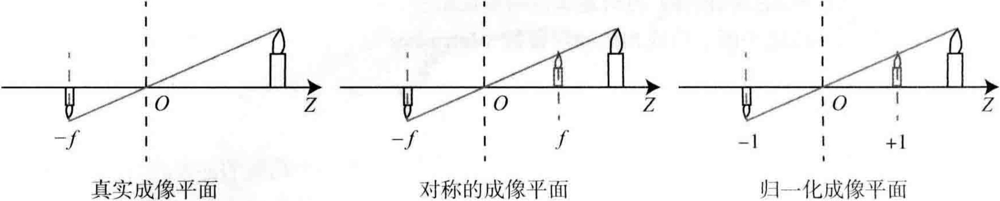
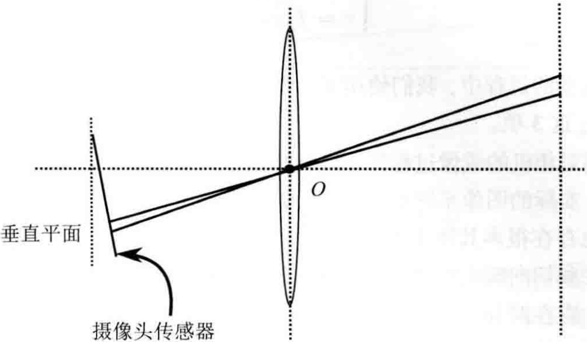
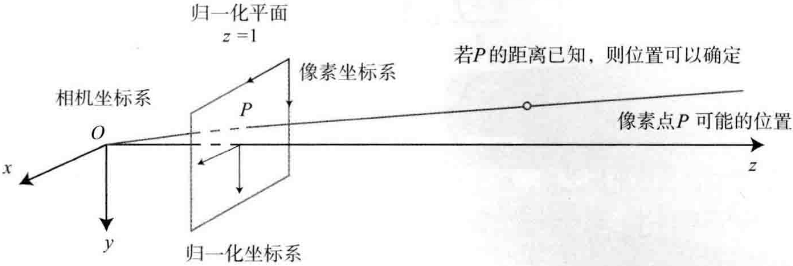
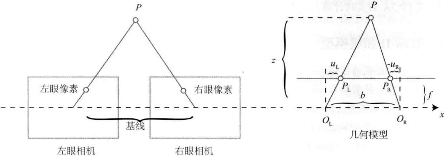

# 第5讲 相机与图像

## 5.1 相机模型

相机将三维世界中的坐标点映射到二维图像平面的过程用最简单的<B>针孔模型</B>，由于相机镜头上的透镜的存在，使得光线投影到成像平面的过程中会产生<B>畸变</B>。

针孔和畸变两个模型能够把外部的三维点投影到相机内部成像平面，构成相机的<B>内参数</B>(Intrinsics)。

### 5.1.1 针孔相机模型

如下图5-1所示：

    
     
    
图 5-1 针孔相机模型

$O-x-y-z$为相机坐标系，z轴指向相机前方，$x$轴向右，$y$轴向下，$O$为摄像机的<b>光心</b>，也是针孔模型中的针孔，现实世界的空间点$P$，经过小孔$O$投影之后，落在物理成像平面$O'-x'-y'$上，成像点为$P'$。$P$的坐标为$[X,Y,Z]^T$，$P'$的坐标为$[X',Y',Z']^T$，物理成像平面到小孔的距离为$f$(焦距)，三角形相似关系如下：

$$
\frac{Z}{f} = -\frac{X}{X'} = -\frac{Y}{Y'}. \tag{5.1}
$$

负号表示成立倒像，为了方便，等价地把成像平面对称地放到相机前方，如下图5-2所示：

    
     
    
图 5-2 真实成像平面，对称的成像平面，归一化成像平面

$$
\frac{Z}{f} = \frac{X}{X'} = \frac{Y}{Y'}. \tag{5.2}
$$

整理得：

$$
\begin{array}{l}
X' = f\frac{X}{Z} \\
Y' = f\frac{Y}{Z}
\end{array}. \tag{5.3}
$$

像素平面是在物理成像平面上的$o-u-v$，在像素平面得到$P'$的<b>像素坐标</b>：$[u,v]^T$。

像素坐标系：原点$o'$位于图像的左上角，$u$轴向右与$x$轴平行，$v$轴向下与$y$轴平行，像素坐标系与成像平面之间，相差一个<b>缩放</b>和一个<b>原点的平移</b>。假设在$u$轴上缩放了$\alpha$倍，在$v$轴上缩放了$\beta$倍。同时，原点平移了$[c_x,c_y]^T$，那么，$P'$的坐标与像素坐标$[u,v]^T$的关系为

$$
\left\{
\begin{aligned}
    u = \alpha X' + c_x \\
    v = \beta Y' + c_y
\end{aligned}
\right. . \tag{5.4}
$$

代入式(5.3)并把$\alpha f$合并成$f_x$，把$\beta f$合并成$f_y$，得

$$
\left\{
\begin{aligned}
    u = f_x \frac{X}{Z} + c_x \\
    v = f_y \frac{Y}{Z} + c_y
\end{aligned}
\right.. \tag{5.5}
$$

> $f$的单位为米，$\alpha,\beta$的单位为像素/米，所以$f_x,f_y$和$c_x,c_y$的单位为像素。

$$
\begin{pmatrix}
    u \\ v \\ 1
\end{pmatrix} = \frac{1}{Z} \begin{pmatrix}
    f_x & 0 & c_x \\
    0 & f_y & c_y \\
    0 & 0 & 1
\end{pmatrix} \overset{def}{=} \frac{1}{Z}KP.
$$

把$Z$挪到左侧：

$$
Z\begin{pmatrix}
    u \\ v \\ 1
\end{pmatrix} = \begin{pmatrix}
    f_x & 0 & c_x \\
    0 & f_y & c_y \\
    0 & 0 & 1
\end{pmatrix} \begin{pmatrix}
    X \\ Y \\ Z
\end{pmatrix} \overset{def}{=} KP. \tag{5.7}
$$

K称为<b>相机的内参数(Camera Intrinsics)</b>矩阵K。如果需要自己确定相机的内参，也就是所谓的<b>标定</b>，比如单目棋盘格张正友标定法。

在式(5.6)中，使用的是P在相机坐标系下的坐标，由于相机在运动，所以$P$的相机坐标应该是它的世界坐标(记为$P_w$)根据相机的当前相机位姿变换到相机坐标系下的结果。相机的位姿由它的旋转矩阵$R$和平移向量$t$来描述，那么有：

$$
ZP_{uv} = Z\begin{bmatrix} u \\ v \\ 1 \end{bmatrix} = K(RP_w + t) = KTP_w. \tag{5.8}
$$

相机的位姿$R,t$称为<b>相机的外参数</b>(Camera Extrinsics)。内参不变，外参会随着相机运动发生改变。

点$P$在相机<b>归一化平面</b>上的投影：

$$
(RP_w + t) = \underbrace{[X,Y,Z]^T}_{相机坐标} \to \underbrace{[X/Z,Y/Z,1]^T}_{归一化坐标}. \tag{5.9}
$$

### 5.1.2 畸变模型

由透镜形状引起的畸变(Distortion，也叫失真)称为<b>径向畸变</b>，分为两大类：<b>桶形畸变</b>和<b>枕形畸变</b>。桶形畸变图像放大率随着与光轴之间的距离增加而减小，而枕形畸变相反。

由于在相机的组装过程中不能使透镜和成像面严格平行，引入的畸变称为<b>切向畸变</b>。

    
     
    
图 5-3 径向畸变的两种类型

    
     
    
图 5-4 切向畸变来源示意图

考虑<b>归一化平面</b>上的任意一点$p$，它的坐标为$[x,y]^T$，也可写成极坐标的形式$[r,\theta]^T$，其中$r$表示点$p$与坐标系原点之间的距离，$\theta$表示与水平轴的夹角。径向畸变是坐标点沿着长度方向发生了变化，也即是其距离原点的长度发生了变化，切向畸变是坐标点沿着切线方向发生了变化，也就是水平角发生了变化。

径向畸变：
$$
\begin{array}{l}
x_{distorted} = x(1 + k_1 r^2 + k_2 r^4 + k_3 r^6) \\
y_{distorted} = y(1 + k_1 r^2 + k_2 r^4 + k_3 r^6)
\end{array}. \tag{5.10}
$$

其中，$[x_{distorted}, y_{distorted}]^T$是畸变后点的<b>归一化坐标</b>。另外，对于<b>切向畸变</b>，可以使用另外两个参数$p_1,p_2$进行纠正：

切向畸变：
$$
\begin{array}{l}
x_{distorted} = x + 2 p_1 x y + p_2(r^2 + 2x^2) \\
y_{distorted} = y + p_1(r^2 + 2y^2) + 2p_2 x y
\end{array}. \tag{5.11}
$$

联合式(5.10)和式(5.11)，对于相机坐标系中的一点$P$，通过5个畸变系数找到这个点在像素平面上的正确位置：

1. 将三维空间点投影到归一化图像平面，设它的归一化坐标为$[x,y]^T$。

2. 对归一化平面上的点计算径向畸变和切向畸变。
$$
\left\{
    \begin{aligned}
        x_{distorted} = x(1 + k_1 r^2 + k_2 r^4 + k_3 r^6) + 2 p_1 xy + p_2(r^2 + 2x^2) \\
        y_{distorted} = y(1 + k_1 r^2 + k_2 r^4 + k_3 r^6) + p_1(r^2 + 2y^2) + 2p_2 x y
    \end{aligned}
\right.. \tag{5.12}
$$

3. 将畸变后的点通过内参数矩阵投影到像素平面，得到该点在图像上的正确位置。
$$
\left\{
    \begin{aligned}
        u = f_x x_{distorted} + c_x \\
        v = f_y y_{distorted} + c_y
    \end{aligned}
\right.. \tag{5.13}
$$
> 上面的纠正畸变过程中，使用了5个畸变项，实际应用中，可以灵活选择纠正模型，比如只选择$k_1,p_1,p_2$这三项。

去畸变处理做法：
1. 先对整张图像进行去畸变，得到去畸变后的图像，然后讨论此图像上的点的空间位置；
2. 从畸变图像上的某个点出发，按照畸变方程，讨论其畸变前的空间位置。

总结单目相机的成像过程：
1. 世界坐标系下有一个固定的点$P$，世界坐标为$P_w$。
2. 由于相机在运动，它的运动由$R,t$或变换矩阵$T \in SE(3)$描述，$P$的相机坐标为$\tilde{P_c}=RP_w + t$。
3. 这时的$\tilde{P_c}$的分量为$X,Y,Z$，把它们投影到归一化平面$Z=1$上，得到$P$的归一化坐标：$P_c=[X/Z,Y/Z, 1]^T$。
4. 有畸变时，根据畸变参数计算$P_c$发生畸变后的坐标。
5. $P$的归一化坐标经过内参后，对应到它的像素坐标：$P_{uv}=KP_c$。

> 世界坐标，相机坐标，归一化坐标，像素坐标

### 5.1.3 双目相机模型

单个相机，仅根据一个像素，无法确定这个空间点的具体位置。因为，从相机光心到归一化平面连线上的所有点，都可以投影至该像素上。只有当$P$的深度确定时(比如通过双目或RGB-D相机)，才能确切地知道它的空间位置。

    
     
    
图 5-5 像素点可能存在的位置

双目相机通过同步采集左右相机的图像，计算图像间视差，以便估计每一个像素的深度：

    
     
    
图 5-6 双目相机的成像模型。$O_L,O_R$为左右光圈中心，方框为成像平面，$f$为焦距。$u_L$和$u_R$为成像平面的坐标。$u_R$为负数。

两个相机的光圈中心之间的距离称为双目相机的<b>基线</b>(记作b)，是双目相机的重要参数。

假设一个空间点$P$，它在左右眼相机各成一像，记作$P_L,P_R$，理想情况下，左右成像平面两个像只在$x$轴(对应图像的$u$轴)上有差异。记它的左侧坐标为$u_L$，右侧坐标为$u_R$，几何关系如图5-6右侧所示，根据$\Delta PP_LP_R$和$\Delta PO_LO_R$的相似关系，有

$$
\frac{z-f}{z} = \frac{b-u_L+u_R}{b}. \tag{5.14}
$$

整理得：

$$
z = \frac{fb}{d}, \qquad d \overset{def}{=}u_L - u_R. \tag{5.15}
$$

其中$d$定义为左右图的横坐标之差，称为<b>视差</b>。根据视差，可以估计一个像素与相机之间的距离。

视差与距离成反比：视差越大，距离越近。同时，由于视差最小为一个像素，于是双目的深度存在一个理论上的最大值，由$fb$确定。基线越长，双目能测到的最大距离就越远；反之，小型双目器件只能测量很近的距离。

视差$d$本身的计算比较困难，需要确切地知道左眼图像的某个像素出现在右眼图像的哪一个位置。

### 5.1.4 RGB-D相机模型

相比于双目相机通过视差计算深度的方式，RGB-D相机能够主动测量每个像素的深度，RGB-D相机原理：
1. 通过<b>红外结构光</b>(Structured Light)原理测量像素距离。例：Kinect1代、Project Tango 1代、Intel RealSense等。
2. 通过<b>飞行时间</b>(Time-of-Flight, ToF)原理测量像素距离。例：Kinect 2代。
