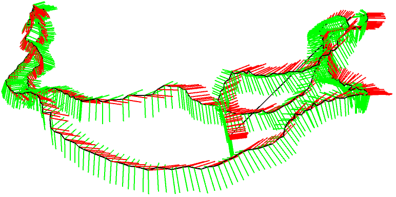

# Chapter3.6

## 3.6 实践：Eigen几何模块

### 3.6.1 Eigen 几何模块的数据演示

演示程序演示前面介绍的各种旋转表达方式，在Eigen中使用四元数、欧拉角和旋转矩阵，演示它们之间的变换方式。

- slambook2/ch3/useGeometry/useGeometry.cpp

```cpp
#include <iostream>
#include <cmath>

using namespace std;

#include <Eigen/Core>
#include <Eigen/Geometry>

using namespace Eigen;

/**
 * 演示 Eigen 几何模块的使用方法
*/

int main(int argc, char **argv)
{
    // Eigen/Geometry 模块提供了各种旋转和平移的表示
    // 3D 旋转直接使用 Matrix3d 或 Matrix3f
    Matrix3d rotation_matrix = Matrix3d::Identity();    // 单位矩阵
    
    // 旋转向量
    // 旋转向量使用 AngleAxis，它底层不直接是Matrix，但运算可以当作矩阵（因为重载了运算符）
    // std::cout << "rotation_matrix: \n" << rotation_matrix << std::endl;
    AngleAxisd rotation_vector(M_PI / 4, Vector3d(0, 0 , 1));   // 沿 z 轴旋转 45 度
    cout.precision(3);
    cout << "rotation matrix (rotation_vector to matrix) = \n" << rotation_vector.matrix() << endl; // 用matrix()转换成矩阵

    // 也可以直接赋值
    rotation_matrix = rotation_vector.toRotationMatrix();
    cout << "rotation matrix (rotation_vector toRotationMatrix) = \n" << rotation_matrix << endl; // 用matrix()转换成矩阵
    // 用 AngleAxis 可以进行坐标变换
    Vector3d v(1, 0, 0);
    Vector3d v_rotated = rotation_vector * v;
    std::cout << "(1, 0, 0) after rotation (by angle anxis) = " << v_rotated.transpose() << std::endl;

    // 或者用旋转矩阵
    v_rotated = rotation_matrix * v;
    std::cout << "(1, 0, 0) after rotation (by matrix) = " << v_rotated.transpose() << std::endl;

    // 欧拉角：可以将旋转矩阵直接转换成欧拉角
    Vector3d euler_angles = rotation_matrix.eulerAngles(2, 1, 0);   // ZYX顺序，即yaw-pitch-roll顺序
    std::cout << "yaw pitch roll = " << euler_angles.transpose() << std::endl;

    // 欧氏变换矩阵使用 Eigen::Isometry
    Isometry3d T = Isometry3d::Identity();  // 虽然称为3d，实质上是 4*4 的矩阵
    T.rotate(rotation_vector);              // 按照rotation_vector进行旋转
    T.pretranslate(Vector3d(1, 3, 4));      // 把平移向量设成(1, 3, 4)
    std::cout << "Transform matrix = \n" << T.matrix() << std::endl;

    // 用变换矩阵进行坐标变换
    Vector3d v_transformed = T * v;         // 相当于 R*v + t
    std::cout << "v transformed = " << v_transformed.transpose() << std::endl;

    // 对于仿射和射影变换，使用Eigen::Affine3d 和 Eigen::Projective3d 即可，

    // 四元数
    // 可以直接把AngleAxis赋值给四元数，反之亦然
    Quaterniond q = Quaterniond(rotation_vector);
    std::cout << "quaternion from rotation vector = " << q.coeffs().transpose() << std::endl;   // coeffs的顺序是（x,y,z,w)，w为实部，前三者为虚部
    
    // 也可以把旋转矩阵赋给它
    q = Quaterniond(rotation_matrix);
    std::cout << "quaternion from rotation matrix = " << q.coeffs().transpose() << std::endl;

    // 使用四元数旋转一个向量，使用重载的乘法即可
    v_rotated = q * v;  // 注意数学上是qvq^{-1}
    std::cout << "(1, 0, 0) after rotation matrix = " << v_rotated.transpose() << std::endl;

    // 用常规向量乘法表示，则应该计算如下
    std::cout << "should be equal to " << (q * Quaterniond(0, 1, 0, 0) * q.inverse()).coeffs().transpose() << std::endl;

    return 0;
}
```

Eigen中对各种形式的表达方式总结如下。每种类型都有单精度和双精度两种数据类型，而且和之前一样，不能由编译器自动转换。下面以双精度为例，可以把最后的d改成f，即得到单精度的数据结构。

- 旋转矩阵（3x3）: Eigen::Matrix3d。
- 旋转向量（3x1）: Eigen::AngleAxisd。
- 欧拉角（3x1）: Eigen::Vector3d。
- 四元数（4x1）: Eigen::Quaterniond。
- 欧式变换矩阵（4x4）: Eigen::Isometry3d。
- 仿射变换（4x4）: Eigen::Affine3d。
- 射影变换（4x4）: Eigen::Projective3d。

> <B>程序代码通常和数学表示有一些细微的差别</B>。例如，通过运算符重载，四元数和三维向量可以直接计算乘法，但在数学上则需要先把向量转成虚四元数，再利用四元数乘法进行计算，同样的情况也适用于变换矩阵乘三维向量的情况。总而言之，程序中的用法会比数学公式更灵活。


### 3.6.2 实际的坐标变换例子

下面举一个小例子来演示坐标变换

<B>例子 </B> 设有小萝卜一号和小萝卜二号位于世界坐标系中。记世界坐标系为$W$，小萝卜们的坐标系为$R_1$和$R_2$。小萝卜一号的位姿为$q_1=[0.35,0.2,0.3,0.1]^T,t_1=[0.3,0.1,0.1]^T$。小萝卜二号的位姿为$q_2=[-0.5,0.4,-0.1,0.2]^T,t_2=[-0.1,0.5,0.3]^T$。这里的$q$和$t$表达的是$T_{R_k ,W},k=1,2$，也就是世界坐标系到相机坐标系的变换关系。现在，小萝卜一号看到某个点在自身的坐标系下坐标为$p_{R_1}=[0.5,0,0.2]^T$，求该向量在小萝卜二号坐标系下的坐标。

- slambook2/ch3/examples/coordinateTransform.cpp
```cpp
#include <iostream>
#include <vector>
#include <algorithm>
#include <Eigen/Core>
#include <Eigen/Geometry>

using namespace std;
using namespace Eigen;

int main(int argc, char **argv)
{
    /**
     * T1w^{-1}p1 = T2w^{-1}p1'
     * p1' = T2w T1w^{-1}p1
    */
    Quaterniond q1(0.35, 0.2, 0.3, 0.1), q2(-0.5, 0.4, -0.1, 0.2);
    q1.normalize(); // 规范化，将四元数的长度缩放到单位长度，四元数模=1.
    q2.normalize();

    Vector3d t1(0.3, 0.1, 0.1), t2(-0.1, 0.5, 0.3);
    Vector3d p1(0.5, 0, 0.2);

    Isometry3d T1w(q1), T2w(q2);
    T1w.pretranslate(t1);
    T2w.pretranslate(t2);

    Vector3d p2 = T2w * T1w.inverse() * p1;
    std::cout << std::endl << p2.transpose() << std::endl;
    return 0;
}
```

程序输出的答案是$[-0.0309731,0.73499,0.296108]^T$，计算过程也十分简单，只需计算

$$
p_{R_2} = T_{R_2,W}T_{W,R_1}p_{R_1}
$$

即可。注意四元数使用之前需要归一化。

---

## 3.7 可视化演示

### 3.7.1 显示运动轨迹

本节演示两个可视化的例子。首先，假设我们通过某种方式记录了一个机器人的运动轨迹，现在想把它画到一个窗口中。假设轨迹文件存储于trajectory.txt，每一行用下面的格式存储：

$$
time,t_x,t_y,t_z,q_x,q_y,q_z,q_w,
$$

其中，time指该位姿的记录时间，t为平移，q为旋转四元数，均是以世界坐标系到机器人坐标系记录。原则上，如果只谈论“机器人的位姿”，那么可以使用$T_{WR}$或者$T_{RW}$，事实上他们只相差一个逆，这意味着知道其中一个就可以很轻松地得到另一个。如果想要存储<B>机器人的轨迹</B>，那么可以存储所有时刻的$T_{WR}$或者$T_{RW}$，这并没有太大的差别。

在画轨迹时，把“轨迹”画成一系列点组成的序列，这和我们想象中的“轨迹”比较相似。这其实是<B>机器人(相机)坐标系的原点在世界坐标系中的坐标</B>。考虑机器人坐标系的原点$O_R$，此时的$O_W$就是这个原点在世界坐标系下的坐标：

$$
O_W = T_{WR}O_R = t_{WR}. \tag{3.48}
$$

这正是$T_{WR}$的平移部分，因此，可以从$T_{WR}$中直接看到<B>相机在何处</B>，这也是我们说$T_{WR}$更为直观的原因。因此，在可视化程序里，轨迹文件存储了$T_{WR}$而不是$T_{RW}$。

- slambook2/ch3/examples/plotTrajectory.cpp
```cpp
#include <pangolin/pangolin.h>
#include <Eigen/Core>
#include <unistd.h>

// 本例演示了如何画出一个预先存储的轨迹

using namespace std;
using namespace Eigen;

// path to trajectory file
std::string trajectory_file = "./examples/trajectory.txt";

void DrawTrajectory(vector<Eigen::Isometry3d, Eigen::aligned_allocator<Eigen::Isometry3d>>);

int main(int argc, char **argv)
{
    vector<Isometry3d, Eigen::aligned_allocator<Isometry3d>> poses;
    ifstream fin(trajectory_file);
    if (!fin) {
        std::cout << "cannot find trajectory file at " << trajectory_file << std::endl;
        return 1;
    }

    while (!fin.eof()) {
        double time, tx, ty, tz, qx, qy, qz, qw;
        fin >> time >> tx >> ty >> tz >> qx >> qy >> qz >> qw;
        Isometry3d Twr(Quaterniond(qw, qx, qy, qz));
        Twr.pretranslate(Vector3d(tx, ty, tz));
        poses.push_back(Twr);
    }

    std::cout << "read total " << poses.size() << " pose entries" << std::endl;

    // draw trajectory in pangolin
    DrawTrajectory(poses);

    return 0;
}

/*****************************************************************************/
void DrawTrajectory(vector<Isometry3d, Eigen::aligned_allocator<Isometry3d>> poses)
{
    // create pangolin window and plot the trajectory
    pangolin::CreateWindowAndBind("Trajectory Viewer", 1024, 768);
    glEnable(GL_DEPTH_TEST);
    glEnable(GL_BLEND);
    glBlendFunc(GL_SRC_ALPHA, GL_ONE_MINUS_SRC_ALPHA);

    pangolin::OpenGlRenderState s_cam(
        pangolin::ProjectionMatrix(1024, 768, 500, 500, 512, 289, 0.1, 1000),
        pangolin::ModelViewLookAt(0, -0.1, -1.8, 0, 0, 0, 0.0, -1.0, 0.0)
    );

    pangolin::View &d_cam = pangolin::CreateDisplay()
        .SetBounds(0.0, 1.0, 0.0, 1.0, -1024.0f / 768.0f)
        .SetHandler(new pangolin::Handler3D(s_cam));
    
    while (pangolin::ShouldQuit() == false) {
        glClear(GL_COLOR_BUFFER_BIT | GL_DEPTH_BUFFER_BIT);
        d_cam.Activate(s_cam);
        glClearColor(1.0f, 1.0f, 1.0f, 1.0f);
        glLineWidth(2);
        for (size_t i = 0; i < poses.size(); i++) {
            // 画每个位姿的三个坐标轴
            Vector3d Ow = poses[i].translation();
            Vector3d Xw = poses[i] * (0.1 * Vector3d(1, 0, 0));
            Vector3d Yw = poses[i] * (0.1 * Vector3d(0, 1, 0));
            Vector3d Zw = poses[i] * (0.1 * Vector3d(0, 0, 1));

            glBegin(GL_LINES);
            glColor3f(1.0, 0.0, 0.0);   // 红
            glVertex3d(Ow[0], Ow[1], Ow[2]);
            glVertex3d(Xw[0], Xw[1], Xw[2]);

            glColor3f(0.0, 1.0, 0.0);   // 绿
            glVertex3d(Ow[0], Ow[1], Ow[2]);
            glVertex3d(Yw[0], Yw[1], Yw[2]);

            glColor3f(0.0, 1.0, 0.0);   // 蓝
            glVertex3d(Ow[0], Ow[1], Ow[2]);
            glVertex3d(Zw[0], Zw[1], Zw[2]);

            glEnd();
        }
        // 画出连线
        for (size_t i = 0; i < poses.size(); i++) {
            glColor3f(0.0, 0.0, 0.0);
            glBegin(GL_LINES);
            auto p1 = poses[i], p2 = poses[i + 1];
            glVertex3d(p1.translation()[0], p1.translation()[1], p1.translation()[2]);
            glVertex3d(p2.translation()[0], p2.translation()[1], p2.translation()[2]);
            glEnd();
        }
        pangolin::FinishFrame();
        usleep(5000);   // sleep 5 ms
    }
}
```

> 该程序演示了如何在Pangolin中画出3D的位姿，用红绿蓝三种颜色画出每个位姿的三个坐标轴（实际上计算了各坐标轴的世界坐标），然后用黑色线将轨迹连起来。位姿可视化的结果如图3-3所示。

<div align=center>
    
    <br />
    <p>图 3-3 位姿可视化的结果</p>
</div>


### 3.7.2 显示相机的位姿

除了显示轨迹，也可以显示3D窗口中相机的位姿。在slambook2/ch3/visualizeGeometry中，以可视化的形式演示相机位姿的各种表达方式(如图3-4所示)。当用鼠标操作相机时，左侧的方框里会实时显示相机位姿对应的旋转矩阵、平移、欧拉角和四元数，可以看到数据是如何变化的。通常，除了欧拉角，看不出它们直观的含义。尽管旋转矩阵或变换矩阵不直观，但是将它们可视化地显示出来并不困难。该程序使用Pangolin库作为3D显示库。

<div align=center>
    <br />
    <p>图 3-4 旋转矩阵、平移、欧拉角、四元数的可视化程序</p>
</div>