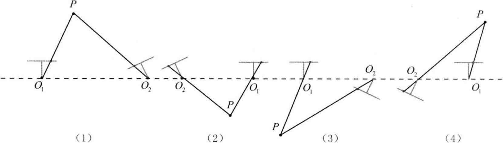

# Chapter7.3

# 7.3 2D-2D: 对极几何

## 7.3.1 对极约束

假设从两张图像中得到了一对配对好的特征点，如下图所示：

    

如果有若干对这样的匹配点，就可以通过这些二维图像点的对应关系，恢复出在两帧之间摄像机的运动。

以上图为例，希望求两帧图像$I_1,I_2$之间的运动，假设第一帧到第二帧的运动为$R,t$，两个相机中心分别为$O_1,O_2$，现在考虑$I_1$中有一个特征点$p_1$，它在$I_2$中对应着特征点$p_2$。如果匹配正确，说明它确实是<B>同一个空间点在两个成像平面上的投影</B>。

连线$\overrightarrow{O_1p_1}$和连线$\overrightarrow{O_2p_2}$在三维空间中会相交于点$P$，这时$O_1,O_2,P$三个点可以确定一个平面，称为<B>极平面(Epipolar plane)</B>。$O_1O_2$连线与像平面$I_1,I_2$的交点分别为$e_1,e_2$。$e_1,e_2$称为<B>极点(Epipoles)</B>，$O_1O_2$被称为<B>基线</B>。我们称极平面与两个像平面$I_1,I_2$之间的相交线$l_1,l_2$为<B>极线(Epipolar line)</B>。

从第一帧的角度看，射线$\overrightarrow{O_1p_1}$是<B>某个像素可能出现的空间位置</B>--因为该射线上的所有点都会投影到同一个像素点，同时，如果不知道$P$的位置，那么当我们在第二幅图像上看时，连线$\overrightarrow{e_2p_2}$(也就是第二幅图像中的极线)就是$P$可能出现的投影的位置，也就是射线$\overrightarrow{O_1p_1}$在第二个相机中的投影。

现在，由于通过特征点匹配确定了$p_2$的像素位置，所以能够推断$P$的空间位置，以及相机的运动。从代数的角度来分析这里的几何关系，在第一帧的坐标系下，设$P$的空间位置为

$$
P=[X,Y,Z]^T.
$$

根据针孔相机模型，我们知道两个像素点$p_1,p_2$的像素位置为

$$
s_1p_1=KP, \quad s_2P_2=K(RP+t). \tag{7.1}
$$

这里$K$为相机内参矩阵，$R,t$为两个坐标系的相机运动。

有时会使用齐次坐标表示像素点，在使用齐次坐标时，一个向量将等于它自身乘上任意的非零常数，这通常用于表达一个投影关系。例如，$s_1p_1$和$p_1$成投影关系，它们在齐次坐标的意义下是相等的。我们称这种相等关系为尺度意义下相等(equal up to a scale)，记作：

$$
sp \simeq p. \tag{7.2}
$$

那么，上述两个投影关系可写为：

$$
p_1 \simeq KP, \quad p_2 \simeq K(RP + t). \tag{7.3}
$$

现在，取：

$$
x_1 = K^{-1}p_1, \quad x_2 = K^{-1}p_2. \tag{7.4}
$$

这里的$x_1,x_2$是两个像素点的归一化平面上的坐标。代入上式，得

$$
x_2 \simeq R x_1 + t. \tag{7.5}
$$

两边同时左乘$t^{\wedge}$，相当于两侧同时与$t$做外积：

$$
t^{\wedge}x_2\simeq t^{\wedge}Rx_1. \tag{7.6}
$$

然后，两侧同时左乘$x_2^T$:

$$
x_2^Tt^{\wedge}x_2 \simeq x_2^Tt^{\wedge}Rx_1. \tag{7.7}
$$

观察等式左侧，$t^{\wedge}x_2$是一个与$t$和$x_2$都垂直的向量，它再和$x_2$做内积时，将得到0.由于等式左侧严格为零，乘以任意非零常数之后也为零，于是我们可以把$\simeq$写成通常的等号。因此，我们就得到了一个简洁的式子：

$$
x_2^Tt^{\wedge}Rx_1 = 0. \tag{7.8}
$$

重新代入$p_1,p_2$，有

$$
p_2^TK^{-1}t^{\wedge}RK^{-1}p_1 = 0. \tag{7.9}
$$

这两个式子都称为<B>对极约束</B>，它以形式简洁著名，它的几何意义是$O_1,P,O_2$三者共面。对极约束中同时包含了平移和旋转。把中间部分记作两个矩阵：基础矩阵(Fundamental Matrix)<B>F</B>和本质矩阵(Essential Matrix)<B>E</B>，于是可以进一步简化对极约束：

$$
\mathord{E=t^{\wedge}R,\quad F = K^{-1}EK^{-1}, \quad x_2^TEx_1=p_2^TFP_1=0}. \tag{7.10}
$$

对极约束简洁地给出了两个匹配点的空间位置关系，于是，相机位姿估计问题变为以下两步：

1. 根据配对点的像素位置求出$E$或者$F$。
2. 根据$E$或者$F$求出$R,t$。

由于$E$和$F$只相差了相机内参，而内参在SLAM中通常是已知的，所以实践中往往使用形式更简单的$E$。以$E$为例，介绍上面两个问题如何求解。

## 7.3.2 本质矩阵

根据定义，本质矩阵$E=t^{\wedge}R$，它是一个$3\times 3$的矩阵，内有9个未知数。那么，是不是任意一个$3\times3$的矩阵都可以被当成本质矩阵呢？从$E$的构造方式上看，有以下值得注意的地方：

- 本质矩阵是由对极约束定义的，由于对极约束是<B>等式为零</B>的约束，所以对$E$乘以任意非零常数后，<B>对极约束依然满足</B>。把这件事称为$E$在不同尺度下是等价的。
- 根据$E=t^{\wedge}R$，可以证明，本质矩阵$E$的奇异值必定是$[\rho,\rho,0]^T$的形式，这称为<B>本质矩阵的内在性质</B>。
- 另外，由于平移和旋转各有3个自由度，故$t^{\wedge}R$共有6个自由度，但由于尺度等价性，故$E$实际上有5个自由度。

$E$具有5个自由度的事实，表明我们最少可以用5对点来求解$E$，但是，$E$的内在性质是一种非线性性质，在估计时会带来麻烦，因此，也可以只考虑它的<B>尺度等价性</B>，使用8对点来估计$E$--这就是经典的<B>八点法(Eight-point-algorithm)</B>。八点法只利用了$E$的线性性质，因此可以在线性代数框架下求解。

考虑一对匹配点，它们的归一化坐标为$x_1=[u_1,v_1,1]^T,x_2=[u_2,v_2,1]^T$。根据对极约束，有

$$
\begin{pmatrix} u_1,v_2,1 \end{pmatrix} \begin{pmatrix} e_1 & e_2 & e_3 \\ e_4 & e_5 & e_6 \\ e_7 & e_8 & e_9 \end{pmatrix} \begin{pmatrix}
    u_1 \\ v_1 \\ 1
\end{pmatrix} = 0. \tag{7.11}
$$

把矩阵$E$展开，写成向量的形式：

$$
e=[e_1, e_2, e_3, e_4, e_5, e_6, e_7, e_8, e_9]^T,
$$

那么，对极约束可以写成与$e$有关的线性形式：

$$
[u_2u_1, u_2v_1,u_2,v_2u_1,v_2v_1,u_1,v_1,1]\cdot e = 0. \tag{7.12}
$$

同理，对于其他点对也有相同的表示，把所有点都放到一个方程中，变成线性方程组($u^i,v^i$表示第$i$个特征点，以此类推)：

$$
\begin{pmatrix}
    u_2^1u_1^1 & u_2^1v_1^1 & u_2^1 & v_2^1u_1^1 & v_2^1v_1^1 & v_2^1 & u_1^1 & v_1^1 & 1 \\
    u_2^2u_1^2 & u_2^2v_1^2 & u_2^2 & v_2^2u_1^2 & v_2^2v_1^2 & v_2^2 & u_1^2 & v_1^2 & 1 \\
    \vdots & \vdots & \vdots & \vdots & \vdots & \vdots & \vdots & \vdots & 1 \\
    u_2^8u_1^8 & u_2^8v_1^8 & u_2^8 & v_2^8u_1^8 & v_2^8v_1^8 & v_2^8 & u_1^8 & v_1^8 & 1 \\
\end{pmatrix} \begin{pmatrix}
    e_1 \\ e_2 \\ e_3 \\ e_4 \\ e_5 \\ e_6 \\ e_7 \\ e_8 \\ e_9
\end{pmatrix} = 0. \tag{7.13}
$$

这8个方程构成了一个线性方程组，它的系数矩阵由特征点位置构成，大小为$8\times 9$，$e$位于该矩阵的零空间中，如果系数矩阵是满秩的(即秩为8)，那么它的零空间维数为1，也就是$e$构成一条线，这与$e$的尺度等价性是一致的。如果8对匹配点组成的矩阵满足秩为8的条件，那么$E$的各元素就可由上述方程解得。

接下来的问题是如何根据已经估得的本质矩阵$E$，恢复出相机的运动$R,t$，这个过程是由奇异值分解(SVD)得到的，设$E$的SVD为

$$
E=U\Sigma V^T, \tag{7.14}
$$

其中$U,V$为正交阵，$\Sigma$为奇异值矩阵，根据$E$的内在性质，我们知道$\Sigma=\mathbf{diag}(\rho, \rho, 0)$。在SVD分解中，对于任意一个$E$，存在两个可能的$t,R$与它对应：

$$
\begin{array}{l}
    t_1^{\wedge}=UR_Z(\frac{\pi}{2})\Sigma U^T, \quad R_1=UR_Z^T(\frac{\pi}{2})V^T \\
    t_2^{\wedge}=UR_Z(-\frac{\pi}{2})\Sigma U^T, \quad R_2=UR_Z^T(-\frac{\pi}{2})V^T.
\end{array} \tag{7.15}
$$

其中，$\mathbin{R}_Z(\frac{\pi}{2})$表示沿$Z$轴旋转90°得到旋转将矩阵，同时，由于$-\mathbin{E}$和$\mathbin{E}$等价，所以对任意一个$\mathbin{t}$取负号，也会得到同样的结果。因此，从$E$分解得到$t,R$时，一共存在4个可能的解。

下图形象地展示了分解本质矩阵得到的4个解，我们已知空间点在相机(蓝色线)上的投影(红色点)，想要求解相机的运动。在保持红色点不变的情况下，可以画出4种可能的情况。不过，幸运的是，只有第一种解中$P$在两个相机中都具有正的深度。因此，只要把任意一点代入4种解中，检测该点在两个相机下的深度，就可以确定哪个解是正确的了。

    

如果利用$E$的内在性质，那么它只有5个自由度，所以最少可以通过5对点来求解相机运动。然而这种做法形式复杂，从工程实现角度考虑，由于平时通常会有几十对乃至上百对的匹配点，从8对减至5对意义并不明显。

剩下的一个问题是：根据线性方程解出的$E$，可能不满足$E$的内在性质--它的奇异值不一定为$\rho,\rho,0$的形式。这时，我们会刻意地把$\Sigma$矩阵调整成上面的样子，通常的做法是，对八点法求得的$E$进行SVD，会得到奇异值矩阵$\Sigma=\mathbf{diag}(\rho_1,\rho_2,\rho_3)$，不妨设$\rho_1 \ge \rho_2 \ge \rho_3$。取：

$$
E = U \mathbf{diag}(\frac{\rho_1 + \rho_2}{2}, \frac{\rho_1 + \rho_2}{2}, 0)V^T. \tag{7.16}
$$

这相当于是把求出来的矩阵投影到了$E$所在的流形上，当然，更简单的做法是将奇异值矩阵取成$\mathbf{diag}(1,1,0)$，因为$E$具有尺度等价性，所以这样做也是合理的。

## 7.3.3 单应矩阵

除了基本矩阵和本质矩阵，而视图几何中还存在另一种常见的矩阵：单应矩阵(Homomgraphy)$H$，它描述了两个平面之间的映射关系。若场景中的特征点都落在同一个平面(比如墙、地面等)，则可以通过单应性进行运动估计。这种情况在无人机携带的俯视相机或扫地机携带的顶视相机中比较常见。

单应矩阵通常描述处于共同平面上的一些点在两张图像之间的变换关系。设图像$I_1$和$I_2$有一对匹配好的特征点$p_1$和$p_2$，这个特征点落在平面$P$上，设这个平面满足方程：

$$
n^TP + d = 0. \tag{7.17}
$$

稍加整理，得

$$
-\frac{n^TP}{d} = 1.
$$

根据式(7.1)，得

$$
\begin{aligned}
p_2 &\simeq K(RP + t) \\
&\simeq K\left( RP + t\cdot(-\frac{n^TP}{d}) \right) \\
&\simeq K\left(R-\frac{tn^T}{d} \right)P \\
&\simeq K\left(R-\frac{tn^T}{d} \right)K^{-1}p_1.
\end{aligned}
$$

于是，得到了一个直接描述图像坐标$p_1$和$p_2$之间的变换，把中间这部分记为$H$，于是：

$$
p_2 \simeq Hp_1. \tag{7.19}
$$

它的定义与旋转、平移以及平面的参数有关。与基础矩阵$F$类似，单应矩阵$H$也是一个$3\times3$的矩阵，求解时的思路和$F$类似，同样可以先根据匹配点计算$H$，然后将它分解以计算旋转和平移，把上式展开，得

$$
\begin{pmatrix}
    u_2 \\ v_2 \\ 1
\end{pmatrix} \simeq \begin{pmatrix}
    h_1 & h_2 & h_3 \\
    h_4 & h_5 & h_6 \\
    h_7 & h_8 & h_9
\end{pmatrix} \begin{pmatrix}
    u_1 \\ v_1 \\ 1
\end{pmatrix}. \tag{7.20}
$$

这里得等号依然是$\simeq$而不是普通的等号，所以$H$矩阵也可以乘以任意非零常数。在实际处理中可以令$h_9 = 1$，然后根据第3行，去掉这个非零银子，于是有

$$
    u_2 = \frac{h_1u_1 + h_2 v_1 + h_3}{h_7u_1 + h_8 v_1 + h_9} \\
    v_2 = \frac{h_4u_1 + h_5 v_1 + h_6}{h_7u_1 + h_8 v_1 + h_9}.
$$

整理得

$$
h_1u_1 + h_2 v_1 + h_3 - h_7 u_1 v_2 - h_8 v_1 u_2 = u_2 \\
h_4u_1 + h_5 v_1 + h_6 - h_7 u_1 v_2 - h_8 v_1 v_2 = v_2.
$$

这样一组内存匹配点就可以构造出两项约束(事实上有三个约束，但是因为线性相关，只取前两个)，于是自由度为8得单应矩阵可以通过4对匹配特征点算出(在非退化的情况下，即这些特征点不能有三点共线的情况)，即求解以下的线性方程组(当$h_9=0$时，右侧为零)：

$$
\begin{pmatrix}
    u_1^1 & v_1^1 & 1 & 0 & 0 & 0 & -u_1^1 u_2^1 & -v_1^1 u_2^1 \\
    0 & 0 & 0 & u_1^1 & v_1^1 & 1 & -u_1^1 v_2^1 & -v_1^1 v_2^1 \\
    u_1^2 & v_1^2 & 1 & 0 & 0 & 0 & -u_1^2 u_2^2 & -v_1^2 u_2^2 \\
    0 & 0 & 0 & u_1^2 & v_1^2 & 1 & -u_1^2 v_2^2 & -v_1^2 v_2^2 \\
    u_1^3 & v_1^3 & 1 & 0 & 0 & 0 & -u_1^3 u_2^3 & -v_1^3 u_2^3 \\
    0 & 0 & 0 & u_1^3 & v_1^3 & 1 & -u_1^3 v_2^3 & -v_1^3 v_2^3 \\
    u_1^4 & v_1^4 & 1 & 0 & 0 & 0 & -u_1^4 u_2^4 & -v_1^4 u_2^4 \\
    0 & 0 & 0 & u_1^4 & v_1^4 & 1 & -u_1^4 v_2^4 & -v_1^4 v_2^4
\end{pmatrix} \begin{pmatrix}
    h_1 \\ h_2 \\ h_3 \\ h_4 \\ h_5 \\ h_6 \\ h_7 \\ h_8
\end{pmatrix} = \begin{pmatrix}
    u_2^1 \\ v_2^1 \\ u_2^2 \\ v_2^2 \\ u_2^3 \\ v_2^3 \\ u_2^4 \\ v_2^4
\end{pmatrix}. \tag{7.21}
$$

这种做法把$H$矩阵看成了向量，通过解该向量的线性方程来恢复$H$吗，又称直接线性变换法(Direct Linear Transform, DLT)。与本质矩阵相似，求出单应矩阵以后需要对其进行分解，才可以得到相应的旋转矩阵$R$和平移向量$t$。分解的方法包括数值法与解析法。与本质矩阵的分解类似，单应矩阵的分解同样会返回4组旋转矩阵与平移向量，同时，可以计算出它们分别对应的场景点所在平面的法向量。

如果已知成像的地图点的深度全为正值(即在相机前方)，则又可以排除两组解，最后仅剩两组解，这时需要通过更多的先验信息进行判断。通常，我们可以通过假设已知场景平面的法向量来解决，如场景平面与相机平面平行，那么法向量$n$的理论值为$1^T$。

单应性在SLAM中具有重要意义，当特征点共面或者相机发生纯旋转时，基础矩阵的自由度下降，这就出现了所谓的退化(degenerate)。现实中的数据总包含一些噪声，这时如果继续使用八点法求解基础矩阵，基础矩阵多余出来的自由度将会主要由噪声决定。为了能够避免退化现象造成的影响，通常我们会同时估计基础矩阵$F$和单应矩阵$H$，选择重投影误差比较小的那个作为最终的运动估计矩阵。

---