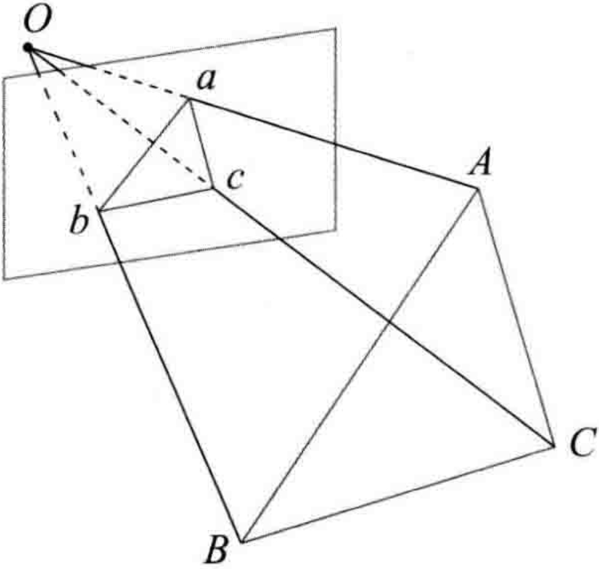
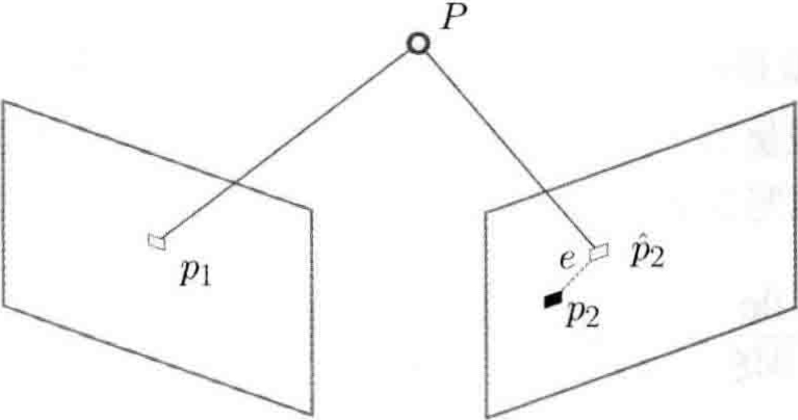

# Chapter7.7

# 7.7 3D-2D：PnP

PnP(Perspective-n-Point)是求解3D到2D点对运动的方法，它描述了当知道$n$个3D空间点以及投影位置时，如果估计相机的位姿。前面提到，2D-2D的对极几何方法需要8个或8个以上的点对（以八点法为例），且存在着初始化、纯旋转和尺度的问题。然而，如果这两张图像中的一张特征点的3D位置已知，那么最少只需要3个点对(以及至少一个额外点验证结果)就可以估计相机运动。特征点的3D位置可以由三角化或者RGB-D相机的深度图确定。因此，在双目或RGB-D的视觉里程计中，我们可以直接使用PnP估计相机运动。而在单目视觉里程计中，必须先进行初始化，才能使用PnP。3D-2D方法不需要使用对极约束，又可以在很少的匹配点中获得较好的运动估计，是一种最重要的姿态估计方法。

PnP问题有很多种求解方法，例如，用3对点估计位姿的P3P、直接线性变换(DLT)、EPnP(Efficient PnP)、UPnP等等。此外，还能用<B>非线性优化</B>的方式，构建最小二乘问题并迭代求解，也就是万金油式的光束法平差(Bundle Adjustment, BA)。先来介绍DLT，再讲解BA。

## 7.7.1 直接线性变换

考虑一个问题：已知一组3D点的位置，以及它们在某个相机中的投影位置，求该相机的位姿。这个问题也可以用于求解给定地图和图像时的相机状态问题。如果把3D点看成在另一个相机坐标系中的话，则也可以用来求解两个相机的相对运动问题。

考虑某个空间点$P$，它的齐次坐标为$P=(X,Y,Z,1)^T$。在图像$I_1$中，投影到特征点$x_1=(u_1,v_1,1)^T$(以归一化平面齐次坐标表示)。此时，相机的位姿$R,t$是未知的。与单应矩阵的求解类似，定义增广矩阵$[R|t]$为一个$3\times 4$的矩阵，包含了旋转与平移信息。将其展开形式列写如下：

$$
s\begin{pmatrix}
    u_1 \\ v_1 \\ 1
\end{pmatrix} = \begin{pmatrix}
    t_1 & t_2 & t_3 & t_4 \\
    t_5 & t_6 & t_7 & t_8 \\
    t_9 & t_{10} & t_{11} & t_{12}
\end{pmatrix} \begin{pmatrix}
    X \\ Y \\ Z \\ 1
\end{pmatrix}. \tag{7.26}
$$

用最后一行把$s$消去，得到两个约束：

$$
u_1 = \frac{t_1X + t_2Y + t_3Z + t_4}{t_9X + t_{10}Y + t_{11}Z + t_{12}}, \quad
v_1 = \frac{t_5X + t_6Y + t_7Z + t_8}{t_9X + t_{10}Y + t_{11}Z + t_{12}}.
$$

为了简化表示，定义$T$的行向量：

$$
t_1=(t_1,t_2,t_3,t_4)^T,t_2=(t_5,t_6,t_7,t_8)^T,t_3=(t_9,t_{10}, t_{11}, t_{12})^T,
$$

于是有

$$
t_1^TP - t_3^TPu_1 = 0,
$$

和

$$
t_2^TP - t_3^TPv_1 = 0.
$$

$t$是待求的变量，可以看到，每个特征点提供了两个关于$t$。假设一共有$N$个特征点，则可以列出如下线性方程组：

$$
\begin{pmatrix}
    P_1^T & 0 & -u_1P_1^T \\
    0 & P_1^T & -v_1P_1^T \\
    \vdots & \vdots & \vdots \\
    P_N^T & 0 & -u_NP_N^T \\
    0 & P_N^T & -u_NP_N^T
\end{pmatrix} \begin{pmatrix}
    t_1 \\ t_2 \\ t_3
\end{pmatrix} = 0. \tag{7.27}
$$

$t$一共有12维，因此最少通过6对匹配点即可实现矩阵$T$的线性求解，这种方法称为DLT。当匹配点大于6对时，也可以使用SVD等方法对超定方程求最小二乘解。

在DLT求解中，我们直接将$T$矩阵看成了12个未知数，忽略了它们之间的联系。因为旋转矩阵$R\in SO(3)$，用DLT求出的解不一定满足该约束，它是一个一般矩阵。平移向量比较好办，它属于向量空间。对于旋转矩阵$R$，必须针对DLT估计的$T$左边$3\times3$的矩阵块，寻找一个最好的旋转矩阵对它进行近似。这可以由QR分解完成，也可以像这样来计算：

$$
R \leftarrow (RR^T)^{-\frac{1}{2}}R. \tag{7.28}
$$

这相当于把结果从矩阵空间重新投影到SE(3)流形上，转换成旋转和平移两部分。

这里的$x_1$使用了归一化平面坐标，去掉了内参矩阵$K$的影响--这是因为内参K在SLAM中通常假设为已知，即使内参未知，也能用PnP去估计$K,R,t$三个量。但是未知量增多，效果会差一些。

---

## 7.7.2

P3P是另一种解PnP的方法，它仅使用3对匹配点，对数据要求较少。

P3P需要利用给定的3个点的几何关系，它的输入数据为3对3D-2D匹配点，记3D点为A,B,C,2D点为a,b,c，其中小写字母代表的点为对应大写字母代表的点在相机成像平面上的投影，如下图所示。

    

此外，P3P还需要使用一对验证点，以从可能的解中选出正确的那一个，记验证点对为D-d，相机光心为O。注意，A,B,C是在世界坐标系中的坐标，而不是在相机坐标系中的坐标。一旦3D点在相机坐标系下的坐标能够算出，，就得到了3D-3D的对应点，把PnP问题转换为了ICP问题。

首先，显然三角形之间存在对应关系：

$$
\Delta Oab - \Delta OAB, \quad \Delta Obc - \Delta OBC, \quad \Delta Oac - \Delta OAC. \tag{7.29}
$$

来考虑Oab和OAB的关系，利用余弦定理，有

$$
OA^2 + OB^2 - 2OA\cdot OB \cdot cos\left \langle a, b  \right \rangle = AB^2, \tag{7.30}
$$

对于其他两个三角形也有类似的性质，于是有

$$
OA^2 + OB^2 - 2OA\cdot OB \cdot cos\left \langle a, b  \right \rangle = AB^2 \\
OB^2 + OC^2 - 2OB\cdot OC \cdot cos\left \langle b, c  \right \rangle = BC^2 \\
OA^2 + OB^2 - 2OA\cdot OC \cdot cos\left \langle a, c  \right \rangle = AC^2. \tag{7.31}
$$

对以上三式全体除以$OC^2$，并且记$x=OA/OC, y = OB/OC$，得

$$
x^2 + y^2 - 2xy\cos\left \langle a, b \right \rangle = AB^2/OC^2 \\
y^2 + 1^2 - 2y\cos\left \langle b, c \right \rangle = BC^2/OC^2 \\
x^2 + 1^2 - 2x\cos\left \langle a, c \right \rangle = AC^2/OC^2. \tag{7.32}
$$

记$v=AB^2/OC^2, uv=BC^2/OC^2, wv=AC^2/OC^2$，有

$$
(1 - u)y^2 - ux^2 - \cos \left \langle b, c \right \rangle y + 2uxy\cos\left \langle a, b \right \rangle + 1 = 0 \\
(1 - w)x^2 - wy^2 - \cos\left \langle a, c \right \rangle x + 2wxy\cos\left \langle a, b  \right \rangle + 1 = 0. \tag{7.34}
$$

由于知道2D点的图像未知，3个余弦角$\cos\left \langle a, b \right \rangle，\cos\left \langle b, c \right \rangle，\cos\left \langle a, c \right \rangle$是已知的，同时，$u=BC^2/AB^2, w=AC^2/AB^2$可以通过$A,B,C$在世界坐标系下的坐标算出，变换到相机坐标系下之后，这个比值并不改变。该式中的$x,y$是未知的，随着相机移动会发生变化。因此，该方程组是关于$x,y$的一个二元二次方程(多项式方程)。求该方程组的解析解是一个复杂的过程，需要用吴消元法。类似于分解$\mathcal{E}$的情况，该方程组最多可能得到4个解，但可以用验证点来计算最有可能的解，得到$A,B,C$在相机坐标系下的3D坐标。然后，根据3D-3D的点对，计算相机的运动$R,t$。

从P3P的原理可以看出，为了求解PnP，我们利用了三角形相似性质，求解投影点$a,b,c$在相机坐标系下的3D坐标，最后把问题转换成一个3D到3D的位姿估计问题。在后文中将看到，带有匹配信息的3D-3D位姿求解非常容易，所以这种思路是非常有效的。

P3P也存在着一些问题：

1. P3P只利用了3个点的信息。当给定的配对点多于3组时，难以利用更多的信息。
2. 如果3D点或2D点受噪声影响，或者存在误匹配，则算法失效。
   
所以，人们还陆续提出了许多别的方法，如EPnP、UPnP等，它们利用更多的信息，而且用迭代的方式对相机位姿进行优化，以尽可能地消除噪声的影响。

在SLAM中，通常的做法是先使用P3P/EPnP等方法估计相机位姿，再构建最小二乘优化问题对估计值进行调整(即进行Bundle Adjustment)。在相机运动足够连续时，也可以假设相机不懂或均速运动，用推测值作为初始值进行优化。

---

## 7.7.3 最小化重投影误差求解PnP

除了使用线性方法，还可以把PnP问题构建成一个关于重投影误差的非线性最小二乘问题，前面说的线性方法，往往是<B>先求相机位姿，再求空间点位置</B>，而非线性优化则是把它们都看成优化变量，放在一起优化。这是一种非常通用的求解方式，可以用它对PnP或ICP给出的结果进行优化。这一类<B>把相机和三维点放在一起进行最小化</B>的问腿，统称为Bundle Adjustment。

我们完全可以在PnP中构建一个Bundle Adjustment问题对相机位姿进行优化，如果相机是连续运动的，也可以直接用BA求解相机位姿。

考虑$n$个三维空间点$P$及其投影$p$，希望计算相机的位姿$R,t$，它的李群表示为$T$，假设某空间点坐标为$P_i=[X_i,Y_i,Z_i]^T$，其投影的像素坐标为$u_i=[u_i, v_i]^T$，像素位置与空间点位置的关系如下：

$$
s_i\begin{bmatrix}
    u_i \\ v_i \\ 1
\end{bmatrix} = KT \begin{bmatrix}
    X_i \\ Y_i \\ Z_i \\ 1
\end{bmatrix}. \tag{7.35}
$$

写成矩阵形式就是：

$$
s_i u_i = KTP_i.
$$

这个式子隐含了一次从齐次到非齐次的转换，否则按矩阵的乘法来说，维度是不对的。现在，由于相机位姿未知及观测点的噪声，该等式存在一个误差。因此，我们把误差求和，构建最小二乘问题，然后寻找最好的的相机位姿，使它最小化：

$$
T^* = \argmin_{T} \frac{1}{2}\sum_{i=1}^{n}\lVert u_i -- \frac{1}{s_i}KTP_i \rVert_2^2. \tag{7.36}
$$

该问题的误差项，是将3D点的投影位置与观测位置作差，所以称为<B>重投影误差</B>。使用齐次坐标时，这个误差有3维，不过由于$u$最后一维为1，该维度的误差一直为零，因而我们更多时候使用非齐次坐标，于是误差就只有2维了。如下图所示：

    

通过特征匹配知道了$p_1$和$p_2$是同一个空间点$P$的投影，但是不知道相机的位姿。在初始值中，$P$的投影$\hat{p}_2$与实际的$p_2$之间有一定的距离，于是我们调整相机的位姿，使得这个距离变小。不过，由于这个调整需要考虑很多个点，所以最后的效果是整体误差的缩小，而每个点的误差通常都不会精确为零。

使用李代数，可以构建无约束的优化问题，很方便地通过高斯牛顿法、列文伯格-马奈尔特方法之前，我们需要知道每个误差项关于优化变量的导数，也就是<B>线性化</B>：

$$
e(x + \Delta x) \approx e(x) + J^T \Delta x. \tag{7.37}
$$

我们可以使用数值导数，但如果能够推导出解析形式，则优先考虑解析导数。现在，当$e$为像素坐标误差(2维)，$x$为相机位姿(6维)时，$J^T$将是一个$2\times6$的矩阵。

回忆李代数的内容，我们介绍了如何使用扰动模型来求李代数的导数。首先，记变换到相机坐标系下的空间点坐标为$P'$，并且将其前3维取出来：

$$
P'=(TP)_{1:3}=[X',Y',Z']^T. \tag{7.38}
$$

那么，相机投影模型相对于$P'$为

$$
su = KP'. \tag{7.39}
$$

展开：

$$
\begin{bmatrix}
    su \\ sv \\ s
\end{bmatrix} = \begin{bmatrix}
    f_x & 0 & c_x \\
    0 & f_y & c_y \\
    0 & 0 & 1
\end{bmatrix} \begin{bmatrix}
    X' \\ Y' \\ Z'
\end{bmatrix}. \tag{7.40}
$$

利用第3行消去$s$（实际上就是$P'$的距离），得

$$
u = f_x\frac{X'}{Z} + c_x, \quad v = f_y \frac{Y'}{Z'} + c_y. \tag{7.41}
$$

当我们求误差时，可以把这里的$u,v$与实际的测量值比较，求差。在定义了中间变量之后，，对$T$左乘扰动量$\delta \xi$，然后考虑$e$的变化关于扰动量的导数。利用链式法则，可以列写如下：

$$
\frac{\partial e}{\partial \delta \xi} = \lim_{\delta \xi \to 0} \frac{e(\delta \xi \oplus \xi) - e(\xi)}{\delta \xi} = \frac{\partial e}{\partial P'} \frac{\partial P'}{\partial \delta \xi}. 
\tag{7.42}
$$

这里的$\oplus$指李代数上的左乘扰动，第一项是误差关于投影点的导数，在式(7.41)中已经列出了变量之间的关系，易得

$$
\frac{\partial e}{\partial P'} = -\begin{bmatrix}
    \frac{\partial u}{\partial X'} & \frac{\partial u}{\partial Y'} & \frac{\partial u}{\partial Z'} \\
    \frac{\partial v}{\partial X'} & \frac{\partial v}{\partial Y'} & \frac{\partial v}{\partial Z'}
\end{bmatrix} = - \begin{bmatrix}
    \frac{f_x}{Z'} & 0 & -\frac{f_x X'}{Z'^2} \\
    0 & \frac{f_y}{Z'} & -\frac{f_y Y'}{Z'^2}
\end{bmatrix}. \tag{7.43}
$$

第二项为变换后的点关于李代数的导数，根据4.3.5节中推导，得

$$
\frac{\partial(TP)}{\partial \delta \xi} = (TP)^{\odot}=\begin{bmatrix}
    I & -P'^{\wedge} \\
    0^T & 0^T
\end{bmatrix}. \tag{7.44}
$$

而在$P'$的定义中，我们取出了前3维，于是得

$$
\frac{\partial P'}{\partial \delta \xi} = [I, -P'^{\wedge}]. \tag{7.45}
$$

将这两项相乘，就得到了$2\times6$的雅可比矩阵：

$$
\frac{\partial e}{\partial \delta \xi} = -\begin{bmatrix}
    \frac{f_x}{Z'} & 0 & -\frac{f_x X'}{Z'^2} & -\frac{f_x X'Y'}{Z'^2} & f_x + \frac{f_x X'^2}{Z'^2} & -\frac{f_x Y'}{Z'} \\
    0 & \frac{f_y}{Z'} & -\frac{f_y Y'}{Z'^2} & -f_y-\frac{f_yY'^2}{Z'^2} & \frac{f_yX'Y'}{Z'^2} & \frac{f_yX'}{Z'}
\end{bmatrix}. \tag{7.46}
$$

这个雅可比矩阵描述了重投影误差关于相机位姿李代数的一阶变化关系，保留了前面的负号，因为误差是由<B>观测值减预测值</B>定义的。当然也可以反过来，将它定义成“预测值减观测值”的形式。在那种情况下，只需要去掉前面的负号即可。此外，如果$\mathfrak{se}(3)$的定义方式是旋转在前，平移在后，则只要把这个矩阵的前3列与后3列对调即可。

除了优化位姿，还希望优化特征点的空间位置。因此，需要讨论$e$关于空间点$P$的导数。所幸，这个导数矩阵相对来说容易一些，仍利用链式法则，有

$$
\frac{\partial e}{\partial P} = \frac{\partial e}{\partial P'} \frac{\partial e}{\partial P}. \tag{7.47}
$$

第一项在前面已推导，关于第二项，按照定义

$$
P' = (TP)_{1:3} = RP + t,
$$

我们发现$P'$对$P$求导后将只剩下$R$。于是：

$$
\frac{\partial e}{\partial P} = -\begin{bmatrix}
    \frac{f_x}{Z'} & 0 & -\frac{f_x X'}{Z'^2} \\
    0 & \frac{f_y}{Z'} & -\frac{f_y Y'}{Z'^2}
\end{bmatrix} R. \tag{7.48}
$$

于是，我们推导出了观测相机方程关于相机位姿与特征点的两个导数矩阵。它们十分重要，能够在优化过程中提供重要的梯度方向，知道优化的迭代。

