## 9.2 BA与图优化

所谓的Bundle Adjustment（BA），是指从视觉图像中提炼出最优的3D模型和相机参数(内参数和外参数)。考虑从任意特征点发射出来的几束光线(bundles of light rays)，它们会在几个相机的成像平面上变成像素或是检测到的特征点。如果我们调整(adjustment)各相机姿态和各特征点的空间未知，使得这些光线最终收束到相机的光心，就称为BA。

在第5讲和第7讲已经简单介绍过BA的原理，本节的重点是介绍它对应的图模型结构的特点，然后介绍一些通用的快速求解方法。

### 9.2.1 投影模型和BA代价函数

从一个世界坐标系中的点$p$出发，把相机的内外参数和畸变都考虑进来，最后投影成像素坐标，需要如下步骤。

1. 把世界坐标转换到相机坐标，这里将用到相机外参数($R,t$):

$$
P' = Rp + t = [X', Y', Z']^T. \tag{9.36}
$$

2. 将$P'$投至归一化平面，得到归一化坐标：

$$
P_c = [u_c, v_c, 1]^T = [X'/Z', Y'/Z', 1]^T. \tag{9.37}
$$

3. 考虑归一化坐标的畸变情况，得到去畸变前的原始像素坐标。这里暂时只考虑径向畸变：

$$
\left\{
    \begin{array}{l}
        u_c' = u_c(1 + k_1 r_c^2 + k_2 r_c^4) \\
        v_c' = v_c(1 + k_1 r_c^2 + k_2 r_c^4)
    \end{array}. \tag{9.38}
\right.
$$

4. 根据内参模型，计算像素坐标：

$$
\left\{
    \begin{array}{l}
        u_s = f_x u_c' + c_x \\
        v_s = f_y v_c' + c_y
    \end{array}. \tag{9.39}
\right.
$$

这一系列计算流程看似复杂，用下面的流程图形象化地表示整个过程，以帮助理解。这个过程就是前面讲的<B>观测方程</B>，之前我们把它抽象地记成：

$$
z = h(x,y). \tag{9.40}
$$

    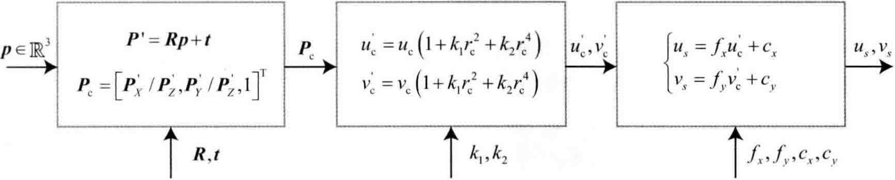

> 左侧的$p$是全局坐标系下的三维坐标点，右侧的$u_s,v_s$是该点在图像平面上的最终像素坐标。中间畸变模块中的$r_c^2 = u_c^2 + v_c^2$

现在，我们给出了它的详细参数化过程。具体地说，这里的$x$指代此时相机的位姿，即外参$R,t$，它对应的李群为$T$，李代数为$\xi$。路标$y$即这里的三维点$p$，而观测数据则是像素坐标$z \overset{def}{=}[u_s,v_s]^T$。以最小二乘的角度来考虑，那么可以列写关于此次观测的误差：

$$
e = z - h(T, p). \tag{9.41}
$$

然后，把其他时刻的观测量也考虑进来，我们可以给误差添加一个下标。设$z_{ij}$为在位姿$T_i$处观察路标$p_j$产生的数据，那么整体的<B>代价函数</B>为

$$
\frac{1}{2}\sum_{i=1}^m \sum_{j=1}^n \lVert e_{ij} \rVert^2 = \frac{1}{2}\sum_{i=1}^m \sum_{j=1}^n \lVert z_{ij} - h(T_i, p_j) \rVert^2. \tag{9.42}
$$

对这个最小二乘进行求解，相当于对位姿和路标同时做了调整，也就是所谓的BA。接下来，我们会根据该目标函数和第6讲介绍的非线性优化内容，逐步深入地探讨该模型的求解。

### 9.2.2 BA的求解

观察9.2.1节中的观测模型$h(T,p)$，很容易判断该函数不是线性函数。所以我们希望使用6.2节介绍的一些非线性优化手段来优化它。根据非线性优化的思想，我们应该从某个初始值开始，不断地寻找下降方向$\Delta x$，来找到目标函数的最优解，即不断地求解增量方程(6.33)中的增量$\Delta x$。尽管误差项都是针对单个位姿和路标点的，但在整体BA目标函数上，我们应该把自变量定义成所有待优化的变量：

$$
x = [T_1,...,T_m,p_1,...,p_n]^T. \tag{9.43}
$$

相应地，增量方程中的$\Delta x$则是对整体自变量的增量。在这个意义下，当我们给自变量一个增量时，目标函数变为

$$
\frac{1}{2}\lVert f(x + \Delta x) \rVert^2 \approx \frac{1}{2}\sum_{i=1}^m \frac{1}{2}\sum_{j=1}^n \lVert e_{ij} + F_{ij} \Delta \xi_i + E_{ij} \Delta p_j \rVert^2. \tag{9.44}
$$

其中，$F_{ij}$表示整个代价函数在当前状态下对相机姿态的偏导数，而$E_{ij}$表示该函数对路标点位置的偏导。我们曾在7.3.3节中介绍了它们的具体形式。现在，把相机位姿变量放在一起：

$$
x_c = [\xi_1, \xi_2,..., \xi_m]^T \in \mathbb{R}^{6m}, \tag{9.45}
$$

并把空间点的变量也放在一起：

$$
x_p = [p_1,p_2,...,p_n]^T \in \mathbb{R}^{3n}, \tag{9.46}
$$

那么，式(9.44)可以简化表达如下：

$$
\frac{1}{2}\lVert f(x + \Delta x) \rVert^2 = \frac{1}{2} \lVert e + F \Delta x_c + E \Delta x_p \rVert^2. \tag{9.47}
$$

需要注意的是，该式从一个由很多小型二次项之和，变成矩阵形式。这里的雅可比矩阵$E$和$F$必须是整体目标函数对整体变量的导数，它将是一个很大块的矩阵，而里头每个小分块，需要由每个误差项的导数$F_{ij}$和$E_{ij}$“拼凑”起来。然后，无论我们使用高斯牛顿法还是列文伯格-马奈尔特方法，最后都将面对增量线性方程：

$$
H \Delta x = g. \tag{9.48}
$$

根据第6讲的知识，我们知道高斯牛顿法和列文伯格-马奈尔特方法的主要差别在于，这里的$H$是取$J^TJ$还是$J^TJ + \lambda I$的形式。由于我们把变量归类成了位姿和空间点两种，所以雅可比矩阵可以分块为

$$
J = [F\quad E]. \tag{9.49}
$$

那么，以高斯牛顿法为例，则$H$矩阵为

$$
H = J^TJ = \begin{bmatrix}
    F^TF & F^TE \\
    E^TF & E^TE
\end{bmatrix}. \tag{9.50}
$$

当然，在列文伯格-马奈尔特方法中我们也需要计算这个矩阵。不难发现，因为考虑了所有的优化变量，所以这个线性方程的维度将非常大，包含了所有的相机位姿和路标点。尤其是在视觉SLAM中，一幅图像会提出数百个特征点，大大增加了这个线性方程的规模。如果直接对$H$求逆来计算增量方程，由于矩阵求逆是复杂度为$O(n^3)$的操作，那么消耗的计算资源会非常多。幸运的是，这里的$H$矩阵是有一定的特殊结构的。利用这个特殊结构，可以加速求解过程。

### 9.2.3 稀疏性和边缘化

21世纪视觉SLAM的一个重要进展是认识到了矩阵$H$的稀疏结构，并发现该结构可以自然、显式地用图优化来表示。本节将详细讨论该矩阵的稀疏结构。

$H$矩阵的稀疏性是由雅可比矩阵$J(x)$引起的，考虑这些代价函数当中的其中一个$e_{ij}$。注意，这个误差项只描述了在$T_i$看到$p_j$这件事，只涉及第$i$个相机位姿和第$j$个路标点，对其余部分的变量的导数都为0。所以该误差项对应的雅可比矩阵有下面的形式：

$$
J_{ij}(x) = \left(
    0_{2\times6},...,0_{2\times6},\frac{\partial e_{ij}}{\partial T_i}, 0_{2\times6}, ..., 0_{2\times3},...,0_{2\times3},\frac{\partial e_{ij}}{\partial p_j}, 0_{2\times3}, ..., 0_{2\times3}. \tag{9.51}
\right)
$$

其中$0_{2\times6}$表示维度为$2\times6$的$0$矩阵，同理，$0_{2\times3}$也是一样的。该误差项对相机姿态的偏导$\partial e_{ij}/\partial \xi_i$维度为$2\times6$，对路标点的偏导$\partial e_{ij}/\partial p_j$的维度是$2\times3$。这个误差项的雅可比矩阵，除了这两处为非零块，其余地方都为零。这体现了该误差项与其他路标和轨迹无关的特性。从图优化的角度来说，这条观测边只和两个顶点有关。那么，它对增量方程有何影响？$H$矩阵为什么会产生稀疏性呢？

以下图为例，我们假设$J_{ij}$只在$i,j$处有非零块，那么它对$H$的贡献为$J_{ij}^TJ_{ij}$，具有图上所画的稀疏形式。这个$J^T_{ij} J_{ij}$矩阵也仅有4个非零块，位于$(i,i),(i,j),(j,i),(j,j)$。对于整体的$H$，有

$$
H = \sum_{i,j}J_{ij}^TJ_{ij}, \tag{9.52}
$$

请注意，$i$在所有相机位姿中取值，$j$在所有路标点中取值。我们把$H$进行分块：

$$
H = \begin{bmatrix}
    H_{11} & H_{12} \\
    H_{21} & H_{22}
\end{bmatrix}. \tag{9.53}
$$

    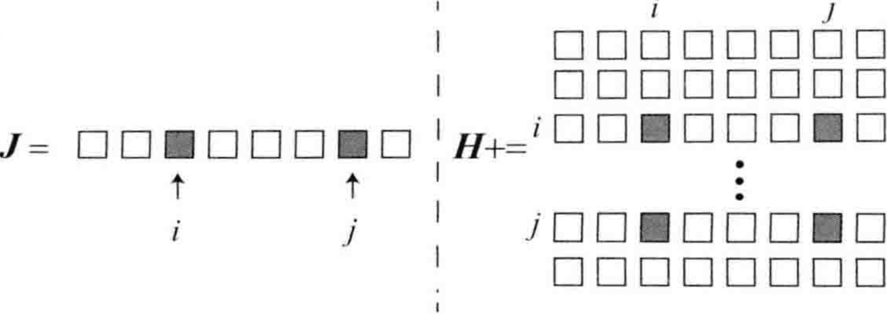

> 当某个误差项$J$具有稀疏性时，它对$H$的贡献也具有稀疏形式

这里，$H_{11}$只和相机位姿有关，而$H_{22}$只和路标点有关。当我们遍历$i,j$时，以下事实总是成立的：

1. 不管$i,j$怎么变，$H_{11}$都是对角阵，只在$H_{ii}$处有非零块。
2. 同理，$H_{22}$也是对角阵，只在$H_{jj}$处有非零块。
3. 对于$H_{12}$和$H_{21}$，它们可能是稀疏的，也可能是稠密的，视具体的观测数据而定。

这显示了$H$的稀疏结构。之后对线性方程的求解中，也正需要利用它的稀疏结构。举个实例：假设一个场景内有2个相机位姿$(C_1,C_2)$和6个路标点$(P_1,P_2,P_3,P_4,P_5,P_6)$，这些相机和点云所对应的变量为$T_i,i=1,2$及$p_j,j=1,...,6$。相机$C_1$观测到路标点$P_1,P_2,P_3,P_4$，相机$C_2$观测到路标点$P_3,P_4,P_5,P_6$。我们把这个过程画成示意图，如下图所示。相机和路标以圆形节点表示。如果$i$相机能够直观观测到$j$点，我们就在它们对应的节点连上一条边。

    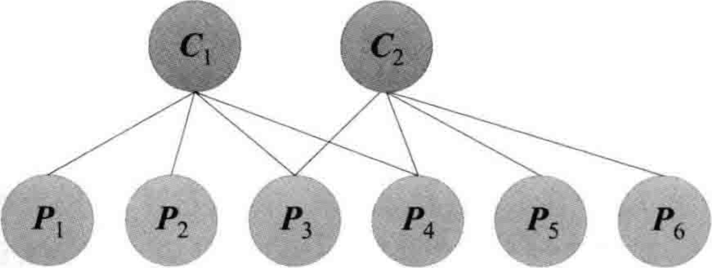
    

图 9-4

> 该图显示相机$C_1$观测到了路标点$P_1,P_2,P_3,P_4$，相机$C_2$看到了路标点$P_3 \sim P_6$

可以推出，场景下的BA目标函数应该为

$$
\frac{1}{2}\left( \lVert e_{11} \rVert^2 +  \lVert e_{12} \rVert^2 +  \lVert e_{13} \rVert^2 +  \lVert e_{14} \rVert^2 +  \lVert e_{23} \rVert^2 +  \lVert e_{24} \rVert^2 +  \lVert e_{25} \rVert^2 +  \lVert e_{26} \rVert^2  \right). \tag{9.54}
$$

这里的$e_{ij}$使用之前定义过的代价函数，即式(9.42)。以$e_{11}$为例，它描述了在$C_1$看到了$P_1$这件事，与其他的相机位姿和路标无关。令$J_{11}$为$e_{11}$所对应的雅可比矩阵，不难看出$e_{11}$对相机变量$\xi_2$和路标点$p_2,...,p_6$的偏导都为0。我们把所有变量以$x=(\xi_1,\xi_2,p_1,...,p_2)^T$的顺序摆放，则有

$$
J_{11} = \frac{\partial e_{11}}{\partial x} = \left(
    \frac{\partial e_{11}}{\partial \xi_1}, 0_{2\times6}, \frac{\partial e_{11}}{\partial p_1}, 0_{2\times3}, 0_{2\times3}, 0_{2\times3}, 0_{2\times3}, 0_{2\times3}
\right). \tag{9.55}
$$

为了方便表示稀疏性，我们用带有颜色的方块表示矩阵在该方块内有数值，其余没有颜色的区域表示矩阵在该处数值都为0.那么上面的$J_{11}$则可以表示成如下图所示的图案。同理，其他的雅可比矩阵也会有类似的稀疏图案。

    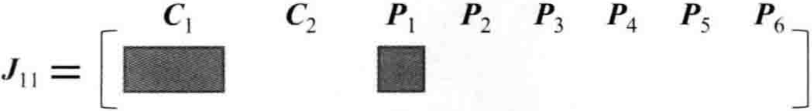
    

图 9-5

> 上方的标记表示矩阵该列所对应的变量。由于相机参数维数比点云参数维数大，所以$C_1$对应的矩阵块要比$P_1$对应的矩阵块宽

为了得到该目标函数对应的雅可比矩阵，可以将这些$J_{ij}$按照一定顺序列为向量，那么整体雅可比矩阵及相应的$H$矩阵的稀疏情况就如下图所示：

    

        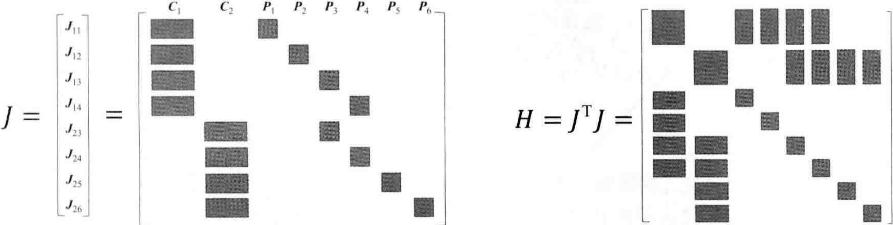
         
        图 9-6
    

可以看到，图9-4对应的<B>邻接矩阵</B>(Adjacency Matrix)和图9-6中的$H$矩阵，除了对角元素外的其余部分有着完全一致的结构。事实上也的确如此，上面的$H$矩阵一共有$8\times8$个矩阵块，对于$H$矩阵中处于非对角线的矩阵块来说，如果该矩阵块非零，则其位置所对应的变量之间的图中会存在一条边，可以从图 9-7 中清晰地看到这一点。所以，$H$矩阵中的非对角部分的非零矩阵块可以理解为其对应的两个变量之间存在联系，或者可以称之为约束。于是，我们发现图优化结构与增量方程的稀疏性存在着明显的联系。

    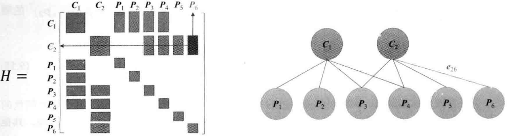
     
    
图 9-7 H矩阵中非零矩阵块和图中边的对应关系

> 左图$H$矩阵中右侧的红色矩阵块，表示在右图中其对应的变量$C_2$和$P_6$之间存在一条边$e_{26}$

现在考虑更一般的情况，假如我们有$m$个相机位姿，$n$个路标点。由于通常路标的数量远远多于相机，于是有$n \gg m$。由上面的推理可知，一般情况下的$H$矩阵如下图9-8所示。它的左上角块显得非常小，而右下角的对角块占据了大量地方。除此之外，非对角部分则分布着散乱的观测数据。由于它的形状很像箭头，又称为箭头形(Arrow-like)矩阵。同时，它也很像一把镐子，所以也可以称为镐形矩阵。

    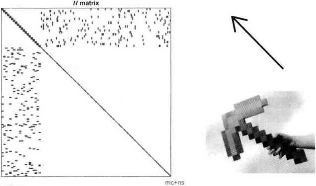
     
    
图 9-8 一般情况下的$H$矩阵

对于具有这种稀疏结构的$H$，线性方程$H \Delta x = g$的求解会有什么不同呢？现实中存在着若干利用$H$的稀疏性加速计算的方法，本节介绍视觉SLAM里一种最常用的手段：Schur消元。在SLAM研究中也称为Marginalization（边缘化）。

仔细观察上图，不难发现这个矩阵可以分成4个块，和式(9.53)一致。左上角为角块矩阵，每个对角块元素的维度与相机位姿的维度相同，且是一个对角块矩阵。右下角也是对角块矩阵，每个对角块的维度是路标的维度。非对角块的结构与具体观测数据相关。我们首先将这个矩阵按照图 9-9所示的方式做区域划分，这4个区域正好对应了公式(9.50)中的4个矩阵块。为了后续分析方便，记这4个块为$B,E,E^T,C$。

    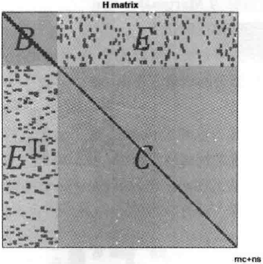
     
    
图 9-9 H矩阵的区域划分

于是，对应的线性方程组也可以由$H\Delta x = g$变为如下形式：

$$
\begin{bmatrix}
    B & E \\
    E^T & C
\end{bmatrix} \begin{bmatrix}
    \Delta x_c \\ \Delta x_p
\end{bmatrix} = \begin{bmatrix}
    v \\ w
\end{bmatrix}. \tag{9.56}
$$

其中$B$是对角块矩阵，每个对焦块的维度和相机参数的维度相同，对角块的个数是相机变量的个数。由于路标数量会远远大于相机变量的个数，所以$C$往往也远大于$B$。三维空间中每个路标点为三维，于是$C$矩阵为对角块矩阵，每个块为$3\times3$矩阵。对角块矩阵求逆的难度远小于对一般矩阵的求逆难度，因为我们只需要对那些对角线矩阵块分别求逆即可。考虑到这个特性，我们对线性方程组进行高斯消元，目标是消去右上角的非对角部分$E$，得

$$
\begin{bmatrix}
    I & -E C^{-1} \\
    0 & I
\end{bmatrix} \begin{bmatrix}
    B & E \\
    E^T & C
\end{bmatrix} \begin{bmatrix}
    \Delta x_c \\
    \Delta x_p
\end{bmatrix} = \begin{bmatrix}
    I & -EC^{-1} \\
    0 & I
\end{bmatrix} \begin{bmatrix}
    v \\ w
\end{bmatrix}. \tag{9.57}
$$

整理，得

$$
\begin{bmatrix}
    B - E C^{-1} E^T & 0 \\
    E^T & C
\end{bmatrix} \begin{bmatrix}
    \Delta x_c \\ \Delta x_p
\end{bmatrix} = \begin{bmatrix}
    v - EC^{-1}w \\ w
\end{bmatrix}. \tag{9.58}
$$

消元之后，方程组第一行变成和$\Delta x_p$无关的项，单独把它拿出来，得到关于位姿部分的增量方程：

$$
[B - EC^{-1}E^T]\Delta x_c = v - EC^{-1}w. \tag{9.59}
$$

这个线性方程的维度和$B$矩阵一样，我们的做法是先求解这个方程，然后把解得的$\Delta x_c$代入原方程，求解$\Delta x_p$。这个过程称为<B>Marginalization</B>，或者<B>Schur</B>消元(Schur Elimination)。相比于直接解线性方程的做法，它的优势在于：

1. 在消元过程中，由于$C$为对角块，所以$C^{-1}$容易解出。
2. 求解了$\Delta x_c$之后，路标部分的增量方程由$\Delta x_p = C^{-1}(w - E^T \Delta x_c)$给出。这依然用到了$C^{-1}$易于求解的特性。

于是，边缘化的主要计算量在于求解式(9.59)，这个方程是一个简单的线性方程，没有特殊的结构可利用。将次方程的系数记为$S$，它的稀疏性如何？图 9-10 显示了对$H$矩阵进行Schur消元后的一个$S$实例，可以看到它的稀疏性是不规则的。

    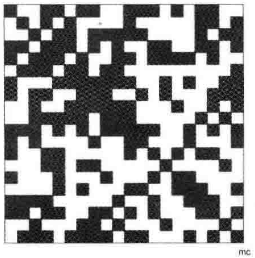
     
    
图 9-10 对H矩阵进行Schur消元后的S矩阵的稀疏状态

前面说到，$H$矩阵的非对角块的非零元素对应着相机和路标的关联。那么，进行了Schur消元后$S$的稀疏性是否具有物理意义呢？答案是肯定的。$S$矩阵的非对角线上的非零矩阵块，表示了该处对应的两个相机变量之间存在着共同观测的路标点，有时称为共视(Co-visibility)。反之，如果该块为零，则表示这两个相机没有共同观测。例如，图 9-11所示的稀疏矩阵，左上角前$4\times4$个矩阵块可以表示对应的相机变量$C_1,C_2,C_3,C_4$之间有共同观测。

于是，$S$矩阵的稀疏性结构当取决于实际观测的结果，无法提前预知。在实践中，例如ORB-SLAM中的Local Mapping环节，在做BA的时候刻意选择那些具有共同观测的帧作为关键帧，在这种情况下，Schur消元后得到的$S$矩阵就是稠密矩阵。不过，由于这个模块并不是实时执行的，所以这种做法也是刻意接受的。但是有另一些方法，例如DSO、OKVIS等，他们采用了滑动窗口(Sliding Window)方法。这类方法对每一帧都要求做一次BA来防止误差的累计，因此它们也必须采用一些技巧来保持$S$矩阵的稀疏性。

    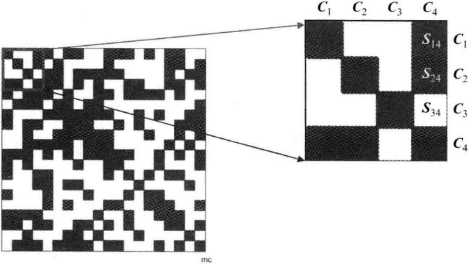
     
    
图 9-11 S矩阵的前4x4矩阵块

> 以$S$矩阵中前$4\times4$个矩阵块为例，这个区域中的矩阵块$S_{14},S_{24}$不为零，表示相机$C_4$和相机$C_1、C_2$之间有共同观测点；而$S_{34}$为零则表示$C_3$和$C_4$之间没有共同观测的路标。

从概率角度来看，我们称这一步为边缘化，是因为我们实际上把求$(\Delta x_c, \Delta x_p)$的问题，转化成了先固定$\Delta x_p$，求出$\Delta x_c$，再求$\Delta x_p$的过程。这一步相当于做了条件概率展开：

$$
P(x_c,c_p) = P(x_c|x_p) P(x_p), \tag{9.60}
$$

结果是求出了关于$x_p$的边缘分布，故称边缘化。在前面介绍的边缘化过程中，实际上我们把所有的路标点都给边缘化了。根据实际情况，我们也能选择一部分进行边缘化。同时，Schur消元只是实现边缘化的其中一种方式，同样可以使用Cholesky分解进行边缘化。

在进行了Schur消元后，还需要求解线性方程组(9.59)，对它的求解是否有什么技巧呢？很遗憾，这部分就属于传统的矩阵数值求解，通常是用分解来计算的。不管采用哪种求解办法，都建议利用$H$的稀疏性进行Schur消元。不光是因为这样可以提高速度，也因为消元后的$S$矩阵的条件数往往比之前的$H$矩阵要小。Schur消元也并不意味着将所有路标消元，将相机变量消元也是SLAM中采用的手段。

### 9.2.4 鲁棒核函数

在前面的BA问题中，我们将最小化误差项的二范数平方和作为目标函数。这种做法虽然很直观，但存在一个严重的问题：如果出于误匹配等原因，某个误差项给的数据是错误的，会发生什么呢？我们把一条原本不应该加到图中的边给加进去了，然后优化算法并不能辨别出这是个错误数据，它会把所有的数据都当作误差来处理。在算法看来，这相当于我们突然观测到了一次很不可能产生的数据。这时，在图优化中会有一条误差很大的边，它的梯度也很大，意味着调整与它相关的变量会使目标函数下降更多。所以，算法将试图优先调整这条边所连接的节点的估计值，使它顺应这条边的无理要求。由于这条边的误差真的很大，往往会抹平其他正确边的影响，使优化算法专注于调整一个错误的值。这显然不是我们希望看到的。

出现这种问题的原因是，当误差很大时，二范数增长得太快。于是就有了核函数的存在。核函数保证每条边的误差不会大得没边而掩盖其他的边。具体的方式是，把原先误差的二范数度量替换成一个增长没有那么快的函数，同时保证自己的光滑性质。因为它们使得整个优化结果更为稳健，所以又叫它们鲁棒核函数(Robust Kernel)。

鲁棒核函数有许多种，例如最常用的Huber核：

$$
H(e) = \left\{
    \begin{aligned}
        &\frac{1}{2}e^2 \qquad \qquad \quad  当|e| \le \delta, \\
        &\delta \left( |e| - \frac{1}{2} \delta \right) \quad 其他
    \end{aligned} \tag{9.61}
\right.
$$

我们看到，当误差$e$大于某个阈值$\delta$后，函数增长由二次形式变成了一次形式，相当于限制了梯度的最大值。同时，Huber核函数又是光滑的，可以很方便地求导。图 9-12 显示了Huber核函数与二次函数的对比，可见在误差较大时 Huber 核函数增长明显低于二次函数。

    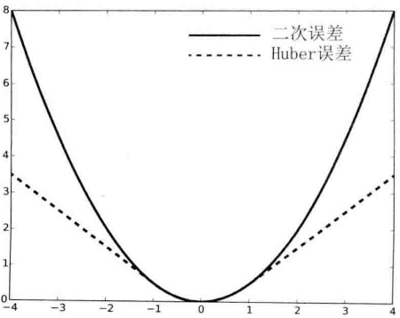
     
    
图 9-12 Huber核函数与二次函数的对比

除了Huber核，还有Cauchy核、Tukey核，等等。在g2o和Ceres中提供了大量的核函数。