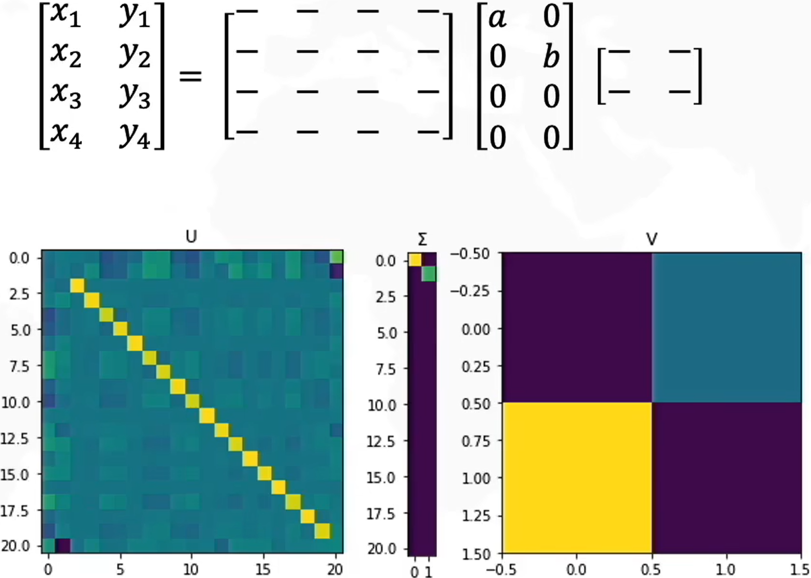
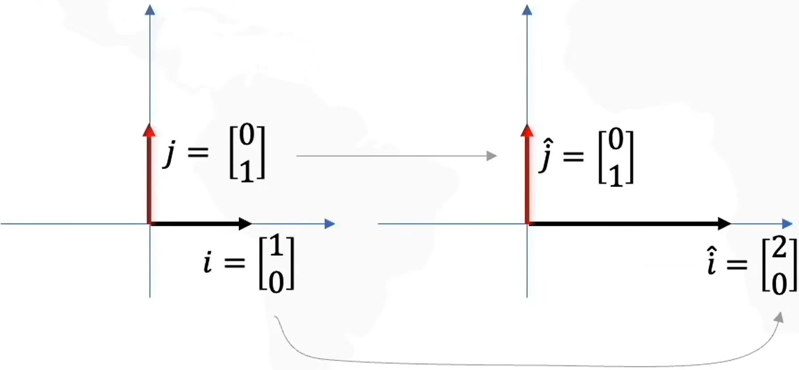
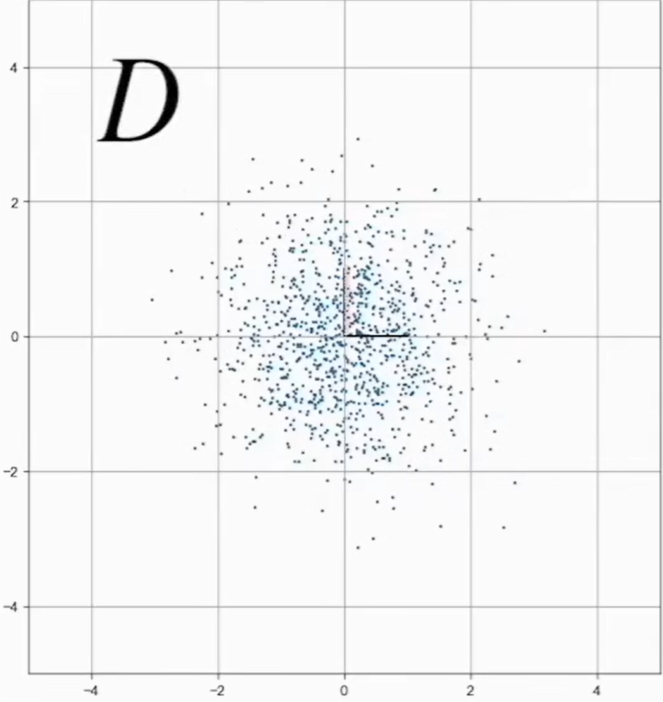
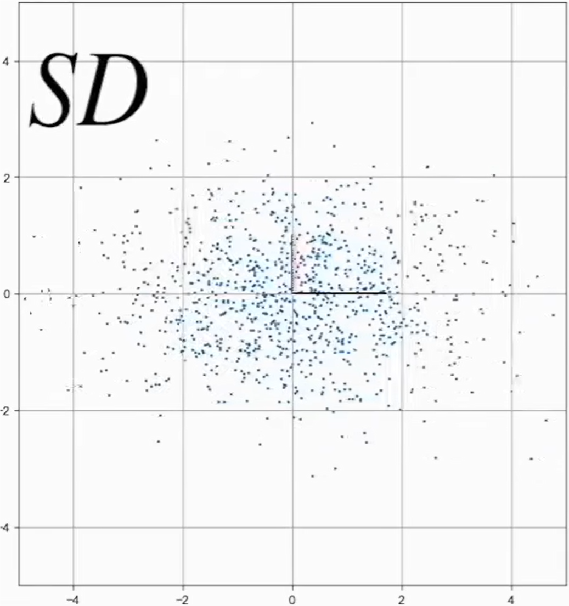
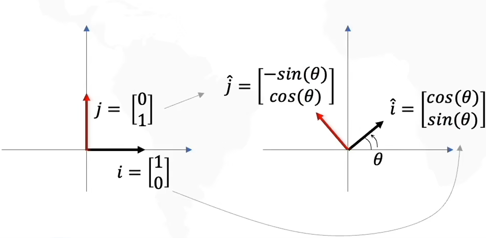
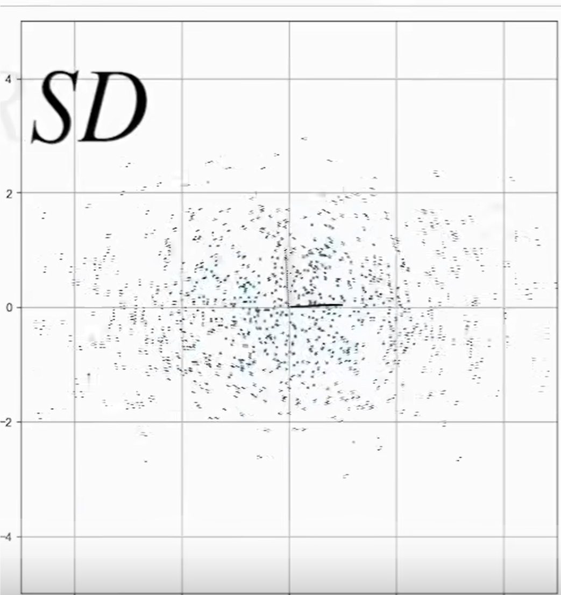
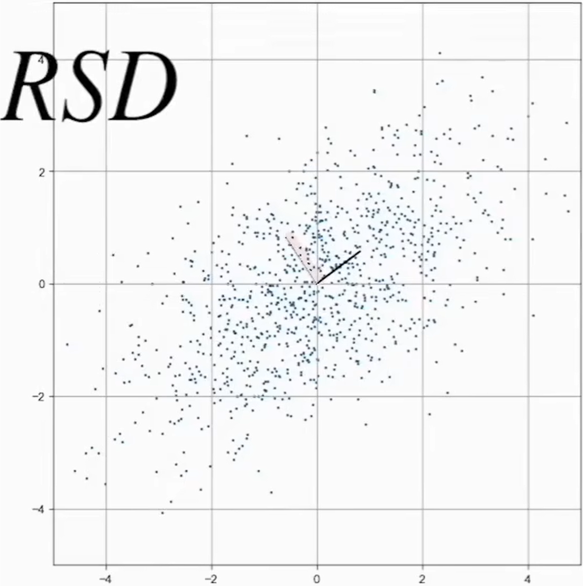
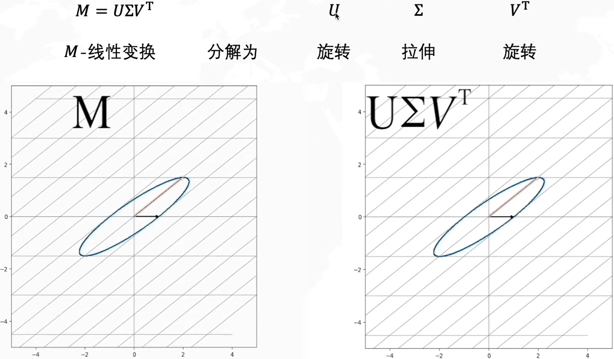
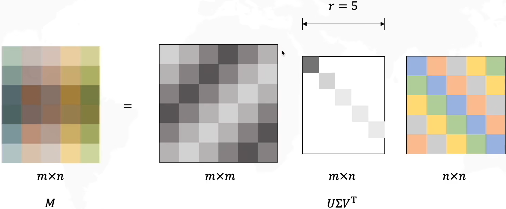

# 奇异值分解(Singular value Decomposition, SVD)

$$
M = U\Sigma V^T
$$

> M不一定是一个方矩阵，可以是任意矩阵。$U$和$V$是方矩阵，$\Sigma$是一个不规则的矩阵，但是对角线是奇异值，其他位置都是0。

    

## 数据线性变换

### 拉伸

$$
D = \begin{bmatrix}
    x_1 & x_2 & x_3 & x_4 \\
    y_1 & y_2 & y_3 & y_4
\end{bmatrix} \hspace{1cm} S = \begin{bmatrix}
    2 & 0 \\
    0 & 1
\end{bmatrix} \hspace{1cm} SD=\begin{bmatrix}
    2 & 0 \\
    0 & 1
\end{bmatrix} \begin{bmatrix}
    x_1 & x_2 & x_3 & x_4 \\
    y_1 & y_2 & y_3 & y_4
\end{bmatrix} = \begin{bmatrix}
    2x_1 & 2x_2 & 2x_3 & 2x_4 \\
    y_1 & y_2 & y_3 & y_4
\end{bmatrix}
$$

    
    
    

### 旋转

$$
D = \begin{bmatrix}
    x_1 & x_2 & x_3 & x_4 \\
    y_1 & y_2 & y_3 & y_4
\end{bmatrix} \hspace{0.5cm} R = \begin{bmatrix}
    \cos(\theta) & -\sin(\theta) \\
    \sin(\theta) & \cos(\theta)
\end{bmatrix} \hspace{0.5cm} RD=\begin{bmatrix}
    \cos(\theta) & -\sin(\theta) \\
    \sin(\theta) & \cos(\theta)
\end{bmatrix} \begin{bmatrix}
    x_1 & x_2 & x_3 & x_4 \\
    y_1 & y_2 & y_3 & y_4
\end{bmatrix} = \begin{bmatrix}
    2x_1 & 2x_2 & 2x_3 & 2x_4 \\
    y_1 & y_2 & y_3 & y_4
\end{bmatrix}
$$

    
    
    

### SVD在2x2矩阵上的分解

    

> 可以理解成SVD分解就是把一个线性变换分解为先旋转后拉伸最后再旋转的过程。

    

超定方程$\bm A \bm x =0$的解，就是对$\bm A$进行SVD分解之后的最小特征值对应的特征向量。